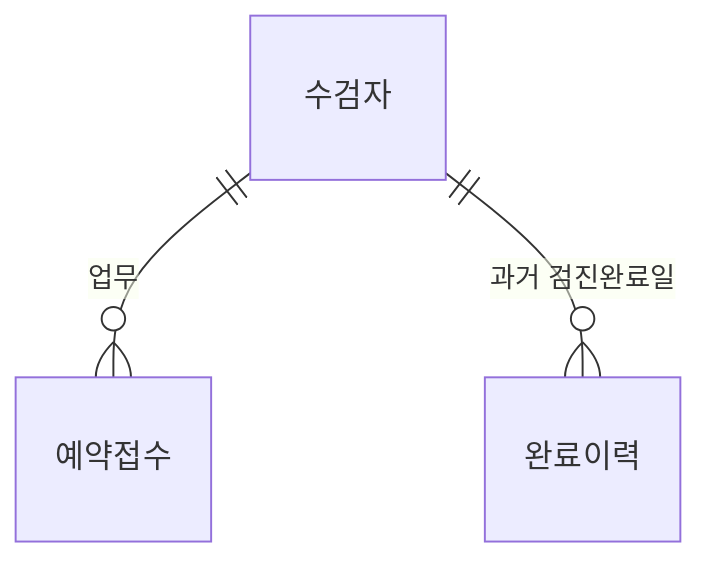

# 검진 예약·접수 관리 — Phase 4 Database

`HealthCheckupReservationReceptionDb` 의 스키마·Seed·Inline TVF·Stored Procedure·보안·테스트 일체.
설계 계약은 `../docs/baseline/04_DB_Design.md` 와 `../docs/baseline/05_DB_Rule_SP_Contract.md`,
구현 스펙은 `../docs/baseline/06_DB_Transaction_Security_Seed.md` 다 — 2026-09-08 봉인 입주했다.

## 대상 환경

| 항목 | 값 |
|---|---|
| Instance | `.\SQLEXPRESS` (SQL Server 2025 Express) |
| Database | `HealthCheckupReservationReceptionDb` |
| Collation | `Korean_Wansung_CI_AS` (`CREATE DATABASE` 에 명시 고정) |
| 시각 | KST `+09:00` (`DATEPART(TZOFFSET, SYSDATETIMEOFFSET()) = 540`) |
| 도구 | `sqlcmd` / Git Bash / `node` (표준 라이브러리만) |

## 구조 한눈에



`검사코드` 는 검사구성 문자열이 코드로 참조하므로 FK 관계선이 없다. `휴무일` 은 날짜로만 조회되는
독립 Master, `변경이력` 도 FK 를 갖지 않는다 (`../docs/baseline/04_DB_Design.md` §4.5).

| 테이블 | 구분 | 책임 | 쓰는 주체 |
|---|---|---|---|
| `수검자` | 핵심 업무 | 수검자 Master. Work 와 1:N | Write SP |
| `예약접수` | 핵심 업무 | 예약·접수 동일 행. 일정·상태·정원·동시성 + **검사구성 2컬럼** | Write SP |
| `검사코드` | 기준 Master | 검사 19종 + NEX/AEX 역할 통합 (12 NEX · 6 AEX · 1 겸용) | Seed 고정 |
| `휴무일` | 기준 Master | 공휴일·센터 휴진일 | Seed 고정 |
| `완료이력` | Rule 입력 | 일반검진 완료일 + 그때의 검사구성. TGT 판정 입력 | Seed/Test · 복사 스크립트 |
| `변경이력` | 변경 기록 | 성공한 데이터 변경을 컬럼 단위로 (`00` CP-06) | Write SP 8개가 쓰고 `USP_HC_변경이력_조회` 이 읽는다 (F-COM-008 · DLG-LOG-01) |

검사구성은 `검사항목코드`를 오름차순 쉼표로 이은 문자열이다. 전개는 `검사코드` 를 JOIN 하고
양끝을 쉼표로 감싼 `LIKE` 로 하며 파서가 필요 없다 (`../docs/phase4/plans/10-schema-consolidation.md` §2.1).

실제 데이터를 한 화면에서 보려면:

```bash
./scripts/inspect.sh     # 6테이블 행수 · 검사코드 19행 역할 · 업무 1건 상세 · 타임라인 · 슬롯 정원
./scripts/copy-completion.sh   # 접수완료 업무를 완료이력으로 복사 (시나리오 준비용)
```

조회 전용이고 배포물이 아니다. 볼 대상을 바꾸려면 `scripts/inspect.sql` 위쪽의
`@업무ID` · `@차트번호` 두 변수만 고친다.

## 빠른 시작

```bash
./scripts/rebuild.sh     # DB Drop → Create → 전체 배포
./scripts/test.sh        # rebuild 후 전체 회귀
```

객체만 다시 배포할 때는 `./scripts/deploy.sh` 를 쓴다. DB 자체는 유지된다.

## 파일 구조

스펙 §7 이 전체 트리의 출처다. 요약하면 다음과 같다.

```text
Deploy.sql / Rebuild.sql   진입점 2개
deploy/                    00_Preflight → 01_Schema → 02_Seed → 03_Functions
                           → 04~07_Procedures → 08_Verify
tests/                     00 Harness · 01~14 단계별 시험 · contract/ SP 호출 시나리오
scripts/                   deploy · rebuild · test · concurrency-test
                           verify-baseline · verify-winforms-unchanged
                           verify-contract-all · verify-no-secret
tools/                     verify-contract.js · verify-docs.js · *.json
artifacts/logs/            sqlcmd -u 원본 출력 (.gitignore)
artifacts/reports/         커밋 대상 증거
```

## 로그 읽는 법

`sqlcmd -u` 출력은 UTF-16 (BOM 포함) 이다.

```bash
iconv -f UTF-16 -t UTF-8 artifacts/logs/*.log | grep -E '^(PASS|FAIL|SKIP|INFO|Msg )'
```

`-f UTF-16LE` 를 쓰지 않는다. BOM 이 `EF BB BF` 로 남아 첫 줄의 `^PASS` 가 매치되지 않는다(실측 확인).

## Gate

G00~G16 의 정의와 증거 파일 대응은 스펙 §42 에 있다.
`PASS` 는 실제 실행 증거가 있을 때만 기록한다. 자세한 금지사항은 `AGENTS.md` 를 본다.

---

## 개발 전용 도구 (배포물 아님 · WinForms 가 부르지 않는다)

| 스크립트 | 하는 일 |
|---|---|
| `scripts/copy-completion.sh` | 접수완료(`RCP`) 업무 **전체**를 완료이력으로 복사 |
| `scripts/dev-completion.sh` | `DEV_완료이력_등록` SP 설치 — 한 사람의 한 날짜를 콕 집어 넣고 지운다 |
| `scripts/verify-red.sh` | 폐기용 DB 에서 "시험이 실제로 실패를 잡는가" 를 판정 (`RED-001`~`004`) |
| `scripts/verify-csharp-call.sh` | `csc.exe` 로 `tools/csharp-probe/Probe.cs` 를 컴파일해 **실제 ADO.NET 호출**로 한글 Parameter·컬럼을 확인 (`CS-001`~`016`) |

```sql
EXEC [dbo].[DEV_완료이력_등록] @차트번호 = N'T001', @완료일자 = '2024-05-01';
EXEC [dbo].[DEV_완료이력_등록] @차트번호 = N'T002', @완료일자 = '2023-11-11', @검사구성모름 = 1;
EXEC [dbo].[DEV_완료이력_등록] @차트번호 = N'T001', @완료일자 = '2024-05-01', @삭제 = 1;
```

`@국가검사` 를 비우면 현재 Master 의 `NEX-01` 기본검사로 채운다. `@검사구성모름 = 1` 은 외부 기관 이력(검사구성 모름)이며
`@국가검사`·`@추가검사` 와 함께 쓰면 거절한다 — 시나리오를 세우는 도구가 입력을 조용히 삼키면 세운 상태와 의도가 갈린다.

`DEV_` 접두사는 의도적이다. 계약 개수를 세는 게이트가 전부 `name LIKE 'USP[_]HC[_]%'` 로 거르므로
(`SCH-014` · `VER-003` · `RBD-004` 지문 · `SCH-019`) 이 SP 는 16개 계약을 한 글자도 건드리지 않는다.
`./scripts/test.sh` 는 언제나 `rebuild.sh`(`DROP DATABASE`)로 시작하므로 회귀에 섞이지도 않는다.
