# 검진 예약·접수 프로세스 정의서

- **문서명:** `01_Process_Definition.md`
- **상태:** FINAL / GO / READ-ONLY
- **문서 버전:** v2.0
- **기준일:** 2026-09-04
- **기준선 ID:** `HC-RSV-RCP-20260904-R3`
- **정책 기준:** `00_Project_Policy.md`
- **포함 범위:** P00 전체 프로세스, P01 수검자 확인/관리, P02 예약 관리, P03 접수 관리
- **완결 범위:** 수검자 확인·등록·수정 → 예약 → 조회·변경·취소 → 내원 → 접수·변경·취소
- **변경 통제:** 본 기준일 이후 본 문서를 수정하지 않는다. 후속 기능·화면·DB 계약은 아래 흐름과 종료조건을 구현하며 신규 업무분기나 역방향 상태전이를 추가하지 않는다.

> 모든 P01~P03 업무에는 CP-01~04와 HOL Rule을 공통 적용한다. 당일예약과 접수에는 별도 마감시간 정책을 추가 적용한다. UI의 사전검증과 관계없이 저장·상태전이는 Stored Procedure/Transaction에서 현재 상태를 최종 재검증한다.

---

# P00 전체 프로세스

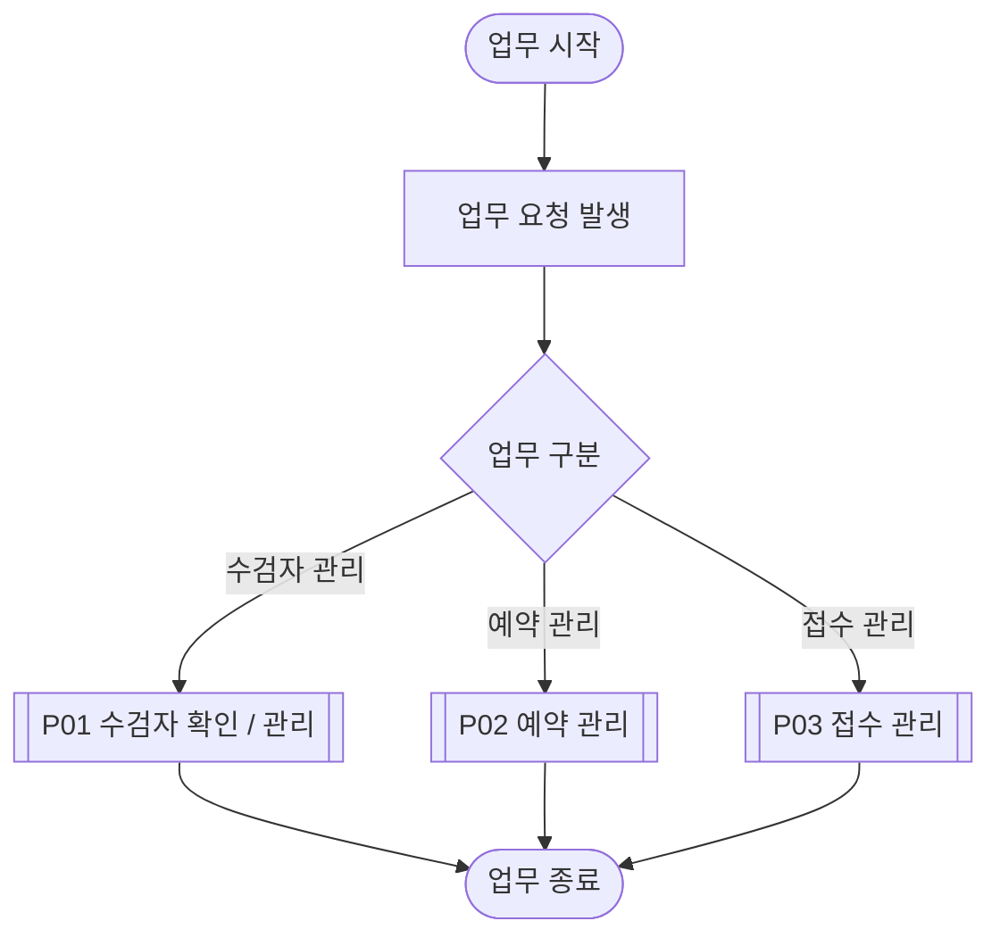

핵심 정상업무 연계:

```text
수검자 확인 또는 신규등록
→ 예약일·시간대 확정
→ 대상판정 및 검사구성
→ 예약 저장
→ 수검자 내원
→ 예약·예정검사 확인
→ 접수
```

보조업무:

```text
수검자 정보수정
예약·접수 내역조회
예약변경 / 예약취소
접수완료 AEX 변경 / 접수취소
```

---

# P01 수검자 확인 / 관리

## P01 전체 프로세스

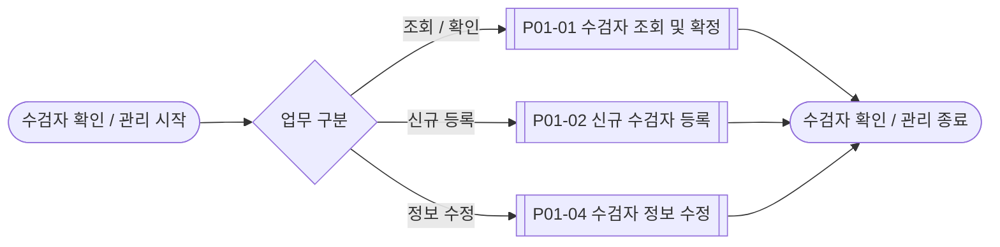

> EP-10에 따라 수검자 Master 삭제 프로세스는 정의하지 않는다. 정보 오류는 P01-04로 수정한다.

## P01 프로세스 구성

```text
P01-01 수검자 조회 및 확정
    └─ 대상이 없으면 P01-02 신규 수검자 등록

P01-02 신규 수검자 등록
    └─ P01-03 등록 중복 검증

P01-03 등록 중복 검증

P01-04 수검자 정보 수정
    └─ 주민등록번호 또는 차트번호 변경 시 P01-05 식별정보 변경 검증

P01-05 식별정보 변경 검증
    ├─ 주민등록번호 / 차트번호 고유성 검증
    └─ 주민등록번호 변경 시 RSV/RCP 업무 존재 여부 검증
```

## P01-01 수검자 조회 및 확정

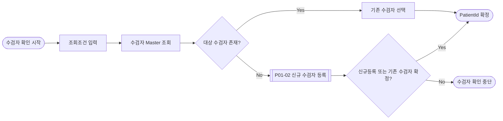

적용 규칙:

- 차트번호, 이름, 주민등록번호, 생년월일, 휴대전화번호 중 하나 이상으로 조회한다.
- 기존 수검자를 선택하면 `PatientId`를 이후 예약·접수 업무의 내부 전달키로 확정한다.
- 대상이 없으면 같은 업무 흐름에서 신규등록할 수 있다.
- 신규등록 SP가 동일 주민등록번호를 기존 수검자로 판정하면 신규행을 만들지 않고 기존 `PatientId`를 반환한다.
- 사용자가 취소하면 호출한 업무로 수검자를 확정하지 않고 종료한다.

## P01-02 신규 수검자 등록

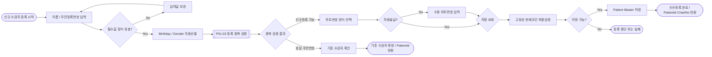

적용 규칙:

- 이름과 주민등록번호가 필수다.
- 주민등록번호 정규화·실제 생년월일 유효성·세기/성별 코드 산출이 실패하면 저장하지 않는다.
- 차트번호는 자동발급 또는 수동입력을 선택한다.
- 자동발급 번호는 화면 진입 시 미리 점유하지 않고 저장 Transaction에서 확정한다.
- 수동입력 차트번호는 저장 시 고유성을 다시 검증한다.
- 주민등록번호·차트번호 고유성은 저장 Transaction에서 최종 재검증하고 `수검자` 한 행으로 저장한다.
- 정상 저장된 수검자는 이후 예약이 취소·실패되어도 유지한다.

## P01-03 등록 중복 검증

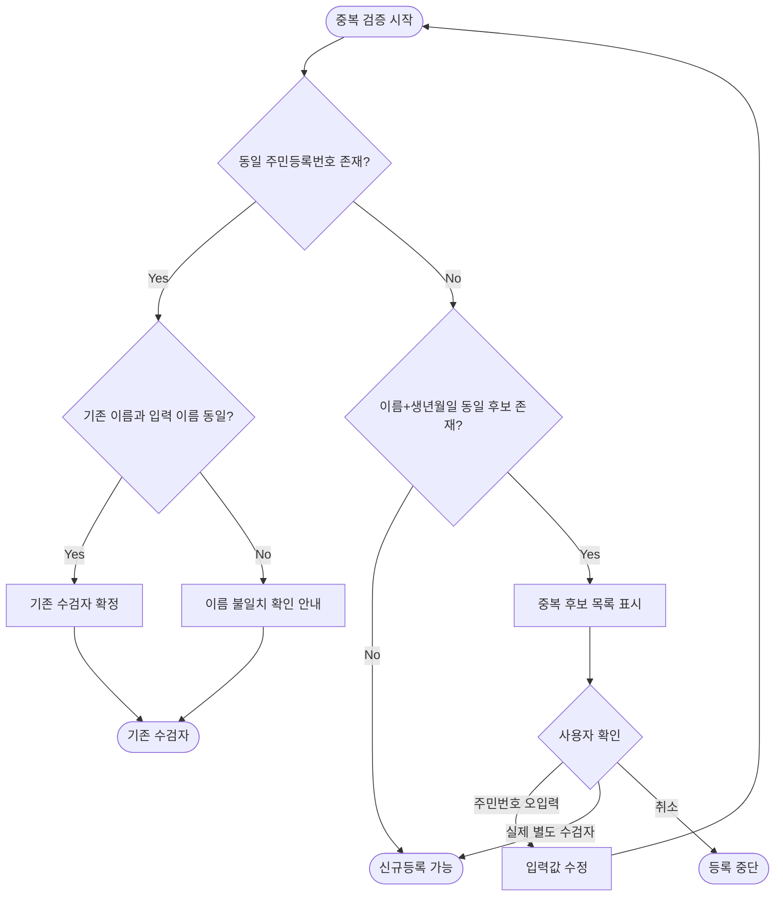

- 최종 고유성 기준은 주민등록번호다.
- 동일 주민등록번호는 이름이 달라도 신규등록하지 않는다.
- 이름+생년월일 후보는 경고·확인 대상이지 자동 동일인 확정조건이 아니다.
- 별도 수검자로 계속하기 확인은 현재 이름·생년월일·주민등록번호 조합에만 유효하다. 값이 바뀌면 다시 검증한다.
- UI 확인 이후에도 저장 Transaction에서 주민등록번호와 차트번호 고유성을 다시 검증한다.

## P01-04 수검자 정보 수정

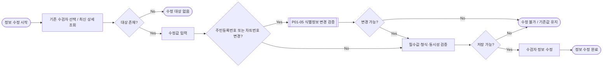

- 최신 `LastEditDate`를 동시성 기준으로 사용한다.
- 주민등록번호가 바뀌면 Birthday/Gender를 다시 산출한다.
- 변경되지 않은 주민등록번호에는 활성 업무 검증을 불필요하게 적용하지 않는다.
- 수정으로 기존 예약·접수의 TGT/NEX/AEX를 자동 재계산하거나 취소하지 않는다.

## P01-05 식별정보 변경 검증

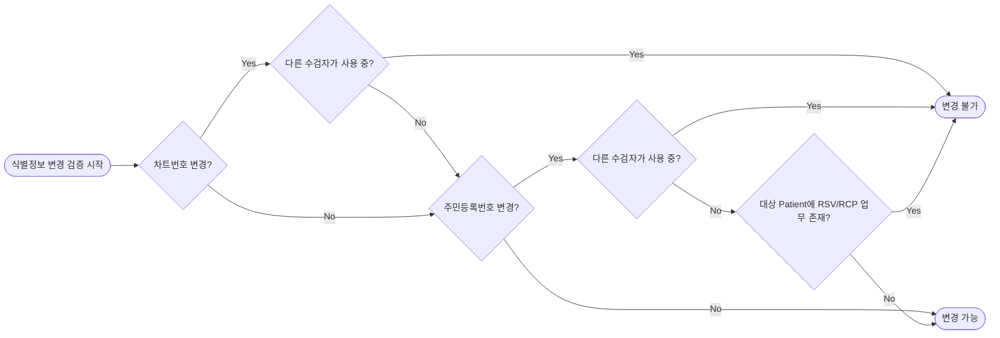

- 주민등록번호 변경에서만 활성 업무 존재를 검증한다.
- 활성 업무는 상태가 RSV 또는 RCP인 해당 수검자의 모든 업무이며 예약일의 과거·현재·미래를 구분하지 않는다.
- 차트번호 변경에는 활성 업무 존재 제한을 적용하지 않는다.

---

# P02 예약 관리

## P02 전체 프로세스

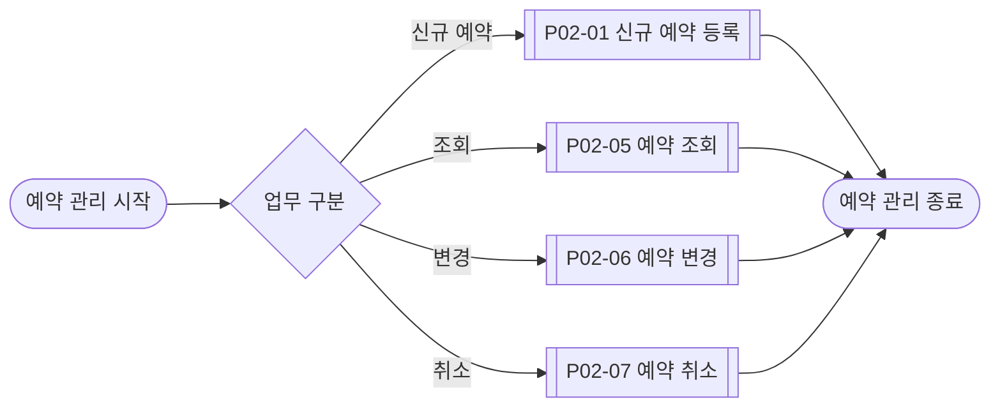

## P02 프로세스 구성

```text
P02-01 신규 예약 등록
    ├─ 직접 진입 시 P01-01 수검자 조회 및 확정
    └─ P02-02 예약 내용 구성

P02-02 예약 내용 구성
    ├─ P02-03 예약 일정 설정
    ├─ P02-04 예약 일정 검증
    ├─ 확정 예약일 기준 TGT 판정
    ├─ NEX 자동 구성
    └─ AEX 선택 및 검증

P02-05 예약 조회

P02-06 예약 변경
    ├─ P02-05 예약 조회
    ├─ 예약일/시간대 변경 시 P02-03·04
    ├─ 예약일 변경 시 TGT/NEX/AEX 영향 재검증
    └─ 실제 AEX 변경 시 AEX 검증

P02-07 예약 취소
    └─ P02-05 예약 조회
```

## P02 프로세스 간 호출 관계

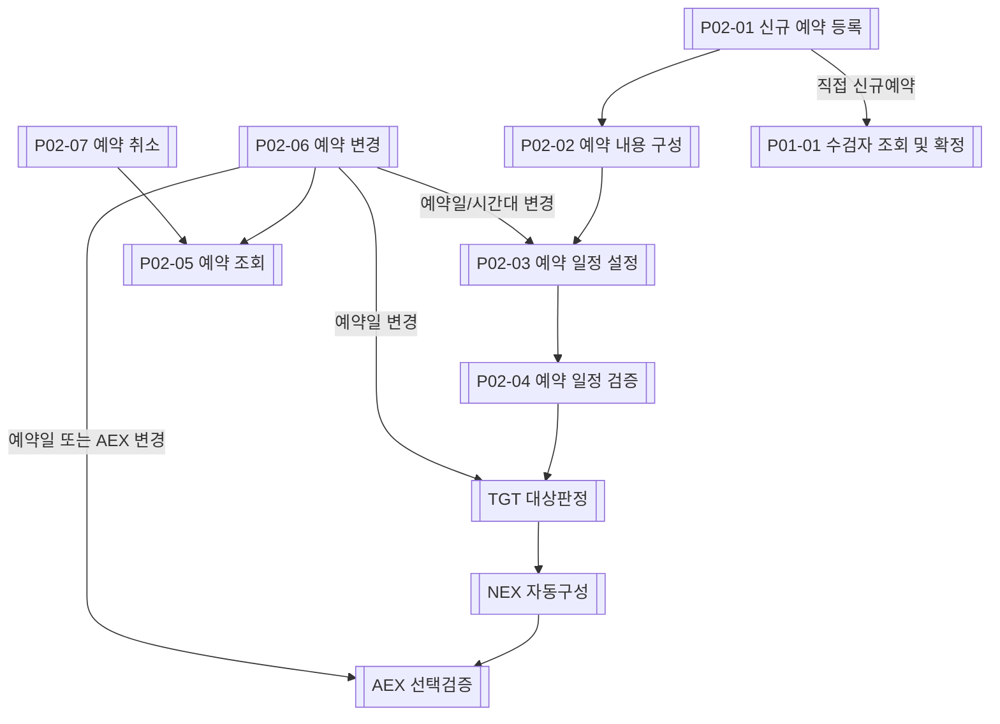

## P02-01 신규 예약 등록

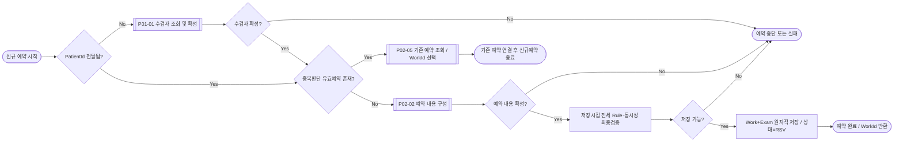

호출 규칙:

- 일반 직접 신규예약은 P01-01로 수검자를 확정한다.
- 수검자 관리에서 호출하거나 P03 WalkIn에서 호출하면 전달된 PatientId를 사용하고 P01-01을 반복하지 않는다.
- 기존 유효예약이 있으면 신규등록을 중단하고 `WorkId`로 공통 Workbench의 기존 건을 연다.
- 저장은 `예약접수` 1행으로 끝난다. 검사구성이 그 행의 컬럼이므로 Master와 Detail을 묶을 대상이 없다.

## P02-02 예약 내용 구성

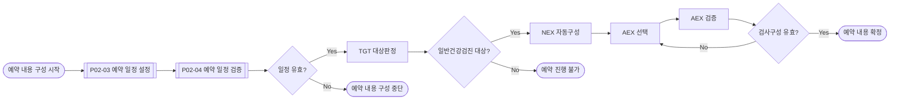

- 예약일·시간대를 먼저 확정한 후 같은 예약일을 기준으로 TGT와 NEX를 계산한다.
- NEX는 사용자 입력목록이 아니라 DB Rule 결과이며 TGT 대상자의 실제 구성은 기본 8종과 조건부 0~3종을 합한 8~11종이다.
- AEX는 0개 이상 선택할 수 있다.
- NEX와 같은 `ExamItemCode` 또는 성별조건 불충족 AEX는 선택할 수 없다.

## P02-03 예약 일정 설정

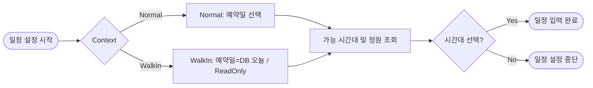

- 평일 AM/PM, 토요일 AM만 제공한다.
- 화면의 정원값은 안내용 Snapshot이며 저장 성공을 보장하지 않는다.
- WalkIn의 예약일은 DB 현재일로 고정한다.

## P02-04 예약 일정 검증

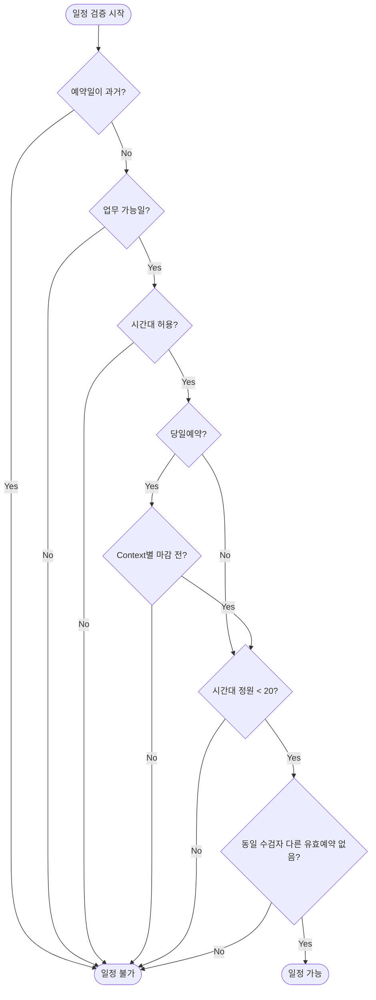

Context별 마감:

| Context | 당일 허용조건 |
|---|---|
| Normal | 해당 시간대 당일예약 마감 전 |
| WalkIn | 해당 시간대 접수 마감 전 |
| 미래일 | 당일 마감 미적용, CP/HOL·시간대·정원·중복 적용 |

- 마감과 같은 시각부터 불가다.
- 신규예약과 예약변경은 저장 Transaction 안에서 정원·중복을 다시 확인한다.
- 예약변경에서는 변경 대상 `WorkId` 자체를 중복판단에서 제외하고 다른 `RSV/RCP` 업무만 충돌로 본다.

## P02-05 예약 조회

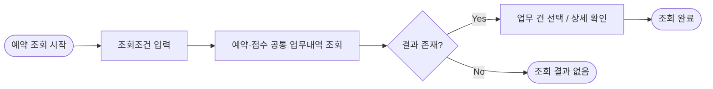

- RSV/RCP/CNR/CNC를 모두 조회할 수 있다.
- P03-04와 동일한 업무 데이터를 조회하며 실제 Form/SP를 공유한다.
- 후속 변경·취소·접수는 `WorkId`로 최신 데이터를 다시 조회한 후 상태를 재판정한다.

## P02-06 예약 변경

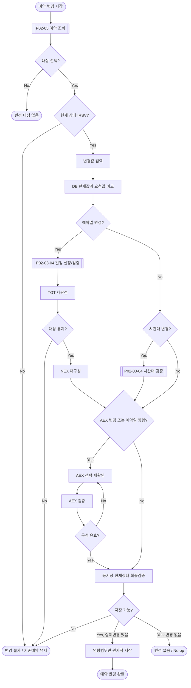

변경 Matrix:

| 실제 변경조합 | 일정 | TGT | NEX | AEX | 저장 |
|---|:---:|:---:|:---:|:---:|---|
| 예약일 변경 포함 | O | O | O | O | Work+영향 Detail |
| 시간대만 변경 | O | X | X | X | Work만 |
| AEX만 변경 | X | X | X | O | AEX Detail+Work 동시성 갱신 |
| 시간대+AEX | O | X | X | O | Work+AEX Detail |
| 변경 없음 | X | X | X | X | 데이터 변경 없음 |

- 예약일 변경 후 비대상이면 변경을 저장하지 않고 기존 예약을 유지한다.
- 새 NEX와 기존/요청 AEX가 충돌하면 유효하게 재선택한 뒤 저장한다.
- 시간대만 변경한 경우 TGT/NEX/AEX를 재검증하거나 재작성하지 않는다.
- AEX 실제 변경은 Work Aggregate 변경으로 처리해 Work의 동시성 토큰도 갱신한다.
- AEX 집합이 동일하면 Detail과 Work를 불필요하게 갱신하지 않는다.
- 일정·중복 검증에서 현재 `WorkId`는 제외하며, 자기 자신 때문에 `다른 유효예약`으로 차단되지 않아야 한다.

## P02-07 예약 취소

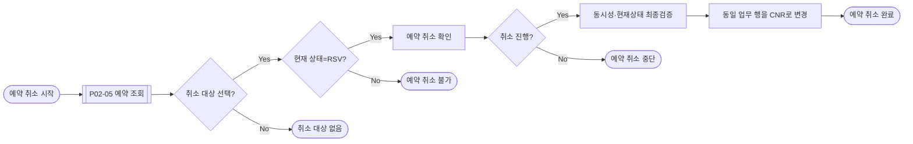

- Work와 검사 Detail을 물리 삭제하지 않는다.
- 취소 상태에서 복원하지 않는다.

---

# P03 접수 관리

## P03 전체 프로세스

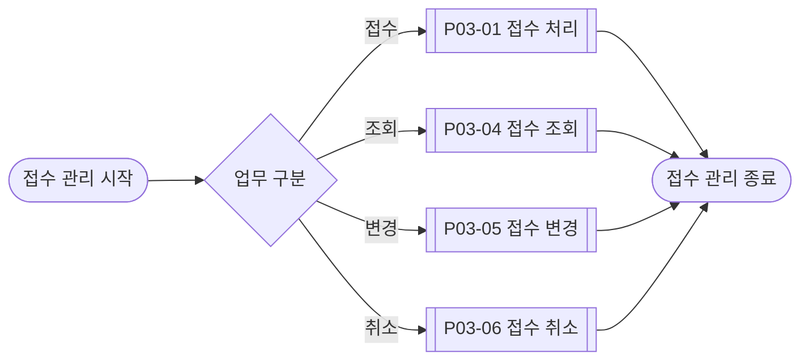

## P03 프로세스 구성

```text
P03-01 접수 처리
    ├─ 필요 시 P01-01 수검자 조회 및 확정
    ├─ P03-02 접수 대상 확인
    └─ P03-03 접수 가능조건 검증

P03-02 접수 대상 확인
    └─ 당일 RSV 업무가 없으면 필요 시 P02-01을 WalkIn Context로 호출

P03-03 접수 가능조건 검증
P03-04 접수 조회
P03-05 접수 변경
    └─ AEX 검사구성 검증
P03-06 접수 취소
```

## P03-01 접수 처리

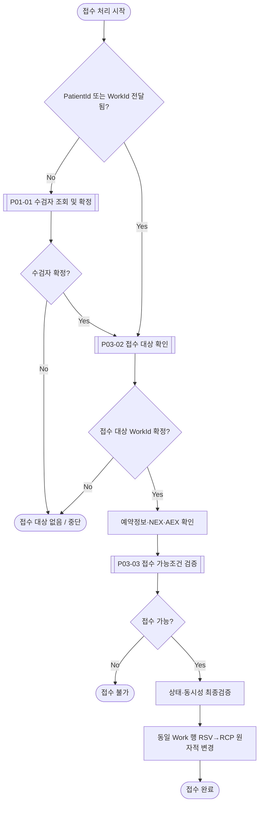

- 접수 화면에서 예약일·시간대·NEX·AEX를 수정하지 않는다.
- 접수 전 AEX 변경이 필요하면 예약변경을 먼저 완료한 후 접수한다.
- 접수 성공 시 예약일·시간대·검사구성은 유지하고 상태만 RCP로 변경한다.

## P03-02 접수 대상 확인

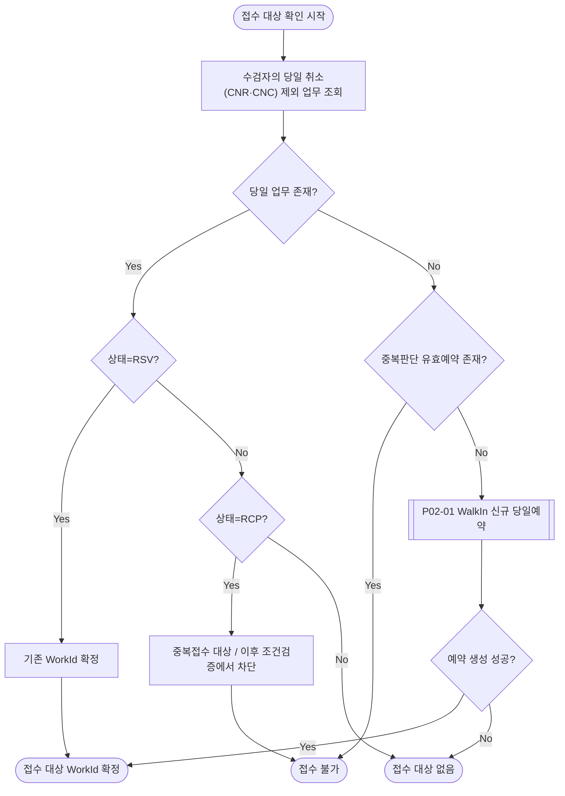

- 당일 RSV 업무를 우선 접수 대상으로 사용한다.
- RCP는 조회될 수 있으나 중복접수로 차단한다.
- CNR·CNC는 접수 대상으로 사용하지 않는다.
- 당일 업무가 없어도 미래 유효예약 등이 RP-06과 충돌하면 WalkIn을 생성할 수 없다.
- WalkIn은 P03에서 확정한 PatientId를 전달하여 P02-01을 재사용한다.

## P03-03 접수 가능조건 검증

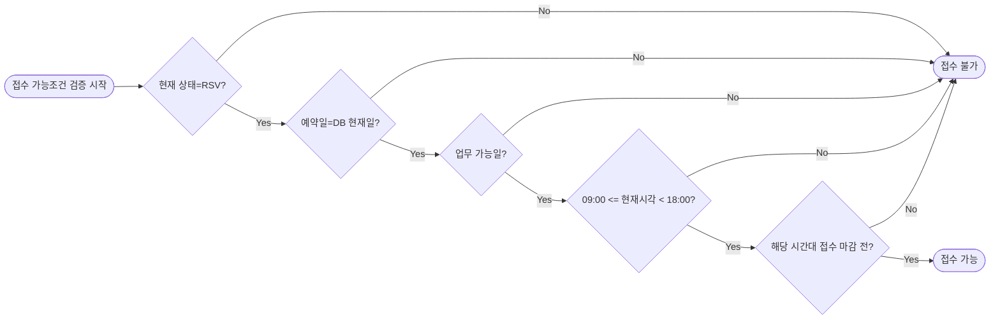

- 마감시각과 같은 시각부터 접수 불가다.
- UI에서 접수 가능으로 보였더라도 SP에서 상태·시각을 다시 확인한다.

## P03-04 접수 조회

```mermaid
flowchart LR
    S1([접수 조회 시작])
    S2[조회조건 입력]
    S3[예약·접수 공통 업무내역 조회]
    S4{결과 존재?}
    S5[업무 건 선택 / 상세 확인]
    E1([조회 완료])
    E2([조회 결과 없음])

    S1 --> S2
    S2 --> S3
    S3 --> S4
    S4 -->|Yes| S5
    S4 -->|No| E2
    S5 --> E1
```

P02-05와 동일한 Form/SP를 공유할 수 있으며 Context에 따라 Ribbon Action만 다르게 적용한다.

## P03-05 접수 변경

```mermaid
flowchart LR
    S1([접수 변경 시작])
    S2[[P03-04 접수 조회]]
    S3{대상 선택?}
    S4{현재 상태=RCP?}
    S5[AEX 추가 / 제거]
    S6[AEX 검사구성 검증]
    S7{구성 유효?}
    S8[동시성·현재상태 최종검증]
    S9{실제 AEX 변경 있음?}
    S10[AEX Detail 변경 + Work 동시성 갱신]
    E1([접수 변경 완료])
    E2([접수 변경 대상 없음])
    E3([접수 변경 불가])
    E4([변경 없음 / No-op])

    S1 --> S2
    S2 --> S3
    S3 -->|No| E2
    S3 -->|Yes| S4
    S4 -->|No| E3
    S4 -->|Yes| S5
    S5 --> S6
    S6 --> S7
    S7 -->|No| S5
    S7 -->|Yes| S8
    S8 --> S9
    S9 -->|No| E4
    S9 -->|Yes| S10
    S10 --> E1
```

- RCP 상태에서만 가능하다.
- 예약일·시간대·NEX는 ReadOnly다.
- 실제 AEX 변경 시 Work Aggregate의 `RowVersion`이 바뀌어야 한다.
- 동일 AEX 집합 저장은 No-op으로 처리한다.

## P03-06 접수 취소

```mermaid
flowchart LR
    S1([접수 취소 시작])
    S2[[P03-04 접수 조회]]
    S3{취소 대상 선택?}
    S4{현재 상태=RCP?}
    S5[접수 취소 확인]
    S6{취소 진행?}
    S7[상태·동시성 최종검증]
    S8[동일 업무 행을 CNC로 변경]
    E1([접수 취소 완료])
    E2([접수 취소 대상 없음])
    E3([접수 취소 불가])
    E4([접수 취소 중단])

    S1 --> S2
    S2 --> S3
    S3 -->|No| E2
    S3 -->|Yes| S4
    S4 -->|No| E3
    S4 -->|Yes| S5
    S5 --> S6
    S6 -->|No| E4
    S6 -->|Yes| S7
    S7 --> S8
    S8 --> E1
```

- RCP만 접수취소할 수 있다.
- RSV로 복원하지 않는다.
- 재진행은 신규예약부터 처리한다.

---

# 프로세스 간 통합 검증

## 1. P01 식별정보 변경

- 주민등록번호 변경 시에만 해당 Patient의 RSV/RCP 업무 존재 여부를 확인한다.
- 존재하면 변경을 차단한다.
- 기존 업무의 대상·검사구성을 자동 재판정하거나 자동 취소하지 않는다.

## 2. P03 → P01 수검자 확인

- 접수 대상이 직접 전달되지 않으면 P01-01로 수검자를 확정한다.
- 신규 수검자는 P01-02를 통해 저장하고 `PatientId`를 즉시 반환한다.
- 이후 예약·접수 업무에는 같은 PatientId를 전달한다.

## 3. P03 → P02 현장 당일예약

- 예약 없는 직접접수는 허용하지 않는다.
- P03-02에서 P02-01을 `WalkIn` Context로 재사용한다.
- 예약일은 DB 현재일로 고정하고 접수 마감 전까지만 저장할 수 있다.
- 저장 성공한 `WorkId`를 접수 Workbench와 접수 Modal로 전달한다.

## 4. 예약일 변경 영향 재검증

```text
예약일 변경
→ 일정검증
→ TGT 재판정
→ NEX 재구성
→ AEX 재검증
→ 유효한 경우만 저장
```

- 비대상이면 기존 예약을 유지한다.
- 시간대만 변경하면 TGT/NEX/AEX를 재검증하지 않는다.

## 5. 취소 상태 재진행

- CNR·CNC는 예약변경·접수·복원 대상으로 사용하지 않는다.
- 취소 데이터는 조회용으로 보존한다.
- 재진행은 신규예약을 생성한다.

## 6. 중복접수

- UI에서 RCP/CNR/CNC Action을 비활성화한다.
- 저장 시 기대상태 `RSV`와 동시성 토큰을 조건으로 원자적 UPDATE한다.
- 두 사용자가 동시에 접수해도 하나만 성공해야 한다.

## 7. 상태전이

```text
RSV → RSV  : 예약변경
RSV → RCP  : 접수
RSV → CNR  : 예약취소
RCP → RCP  : AEX 변경
RCP → CNC  : 접수취소
CNR → *    : 허용하지 않음
CNC → *    : 허용하지 않음
```

순환 상태전이와 복원 경로는 없다.

## 8. 동시성 및 잠금 경계

- 수검자 수정과 같은 Patient의 신규예약 생성이 경합할 수 있으므로 Patient 단위 직렬화가 필요하다.
- 신규예약·예약이동은 Patient와 대상 Slot을 같은 Transaction에서 잠그고 정원·중복을 재조회한다.
- 예약이동의 중복조회에서는 변경 대상 `WorkId`를 제외하고 다른 유효업무만 확인한다.
- 예약이동에서 기존 Slot과 신규 Slot을 함께 잠글 경우 정렬된 순서로 획득하여 교착 위험을 줄인다.
- 정확한 잠금 구현은 후속 DB 계약에서 정의하되 본 프로세스의 원자성 결과를 변경할 수 없다.

---

# 정책 추적표

## P01 ↔ 정책

| 프로세스 | 주요 정책 |
|---|---|
| P01-01 | EP-01, EP-02 |
| P01-02 | EP-03, EP-04, EP-09 |
| P01-03 | EP-05~07 |
| P01-04 | EP-04, EP-08, CP-06 |
| P01-05 | EP-03, EP-05, EP-08 |

## P02 ↔ 정책

| 프로세스 | 주요 정책 |
|---|---|
| P02-01 | RP-01, RP-06 |
| P02-02 | RP-07, RP-08, TGT, NEX, AEX |
| P02-03 | RP-02, RP-04, RP-05 |
| P02-04 | CP-01~04, HOL, RP-02~06, RP-09, 마감시간 정책 |
| P02-05 | CP-05, 상태 해석 |
| P02-06 | RP-03, RP-06~09, TGT, NEX, AEX |
| P02-07 | CP-05, RP-10 |

## P03 ↔ 정책

| 프로세스 | 주요 정책 |
|---|---|
| P03-01 | RCP-01, RCP-04, RP-08 |
| P03-02 | CP-05, RP-05, RP-06, RCP-01 |
| P03-03 | CP-01~04, HOL, RCP-02, RCP-03, 마감시간 정책 |
| P03-04 | CP-05, 상태 해석 |
| P03-05 | RP-08, AEX, RCP-05 |
| P03-06 | CP-05, RCP-06 |

---

# 최종 확정사항

1. P00은 수검자 관리·예약 관리·접수 관리의 최상위 구조다.
2. P01은 조회/확정, 신규등록, 중복검증, 정보수정, 식별정보 변경검증의 5개 프로세스다.
3. P02 신규예약은 `일정 확정 → 일정검증 → TGT → NEX → AEX → 저장` 순서다.
4. 기존 유효예약이 있으면 신규예약을 생성하지 않고 기존 Work를 연다.
5. 예약변경의 중복판정에서는 변경 대상 Work 자체를 제외한다.
6. 예약일 변경은 TGT/NEX/AEX를 영향 재검증하고 시간대만 변경하면 일정 Rule만 검증한다.
7. P03은 예약 기반 접수만 허용하며 현장 내원도 WalkIn 당일예약 후 접수한다.
8. 접수 단계에서는 예약정보와 검사구성을 확인하며 직접 편집하지 않는다.
9. 예약과 접수는 동일 업무 행의 RSV/RCP/CNR/CNC 상태전이다.
10. 취소는 보존하되 복원하지 않는다.
11. 모든 Write는 DB에서 현재상태·정원·중복·Rule·동시성을 최종 검증한다.

# 최종 검수

| 검수영역 | 결과 |
|---|:---:|
| 정책 → 프로세스 정방향 추적 | PASS |
| 프로세스 → 정책 역방향 추적 | PASS |
| P01~P03 종료점 | 모두 존재 |
| 신규등록 중복후보 루프 | 수정/별도등록/중단 분기 존재 |
| 신규예약 기존 유효예약 분기 | 기존 Work 연결 후 종료 |
| 예약일/시간대/AEX 변경 영향분리 | PASS |
| NEX 실제 구성 Cardinality | 8~11종 |
| 예약변경 현재 Work 제외 중복판정 | PASS |
| WalkIn → 신규예약 → 접수 복귀 | PASS |
| 중복접수·취소·복원 교착 | 없음 |
| 범위 외 업무 유입 | 없음 |
| 후속 기능·화면·DB 설계에 필요한 미결정 업무흐름 | 0건 |

> **최종 판정: GO — 본 문서는 `HC-RSV-RCP-20260904-R3` 기준선의 최종 프로세스 정의서이며 이후 READ-ONLY로 사용한다.**
