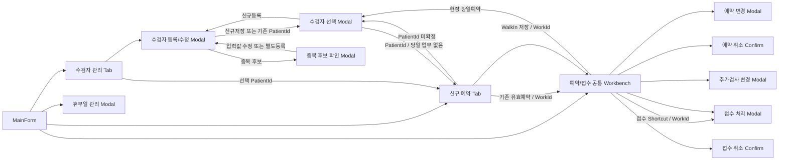

# 검진 예약·접수 관리 프로그램 — 최종 와이어프레임 정의서

- **문서명:** `03_Wireframe_Definition.md`
- **상태:** FINAL / GO / READ-ONLY
- **문서 버전:** v1.5
- **기준일:** 2026-09-08
- **기준선 ID:** `HC-RSV-RCP-20260908-R8`  (직전 `HC-RSV-RCP-20260908-R7`)
- **R8 개정 범위:** R7 직후의 약식 리뷰가 찾은 결함을 정정한다. `2026-06-03` 지방선거일 Seed 누락, `07a` No-op 의 정렬 함정, `03` Grid 의 `행버전` 누락, 게이트 세 곳의 fail-open, `G09` 과다 주장이 그것이다
- **대상 환경:** C# WinForms / .NET Framework 4.6.1 / DevExpress Components 20.2 / MSSQL
- **기준문서:** `00_Project_Policy.md`, `01_Process_Definition.md`, `02_Function_Definition.xlsx`
- **설계 원칙:** 정책·프로세스·기능을 UI로 표현하되 신규 업무기능이나 정책을 추가하지 않는다.
- **테스트 주민등록번호 표시·저장 원칙:** 임의 생성한 테스트 값만 사용한다. 화면에서는 전체값을 표시할 수 있고 DB에는 `-`를 제거한 숫자 13자리 값을 저장한다.
- **기준본 통제:** 구현 기준 파일명은 오직 `03_Wireframe_Definition.md`다. 파일명에 `(1)`, `개선본`, `후보본` 등이 붙은 과거 사본은 구현 기준으로 사용하지 않는다.
- **변경 통제:** 본 문서의 개정은 재봉인 절차(ROOT `AGENTS.md` §2.2)로만 한다. 화면 Control의 좌표·크기 등 비업무적 미세조정은 Source에서 수행할 수 있으나 화면 ID, Navigation, Action, 입력·ReadOnly 범위, Validation 의미는 그 절차 밖에서 변경할 수 없다.

---

# 1. 설계 범위 및 확정 원칙

## 1.1 전체 UI 구조

```text
MainForm
├─ 상단 업무 Navigation
├─ Context Ribbon
├─ 열린 업무 Tab
└─ 현재 업무 View
    ├─ 조회조건
    ├─ Grid / Editor
    └─ ReadOnly Detail

Transaction 업무
└─ Modal Dialog / Confirmation Dialog
```

상단 업무 Navigation:

```text
[수검자 관리]   [신규 예약]   [예약 관리]   [접수 관리]   [휴무일 관리]
```

`[휴무일 관리]`는 Tab을 열지 않고 `DLG-HOL-01` Modal을 직접 연다. 기준정보 관리이며 업무 Tab이 아니다.

업무 Tab 운영:

- 주요 업무화면은 MainForm 내부 Tab으로 연다.
- 동일 업무 Tab은 중복 생성하지 않는 Single Instance를 기본으로 한다.
- 예약 관리와 접수 관리는 동일 Workbench Tab 하나를 공유한다.
- 동일 Workbench는 `Reservation` / `Reception` Context로 전환하며 Tab Caption과 Ribbon Action이 바뀐다.
- 등록·변경·접수·취소는 Main View에서 직접 편집하지 않고 Modal/Confirm으로 분리한다.
- 신규예약은 정보량과 진행단계가 크므로 Main Tab Full Editor로 사용한다.

## 1.2 Main Tab / Modal 역할

| 구분 | UI 형태 | 역할 |
|---|---|---|
| 수검자 관리 | Main Tab | 조회, 대상 선택, 상세 확인 |
| 신규 예약 | Main Tab | 수검자 확정 → 일정 → TGT → NEX → AEX → 저장 |
| 예약/접수 관리 | 공통 Main Tab | 업무내역 조회, 상태 확인, 후속 Action 시작 |
| 수검자 신규/수정 | Modal | Master 등록·수정 |
| 수검자 선택 | Modal | 신규예약/WalkIn 대상 PatientId 반환 |
| 중복 후보 확인 | Modal | 이름+생년월일 후보 확인·재입력·별도등록 분기 |
| 예약 변경 | Modal | 예약일·시간대·AEX 변경 |
| 접수 처리 | Modal | 예약·검사구성 최종확인 후 RSV→RCP |
| 접수완료 추가검사 변경 | Modal | RCP 상태에서 AEX만 변경 |
| 변경이력 열람 | Modal | 대상 행 1개의 변경기록 최신순 열람 (읽기 전용) |
| 휴무일 관리 | Modal | 휴무일 Master 열람과 자체휴무일 등록·수정·삭제 |
| 예약/접수 취소 | Confirmation | RSV를 CNR로, RCP를 CNC로 변경 |

## 1.3 공통 업무조건 표시

MainForm 하단 상태영역 또는 `RibbonStatusBar`에 공통 업무상태와 조작자를 표시한다.

```text
업무 상태 : 업무 가능
업무 상태 : 업무 불가 — 휴무일
업무 상태 : 업무 불가 — 운영시간 외 (09:00~18:00)
조작자 : 접수1번창구
```

- 공통 업무불가 상태에서는 업무 수행 Ribbon Action을 비활성화한다.
- `컬럼설정`처럼 데이터 변경과 무관한 화면설정은 사용 가능하다.
- 화면 상태는 안내값이며 저장 성공을 보장하지 않는다.
- 조작자는 WinForms 설정 파일의 값을 읽기 전용으로 표시하며 입력 Control이 아니다. Write Stored Procedure 호출 시 `@OperatorName`으로 전달한다. 로그인·권한·사용자별 개인화는 구현하지 않는다.

## 1.4 DevExpress 20.2 구현 기준

| 영역 | 기준 Control / 구현 방식 |
|---|---|
| MainForm | `RibbonForm` + `RibbonControl` 1개 |
| Navigation / Context Action | `RibbonPage`, `RibbonPageGroup`, `BarButtonItem` |
| Main 업무 Tab | `XtraTabControl` + 업무별 `XtraUserControl` |
| 화면 배치 | `LayoutControl`, `SplitContainerControl`, Dock |
| 목록 | `GridControl` + `GridView` |
| 일반 입력 | `TextEdit`, `MemoEdit`, `DateEdit`, `RadioGroup`, `CheckEdit` |
| Modal | `XtraForm` |
| 입력 검증 | `DXValidationProvider`, `DXErrorProvider`, Blocking Message |
| 상태표시 | `RibbonStatusBar` 또는 MainForm 하단 상태영역 |

구현 원칙:

- 고정 Pixel 중심 배치를 피하고 Layout/Dock/Splitter를 사용한다.
- MainForm은 기본 Maximized로 연다.
- 최소 검증 해상도는 `1366×768`, 권장 기준은 `1920×1080`이다.
- Windows 배율 100%와 125%에서 Label·Grid Header·Modal 하단버튼 잘림을 확인한다.
- Ribbon과 별도 Main Menu Bar를 중복 구성하지 않는다.
- DevExpress 20.2에서 제공되지 않는 최신 API에 의존하지 않는다.

---

# 2. 화면 목록

| 화면 ID | 화면명 | 형태 | 주요 Process | 주요 Function |
|---|---|---|---|---|
| WF-00 | MainForm Shell | MainForm | P00 | 공통 |
| WF-PAT-01 | 수검자 관리 | Main Tab | P01-01~05 | F-PAT-001~003, F-COM-002, F-COM-007 |
| DLG-PAT-01 | 수검자 등록/수정 | Modal | P01-02~05 | F-PAT-002~003, F-COM-002, F-COM-007 |
| DLG-PAT-02 | 수검자 선택 | Modal | P01-01~03 | F-PAT-001~002, F-COM-002, F-COM-007 |
| DLG-PAT-03 | 중복 후보 확인 | Modal | P01-03 | F-COM-002 |
| WF-RSV-01 | 신규 예약 | Main Tab | P02-01~04 | F-RSV-001, F-COM-003~005, F-COM-007 |
| WF-WRK-01 | 예약/접수 공통 Workbench | Main Tab | P02-05, P03-04 | F-COM-001, F-COM-007 |
| DLG-RSV-01 | 예약 변경 | Modal | P02-06 | F-RSV-002, F-COM-003~005, F-COM-007 |
| CNF-RSV-01 | 예약 취소 확인 | Confirm | P02-07 | F-RSV-003, F-COM-007 |
| DLG-RCP-01 | 접수 처리 | Modal | P03-01~03 | F-RCP-001, F-COM-006~007 |
| DLG-RCP-02 | 추가검사 변경 | Modal | P03-05 | F-RCP-002, F-COM-004, F-COM-007 |
| CNF-RCP-01 | 접수 취소 확인 | Confirm | P03-06 | F-RCP-003, F-COM-007 |
| DLG-LOG-01 | 변경이력 열람 | Modal | P01~P03 공통 | F-COM-008 |
| DLG-HOL-01 | 휴무일 관리 | Modal | 기준정보 | F-COM-009 |

---

# 3. 전체 Navigation



호출계약:

```text
BeginNewReservation(Context, PatientId?, Source)
OpenWorkbench(WorkContext, WorkId?)
```

- Navigation 전달키는 `PatientId` 또는 `WorkId`다.
- 두 내부 키는 Grid 기본 컬럼과 화면 상세에 노출하지 않는다.
- WorkId Targeted Navigation은 기존 조회조건과 관계없이 최신 한 건을 직접 조회하고 자동 선택한다.

---

# 4. WF-00 — MainForm Shell

## 4.1 전체 Wireframe

```text
┌──────────────────────────────────────────────────────────────────────────────┐
│ 검진 예약·접수 관리                                                         │
├──────────────────────────────────────────────────────────────────────────────┤
│ [수검자 관리]   [신규 예약]   [예약 관리]   [접수 관리]   [휴무일 관리]     │
├──────────────────────────────────────────────────────────────────────────────┤
│ Context Ribbon                                                              │
│ [검색]                   [현재 업무 Action]                    [보기]        │
│ ...                      ...                                  [컬럼설정]      │
├──────────────────────────────────────────────────────────────────────────────┤
│ [수검자 관리 ×] [신규 예약 ×] [예약 관리 ×]                                │
├──────────────────────────────────────────────────────────────────────────────┤
│                                                                              │
│                          현재 선택된 업무 Tab                                │
│                                                                              │
├──────────────────────────────────────────────────────────────────────────────┤
│ 업무 상태 : 업무 가능 / 휴무일 / 운영시간 외                                │
└──────────────────────────────────────────────────────────────────────────────┘
```

## 4.2 Context Ribbon 공통 규칙

Ribbon Group 순서:

```text
[검색] → [현재 업무 Action] → [보기]
```

- 주요 업무 Action은 화면 하단에 배치하지 않는다.
- 버튼은 현재 Tab, Context, 선택행, 상태에 따라 Enabled/Disabled 한다.
- 같은 Context에서 상태가 바뀌어도 버튼을 숨기지 않고 Disabled 처리하는 것을 기본으로 한다.
- 실제 데이터 변경은 Modal/Confirm에서 수행한다.
- Tab 전환 시 해당 Tab의 Ribbon Page/Group만 활성화한다.

## 4.3 Single Instance Tab

| Tab | 인스턴스 정책 |
|---|---|
| 수검자 관리 | 1개 |
| 신규 예약 | 1개, Normal/WalkIn Context 공유 |
| 예약/접수 Workbench | 1개, Reservation/Reception Context 공유 |

동일 Tab 재호출 시 기존 인스턴스를 활성화하되 8.10과 9.1의 Reset/Targeted Navigation 계약을 적용한다.

---

# 5. WF-PAT-01 — 수검자 관리 Tab

## 5.1 목적

- 기존 수검자 조회·선택·상세 확인
- 신규등록 진입
- 기존 수검자 정보수정 진입
- 선택 수검자를 신규예약으로 전달
- 수검자 삭제 기능 미제공

## 5.2 Context Ribbon

```text
검색                 수검자                              보기
[조회]               [신규등록] [정보수정] [신규예약]   [변경이력] [컬럼설정]
```

| 상태 | 조회 | 신규등록 | 정보수정 | 신규예약 | 변경이력 | 컬럼설정 |
|---|:---:|:---:|:---:|:---:|:---:|:---:|
| 행 미선택 | O | O | X | X | X | O |
| 행 선택 | O | O | O | O | O | O |
| 공통 업무불가 | X | X | X | X | O | O |

`[변경이력]`은 조회 Action이라 **공통 업무불가에도 열린다** — 데이터를 바꾸지 않으므로 `308`/`309`의 차단 대상이 아니다(§23.4).

## 5.3 조회조건 및 검색계약

```text
차트번호 [              ]   이름       [              ]
주민번호 [              ]   생년월일   [ 📅          ]
휴대전화 [              ]
```

- 최소 1개 조건이 있어야 조회한다.
- 입력된 조건은 AND로 결합한다.
- 차트번호·주민번호·생년월일·휴대전화는 정규화 후 정확검색한다.
- 이름은 앞부분 일치(`Name LIKE @Name + '%'`)로 검색한다.
- 빈 문자열은 미입력으로 처리한다.
- 주민번호와 전화번호는 `-`를 제거하여 조회한다.
- 재조회 시 선택행과 우측 상세를 초기화한다.

## 5.4 Wireframe

```text
┌────────────────────────────────────────────────────────────────────────────┐
│ 조회조건                                                                   │
│ 차트번호 [       ] 이름 [       ] 주민번호 [             ]                │
│ 생년월일 [📅    ] 휴대전화 [             ]                                │
├──────────────────────────────────┬─────────────────────────────────────────┤
│                                  │ 수검자 상세                             │
│                                  │ [기본정보]                              │
│        수검자 Grid               │ 차트번호 / 이름                         │
│                                  │ 주민등록번호 전체값 / 생년월일 / 성별   │
│                                  │ [연락처]                                │
│                                  │ 휴대전화 / 전화번호 / E-mail            │
│                                  │ [주소]                                  │
│                                  │ 우편번호 / 주소 / 상세주소              │
│                                  │ [메모]                                  │
└──────────────────────────────────┴─────────────────────────────────────────┘
```

## 5.5 수검자 Grid

기본 컬럼:

```text
차트번호 → 이름 → 생년월일 → 성별 → 휴대전화번호
```

Column Chooser 추가 후보:

```text
주민등록번호(전체 테스트값)
전화번호
E-mail
우편번호
주소
```

제외:

- PatientId
- CreationDate / LastEditDate
- 과제 미사용 컬럼

동작:

- Single Row Selection
- Multi-Select 미사용
- 행 선택 즉시 우측 상세 갱신
- Double Click 업무 Action 없음
- 재조회 시 SelectedRow 해제와 상세 Clear

## 5.6 `수검자` 17개 컬럼 UI·저장 계약

No는 `04` §8.1.2의 DB 컬럼 순서(`PK → 감사 → FK → 일반`)를 따른다. 화면 배치 순서가 아니다.

| No | 컬럼 | UI 노출 / 편집 | 값 생성·저장 기준 |
|---:|---|---|---|
| 1 | PatientId | 화면 미표시 | DB 자동생성, 저장 성공 시 호출 화면 반환, 불변 |
| 2 | CreationDate | 화면 미표시 | INSERT 시 DB 서버시각 |
| 3 | LastEditDate | 화면 미표시 | INSERT 시 생성시각, UPDATE 성공 시 DB 서버시각. 감사 정보이며 동시성 기준이 아니다 |
| 4 | RowVersion | 화면 미표시 | DB 자동생성. 수정·삭제 요청에 함께 실어 보내는 동시성값 |
| 5 | ChartNo | 등록/수정 Editor | New 자동발급 또는 수동입력, Edit 수동수정, DB 최종 고유성 검증 |
| 6 | Name | 등록/수정, 조회/Grid/상세 | 필수 |
| 7 | SocialNumber | 등록/수정, 조회, 상세, 선택 컬럼 | 테스트 전체값 표시; `-` 제거 후 숫자 13자리 저장; DB 최종 고유성 검증 |
| 8 | Birthday | ReadOnly | SocialNumber에서 `yyyyMMdd` 자동산출 |
| 9 | Gender | ReadOnly | SocialNumber에서 M/F 자동산출; UI 남/여 |
| 10 | Email | 등록/수정, 상세/선택 컬럼 | 선택, 미입력 NULL |
| 11 | MobilePhone | 등록/수정, 조회/Grid/상세 | 선택, 미입력 NULL |
| 12 | Phone | 등록/수정, 상세/선택 컬럼 | 선택, 미입력 NULL |
| 13 | Zipcode | 등록/수정, 상세/선택 컬럼 | 선택, 미입력 NULL |
| 14 | Address | 등록/수정, 상세/선택 컬럼 | 선택, 미입력 NULL |
| 15 | AddressDetail | 등록/수정, 상세 | 선택, 미입력 NULL |
| 16 | HepatitisBExcluded | 등록/수정 Editor | 신규 기본값 0; NEX-03 제외 판정 입력이며 `1`이 제외다. Grid·조회조건에는 제공하지 않는다 (§6.2a) |
| 17 | Memo | 등록/수정, 상세 | 선택, 미입력 NULL |

- UI 미사용 NOT NULL 컬럼은 DB Default 또는 저장 SP가 보장한다.
- `PatientId`는 내부 연결키이며 화면에 표시하지 않는다.

---

# 6. DLG-PAT-01 / DLG-PAT-03 — 수검자 등록·수정·중복후보

## 6.1 DLG-PAT-01 공통 Editor

```text
Mode = New / Edit
```

```text
┌──────────────────────────────────────────────────────────────┐
│ 수검자 신규등록 / 정보수정                                  │
├──────────────────────────────────────────────────────────────┤
│ [기본정보]                                                   │
│ 차트번호 방식  ○ 자동발급  ○ 수동입력                       │
│ 차트번호       [ 저장 시 자동발급 / 수동값 ]                │
│ 이름 *         [                       ]                    │
│ 주민등록번호 * [ 000000-0000000       ] 전체 테스트값      │
│ 생년월일       [ yyyy-MM-dd            ] ReadOnly           │
│ 성별           [ 남 / 여               ] ReadOnly           │
├──────────────────────────────────────────────────────────────┤
│ [연락처] 휴대전화 / 전화번호 / E-mail                       │
├──────────────────────────────────────────────────────────────┤
│ [주소] 우편번호 / 주소 / 상세주소                           │
├──────────────────────────────────────────────────────────────┤
│ [검사 제외]  ☐ B형간염 검사 제외                            │
├──────────────────────────────────────────────────────────────┤
│ 메모                                                         │
├──────────────────────────────────────────────────────────────┤
│                                      [저장] [닫기]           │
└──────────────────────────────────────────────────────────────┘
```

## 6.2 주민등록번호 입력·파생값

```text
입력/변경
→ '-' 제거, 숫자 13자리
→ 생년월일 실제 날짜 검증
→ 7번째 자리 세기·성별 해석
→ Birthday/Gender 자동산출
→ 중복·변경조건 검증
```

| 7번째 자리 | 세기 | 성별 |
|---|---:|---|
| 1, 5 | 1900년대 | 남 |
| 2, 6 | 1900년대 | 여 |
| 3, 7 | 2000년대 | 남 |
| 4, 8 | 2000년대 | 여 |

- 실제 행정번호 존재 여부와 체크디지트 검증은 하지 않는다.
- 형식·날짜·파생 실패 시 Birthday/Gender를 Clear하고 저장을 비활성화한다.

## 6.2a 검사 제외 입력

```text
☐ B형간염 검사 제외        체크 = 제외    신규 기본값 = 해제
```

- `NEX-03`의 판정 입력이다. 체크하면 만 40세여도 B형간염(`EX010`)이 국가검사 구성에서 빠진다.
- New/Edit 두 Mode에서 모두 편집한다. Edit는 `SELECT_수검자상세`가 돌려준 현재값으로 초기화한다.
- **이미 저장된 예약·접수의 검사구성은 다시 만들지 않는다.** 다음 예약부터 적용된다 — 주민등록번호 변경이 기존 업무를 재판정하지 않는 것과 같은 원칙이다(`05` §10.2).
- 제외 사유는 입력받지 않는다. `NEX-03`이 요구하는 값이 `제외인가 아닌가` 하나뿐이고, 사유 판단에 필요한 검사 이력·판독은 `00` §8.2가 범위 밖에 두었다.
- Grid·조회조건·Column Chooser 후보로 제공하지 않는다(§18).

## 6.3 New Mode

- 이름·주민번호 필수
- 차트번호 방식 기본값은 자동발급
- 자동발급 번호는 저장 SP에서 확정·반환
- 수동입력은 ChartNo 필수 및 저장시점 고유성 재검증
- 동일 주민번호는 신규 INSERT 없이 기존 PatientId 반환
- 동일 주민번호+이름 불일치도 기존 수검자 확인 후 기존 PatientId 반환
- 이름+생년월일 동일/주민번호 상이는 DLG-PAT-03 표시
- 저장 성공 후 PatientId와 ChartNo를 호출 화면으로 반환

## 6.4 Edit Mode

- 기존 `SocialNumber` 값을 전체 테스트값으로 Load
- 최초값과 저장요청 정규화값을 비교해 실제 변경 여부 판단
- 주민번호 변경 시 Birthday/Gender 재산출
- 주민번호/차트번호 변경 시 고유성 검증
- 주민번호 변경+RSV/RCP 업무 존재 시 변경 차단
- 차트번호 변경에는 활성업무 검증 미적용
- Edit에서는 자동발급 전환 없이 기존 ChartNo 수동수정만 허용
- 기존 업무의 TGT/NEX/AEX 자동 재판정·취소 없음
- 기대 LastEditDate 불일치 시 저장하지 않고 최신값을 다시 조회

## 6.5 DLG-PAT-03 — 중복 후보 확인

```text
┌────────────────────────────────────────────────────────────────────┐
│ 중복 후보 확인                                                     │
├────────────────────────────────────────────────────────────────────┤
│ 입력값: 이름 / 생년월일 / 주민번호 전체값 / 휴대전화              │
├────────────────────────────────────────────────────────────────────┤
│ 후보: 차트번호 │ 이름 │ 생년월일 │ 성별 │ 주민번호 전체값 │ 휴대전화│
├────────────────────────────────────────────────────────────────────┤
│ 주민등록번호 오입력 여부를 확인하십시오.                           │
│               [입력값 수정] [별도 수검자로 계속] [닫기]           │
└────────────────────────────────────────────────────────────────────┘
```

- 입력값 수정: Editor 복귀 후 다시 검증
- 별도 수검자로 계속: 현재 Name+Birthday+SocialNumber 조합에만 유효
- 세 값 중 하나가 바뀌면 확인상태 해제 후 다시 후보검증
- 같은 확인값으로 저장 재시도 시 Dialog를 반복 표시하지 않음
- DB 최종 고유성은 `수검자.SocialNumber` 정확값 기준

---

# 7. DLG-PAT-02 — 수검자 선택 Modal

## 7.1 사용 위치

- 상단 신규예약 직접 진입 후 PatientId 미확정
- Reception Context의 현장 당일예약

## 7.2 Wireframe

```text
┌──────────────────────────────────────────────────────────────────────────────┐
│ 수검자 선택                                                                 │
├──────────────────────────────────────────────────────────────────────────────┤
│ 차트번호 [       ] 이름 [       ] 주민번호 [                 ]              │
│ 생년월일 [📅    ] 휴대전화 [             ]          [조회] [신규등록]      │
├──────────────────────────────────────────────────────────────────────────────┤
│ 차트번호 │ 이름 │ 주민번호 전체값 │ 생년월일 │ 성별 │ 휴대전화             │
├──────────────────────────────────────────────────────────────────────────────┤
│                                                      [선택] [닫기]           │
└──────────────────────────────────────────────────────────────────────────────┘
```

- 조회계약은 5.3과 동일하다.
- Single Row Selection
- 행 선택 후 `[선택]`으로 PatientId 반환
- 결과가 없으면 DLG-PAT-01 New Mode로 신규등록
- 신규저장 또는 동일 기존수검자 확정 후 재검색을 요구하지 않고 PatientId를 즉시 호출 화면에 반환
- DLG-PAT-01 취소 시 DLG-PAT-02 유지

---

# 8. WF-RSV-01 — 신규 예약 Main Tab

## 8.1 Context

```text
Normal = 일반 신규예약
WalkIn = 현장 당일예약
```

같은 Tab/UI를 재사용하되 Context 변경 시 Dirty 확인과 전체 Reset을 적용한다.

## 8.2 Ribbon

```text
예약
[예약저장]
```

- 수검자 선택·일정·AEX는 화면 내부에서 처리한다.
- 화면 입력 준비상태가 충족되면 예약저장을 Enabled 한다.
- 클릭 후 DB 최종검증 실패 가능성을 항상 전제로 한다.

## 8.3 Wireframe

```text
┌─────────────────────────────────────────────────────────────────────────┐
│ 수검자 정보                              │ 예약 일정                    │
│ 차트번호 / 이름 / 생년월일 / 성별        │ 예약일 [📅]                  │
│                                          │ ○ 오전  12 / 20              │
│                                          │ ○ 오후  20 / 20              │
├──────────────────────────────────────────┴──────────────────────────────┤
│ TGT 대상판정 : 미판정 / 대상 / 비대상                                  │
├───────────────────────────────────┬─────────────────────────────────────┤
│ NEX ReadOnly                      │ AEX Editable                        │
│ 검사명               구분         │ 선택 │ 검사명 │ 선택불가 사유       │
│ 문진/진찰            기본         │ ☐    │ 복부초음파                │
│ ...                                │ X    │ 유방초음파 │ 성별 조건      │
│ 골밀도검사           조건부       │ X    │ 골밀도검사 │ 국가검진 포함  │
└───────────────────────────────────┴─────────────────────────────────────┘
```

## 8.4 화면 비율

```text
상단 수검자/일정 : 30~35%
하단 검사구성    : 65~70%
상단 내부        : 수검자 45 / 일정 55
하단 내부        : NEX 55 / AEX 45
```

고정 좌표로 잠그지 않고 Splitter/Layout 비율로 구현한다.

## 8.5 진행 상태

최초:

```text
수검자 선택 Enabled
예약 일정 Disabled
TGT 미판정
NEX Empty/ReadOnly
AEX Disabled
예약저장 Disabled
```

PatientId 확정 후:

- 중복판단 유효예약 확인
- 기존 유효예약 존재: 신규예약 중단, WorkId로 Reservation Workbench 이동
- 없음: 일정영역 Enabled

일정 확정 후:

```text
일정 화면검증
→ TGT
→ 대상이면 NEX
→ AEX 가용성/선택
→ 저장 준비상태 평가
```

비대상:

```text
TGT=비대상 / NEX 없음 / AEX Disabled / 예약저장 Disabled
```

## 8.6 일정 선택 및 정원

- Normal: 예약일 Editable, 과거일 선택 불가
- WalkIn: 예약일=DB 오늘, ReadOnly
- 월~토 운영, 일요일/HOL 불가
- 토요일 PM 불가
- 정원은 RSV+RCP, CNR·CNC 제외
- 20/20 시간대 선택 불가
- 저장 직전 DB에서 정원과 중복 재검증

당일 Context:

| 구분 | AM | PM |
|---|---|---|
| Normal 평일 | 10:00 전 | 15:00 전 |
| WalkIn 평일 | 11:00 전 | 16:00 전 |
| Normal 토요일 | 10:00 전 | 불가 |
| WalkIn 토요일 | 11:00 전 | 불가 |

## 8.7 TGT 표시

```text
대상판정 : 대상 — 최초검진
대상판정 : 대상 — 최근 완료연도 2024
대상판정 : 비대상 — 예약일 기준 만 20세 미만
대상판정 : 비대상 — 2년 주기 미도래
```

- 판정문구는 화면 계산결과이며 별도 DB 컬럼으로 저장하지 않는다.
- 저장 SP가 TGT를 다시 평가한다.

## 8.8 NEX

- 기본 8종에 조건부 Rule 결과를 추가하여 실제 8~11행을 ReadOnly Grid로 표시
- 사용자 추가·삭제 금지
- 예약일 변경 시 재구성
- 시간대만 변경 시 유지
- 구분은 기본/조건부로 표시 가능

## 8.9 AEX

7종 전체를 표시한다.

```text
선택 │ 검사명 │ 선택불가 사유
```

- 0개 이상 선택
- 성별 불충족: Disabled+사유
- NEX 동일 ExamItemCode: Disabled+`일반건강검진에 포함된 검사입니다.`
- 가격·수납·결제 미표시

## 8.10 Single Instance / Dirty / Reset

```text
BeginNewReservation(Context, PatientId?, Source)
```

다음 상황에서 미저장 변경 폐기 확인:

- 다른 PatientId로 재호출
- Normal↔WalkIn 전환
- Tab 닫기
- 다른 Flow가 같은 Tab을 재사용

```text
미저장 예약 내용이 있습니다. 현재 입력을 폐기하고 새 업무를 시작하시겠습니까?
[확인] [취소]
```

| 이벤트 | 예약일/시간대 | TGT | NEX | AEX | 저장상태 |
|---|---|---|---|---|---|
| PatientId 변경 | Clear | 미판정 | Clear | Clear/Disabled | Disabled |
| Context 전환 | 기본값 Reset | 미판정 | Clear | Clear/Disabled | Disabled |
| 예약일 변경 | 새 날짜, 시간대 재선택 | 재판정 | 재구성 | 유효 선택만 유지 | 재평가 |
| 시간대만 변경 | 새 시간대 | 유지 | 유지 | 유지 | 일정검증 후 재평가 |
| 저장 성공 | 전체 Clear | 미판정 | Clear | Clear/Disabled | Disabled |

## 8.11 예약저장 2단계 처리

화면 준비상태:

- PatientId 확정
- 예약일·시간대 선택
- 화면기준 일정 가능
- TGT 대상
- NEX 구성 완료
- AEX 선택구성 유효

저장 클릭 후 DB:

```text
현재 상태/업무일/마감
→ Patient 중복예약
→ Slot 정원
→ TGT
→ NEX
→ AEX
→ Transaction 저장
```

- 성공: WorkId·RowVersion 수신 후 Reservation Workbench에서 생성건 자동선택
- 실패: Commit 없음, 사유 표시, 일정/대상/검사구성 최신값 Refresh

---

# 9. WF-WRK-01 — 예약/접수 공통 Workbench

## 9.1 Context 전환과 대상 전달

```text
OpenWorkbench(WorkContext, WorkId?)
```

상단 일반 전환:

```text
[예약 관리] → WorkContext=Reservation / Caption=예약 관리
[접수 관리] → WorkContext=Reception / Caption=접수 관리
```

- 기존 SelectedRow 해제
- 우측 Detail Clear
- Transaction Action Disabled
- 조회조건/Grid 결과는 유지 가능하나 선택상태는 승계하지 않음

WorkId Targeted Navigation:

- 신규예약 중 기존 유효예약 연결
- Normal/WalkIn 저장 성공
- Reservation Context의 접수 Shortcut

처리:

```text
Context 전환
→ 조회조건과 무관하게 WorkId 직접조회
→ 최신 데이터
→ 행 자동선택
→ Detail/Action 재평가
→ 필요 시 Modal 실행
```

## 9.2 기본 레이아웃

```text
좌측 조회조건+Grid 60 : 우측 Detail 40
```

사용자 Splitter 조절을 허용한다.

## 9.3 조회조건 및 검색계약

```text
예약/접수일 [From] ~ [To]
상태 [전체/예약/접수완료/예약취소/접수취소]
차트번호 [          ]
이름 [          ]
```

- 최소 하나의 실질 조건 필요. 상태 `전체`만 선택한 경우 조건으로 보지 않는다.
- 입력조건 AND 결합
- 날짜는 양끝 포함
- From만 있으면 이후, To만 있으면 이전
- From>To는 Inline 오류
- 차트번호 정확검색, 이름 접두검색
- 시간대는 조회조건에서 제외
- 과거·현재·미래 모두 조회 가능

## 9.4 Grid

기본:

```text
예약/접수일 → 시간대 → 상태 → 이름 → 차트번호
```

선택 컬럼:

```text
성별 / 생년월일 / 휴대전화번호
```

제외:

- PatientId / WorkId
- 주민등록번호
- 정원현황
- NEX/AEX 상세
- 주소/E-mail/메모
- 시스템 생성·수정일 및 RowVersion

- Single Row Selection
- 재조회 시 선택·상세·Transaction Action Clear
- Double Click Action 없음

## 9.5 우측 Detail

```text
[수검자] 차트번호 / 이름 / 생년월일 / 성별
[예약] 예약일 / 시간대 / 현재 정원 / 상태
[NEX] 실제 저장 구성 ReadOnly
[AEX] 실제 저장 구성 ReadOnly
```

정원현황은 현재 조회값이며 Work 저장 Snapshot 컬럼이 아니다.

## 9.6 Reservation Context Ribbon

```text
검색                   예약 업무                         보기
[조회]                 [예약변경] [예약취소] [접수]     [변경이력] [컬럼설정]
```

| 선택 상태 | 예약변경 | 예약취소 | 접수 | 변경이력 |
|---|:---:|:---:|:---:|:---:|
| 미선택 | X | X | X | X |
| RSV | O | O | 조건부 O | O |
| RCP | X | X | X | O |
| CNR | X | X | X | O |
| CNC | X | X | X | O |
| 공통 업무불가 | X | X | X | O |

`[변경이력]`은 상태와 무관하게 행이 선택되면 열린다. 취소된 업무의 변경 내역도 남아 있고 그것을 보는 것이 열람의 목적이다(§23).

`접수`는 P02 상태변경 버튼이 아니라 Reception Context/P03로 연결하는 Shortcut이다.

## 9.7 Reception Context Ribbon

```text
검색                  접수 업무                                      보기
[조회]                [현장 당일예약] [예약변경] [접수]              [변경이력] [컬럼설정]
                      [추가검사변경] [접수취소]
```

| 선택 상태 | 현장 당일예약 | 예약변경 | 접수 | 추가검사변경 | 접수취소 | 변경이력 |
|---|:---:|:---:|:---:|:---:|:---:|:---:|
| 미선택 | O | X | X | X | X | X |
| RSV | O | O | 조건부 O | X | X | O |
| RCP | O | X | X | O | O | O |
| CNR | O | X | X | X | X | O |
| CNC | O | X | X | X | X | O |
| 공통 업무불가 | X | X | X | X | X | O |

현장 당일예약은 선택행과 무관한 독립 Action이다.

`[변경이력]`은 §9.6과 같다 — 상태와 무관하게 행이 선택되면 열리고, 조회 Action이라 공통 업무불가에도 열린다(§23.4).

## 9.8 현장 당일예약 Flow

```text
[현장 당일예약]
→ DLG-PAT-02 수검자 확정
→ 당일 취소(CNR·CNC) 제외 업무 확인
├─ RSV 존재: 해당 WorkId 선택 후 접수조건 검증
├─ RCP 존재: 중복접수 안내
└─ 당일 업무 없음
   → 미래 유효예약 등 RP-06 충돌 확인
   → WF-RSV-01 WalkIn
   → 예약일=오늘 ReadOnly
   → 예약 저장
   → Reception Workbench WorkId 자동선택
   → DLG-RCP-01
```

---

# 10. DLG-RSV-01 — 예약 변경 Modal

## 10.1 Wireframe

```text
┌──────────────────────────────────────────────────────────────────────┐
│ 예약 변경                                                            │
├──────────────────────────────────┬───────────────────────────────────┤
│ 수검자 정보 ReadOnly            │ 예약일/시간대 Editable             │
├──────────────────────────────────┴───────────────────────────────────┤
│ TGT 대상판정                                                       │
├──────────────────────────────────┬───────────────────────────────────┤
│ NEX ReadOnly                     │ AEX Editable                      │
├──────────────────────────────────┴───────────────────────────────────┤
│                                               [저장] [닫기]          │
└──────────────────────────────────────────────────────────────────────┘
```

## 10.2 전제

- RSV만 진입 가능
- 수검자 ReadOnly
- 예약일·시간대·AEX Editable
- 원본 RowVersion을 보관하고 저장 시 전달

## 10.3 변경 영향

| 변경 | UI 동작 |
|---|---|
| 예약일 | 저장상태 즉시 해제 → 일정 → TGT → NEX → AEX 재평가 |
| 시간대만 | 일정·정원·마감만 재평가, TGT/NEX/AEX 유지 |
| AEX만 | AEX 가용성·선택만 평가 |
| 시간대+AEX | 일정과 AEX만 평가 |
| 없음 | 저장 Disabled 또는 No-op 안내 |

- DB는 실제 변경조합을 다시 계산한다.
- 일정·중복 검증에서는 현재 `WorkId` 자체를 제외하고 다른 `RSV/RCP` 업무만 충돌로 판단한다.
- 예약일 변경 후 비대상 또는 AEX 충돌 미해소 시 저장 불가다.
- 동시성 충돌 시 최신 데이터 Refresh 후 Modal 값을 재평가한다.

---

# 11. DLG-RCP-01 — 접수 처리 Modal

## 11.1 Wireframe

```text
┌───────────────────────────────────────────────────────────────┐
│ 접수 처리                                                     │
├────────────────────────────────┬──────────────────────────────┤
│ 수검자 정보 ReadOnly           │ 예약 정보 ReadOnly           │
│ 차트번호/이름/생년월일/성별    │ 예약일/시간대/상태=RSV       │
├────────────────────────────────┼──────────────────────────────┤
│ NEX ReadOnly                   │ AEX ReadOnly                 │
├────────────────────────────────┴──────────────────────────────┤
│ 접수 가능 여부 : 가능 / 불가 + 사유                          │
│                                      [접수처리] [닫기]        │
└───────────────────────────────────────────────────────────────┘
```

## 11.2 ReadOnly

```text
수검자 / 예약일 / 시간대 / NEX / AEX = ReadOnly
```

접수 단계에서 AEX를 수정하지 않는다. 접수 전 변경은 Workbench의 예약변경으로 수행한다.

## 11.3 접수 가능조건

- 상태 RSV
- 예약일=DB 현재일
- 업무 가능일/HOL
- 09:00<=현재시각<18:00
- 해당 시간대 접수마감 전
- 최신 RowVersion 일치

성공:

```text
같은 WorkId / RSV→RCP / 예약일·시간대·검사구성 유지
```

---

# 12. DLG-RCP-02 — 접수완료 추가검사 변경 Modal

```text
┌───────────────────────────────────────────────────────────────┐
│ 추가검사 변경                                                 │
├────────────────────────────────┬──────────────────────────────┤
│ 수검자 정보 ReadOnly           │ 예약정보 ReadOnly / RCP      │
├────────────────────────────────┼──────────────────────────────┤
│ NEX ReadOnly                   │ AEX Editable                 │
├────────────────────────────────┴──────────────────────────────┤
│                                          [저장] [닫기]        │
└───────────────────────────────────────────────────────────────┘
```

- RCP 상태만 가능
- 예약일·시간대·NEX ReadOnly
- AEX-01~05 동일 적용
- 실제 변경 시 상태는 RCP 유지, Work RowVersion 갱신
- 동일 집합이면 No-op

---

# 13. 취소 Confirmation

## 13.1 CNF-RSV-01

```text
선택한 예약을 취소하시겠습니까?
취소 후 기존 예약으로 복원할 수 없습니다.
[확인] [닫기]
```

- RSV만 가능
- DB에서 상태·RowVersion 재확인 후 CNR

## 13.2 CNF-RCP-01

```text
선택한 접수를 취소하시겠습니까?
예약 상태로 되돌아가지 않으며 해당 업무 전체가 취소됩니다.
[확인] [닫기]
```

- RCP만 가능
- DB에서 상태·RowVersion 재확인 후 CNC

---

# 14. 상태·편집·Action Matrix

## 14.1 상태 표시

| DB 코드 | UI 표시 |
|---|---|
| RSV | 예약 |
| RCP | 접수완료 |
| CNR | 예약취소 |
| CNC | 접수취소 |

## 14.2 NEX/AEX 편집

| 화면 | NEX | AEX |
|---|---|---|
| Workbench 상세 | ReadOnly | ReadOnly |
| 신규예약 | ReadOnly | Editable |
| 예약변경 | ReadOnly | Editable |
| 접수처리 | ReadOnly | ReadOnly |
| 접수완료 추가검사변경 | ReadOnly | Editable |
| 취소 상태(CNR·CNC) | ReadOnly | ReadOnly |

## 14.3 Work 상태별 Action

| 상태 | 예약변경 | 예약취소 | 접수 | RCP AEX 변경 | 접수취소 |
|---|:---:|:---:|:---:|:---:|:---:|
| RSV | O | O | 조건부 O | X | X |
| RCP | X | X | X | O | O |
| CNR | X | X | X | X | X |
| CNC | X | X | X | X | X |

---

# 15. Validation 표현 및 Matrix

## 15.1 표현 원칙

```text
미리 판단 가능한 선택불가 → Disabled + 사유
입력필드 오류              → Inline 오류
저장/상태전이 최종차단     → Blocking Message + 중단
동시성 충돌                → Blocking Message + 최신값 Refresh
```

## 15.2 Validation Matrix

| Validation | UI 표현 | 결과 |
|---|---|---|
| 필수정보 누락 | Control 인접 Inline | 저장 불가 |
| 주민번호 13자리/날짜/파생 오류 | Inline, Birthday/Gender Clear | 저장 불가 |
| 주민번호 중복 | Blocking + 기존 수검자 확인 | 신규등록/수정 중단 |
| 차트번호 중복 | Blocking | 저장 중단 |
| 동일 주민번호+이름 불일치 | 기존 전체값 확인 | 신규등록 없이 기존 PatientId |
| 이름+생년월일 후보 | DLG-PAT-03 | 수정/별도등록/중단 |
| 주민번호 변경+RSV/RCP 존재 | Blocking | 주민번호 변경 불가 |
| 수검자 RowVersion 불일치 | Blocking+최신 수검자 Refresh | 수정 Rollback |
| 기존 유효예약 존재 | 안내+WorkId 연결 | 신규예약 중단 |
| 예약변경 다른 유효업무 | 현재 WorkId 제외 후 DB 재검증 | 자기 자신은 충돌로 판단하지 않음 |
| 과거 예약일 | 일정 Inline | 선택 불가 |
| 일요일/HOL | 날짜/일정 Disabled+사유 | 예약 불가 |
| 토요일 PM | 시간대 Disabled | 선택 불가 |
| 정원 20/20 | 시간대 Disabled+정원 마감 | 선택 불가 |
| Normal 당일예약 마감 | 시간대 Disabled+사유 | 저장 불가 |
| WalkIn 접수마감 | Inline/Blocking | 현장예약 불가 |
| TGT 비대상 | 판정결과+저장 Disabled | 예약 불가 |
| AEX 성별 제한 | Checkbox Disabled+사유 | 선택 불가 |
| AEX NEX 중복 | Disabled+국가검진 포함 사유 | 선택 불가 |
| 접수일 불일치 | Modal 사유+버튼 Disabled | 접수 불가 |
| 접수마감 | Modal 사유+버튼 Disabled | 접수 불가 |
| RCP/CNR/CNC 재접수 | Action/Modal 차단 | 접수 불가 |
| Work RowVersion 불일치 | Blocking+최신 Work Refresh | 변경 Rollback |
| Single Instance 재호출+Dirty | 폐기 Confirm | 확인 Reset / 취소 유지 |
| 저장 직전 정원·중복·상태 변경 | Blocking+Refresh | Transaction Rollback |
| 취소 | Confirm 후 DB 재검증 | CNR/CNC 상태전이 |
| 휴무일 날짜 중복 | DLG-HOL-01 Blocking | 등록 불가 |
| 법정·대체 공휴일 행 선택 | 입력행·[수정][삭제] Disabled | 변경 불가 (HOL-05) |
| 휴무일명 공백 | Inline | 저장 불가 |

## 15.3 DB 실패 후 UI

- DB 오류 ResultCode를 화면 업무문구로 매핑한다.
- 실패한 입력을 무조건 폐기하지 않는다.
- 정원·마감·상태·동시성처럼 최신값이 필요한 실패는 관련 영역을 Refresh한다.
- Transaction이 실패하면 성공 메시지나 로컬 상태전이를 적용하지 않는다.

---

# 16. Refresh·동시성·No-op UI 계약

- 수검자 Edit Modal은 원본 `LastEditDate`를 숨은 값으로 유지한다.
- Work 관련 Modal은 원본 `RowVersion`을 숨은 값으로 유지한다.
- 저장 성공 응답의 새 동시성값으로 화면 모델을 교체한다.
- 저장 실패 후 기존 RowVersion으로 재시도하지 않는다.
- AEX가 실제로 바뀌면 Work RowVersion이 변경된 것으로 처리한다.
- AEX 집합이나 예약값에 실제 변경이 없으면 성공적인 No-op 안내 후 불필요한 Refresh를 최소화할 수 있다.
- Targeted Navigation은 항상 최신 DB 데이터를 조회한다.

---

# 17. 주요 화면 필드 요약

## 17.1 수검자 관리/Editor

- ChartNo
- Name
- SocialNumber 전체 테스트값
- Birthday
- Gender
- MobilePhone
- Phone
- Email
- Zipcode
- Address
- AddressDetail
- Memo

## 17.2 수검자 선택 Modal 기본 Grid

- ChartNo
- Name
- SocialNumber 전체 테스트값
- Birthday
- Gender
- MobilePhone

## 17.3 예약/접수 Workbench

조회조건:

- 예약/접수일 From/To
- 상태
- 차트번호
- 이름

기본 Grid:

- 예약/접수일
- 시간대
- 상태
- 이름
- 차트번호

우측 상세:

- 수검자 기본정보
- 예약일/시간대/정원/상태
- NEX 실제 구성
- AEX 실제 구성

Workbench에는 주민등록번호를 표시하지 않는다.

---

# 18. Column Chooser 정책

제공:

```text
표시 / 숨김
기본값 복원
```

제외:

- 사용자별 Layout DB 저장
- 로그인별 개인화
- 복잡한 Column Profile 관리자

- 허용 컬럼 후보만 제공한다.
- 수검자 관리에서는 SocialNumber를 선택 컬럼으로 허용한다.
- Workbench에서는 SocialNumber를 후보로 제공하지 않는다.
- 내부키, 정규화 컬럼, 동시성값, 생성/수정시각, 미사용 컬럼은 모든 Grid에서 제외한다.
- `HepatitisBExcluded`는 Editor에서 편집하지만 Grid 후보로 제공하지 않는다. 검색 조건도 목록 표시값도 아니고 `NEX-03` 판정 입력일 뿐이다(§6.2a).

---

# 19. Process / Function 추적

| UI | Process | Function |
|---|---|---|
| 수검자 조회/선택 | P01-01 | F-PAT-001 |
| 신규 수검자 등록 | P01-02~03 | F-PAT-002, F-COM-002 |
| 중복 후보 확인 | P01-03 | F-COM-002 |
| 수검자 수정 | P01-04~05 | F-PAT-003, F-COM-002 |
| 신규예약 | P02-01~04 | F-RSV-001, F-COM-003~005 |
| 예약조회 Workbench | P02-05 | F-COM-001 |
| 예약변경 | P02-06 | F-RSV-002, F-COM-003~005 |
| 예약취소 | P02-07 | F-RSV-003 |
| 접수처리 | P03-01~03 | F-RCP-001, F-COM-006 |
| 접수조회 Workbench | P03-04 | F-COM-001 |
| RCP AEX 변경 | P03-05 | F-RCP-002, F-COM-004 |
| 접수취소 | P03-06 | F-RCP-003 |
| 현장 당일예약 | P03-02→P02-01~04 | F-RSV-001 |
| 변경기록 열람 | P01~P03 | F-COM-008 |
| 휴무일 관리 | 기준정보 (P 없음) | F-COM-009 |
| 공통 업무조건 | P01~P03 | F-COM-007 |
| Single Instance 상태초기화 | P01-01, P02-01, P03-02 | 기존 기능의 UI 상태계약 |

---

# 20. Out-of-Scope UI 차단

다음 화면·기능을 생성하지 않는다.

- 로그인/권한
- 통계 Dashboard
- 실제 검사 수행/진행상태
- 검사결과 입력·판독·최종판정
- 조직검사·용종절제·후속오더
- 공단 대상자 API
- 검사 Master/AEX 관리자 CRUD
- 법정공휴일·대체공휴일 행의 화면 변경 (`DLG-HOL-01`은 자체휴무일만 편집한다. `00` HOL-05)
- 가격·할인·수납·결제
- 수검자 삭제·복원
- 보험/VIP/학생/마케팅 업무
- 출력·인쇄·엑셀 내보내기
- 사용자별 Grid Layout DB 저장

---

# 21. 최종 화면 흐름 시나리오

## 21.1 수검자 관리 → 신규등록 → 신규예약

```text
수검자 관리 [신규등록]
→ DLG-PAT-01 New
→ 주민번호 파생/중복검증
→ PatientId 반환
→ Grid Refresh
→ [신규예약]
→ PatientId 전달
→ 일정/TGT/NEX/AEX
→ 저장
→ WorkId로 Reservation Workbench 자동선택
```

## 21.2 상단 신규예약 → 신규 수검자

```text
[신규 예약]
→ WF-RSV-01
→ [수검자 선택]
→ DLG-PAT-02 결과 없음
→ [신규등록]
→ DLG-PAT-01
→ 신규저장 또는 기존수검자 확정
→ PatientId 즉시 반환
→ 신규예약 계속
```

## 21.3 기존 유효예약

```text
PatientId 확정
→ 기존 유효예약 확인
→ 존재
→ 신규예약 중단
→ Reservation Workbench WorkId 직접조회·자동선택
```

## 21.4 예약일 변경

```text
RSV 선택 → [예약변경]
→ 예약일 변경
→ 일정검증
→ TGT
→ NEX
→ AEX 재검증
→ 저장 또는 기존예약 유지
```

## 21.5 시간대만 변경

```text
RSV 선택 → [예약변경]
→ 시간대 변경
→ 일정·마감·정원·중복만 검증
→ TGT/NEX/AEX 유지
→ 저장
```

## 21.6 현장 당일예약 후 접수

```text
Reception Context [현장 당일예약]
→ 수검자 확정
→ 당일 Work 없음
→ WalkIn 신규예약
→ WorkId 반환
→ Workbench 자동선택
→ 접수 Modal
→ RSV→RCP
```

## 21.7 취소

```text
RSV → 예약취소 Confirm → CNR
RCP → 접수취소 Confirm → CNC
CNR · CNC → 복원 없음 / 재진행 신규예약
```

## 21.8 Single Instance 대상 교체

```text
미저장 신규예약 존재
→ 다른 PatientId/Context 호출
→ 폐기 Confirm
├─ 취소: 기존 입력 유지
└─ 확인: 전체 Reset 후 새 대상 적용
```

---

# 22. 최종 적대적 검수

| 검수영역 | 확인내용 | 결과 |
|---|---|:---:|
| 정책 정합성 | CP/EP/RP/RCP 및 TGT/NEX/AEX/HOL 위반 없음 | PASS |
| 프로세스 정합성 | P01 대상 없음→신규등록, WalkIn 복귀 등 종료점 존재 | PASS |
| 기능정의 정합성 | 16개 Function ID / 36개 기능행 추적 | PASS |
| 신규 수검자 진입 | DLG-PAT-02에서 신규등록 후 PatientId 즉시 반환 | PASS |
| 주민번호 표시/저장 | 테스트 전체값 UI와 DB 숫자 13자리 저장 계약 일치 | PASS |
| Birthday/Gender | 입력·변경 자동산출, 실패 시 저장차단 | PASS |
| ChartNo New/Edit | New 자동/수동, Edit 수동수정 | PASS |
| 중복 후보 | 재입력/별도등록/중단 분기 | PASS |
| 수검자 | 17/17 컬럼 입력·파생·기본값·내부관리 계약 | PASS |
| 검색계약 | 최소조건, AND, 정확/접두검색, 정규화 확정 | PASS |
| Single Instance | Dirty Confirm/Reset/Targeted Navigation | PASS |
| WalkIn | 오늘 ReadOnly, 접수마감 전 저장 | PASS |
| Workbench | 공통 인스턴스 및 WorkId 직접조회 | PASS |
| UI/DB 검증경계 | 화면 준비상태와 DB 최종권한 분리 | PASS |
| 동시성 UI | LastEditDate/RowVersion Refresh 계약 | PASS |
| AEX Aggregate 변경 | 실제 변경 시 Work RowVersion 갱신 인지 | PASS |
| Reservation/Reception Action | 상태별 Matrix 일치 | PASS |
| Navigation 교착 | 없음 | PASS |
| 범위 외 누출 | 없음 | PASS |
| DevExpress 20.2 구현성 | 표준 Control/Event로 구현 가능 | PASS |
| 후속 DB 계약 전 필수 UI 미결정 | 0건 | PASS |

## 22.1 종결된 결함

| 결함 | 종결 위치 |
|---|---|
| 수검자 선택 Modal의 신규등록 경로 부재 | 3, 7, 21.2, 21.6 |
| 주민번호 편집·Birthday/Gender·ChartNo Mode 미정 | 5.6, 6 |
| Single Instance 상태 오염 | 8.10, 9.1, 21.8 |
| UI Enabled와 DB 성공 혼재 | 8.11, 15 |
| Reception Matrix 현장 당일예약 누락 | 9.7~9.8, 14 |
| 16개 컬럼 NOT NULL 값 출처 미정 | 5.6 |
| WorkId Targeted Navigation 불명확 | 3, 9.1 |
| 예약변경 자기 Work 오탐 가능성 | 10.3, 15.2 |
| 과거 03 파일 중복 기준본 | 본 문서 파일명으로 단일화 |

---

# 23. DLG-LOG-01 — 변경이력 열람 Modal

## 23.1 목적

`00` CP-06이 변경기록을 **열람용**으로 규정한 것을 받는 유일한 화면이다. 대상 행 하나의 변경 내역만 보여준다.

## 23.2 진입점

```text
WF-PAT-01   행 선택 → Context Ribbon [변경이력]   → TargetTable=수검자,   TargetKey=PatientId
WF-WRK-01   행 선택 → Context Ribbon [변경이력]   → TargetTable=예약접수, TargetKey=WorkId
```

두 진입점이 같은 Modal을 연다. 화면은 `SP-LOG-01`(`SELECT_변경이력`) 하나만 호출한다.

## 23.3 레이아웃

```text
┌──────────────────────────────────────────────────────────────┐
│ 변경이력 — 수검자 홍길동 (2026-000123)                       │
├──────────────────────────────────────────────────────────────┤
│ 기록일시          조작자(자기신고)  항목      변경전  변경후 │
│ 2026-09-07 14:20  접수1번데스크     휴대전화  010-…  010-…   │
│ 2026-09-06 09:11  접수1번데스크     주소      서울…  경기…   │
├──────────────────────────────────────────────────────────────┤
│                                                     [닫기]   │
└──────────────────────────────────────────────────────────────┘
```

Grid 컬럼은 `SP-LOG-01` RS1을 그대로 쓴다 — `RecordedAt` · `OperatorName` · `ColumnName` · `BeforeValue` · `AfterValue`. `LogId`는 표시하지 않는다(내부키, §18).

## 23.4 표시 계약

- **읽기 전용이다.** 편집·삭제·재적용 Action이 없다.
- 정렬은 `기록일시` 최신순 고정이다. 사용자 정렬을 제공하지 않는다.
- 기록이 0건이면 빈 Grid와 안내 문구를 보여준다. 오류가 아니다 — `SP-LOG-01`이 `Code=0`을 돌려준다.
- **`조작자`는 자기신고 값이다.** 인증된 사용자가 아니므로 컬럼 머리에 그 사실을 표시한다. `00` §8.2가 로그인·권한을 범위 밖에 두었고 DB가 실제 주체와 대조할 정보를 갖지 않는다.
- **`변경전`·`변경후`는 잘려 저장됐을 수 있다**(`00` CP-06, `NVARCHAR(4000)`). 복원 근거로 쓰지 않으며 화면도 복원 Action을 제공하지 않는다.
- 페이징을 두지 않는다. 대상 행 하나의 이력은 수십 건 규모이고 `00` §8.2가 출력·통계를 범위 밖에 두었다.
- 열람은 데이터를 바꾸지 않으므로 이 화면의 호출은 `변경이력`을 남기지 않는다.

## 23.5 보이지 않는 것

- **다른 대상 테이블의 이력.** 수검자 행에서 열면 수검자 변경만, 업무 행에서 열면 그 업무의 변경만 보인다. 한 수검자의 예약 취소 이력은 `WF-WRK-01`에서 그 업무 행을 골라 본다.
- **실패한 호출.** `00` CP-06이 데이터를 바꾸지 않은 호출을 기록하지 않는다고 확정했다.
- **완료이력 변경.** `변경이력`의 대상 테이블은 `수검자`·`예약접수` 둘뿐이다(`04` §8.6.3).

---

# 24. DLG-HOL-01 — 휴무일 관리 Modal

## 24.1 목적

`00` HOL-03~06을 받는 유일한 화면이다. 휴무일 Master 전체를 열람하고 **자체휴무일만** 등록·수정·삭제한다. 법정공휴일·대체공휴일은 Seed로 공급되며 이 화면이 바꾸지 않는다(`00` HOL-05).

## 24.2 진입점

```text
WF-00   상단 Navigation [휴무일 관리]  →  DLG-HOL-01
```

업무 Tab을 열지 않는다. 기준정보 관리이므로 열려 있는 업무 Tab의 상태·Dirty·Single Instance 계약에 관여하지 않는다.

`[!]` **§1.3의 공통 업무조건이 이 화면에는 적용되지 않는다.** 휴무일이거나 운영시간 밖이면 업무 Action을 비활성하는 규칙은 검진 업무를 대상으로 한다. 기준정보 정비를 운영시간 안으로 묶으면 *내일이 휴무가 되었다*를 오늘 18:00 이후에 넣을 수 없다 — 정비가 필요한 바로 그 시각에 막히는 셈이다. `SP-HOL-02`~`04`도 `308`·`309`를 반환하지 않는다(`05` §12.6~§12.8).

## 24.3 레이아웃

```text
┌────────────────────────────────────────────────────────────────────┐
│ 휴무일 관리                                                        │
├────────────────────────────────────────────────────────────────────┤
│ 조회기간 [2026-01-01] ~ [2027-12-31]   구분 [전체 ▼]      [조회]   │
├────────────────────────────────────────────────────────────────────┤
│ ! 공휴일 등재가 2027-12-27 에 끝납니다. 남은 기간 120일             │
├────────────────────────────────────────────────────────────────────┤
│ 휴무일자      휴무일명        휴무구분      사용여부  비고          │
│ 2026-12-25    성탄절          법정공휴일    Y                       │
│ 2026-12-26    센터 휴진일     자체휴무일    Y         정기 휴진     │
├────────────────────────────────────────────────────────────────────┤
│ 휴무일자 [          ]  휴무일명 [                    ]              │
│ 사용여부 [v]           비고     [                    ]              │
│                          [추가]  [수정]  [삭제]        [닫기]      │
└────────────────────────────────────────────────────────────────────┘
```

Grid 컬럼은 `SP-HOL-01` RS1 여섯 중 다섯이다 — `HolidayDate` · `HolidayName` · `HolidayType` · `IsActive` · `Memo`.
여섯 번째 `RowVersion`은 **화면이 들고 있되 표시하지 않는다**(내부 동시성값, §18). [수정]·[삭제]가 `@행버전`을 필수로 요구하므로(`05` §12.7·§12.8) 이 값을 버리면 두 Action이 `100`만 돌려받는다.

## 24.4 Grid 표시 계약

- 정렬은 `휴무일자` 오름차순 고정이다.
- 조회기간 기본값은 `00` §7.4가 정한 공휴일 등재 범위다. 사용자가 좁힐 수 있다.
- **법정공휴일·대체공휴일 행은 회색으로 표시하고 선택해도 입력행에 싣지 않는다.** 보여 주는 이유는 둘이다 — 그 날짜가 왜 업무 불가인지 확인하고, 자체휴무일을 같은 날짜에 넣으려는 시도를 미리 막는다(HOL-04 날짜 중복 금지).
- 일요일은 Master에 없다. HOL-01의 요일 Rule이 차단하므로 Seed하지 않는다(`04` §8.4).

## 24.5 편집 계약

| Action | 대상 | 계약 |
|---|---|---|
| [추가] | — | `휴무구분`은 항상 `자체휴무일`이다. 화면이 고르지 않고 보여주지도 않는다 |
| [수정] | 자체휴무일 행 | `휴무일명`·`사용여부`·`비고`만 바꾼다. `휴무일자`는 PK이므로 바꾸지 않는다 — 날짜를 옮기려면 삭제 후 등록이다 |
| [삭제] | 자체휴무일 행 | 물리 삭제다. `사용여부 = 0`은 삭제가 아니라 일시 무효화이며 그 날짜를 계속 점유한다 |

- 법정·대체 행이 선택되면 입력행과 `[수정]`·`[삭제]`를 Disabled 한다. 숨기지 않는다(§4.2).
- 날짜 중복·공백 휴무일명의 **최종 판정은 DB**다. 화면 검증은 사용자 안내다(`00` §9 9항).

## 24.6 만료 경고

`SP-HOL-01`은 목록과 함께 RS2로 공휴일 등재 최종일·잔여일수·**경고임계일수**를 돌려준다. 화면은 `잔여일수 < 경고임계일수`만 비교한다 — 임계 숫자를 C#에 심지 않는다. 그 값의 단일 출처는 `00` §7.4이고 DB가 그것을 비추며, 어긋나면 회귀가 잡는다.

**경고일 뿐 편집을 막지 않는다** — 갱신은 운영 책임이다(HOL-06).

## 24.7 보이지 않는 것

- **공휴일 API·외부 달력.** `00` HOL-03이 연계하지 않는다고 확정했다.
- **법정·대체 공휴일의 추가·삭제.** 임시공휴일 지정 같은 예외는 다음 Seed 갱신에서 반영한다.
- **변경이력.** `변경이력`의 대상 테이블은 `수검자`·`예약접수` 둘뿐이므로(`04` §8.6.3) 이 화면의 변경은 기록되지 않는다.

---

# 25. 최종 확정

1. MainForm은 상단 Navigation+Context Ribbon+Single Instance 업무 Tab 구조다.
2. 수검자 관리, 신규예약, 예약/접수 공통 Workbench를 주요 Main View로 사용한다.
3. 데이터 변경은 Modal/Confirm을 사용하고 주요 Action은 Context Ribbon에 둔다.
4. 신규예약은 Full Editor Main Tab이다.
5. Workbench는 Reservation/Reception Context를 공유하고 WorkId Targeted Navigation을 지원한다.
6. NEX는 항상 ReadOnly, AEX는 신규예약·예약변경·RCP AEX 변경에서만 Editable이다.
7. 직접접수는 없고 현장 내원도 WalkIn 예약 후 접수한다.
8. 상태는 예약/접수완료/예약취소/접수취소이며 취소는 복원하지 않는다.
9. 주민번호는 임의 테스트 전체값을 표시할 수 있으며 DB에는 숫자 13자리 정규화값을 저장한다.
10. 모든 저장·상태전이는 Stored Procedure/Transaction 최종검증을 통과해야 한다.
11. 휴무일 관리는 `DLG-HOL-01` Modal 하나이며 자체휴무일만 편집한다.
12. `03_Wireframe_Definition.md`만 유효 기준본으로 사용한다.
13. 후속 Phase는 이 문서를 재봉인 절차 밖에서 수정하지 않고 Table/SP/Transaction 계약을 구현한다.

> **최종 판정: GO — 본 문서는 `HC-RSV-RCP-20260908-R7` 기준선의 최종 UI 구현 기준이며 이후 READ-ONLY로 사용한다.**
