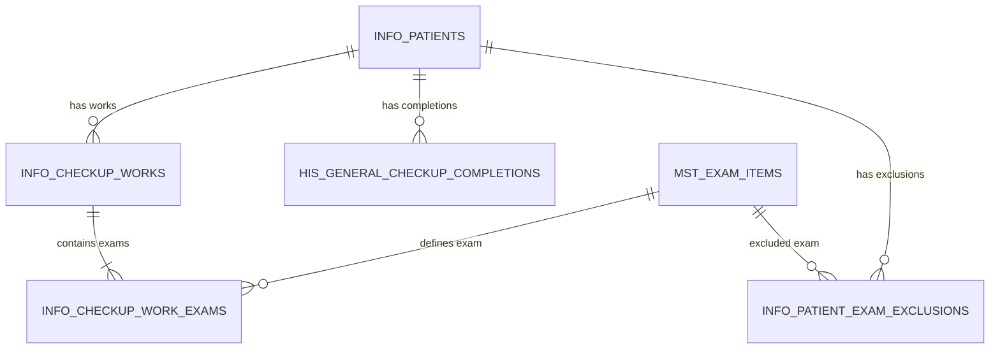
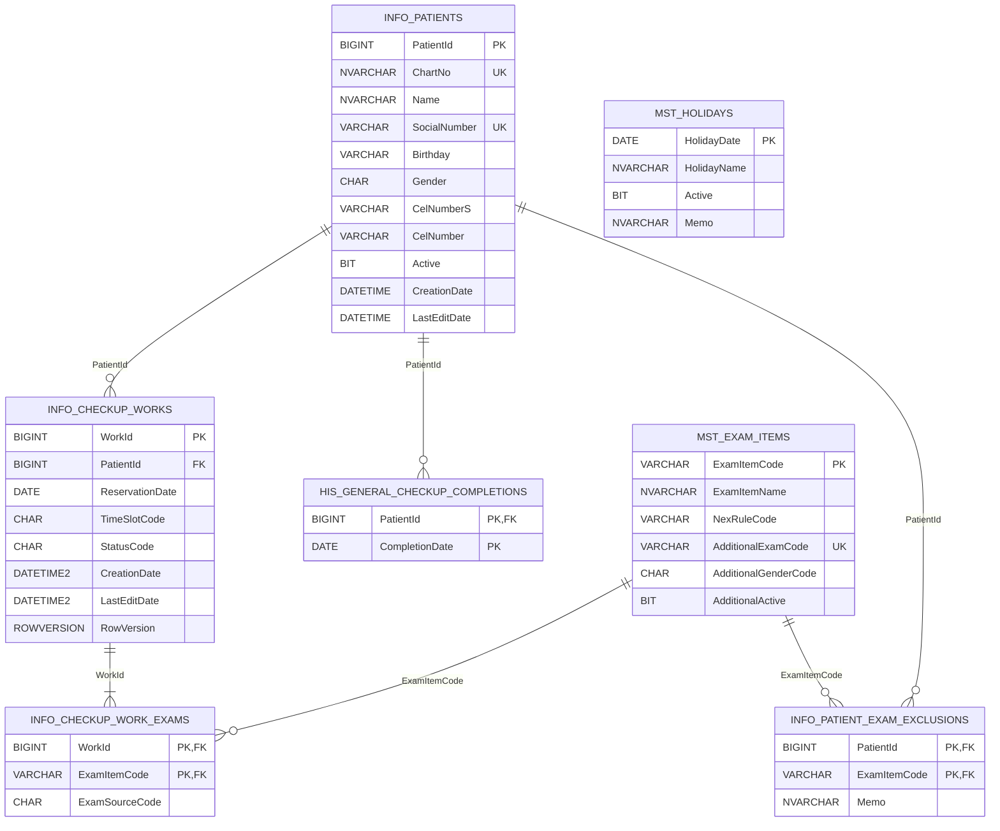

# 검진 예약·접수 관리 프로그램 — DB 설계서

- **문서명:** `04_DB_Design.md`
- **상태:** FINAL / GO / READ-ONLY — Phase 2 물리 스키마 기준선 확정
- **문서 버전:** v1.1
- **기준일:** 2026-09-03
- **기준선 ID:** `HC-RSV-RCP-20260903-R2`
- **대상 환경:** C# WinForms / .NET Framework 4.6.1 / DevExpress Components 20.2 / Microsoft SQL Server / Stored Procedure
- **최종 확정 범위:** 7개 테이블 논리·물리구조, 전체 컬럼·타입·NULL, PK/FK/UQ/CK/DF, 최소 Index, Sequence, 비-TVP AEX 7개 BIT 입력경계, 계산값·영속값·Aggregate·동시성 기준
- **후속 문서:** `05_DB_Rule_SP_Contract.md` → `06_DB_Transaction_Security_Seed.md` → `07_UI_DB_Matrix_Final_Validation.md`
- **기준문서:**
  - `00_Project_Policy.md` — FINAL / GO / READ-ONLY
  - `01_Process_Definition.md` — FINAL / GO / READ-ONLY
  - `02_Function_Definition.xlsx` — FINAL / GO / READ-ONLY
  - `03_Wireframe_Definition.md` — FINAL / GO / READ-ONLY
- **작성 원칙:** 상위 기준문서의 업무정책·프로세스·기능·화면계약을 물리 스키마로 구현하며, DB 구현 편의를 위한 신규 업무기능이나 정책을 추가하지 않는다.
- **변경 통제:** 본 기준일 이후 본 문서는 수정하지 않는다. 후속 Phase는 본 문서의 스키마를 사용하여 Rule·Stored Procedure·Transaction·잠금·권한·Seed·테스트 계약을 구체화하며 테이블·컬럼·키·제약의 의미를 변경하지 않는다.

---

# 0. 문서 목적 및 설계 단계

## 0.1 목적

본 문서는 검진 예약·접수 관리 프로그램 구현에 필요한 데이터, 관계, 무결성, 조회경로 및 저장 경계를 정의한다.

DB는 다음 업무 흐름을 지원해야 한다.

```text
수검자 Master 고유성
→ 예약·접수 동일 업무 행 상태전이
→ 예약일/시간대 정원 및 중복예약 검증
→ 예약일 기준 TGT 판정
→ NEX 자동구성
→ AEX 선택조건 및 NEX 중복 차단
→ 예약 기반 접수
→ 취소 데이터 보존
→ 모든 Write SP 저장시점 최종 재검증
```

## 0.2 단계별 작성 범위

| Phase | 범위 | 본 문서에서의 상태 |
|---|---|:---:|
| Phase 1 | 최초 10개 테이블 후보 검토 | **과거 검토안 / 구현 금지** |
| Phase 1.1 | 검사 Master 통합, 테스트 식별값 저장 단순화, 7개 테이블 논리모델, 정·역방향 검수 | **완료 / 최종 기준** |
| Phase 2 | 전체 컬럼·타입·NULL, PK/FK/UQ/CK/DF, 최소 Index, Sequence, 물리 ERD, 비-TVP AEX 입력경계 | **FINAL / GO / READ-ONLY** |
| Phase 3 | Rule·Stored Procedure 입출력·Result Set·ResultCode 계약 | **`05_DB_Rule_SP_Contract.md` 완료** |
| Phase 4 | Transaction·잠금·동시성·권한·Seed/Test Data | **`06_DB_Transaction_Security_Seed.md`에서 진행** |
| Phase 5 | UI–DB Matrix·통합 적대적 검수 | **`07_UI_DB_Matrix_Final_Validation.md`에서 진행** |

본 문서의 완료 범위는 Phase 1.1과 Phase 2다. Phase 3은 `05_DB_Rule_SP_Contract.md`에서 완료되었으며, Phase 4~5는 별도 후속 문서에서 진행한다. 후속 문서는 본 문서를 다시 열거나 수정하는 근거가 아니다.

최종 통합 보정에서 다음 계약을 종결했다.

```text
03 와이어프레임 기준본을 정식 파일명 하나로 통일
주민등록번호는 임의 테스트값 13자리를 INFO_PATIENTS에 직접 저장
주민등록번호 고유성·정확검색을 INFO_PATIENTS의 Unique Constraint로 일원화
수검자 저장 SP가 주민등록번호 형식·날짜·세기/성별·파생값을 최종검증
물리 테이블을 7개로 단순화
예약변경 중복판정에서 현재 WorkId 제외
NEX 실제 반환 Cardinality를 8~11행으로 확정
시간대만 변경 시 TGT/NEX/AEX 재검증 금지
마감 경계 비교용 고정밀 DB 현재시각
Patient/Work Entity별 동시성값 분리
AEX 실제변경 시 Work Aggregate RowVersion 갱신
AEX 동일집합 저장은 No-op
Patient 수정과 신규예약 간 Patient 단위 직렬화
정원·중복예약의 Patient/Slot 단위 직렬화
DB 서버 현지시각을 대한민국 표준시로 고정
후속 Phase의 스키마 변경금지와 별도 문서 책임
```

## 0.3 Source of Truth 우선순위

충돌이 발생하면 다음 순서로 판단한다.

```text
00_Project_Policy.md
→ 01_Process_Definition.md
→ 02_Function_Definition.xlsx
→ 03_Wireframe_Definition.md
→ 04_DB_Design.md
→ 05_DB_Rule_SP_Contract.md
→ 06~07 후속문서
→ DB Script / C# Source
```

- 00~05는 `HC-RSV-RCP-20260903-R2` 기준선의 유일한 구현 기준이며 모두 READ-ONLY다.
- 와이어프레임 기준본은 정식 파일명 `03_Wireframe_Definition.md` 하나만 사용한다.
- 본 문서는 테이블명·컬럼명·타입·NULL·키·제약·최소 Index·Sequence·AEX 입력경계를 확정한다.
- 정확한 UDF/SP 이름·시그니처·Result Set·ResultCode·검증 우선순위는 `05_DB_Rule_SP_Contract.md`를 따른다.
- 잠금 SQL·Transaction 격리·Seed/Test Data·권한은 `06_DB_Transaction_Security_Seed.md`에서 확정한다.
- 와이어프레임의 `PatientId`, `WorkId` 호출계약은 본 문서의 물리 PK로 구현한다.
- `SEQUENCE`, UDF, Stored Procedure는 DB 객체이지만 물리 테이블 수 7개에는 포함하지 않는다.

## 0.4 기준선 고정 및 후속 변경 통제

### 0.4.1 변경하지 않는 항목

후속 Phase와 구현에서는 다음을 추가·삭제·이름변경·분할·병합·형변경하지 않는다.

```text
물리 테이블 7개
전체 컬럼명과 데이터 타입
NULL / NOT NULL
IDENTITY / ROWVERSION
PK / FK / UQ / CK / DF
FK 방향과 NO ACTION 원칙
SEQ_HC_CHART_NO의 역할과 표현범위
INFO_CHECKUP_WORK_EXAMS의 Composite PK
INFO_PATIENTS.SocialNumber의 숫자 13자리 테스트값 저장구조
AEX OPT01~OPT07의 7개 BIT 외부 입력경계
예약·접수 동일 INFO_CHECKUP_WORKS 행 구조
```

### 0.4.2 후속 문서에서 구체화할 수 있는 항목

다음은 스키마 의미를 바꾸지 않는 범위에서만 후속 문서가 확정한다.

```text
Rule/UDF/SP 내부 SQL 구현
Transaction·잠금키·잠금 획득순서
Seed/Test Data와 배포 검수
DB Role·GRANT EXECUTE·직접 DML 통제
실행 테스트와 성능 검증
```

현재 5개 업무/조회 Nonclustered Index는 최소 기준이다. 실행계획과 재현 가능한 성능시험으로 필요성이 증명된 경우에만 업무 의미를 갖지 않는 보조 Nonclustered Index 또는 INCLUDE를 DB Script에 추가할 수 있다. 이 경우에도 테이블·컬럼·키·제약의 기준선은 열지 않으며 근거와 결과를 `07_UI_DB_Matrix_Final_Validation.md`에 기록한다.

### 0.4.3 예외 처리

현재 검수에서는 기존 구조로 구현할 수 없는 요구사항이 발견되지 않았다. 후속 구현에서 상위 요구를 현재 구조로 구현할 수 없다는 사실이 실행 가능한 SQL 테스트로 증명되더라도 00~05를 조용히 수정하지 않는다. 별도 이탈기록으로 원인·재현절차·영향범위를 작성하고 승인 전까지 기준선을 유지한다.

---

# 1. DB 설계 원칙

## 1.1 예약·접수 동일 업무 행

예약과 접수는 별도 Master 또는 별도 업무 행으로 분리하지 않는다.

```text
INFO_CHECKUP_WORKS 1행

예약(RSV)
 ├─ 예약 변경 → 예약(RSV)
 ├─ 예약 취소 → 취소(CNL)
 └─ 접수       → 접수완료(RCP)

접수완료(RCP)
 ├─ AEX 변경   → 접수완료(RCP)
 └─ 접수 취소  → 취소(CNL)

취소(CNL)
 └─ 복원 불가
```

- 접수 시 새로운 접수 행을 생성하지 않는다.
- 취소 시 물리 삭제하지 않는다.
- 취소 전 상태를 저장하거나 복원하지 않는다.
- 재진행은 신규 예약 업무 행을 생성한다.

## 1.2 DB 최종검증

UI의 Enabled/Disabled 상태와 조회값은 사전검증이다. 데이터 변경의 최종 권한은 Stored Procedure/Transaction에 둔다.

모든 Write SP는 업무별로 다음 순서를 적용한다.

```text
입력값 정규화 및 필수값 확인
→ 현재 데이터 상태 확인
→ 해당 업무에 적용되는 정책/Rule만 재검증
→ 고유성·정원·중복·동시성 검증
→ 동일 Transaction 내 Master/Detail 저장
→ ResultCode·관련 식별키·업무별 동시성값 반환
```

반환값은 Entity별로 구분한다.

| Write SP 구분 | 성공 시 핵심 반환값 | 동시성 기준 |
|---|---|---|
| 수검자 등록/수정 | `PatientId`, `ChartNo`, `LastEditDate` | `INFO_PATIENTS.LastEditDate` |
| 예약·접수 등록/변경/취소 | `WorkId`, `RowVersion` | `INFO_CHECKUP_WORKS.RowVersion` |
| Seed 배포 Script | 별도 사용자 호출 반환계약 없음 | 배포 검수 |

`INFO_PATIENTS`에는 `RowVersion` 컬럼이 없으므로 수검자 SP가 Work용 `RowVersion`을 반환하지 않는다.

### 1.2.1 Work Aggregate 동시성 계약

`INFO_CHECKUP_WORKS.RowVersion`은 Work Master 행뿐 아니라 Work Aggregate 전체의 동시성값으로 사용한다.

- `INFO_CHECKUP_WORK_EXAMS`의 AEX 집합이 실제로 변경되면 같은 Transaction에서 `INFO_CHECKUP_WORKS.LastEditDate`도 갱신한다.
- 위 Master UPDATE로 `RowVersion`이 자동 변경되며 성공 결과는 새 `RowVersion`을 반환한다.
- AEX 요청집합이 현재집합과 완전히 같으면 Detail DELETE/INSERT와 Work UPDATE를 모두 수행하지 않는 No-op으로 처리한다.
- 예약일 변경으로 NEX/AEX Detail이 재작성되는 경우에도 Work Master 변경과 Detail 저장은 같은 Transaction에서 완료한다.
- C#은 Detail별 동시성값을 별도로 관리하지 않고 Work의 `RowVersion` 하나를 전달한다.

## 1.3 Stored Procedure 중심

- C#은 업무 테이블에 직접 INSERT/UPDATE/DELETE하지 않는다.
- 조회도 화면계약별 Stored Procedure 사용을 기본으로 한다.
- 예상 가능한 업무 실패는 공통 `ResultCode`로 반환한다.
- 예상하지 못한 DB 오류는 `THROW`로 전달한다.
- 업무 Rule을 Trigger에 숨기지 않는다.

## 1.4 물리삭제 및 이력

| 데이터 | 처리 원칙 |
|---|---|
| 수검자 Master | 삭제 SP 및 삭제 UI 없음 |
| 예약·접수 업무 | 상태=`CNL`로 보존 |
| 업무 검사구성 | 예약일/AEX 변경 시 현재 유효구성으로 재작성 가능 |
| 검사/HOL Master | 관리자 CRUD 없음. Seed Script로 제공 |
| 검진완료/제외정보 | 테스트 및 Rule 입력자료. 사용자 CRUD 없음 |
| 일반 변경상세 이력 | 별도 History 테이블 생성하지 않음 |

`INFO_CHECKUP_WORK_EXAMS`의 재작성은 일반 변경상세 이력 미관리 정책과 일치하며 `INFO_CHECKUP_WORKS`의 물리삭제를 의미하지 않는다.

## 1.5 `INFO_PATIENTS` 구조 유지와 테스트 식별값

- 사용자가 제시한 29개 컬럼을 수검자 Master 기준으로 유지한다.
- `PatientId`는 DB 자동생성 불변 키다.
- `SocialNumber`에는 `-`를 제거한 숫자 13자리 임의 테스트값을 저장한다.
- 실제 주민등록번호를 입력하거나 Seed에 포함하지 않는다.
- `SocialNumber`는 전체 수검자에서 고유하며 정확검색에 사용한다.
- `Birthday`, `Gender`는 `SocialNumber`에서 산출하고, 저장 SP가 원본과 파생값의 일관성을 최종 보장한다.
- `CelNumberS`, `TelNumberS`는 표시값에서 `-`를 제거한 검색값으로 유지한다.

## 1.6 계산값과 영속값 분리

다음 값은 영속하지 않는다.

- 현재 업무 가능 여부
- 현재 시간대 예약인원과 잔여정원
- TGT 화면 판정문구
- AEX 선택불가 사유
- `Normal` / `WalkIn` UI Context
- Workbench 선택상태와 Dirty 상태
- 취소 전 상태

다음 값은 업무 스냅샷으로 저장한다.

- 예약일과 시간대
- 현재 업무 상태
- 예약 저장/예약일 변경 후의 NEX 실제 구성
- 사용자가 선택한 AEX 실제 구성

## 1.7 범위 통제

다음 구조는 생성하지 않는다.

- 별도 접수 Master/Detail
- 시·분 단위 예약시간
- 검사 진행상태·결과·판독
- 가격·할인·수납·결제
- 보험·VIP·학생·마케팅 업무 테이블
- 수검자 삭제·복원
- 예약·접수 상태변경 History
- 범용 Rule Engine/Expression 테이블
- 업무 상태·시간대만을 위한 공통 코드 테이블
- 사용자별 Grid Layout 저장
- 휴무일/검사 Master 관리자 UI
- 주민번호 전용 보조 테이블

## 1.8 관리 단순화 원칙

테이블 수를 줄이는 것만을 단순화로 보지 않고, 역할 중복과 불필요한 컬럼·Index·DB 객체를 제거한다.

```text
핵심 업무 데이터 : INFO_PATIENTS, INFO_CHECKUP_WORKS, INFO_CHECKUP_WORK_EXAMS
기준 Master      : MST_EXAM_ITEMS, MST_HOLIDAYS
Rule 입력자료    : HIS_GENERAL_CHECKUP_COMPLETIONS, INFO_PATIENT_EXAM_EXCLUSIONS
총 7개
```

- NEX/AEX Master를 다시 분리하지 않는다.
- Seed·관계 테이블에는 업무상 사용하지 않는 공통 감사 컬럼을 관성적으로 추가하지 않는다.
- 검사 표시순서는 별도 순서 컬럼 대신 확정 코드(`EX001~EX019`, `OPT01~OPT07`) 순서를 사용한다.
- 19행 검사 Master에 성능 목적의 불필요한 Index를 추가하지 않는다.
- 상태·시간대·성별만을 위한 코드 테이블, 범용 Rule Engine, Trigger, 상태 History를 추가하지 않는다.
- `05_DB_Rule_SP_Contract.md`에서는 작은 Wrapper UDF를 다수 생성하지 않고 실제 재사용 가치가 있는 Rule 객체만 사용한다.

---

# 2. DB가 보장해야 하는 업무 불변조건

## 2.1 수검자

| 정책 | DB 불변조건 |
|---|---|
| EP-01~02 | `PatientId`는 수검자별 1개이며 자동생성 후 변경하지 않는다. |
| EP-03 | `ChartNo`는 필수이고 전체 수검자에서 고유하다. |
| EP-04 | `Name`, `SocialNumber`는 필수다. `SocialNumber`는 숫자 13자리 테스트값이다. |
| EP-05~06 | 동일 `SocialNumber`는 하나의 `PatientId`에만 연결된다. |
| EP-07 | 이름+생년월일 동일 후보는 조회로 제공하며 최종 고유성 기준은 `SocialNumber`다. |
| EP-08 | 주민등록번호/차트번호 변경 시 고유성을 재검증한다. 주민등록번호 변경은 해당 수검자의 `RSV` 또는 `RCP` 업무가 하나라도 있으면 차단한다. |
| EP-09 | 예약 실패·중단과 무관하게 저장된 수검자는 유지한다. |
| EP-10 | 수검자 삭제 SP를 제공하지 않는다. |

## 2.2 예약·접수

| 정책 | DB 불변조건 |
|---|---|
| RP-01 | `1 Work = 1 Patient + 1회 내원`이다. |
| RP-02 | 예약일과 시간대는 필수이고 시간대는 `AM` 또는 `PM`이다. |
| RP-03 | 예약일+시간대별 `RSV`와 `RCP` 합계는 최대 20건이다. `CNL`은 제외한다. |
| RP-04 | 신규 예약일은 과거일 수 없고 HOL 업무 가능일이어야 한다. |
| RP-05 | 당일예약은 Context와 마감시각을 적용하고 현장예약도 접수마감 후에는 저장하지 않는다. |
| RP-06 | 동일 수검자는 현재일 이상이고 상태가 `RSV` 또는 `RCP`인 유효업무를 둘 이상 동시에 가질 수 없다. 예약변경 판정에서는 현재 변경대상 `WorkId`를 제외한다. |
| RP-07 | 신규예약은 예약일 기준 TGT 대상인 경우만 저장한다. |
| RP-08 | NEX가 없는 AEX 단독예약과 NEX/AEX 동일 `ExamItemCode` 중복을 허용하지 않는다. |
| RP-09 | 예약변경은 `RSV`에서만 수행하고 변경항목별 영향범위를 재검증한다. |
| RP-10 | 예약취소는 `RSV → CNL`만 허용한다. |
| RCP-01 | 직접접수는 없으며 기존 `RSV` 업무를 대상으로 한다. |
| RCP-02 | 접수는 예약일=DB 현재일, 업무일·운영시간·접수마감 충족 시만 가능하다. |
| RCP-03~04 | 접수는 원자적인 `RSV → RCP` 상태전이다. |
| RCP-05 | `RCP`에서는 AEX만 변경하고 예약일·시간대·NEX는 변경하지 않는다. |
| RCP-06 | 접수취소는 `RCP → CNL`만 허용한다. |

### 2.2.1 예약변경 영향범위 결정계약

예약변경 SP는 C#이 전달한 변경구분을 신뢰하지 않고 DB의 현재값과 요청값을 비교하여 다음 세 값을 계산한다.

```text
ReservationDateChanged
TimeSlotChanged
AexSelectionChanged
```

AEX 변경 여부는 현재 Work의 AEX 집합과 `OPT01~OPT07` 7개 요청값을 비교하여 판정한다.

| 실제 변경조합 | 일정/마감/정원/중복 | TGT | NEX | AEX 검증·저장 |
|---|:---:|:---:|:---:|:---:|
| 예약일 변경 포함 | O | O | O | O |
| 시간대만 변경 | O | X | X | **X** |
| AEX만 변경 | X | X | X | O |
| 시간대 + AEX 변경 | O | X | X | O |
| 변경사항 없음 | X | X | X | X |

- 예약일이 유지되고 AEX 선택도 동일하면 시간대 변경 경로에서는 기존 AEX의 `AdditionalActive`, 성별조건, NEX 중복을 다시 검사하거나 재작성하지 않는다.
- 예약일 변경이 포함되면 기존 선택 AEX를 변경 예약일 기준의 새 NEX와 다시 검증한다.
- 시간대와 AEX를 함께 변경하면 일정 Rule과 AEX Rule만 적용하고 TGT/NEX는 유지한다.
- 예약변경의 중복판정은 `PatientId` 일치, `ReservationDate >= DB Today`, `StatusCode IN ('RSV','RCP')`, `WorkId <> @WorkId`를 모두 적용한다.
- 현재 Work를 제외한 다른 유효업무가 2건 이상이면 기존 데이터 무결성 오류로 처리한다.

## 2.3 TGT / NEX / AEX / HOL

### TGT

```text
예약일 기준 만 20세 이상
AND
(
  예약일보다 과거인 일반건강검진 완료이력 없음
  OR 예약연도 - 최근 완료연도 >= 2
)
```

### NEX

- TGT 대상이면 기본 8종을 항상 구성한다.
- 조건부 5종은 예약일 기준 나이·성별·제외정보로 구성한다.
- 조건 조합상 동시에 추가될 수 있는 조건부 검사는 최대 3종이다.
- 따라서 TGT 대상의 실제 NEX 결과는 **8~11행**이다.
- NEX는 사용자 전달목록이 아니라 DB Rule 결과로 생성한다.
- 예약일 변경 시에만 재구성한다.

### AEX

- `0개 이상` 선택 가능하다.
- 통합 검사 Master의 `AdditionalExamCode`가 존재하고 `AdditionalActive=1`인 항목만 허용한다.
- 성별조건을 충족해야 한다.
- NEX와 동일 `ExamItemCode`가 있으면 선택할 수 없다.
- 추가검사 선택값은 `OPT01~OPT07`별 `BIT` 파라미터로 전달하므로 중복 코드와 미정의 코드를 입력할 수 없다.
- 실제 한 Work의 검사구성 최대는 `NEX 11 + AEX 6 = 17행`이다. 공통 검사 Master 전체를 기준으로 한 물리적 보수 상한은 19행이다.

### HOL / 시간

```text
월~토 AND 활성 휴무일 아님 → 업무 가능일
일요일 OR 활성 휴무일     → 업무 불가일
```

- 운영시간은 DB 서버 현지시각 기준 `09:00 <= 현재시각 < 18:00`으로 해석한다.
- 마감시각과 같은 시각부터 불가로 처리한다.
- 요일 계산은 `SET DATEFIRST`에 영향을 받지 않는 방식으로 구현한다.

---

# 3. DB 기술 결정사항

## 3.1 확정 결정

| No | 결정항목 | 확정안 |
|---:|---|---|
| 1 | 물리 테이블 수 | **7개** |
| 2 | 예약·접수 Master | `INFO_CHECKUP_WORKS` 1개 |
| 3 | 검사 Detail | `INFO_CHECKUP_WORK_EXAMS` 1개 |
| 4 | 검사 Master | `MST_EXAM_ITEMS`에 NEX/AEX 역할 통합 |
| 5 | NEX/AEX 하위 Master | 생성하지 않음 |
| 6 | 검사 표시순서 | `ExamItemCode`, `AdditionalExamCode` 코드순 |
| 7 | 상태코드 | `RSV`, `RCP`, `CNL` |
| 8 | 시간대코드 | `AM`, `PM` |
| 9 | 성별코드 | `M`, `F` |
| 10 | 검사출처 | `NEX`, `AEX` |
| 11 | 주민번호 저장 | `INFO_PATIENTS.SocialNumber` 숫자 13자리 테스트값 + Unique Constraint |
| 12 | ChartNo 자동발급 | `SEQ_HC_CHART_NO` |
| 13 | AEX 다중입력 | `OPT01~OPT07`별 7개 `BIT` 파라미터 |
| 14 | Work 동시성 | `ROWVERSION` + 기대상태 조건 UPDATE |
| 15 | 정원/중복 | Transaction + Patient/Slot 직렬화 |
| 16 | Rule 재사용 | 소수의 명시적인 UDF/평가 SP만 사용 |
| 17 | Trigger/Cascade | 업무 Trigger 없음, FK Cascade 없음 |

## 3.2 7개 테이블과 비테이블 객체의 경계

```text
물리 테이블 7개

+ SEQ_HC_CHART_NO : Sequence
+ UFN_HC_*        : Rule Function
+ USP_HC_*        : Stored Procedure
```

객체 수를 테이블 수와 혼동하지 않는다. 고정 상태·시간대·성별 코드는 CHECK 제약으로 관리하여 코드 테이블을 추가하지 않는다.

## 3.3 명명규칙

| 객체 | 규칙 | 예시 |
|---|---|---|
| 정보/업무 테이블 | `INFO_` | `INFO_CHECKUP_WORKS` |
| Master | `MST_` | `MST_EXAM_ITEMS` |
| 이력/Test 입력 | `HIS_` | `HIS_GENERAL_CHECKUP_COMPLETIONS` |
| Stored Procedure | `USP_HC_` | `USP_HC_INSERT_예약` |
| Function | `UFN_HC_` | `UFN_HC_검진대상확인` |
| Sequence | `SEQ_HC_` | `SEQ_HC_CHART_NO` |
| Primary Key | `PK_` | `PK_INFO_CHECKUP_WORKS` |
| Foreign Key | `FK_` | `FK_INFO_CHECKUP_WORKS_PATIENT` |
| Unique Constraint | `UQ_` | `UQ_INFO_PATIENTS_SOCIAL_NUMBER` |
| Filtered Unique Index | `UX_` | `UX_MST_EXAM_ITEMS_AEX_CODE` |
| Check | `CK_` | `CK_INFO_CHECKUP_WORKS_STATUS` |
| Default | `DF_` | `DF_INFO_CHECKUP_WORKS_CREATION_DATE` |
| Nonclustered Index | `IX_` | `IX_INFO_CHECKUP_WORKS_SLOT` |

## 3.4 공통 데이터 타입 및 현재시각 계약

| 데이터 | 타입 원칙 |
|---|---|
| 내부 PK | 필요한 업무 Master만 `BIGINT IDENTITY(1,1)` |
| FK | 참조 PK와 동일한 타입 |
| 날짜 | `DATE` |
| Work 영속 업무시각 | `DATETIME2(0)` |
| 정책·마감 비교용 현재시각 | `DATETIME2(7)`, `TIME(7)` |
| 기존 `INFO_PATIENTS` 시각 | 기존 `DATETIME` 유지 |
| 짧은 고정 코드 | `CHAR(n)` |
| 가변 코드 | `VARCHAR(n)` |
| 한글 명칭/비고 | `NVARCHAR(n)` |
| 여부 | `BIT` |
| 주민번호 테스트값 | `VARCHAR(13)` |
| 동시성 토큰 | `ROWVERSION` |

SP는 시작 시 DB 서버시각을 고정밀도로 한 번만 캡처한다.

```sql
DECLARE @Now         DATETIME2(7) = SYSDATETIME();
DECLARE @Today       DATE         = CONVERT(DATE, @Now);
DECLARE @CurrentTime TIME(7)      = CONVERT(TIME(7), @Now);
DECLARE @StoredNow   DATETIME2(0) = CONVERT(DATETIME2(0), @Now);
```

- 운영시간과 마감 비교에는 `@CurrentTime`을 사용하여 경계 반올림 오류를 방지한다.
- 마감시각과 같은 시각부터 불가이므로 비교는 `@CurrentTime < @CutoffTime`을 사용한다.
- `CreationDate`, `LastEditDate` 저장에는 테이블 정의에 맞는 `@StoredNow` 또는 기존 `INFO_PATIENTS`용 `DATETIME` 값을 사용한다.
- DB 서버 OS와 SQL Server의 현지시각은 대한민국 표준시(KST, UTC+09:00)를 나타내야 한다.
- 배포 검수에서 서버 현재일·시각이 KST와 일치하지 않으면 설치 실패로 처리한다. 애플리케이션 PC 시각은 정책판정의 기준으로 사용하지 않는다.
- DB 서버를 UTC로 운영하는 환경으로 임의 변경하지 않는다. 불가피한 경우에도 00~05를 수정하지 않고 Phase 4에서 모든 현재시각 취득을 KST로 일관 변환한다.

## 3.5 주민등록번호 테스트값 저장·검색

```text
INFO_PATIENTS.SocialNumber
= '-'를 제거한 숫자 13자리 임의 테스트값
```

- 실제 주민등록번호를 입력하거나 Seed에 포함하지 않는다.
- UI는 하이픈이 포함된 표시형식을 사용할 수 있으나 C#은 `-`를 제거한 숫자 13자리 값만 SP에 전달한다.
- SP는 숫자 13자리·실제 날짜·7번째 자리 코드를 다시 검증하고 정규화된 테스트값만 DB에 저장한다.
- 정확조회와 고유성은 `UQ_INFO_PATIENTS_SOCIAL_NUMBER`로 수행한다.
- 저장 SP는 6자리 생년월일의 실제 날짜와 7번째 자리의 세기·성별 코드를 검증한다.
- 저장 SP는 `Birthday(yyyyMMdd)`와 `Gender(M/F)`를 산출하여 저장한다.
- 실제 행정번호 존재 여부와 마지막 검증번호 계산은 수행하지 않는다.
- UI에서 산출한 Birthday/Gender는 사용자 안내용이며 DB 저장값의 최종 기준은 Write SP다.

## 3.6 ChartNo 자동발급

```text
형식: C + 6자리 일련번호
예: C000001, C000123
```

- 자동발급은 저장 Transaction 안에서 Sequence 값을 취득한다.
- Sequence 값은 Rollback 또는 Cache로 결번이 발생할 수 있으며 차트번호는 연속번호를 요구하지 않는다.
- 수동입력값과 충돌하면 다음 Sequence 값을 취득하여 고유 후보를 재생성한다.
- 최대 표현값은 `C999999`이며 과제 데이터 규모에서 충분하다.

## 3.7 검사 Master 통합·단순화 원칙

다음 두 물리 테이블은 생성하지 않는다.

```text
MST_NATIONAL_EXAMS
MST_ADDITIONAL_EXAMS
```

NEX/AEX 속성은 `MST_EXAM_ITEMS` 한 행에 선택적으로 저장한다.

```text
공통 검사 1행
├─ NEX 역할: NexRuleCode
└─ AEX 역할: AdditionalExamCode + 성별 + 사용여부
```

별도 `NexSortOrder`, `AdditionalSortOrder`, 생성·수정시각은 저장하지 않는다.

```text
NEX 표시순서 = ExamItemCode ASC
AEX 표시순서 = AdditionalExamCode ASC
```

국가검진 골밀도와 `OPT04` 골밀도검사는 같은 `ExamItemCode=EX012` 한 행을 사용한다. 역할별 NULL 조합은 CHECK로, AEX 코드 고유성은 filtered unique index 1개로 보장한다.

## 3.8 AEX 다중선택 입력계약 — TVP 미사용

추가검사 Master는 `OPT01~OPT07` 7종으로 고정되어 있고 관리자 CRUD를 제공하지 않으므로 외부 호출 SP에 사용자 정의 Table Type을 사용하지 않는다. 신규예약·예약변경·접수완료 AEX 변경 SP는 다음 7개 `BIT` 파라미터를 공통으로 사용한다.

```text
@AexOpt01Selected BIT
@AexOpt02Selected BIT
@AexOpt03Selected BIT
@AexOpt04Selected BIT
@AexOpt05Selected BIT
@AexOpt06Selected BIT
@AexOpt07Selected BIT
```

입력 의미는 다음과 같다.

```text
0 = 미선택
1 = 선택
NULL = 허용하지 않음
```

적용 원칙:

- C#은 저장 호출마다 7개 값을 모두 명시적으로 전달한다.
- SP는 7개 중 하나라도 `NULL`이면 입력 오류로 처리한다.
- `0개 이상` 선택을 허용하므로 7개가 모두 `0`인 입력은 정상이다.
- 고정된 파라미터 이름으로 전달하므로 중복 코드, 오탈자 코드, Master에 없는 코드를 외부에서 전달할 수 없다.
- CSV, 구분자 문자열, XML, JSON, `STRING_SPLIT`, 사용자 정의 Table Type은 사용하지 않는다.
- SP 내부에서는 `VALUES` 행 생성자 또는 로컬 Table Variable로 선택값을 행 집합으로 변환한 후 `MST_EXAM_ITEMS.AdditionalExamCode`와 검증한다.
- 실제 저장 전 `AdditionalActive`, 성별조건, NEX 동일 `ExamItemCode` 중복을 DB Rule로 다시 검증한다.
- 예약일이 유지되고 AEX 선택집합도 동일한 시간대만 변경에서는 AEX를 검증하거나 삭제·재삽입하지 않는다.
- 향후 추가검사 종수가 변경되면 C# DTO와 관련 SP 파라미터를 함께 변경해야 한다. 이번 과제에서는 7종이 확정되어 있으므로 허용 가능한 명시적 계약이다.

SP 내부 변환 개념은 다음과 같다.

```sql
DECLARE @SelectedAex TABLE
(
    AdditionalExamCode VARCHAR(10) NOT NULL PRIMARY KEY
);

INSERT INTO @SelectedAex (AdditionalExamCode)
SELECT V.AdditionalExamCode
FROM
(
    VALUES
        ('OPT01', @AexOpt01Selected),
        ('OPT02', @AexOpt02Selected),
        ('OPT03', @AexOpt03Selected),
        ('OPT04', @AexOpt04Selected),
        ('OPT05', @AexOpt05Selected),
        ('OPT06', @AexOpt06Selected),
        ('OPT07', @AexOpt07Selected)
) V (AdditionalExamCode, IsSelected)
WHERE V.IsSelected = 1;
```

## 3.9 SQL Server 호환성 경계

본 물리설계는 `SEQUENCE`, `TRY_CONVERT`, `THROW`, `ROWVERSION` 및 filtered index를 사용하므로 SQL Server 2012 이상을 최소 기준으로 한다. AEX 전달을 위해 `STRING_SPLIT`, XML/JSON 파싱, 사용자 정의 Table Type을 사용하지 않는다. 실제 DB Script 작성 전에 서버 버전과 Database Compatibility Level을 확인하되, 이 확인은 7개 테이블 논리모델을 변경하는 사유가 아니다.

## 3.10 Transaction·잠금 구현의 고정 결과조건

구체적인 잠금 SQL은 `06_DB_Transaction_Security_Seed.md`에서 선택하지만 다음 동시 실행 결과는 본 기준선에서 고정한다.

### Patient 단위 직렬화

다음 Write 경로는 동일 `PatientId`에 대해 공통 Patient 잠금영역을 사용한다.

```text
수검자 주민등록번호 변경
신규예약 생성
예약일/시간대 변경
현장 당일예약 생성
```

따라서 한 세션이 활성 Work 부재를 확인한 직후 다른 세션이 예약을 삽입하여 주민등록번호 변경과 신규예약이 동시에 성공하는 경합을 허용하지 않는다.

### Slot 단위 직렬화

신규예약과 예약 일정변경은 대상 `ReservationDate + TimeSlotCode` 단위로 직렬화한 뒤 같은 Transaction에서 다음을 재조회한다.

```text
현재 정원
동일 수검자 중복판단 유효예약
현재 업무상태와 RowVersion
```

- 정원 19/20 상태의 동시 신규예약 2건은 정확히 1건만 성공해야 한다.
- 동일 수검자의 서로 다른 시간대 동시예약도 정확히 1건만 성공해야 한다.
- 예약변경 중복판정에서는 변경 대상 `WorkId`를 제외하고 다른 유효업무만 조회한다.
- 다른 유효업무가 2건 이상이면 정상 업무충돌이 아니라 `WorkDataError`로 처리한다.
- 예약 이동은 기존 Slot과 신규 Slot 잠금키를 결정적 정렬순서로 획득하여 교차이동 Deadlock을 줄인다.
- `sp_getapplock`, `UPDLOCK/HOLDLOCK` 또는 동등한 방식 중 하나를 후속 문서에서 채택할 수 있으나 위 결과조건은 변경할 수 없다.

---

# 4. Phase 1.1 — 7개 테이블 논리 데이터 모델

## 4.1 Entity 목록

| No | 테이블 | 구분 | 책임 |
|---:|---|---|---|
| 1 | `INFO_PATIENTS` | 수검자 Master | 기존 29개 컬럼, PatientId/ChartNo/기본정보/주민번호 테스트값 |
| 2 | `INFO_CHECKUP_WORKS` | 업무 Master | 예약·접수 동일 행, 일정·상태·동시성 |
| 3 | `INFO_CHECKUP_WORK_EXAMS` | 업무 Detail | Work별 NEX/AEX 실제 구성 스냅샷 |
| 4 | `MST_EXAM_ITEMS` | 통합 검사 Master | 공통 ExamItemCode + NEX/AEX 역할 속성 |
| 5 | `MST_HOLIDAYS` | HOL Master | 공휴일·센터 휴진일 |
| 6 | `HIS_GENERAL_CHECKUP_COMPLETIONS` | TGT 입력이력 | 일반건강검진 완료일 |
| 7 | `INFO_PATIENT_EXAM_EXCLUSIONS` | NEX 입력자료 | 수검자별 검사 제외관계 |

## 4.2 테이블별 독립 유지 근거

| 테이블 | 다른 테이블에 합치지 않는 이유 |
|---|---|
| `INFO_PATIENTS` | 수검자 Master이며 Work와 1:N 관계 |
| `INFO_CHECKUP_WORKS` | 일정·상태·정원 산정의 1건 단위 |
| `INFO_CHECKUP_WORK_EXAMS` | 한 Work에 NEX 8~11행과 AEX 0~6행이 존재하므로 Master와 분리 필요 |
| `MST_EXAM_ITEMS` | 검사코드와 NEX/AEX 역할의 단일 Seed 원천 |
| `MST_HOLIDAYS` | 날짜별 독립 Master이며 정책상 Seed 필수 |
| `HIS_GENERAL_CHECKUP_COMPLETIONS` | 한 Patient의 복수 완료이력과 예약일 이전 최근연도 판정 필요 |
| `INFO_PATIENT_EXAM_EXCLUSIONS` | Patient–Exam N:M 관계이며 검사별 Patient 컬럼 증가를 방지 |

## 4.3 Aggregate 경계

### Patient Aggregate

```text
INFO_PATIENTS 1행
```

수검자 생성·수정은 단일 Master 행을 Transaction 안에서 저장한다. 주민번호·차트번호 고유성은 `INFO_PATIENTS`의 Unique Constraint와 Write SP 검증으로 보장한다.

### Checkup Work Aggregate

```text
INFO_CHECKUP_WORKS
└─ INFO_CHECKUP_WORK_EXAMS
```

신규예약, 예약일 변경, AEX 변경은 Master와 Detail을 필요한 범위에서 같은 Transaction으로 처리한다. 취소는 Work 상태만 변경하고 Detail은 보존한다.

- AEX 또는 NEX/AEX Detail이 실제로 변경되면 같은 Transaction에서 Work `LastEditDate`를 갱신하여 Aggregate `RowVersion`도 변경한다.
- 동일 AEX 집합 No-op에서는 Master와 Detail을 모두 갱신하지 않는다.
- Work Detail을 독립 저장하는 외부 SP는 제공하지 않는다.

### Rule Reference Data

```text
MST_EXAM_ITEMS
MST_HOLIDAYS
HIS_GENERAL_CHECKUP_COMPLETIONS
INFO_PATIENT_EXAM_EXCLUSIONS
```

## 4.4 관계 및 Cardinality

| 부모 | 자식 | 관계 | 의미 |
|---|---|---|---|
| `INFO_PATIENTS` | `INFO_CHECKUP_WORKS` | 1 : N | 수검자의 과거·현재 Work |
| `INFO_CHECKUP_WORKS` | `INFO_CHECKUP_WORK_EXAMS` | 1 : N | Work의 검사 스냅샷 |
| `MST_EXAM_ITEMS` | `INFO_CHECKUP_WORK_EXAMS` | 1 : N | 공통 검사코드 참조 |
| `INFO_PATIENTS` | `HIS_GENERAL_CHECKUP_COMPLETIONS` | 1 : N | 일반검진 완료이력 |
| `INFO_PATIENTS` | `INFO_PATIENT_EXAM_EXCLUSIONS` | 1 : N | 수검자별 검사 제외관계 |
| `MST_EXAM_ITEMS` | `INFO_PATIENT_EXAM_EXCLUSIONS` | 1 : N | 제외대상 공통 검사코드 |

## 4.5 논리 ERD



## 4.6 공통 검사코드 19종

```text
NEX 13개 + AEX 7개 - 공통 골밀도 1개 = 19개 Master 행
실제 NEX 결과 = 8~11행
실제 Work 검사구성 최대 = 17행
```

| ExamItemCode | 검사명 | NexRuleCode | AdditionalExamCode | AEX 성별 |
|---|---|---|---|---|
| EX001 | 문진/진찰 | NEX-01 | - | - |
| EX002 | 신체계측 | NEX-01 | - | - |
| EX003 | 혈압 | NEX-01 | - | - |
| EX004 | 시력·청력 | NEX-01 | - | - |
| EX005 | 흉부 X-ray | NEX-01 | - | - |
| EX006 | 요검사 | NEX-01 | - | - |
| EX007 | 혈액검사 | NEX-01 | - | - |
| EX008 | 구강검진 | NEX-01 | - | - |
| EX009 | 이상지질혈증 | NEX-02 | - | - |
| EX010 | B형간염 | NEX-03 | - | - |
| EX011 | C형간염 | NEX-04 | - | - |
| EX012 | 골밀도검사 | NEX-05 | OPT04 | A |
| EX013 | 폐기능 | NEX-06 | - | - |
| EX014 | 복부초음파 | - | OPT01 | A |
| EX015 | 갑상선초음파 | - | OPT02 | A |
| EX016 | 유방초음파 | - | OPT03 | F |
| EX017 | PSA | - | OPT05 | M |
| EX018 | HbA1c | - | OPT06 | A |
| EX019 | HPV 검사 | - | OPT07 | F |

`NEX-01`은 기본검사, `NEX-02~06`은 조건부검사로 해석한다. NEX/AEX 화면 순서는 확정 코드의 오름차순을 사용한다.

## 4.7 Function ID ↔ Entity 추적

| Function ID | Entity / Rule |
|---|---|
| F-PAT-001 | `INFO_PATIENTS` |
| F-PAT-002 | `INFO_PATIENTS`, `SEQ_HC_CHART_NO` |
| F-PAT-003 | `INFO_PATIENTS`, `INFO_CHECKUP_WORKS` |
| F-RSV-001 | `INFO_CHECKUP_WORKS`, `INFO_CHECKUP_WORK_EXAMS`, TGT/NEX/AEX/HOL |
| F-RSV-002 | `INFO_CHECKUP_WORKS`, `INFO_CHECKUP_WORK_EXAMS`, TGT/NEX/AEX/HOL |
| F-RSV-003 | `INFO_CHECKUP_WORKS` |
| F-RCP-001 | `INFO_CHECKUP_WORKS`, `INFO_CHECKUP_WORK_EXAMS`, HOL/마감 |
| F-RCP-002 | `INFO_CHECKUP_WORKS`, `INFO_CHECKUP_WORK_EXAMS`, AEX |
| F-RCP-003 | `INFO_CHECKUP_WORKS` |
| F-COM-001 | `INFO_CHECKUP_WORKS`, `INFO_CHECKUP_WORK_EXAMS`, `INFO_PATIENTS`, `MST_EXAM_ITEMS` |
| F-COM-002 | `INFO_PATIENTS`, `INFO_CHECKUP_WORKS` |
| F-COM-003 | `INFO_PATIENTS`, `HIS_GENERAL_CHECKUP_COMPLETIONS`, TGT |
| F-COM-004 | `MST_EXAM_ITEMS`, `INFO_PATIENT_EXAM_EXCLUSIONS`, `INFO_CHECKUP_WORK_EXAMS`, NEX/AEX |
| F-COM-005 | `INFO_CHECKUP_WORKS`, `MST_HOLIDAYS`, 일정/정원/중복 |
| F-COM-006 | `INFO_CHECKUP_WORKS`, `MST_HOLIDAYS`, 접수조건 |
| F-COM-007 | `MST_HOLIDAYS`, 업무일/업무시간 Rule |

16개 Function ID와 36개 기능정의 Row는 7개 테이블 및 Rule/SP 객체로 모두 추적 가능하다.

---

# 5. Phase 1.1 적대적 재검수

## 5.1 최초 후보 → 7개 통합 영향

| 검수질문 | 결과 |
|---|:---:|
| NEX 13종 Seed를 표현할 수 있는가 | PASS — `NexRuleCode`, `ExamItemCode` 코드순 |
| AEX 7종 최소정보를 표현할 수 있는가 | PASS — 코드, 성별, 사용여부, 공통 ExamItemCode |
| 골밀도 공통코드를 한 행으로 표현하는가 | PASS — `EX012` |
| NEX/AEX 역할을 동시에 가질 수 있는가 | PASS |
| AEX 코드 중복을 DB에서 차단할 수 있는가 | PASS — filtered unique index 1개 |
| 역할별 NULL 조합 오류를 차단할 수 있는가 | PASS — CHECK |
| 주민번호 정확검색·고유성을 단일 Patient 테이블에서 보장하는가 | PASS — `SocialNumber` Unique Constraint |
| 추가 기술 테이블 없이 Birthday/Gender 일관성을 보장하는가 | PASS — Write SP 최종 산출·검증 |
| 관리자 CRUD 없는 Seed 수명주기와 맞는가 | PASS |
| 상위 정책 또는 기능이 삭제되는가 | 없음 |

## 5.2 역방향 고아 테이블 검수

| 테이블 | 상위 근거 | 판정 |
|---|---|:---:|
| INFO_PATIENTS | EP / P01 / F-PAT | PASS |
| INFO_CHECKUP_WORKS | RP/RCP / P02/P03 | PASS |
| INFO_CHECKUP_WORK_EXAMS | RP-08/09, RCP-05, NEX/AEX | PASS |
| MST_EXAM_ITEMS | NEX-01~07, AEX-01~05 | PASS |
| MST_HOLIDAYS | HOL-01~05 | PASS |
| HIS_GENERAL_CHECKUP_COMPLETIONS | TGT-02~05 | PASS |
| INFO_PATIENT_EXAM_EXCLUSIONS | NEX-03 | PASS |

## 5.3 통합하지 않은 구조의 필요성 검수

- Work와 Work Exam을 합치면 예약일·상태가 검사 수만큼 중복되고 정원 COUNT가 왜곡되므로 분리 유지가 필수다.
- 완료이력을 Patient의 최근일 1개 컬럼으로 축약하면 복수 이력·예약일 이후 이력 제외 테스트가 불가능하므로 분리 유지가 필요하다.
- 검사 제외를 Patient의 특정 BIT 컬럼으로 넣으면 기존 29개 컬럼을 변경하고 검사별 컬럼 증가를 유발하므로 관계테이블 유지가 적절하다.
- HOL을 함수에 하드코딩하면 정책상 Master/Seed 요구를 위반하므로 테이블 유지가 필요하다.
- 주민번호 테스트값은 기존 `SocialNumber` 컬럼에 직접 저장할 수 있으므로 별도 기술 테이블을 유지하지 않는다.

## 5.4 Phase 1.1 판정

> **Phase 1.1 FINAL GO**

- 물리 테이블은 7개로 확정한다.
- `MST_NATIONAL_EXAMS`, `MST_ADDITIONAL_EXAMS` 및 주민번호 전용 보조 테이블은 생성하지 않는다.
- 검사 역할은 `MST_EXAM_ITEMS`에 통합한다.
- 상위 산출물과 R2 기준선이 일치한다.
- Phase 2 물리설계는 아래 구조로 확정한다.

---

# 6. Phase 2 물리설계 공통 규칙

## 6.1 물리설계 확정 범위

Phase 2에서는 다음을 확정한다.

```text
7개 테이블의 전체 컬럼과 타입
NULL / NOT NULL
IDENTITY / ROWVERSION / DEFAULT
PK / FK / UNIQUE / CHECK
Clustered / Nonclustered / Filtered Unique Index
ChartNo Sequence
물리 ERD
```

Rule/UDF/SP 입출력 계약은 `05_DB_Rule_SP_Contract.md`, 잠금 SQL·Seed/Test Data·권한은 `06_DB_Transaction_Security_Seed.md`에서 작성한다. 후속 문서는 본 장의 테이블·컬럼·키·제약을 변경하지 않는다.

## 6.2 공통 저장 규칙

- 문자열 선택값은 SP에서 `LTRIM/RTRIM` 후 빈 문자열을 `NULL`로 변환한다.
- 영문 코드값은 대문자로 저장한다.
- UI/C#은 주민번호 표시값에서 `-`를 제거한 숫자 13자리를 전달하고, SP는 길이·숫자·날짜·7번째 자리 코드를 최종 재검증한다.
- 정책·마감 비교는 3.4의 고정밀 `@Now/@CurrentTime`을 사용한다.
- `INFO_CHECKUP_WORKS.CreationDate/LastEditDate`는 같은 실행에서 캡처한 `@StoredNow`를 사용한다.
- 기존 `INFO_PATIENTS`는 원형을 유지하기 위해 `DATETIME`과 DB 서버시각을 사용한다.
- C#이 전달한 생성·수정시각을 저장하지 않는다.
- Seed·관계 테이블에는 상위 요구나 동시성 용도가 없는 공통 시각 컬럼을 추가하지 않는다.
- FK의 `ON DELETE`, `ON UPDATE`는 기본 `NO ACTION`이다.

## 6.3 Clustered Key 원칙

- 순차증가 단일 PK가 있는 테이블은 해당 PK를 Clustered로 사용한다.
- 자연키로만 조회되는 소형 Master/관계테이블은 자연키 Composite PK를 Clustered로 사용한다.
- 무작위 GUID PK는 사용하지 않는다.

---

# 7. 물리 테이블 요약

| No | 테이블 | PK | 주요 FK | 핵심 고유성/역할 |
|---:|---|---|---|---|
| 1 | `INFO_PATIENTS` | `PatientId` | - | `ChartNo`, `SocialNumber` 고유 |
| 2 | `INFO_CHECKUP_WORKS` | `WorkId` | Patient | 예약·접수 상태행 |
| 3 | `INFO_CHECKUP_WORK_EXAMS` | `WorkId + ExamItemCode` | Work, ExamItem | Work 내 동일검사 중복차단 |
| 4 | `MST_EXAM_ITEMS` | `ExamItemCode` | - | NEX/AEX 통합 Master |
| 5 | `MST_HOLIDAYS` | `HolidayDate` | - | 동일 휴무일 중복차단 |
| 6 | `HIS_GENERAL_CHECKUP_COMPLETIONS` | `PatientId + CompletionDate` | Patient | 완료이력 자연키 |
| 7 | `INFO_PATIENT_EXAM_EXCLUSIONS` | `PatientId + ExamItemCode` | Patient, ExamItem | 제외관계 존재=제외 |

---

# 8. 테이블 상세 정의

## 8.1 `INFO_PATIENTS`

### 8.1.1 역할

수검자 Master다. 사용자 제공 29개 컬럼 구조를 유지하고, 정책상 내부 식별자·차트번호·주민등록번호 고유성 및 조회를 지원한다.

### 8.1.2 컬럼

| No | 컬럼 | 타입 | NULL | Default / 생성 | 설명 |
|---:|---|---|:---:|---|---|
| 1 | `PatientId` | `BIGINT IDENTITY(1,1)` | X | DB 자동생성 | PK, 불변 내부 식별자 |
| 2 | `ChartNo` | `NVARCHAR(100)` | X | SP 수동값 또는 Sequence 변환값 | 차트번호 |
| 3 | `Name` | `NVARCHAR(100)` | X | 사용자 입력 | 이름 |
| 4 | `PassportNumber` | `VARCHAR(10)` | O | 없음 | 과제 UI 미사용 |
| 5 | `SocialNumber` | `VARCHAR(13)` | X | 정규화한 임의 테스트값 | 주민번호 테스트값, 고유 식별 |
| 6 | `Birthday` | `VARCHAR(8)` | X | SocialNumber에서 SP 산출 | `yyyyMMdd` |
| 7 | `Gender` | `CHAR(1)` | X | SocialNumber에서 SP 산출 | `M` / `F` |
| 8 | `InsuranceNumber` | `VARCHAR(100)` | O | 없음 | 과제 UI 미사용 |
| 9 | `EMail` | `VARCHAR(200)` | O | 없음 | E-mail |
| 10 | `CelNumberS` | `VARCHAR(13)` | O | `CelNumber` 정규화 | 휴대전화 검색값 |
| 11 | `TelNumberS` | `VARCHAR(13)` | O | `TelNumber` 정규화 | 전화번호 검색값 |
| 12 | `TelNumber` | `VARCHAR(13)` | O | 사용자 입력 | 전화번호 |
| 13 | `CelNumber` | `VARCHAR(13)` | O | 사용자 입력 | 휴대전화번호 |
| 14 | `Zipcode` | `VARCHAR(10)` | O | 사용자 입력 | 우편번호 |
| 15 | `Address` | `NVARCHAR(200)` | O | 사용자 입력 | 주소 |
| 16 | `AddressDetail` | `NVARCHAR(200)` | O | 사용자 입력 | 상세주소 |
| 17 | `Memo` | `NVARCHAR(MAX)` | O | 사용자 입력 | 메모 |
| 18 | `Active` | `BIT` | X | `1` | 과제 신규 수검자 활성값 |
| 19 | `IsStudent` | `BIT` | X | `0` | UI 미사용 |
| 20 | `IsVIP` | `BIT` | X | `0` | UI 미사용 |
| 21 | `IsReceiveCall` | `BIT` | X | `0` | UI 미사용 |
| 22 | `IsReceiveSMS` | `BIT` | X | `0` | UI 미사용 |
| 23 | `IsReceiveEmail` | `BIT` | X | `0` | UI 미사용 |
| 24 | `IsReceivePost` | `BIT` | X | `0` | UI 미사용 |
| 25 | `IsMarketingConsent` | `BIT` | X | `0` | UI 미사용 |
| 26 | `MConsentDate` | `DATETIME` | O | 없음 | UI 미사용 |
| 27 | `MCancelDate` | `DATETIME` | O | 없음 | UI 미사용 |
| 28 | `CreationDate` | `DATETIME` | X | `GETDATE()` | 생성시각 |
| 29 | `LastEditDate` | `DATETIME` | X | `GETDATE()` | 마지막 수정시각 및 수정 동시성 기준값 |

### 8.1.3 Key / Constraint

| 구분 | 이름 | 컬럼/조건 |
|---|---|---|
| PK | `PK_INFO_PATIENTS` | `PatientId` Clustered |
| UQ | `UQ_INFO_PATIENTS_CHART_NO` | `ChartNo` |
| UQ | `UQ_INFO_PATIENTS_SOCIAL_NUMBER` | `SocialNumber` |
| CK | `CK_INFO_PATIENTS_CHART_NO_NOT_BLANK` | `LEN(LTRIM(RTRIM(ChartNo))) > 0` |
| CK | `CK_INFO_PATIENTS_NAME_NOT_BLANK` | `LEN(LTRIM(RTRIM(Name))) > 0` |
| CK | `CK_INFO_PATIENTS_SOCIAL_FORMAT` | `LEN(SocialNumber)=13 AND SocialNumber NOT LIKE '%[^0-9]%'` |
| CK | `CK_INFO_PATIENTS_BIRTHDAY` | 숫자 8자리이며 `TRY_CONVERT(DATE, Birthday, 112)` 가능 |
| CK | `CK_INFO_PATIENTS_GENDER` | `Gender IN ('M','F')` |
| CK | `CK_INFO_PATIENTS_CEL_NORMALIZED` | 원번호가 NULL이면 S도 NULL, 아니면 `CelNumberS=REPLACE(CelNumber,'-','')` |
| CK | `CK_INFO_PATIENTS_TEL_NORMALIZED` | 원번호가 NULL이면 S도 NULL, 아니면 `TelNumberS=REPLACE(TelNumber,'-','')` |
| CK | `CK_INFO_PATIENTS_CEL_DIGIT` | `CelNumberS`가 NULL이거나 숫자만 포함 |
| CK | `CK_INFO_PATIENTS_TEL_DIGIT` | `TelNumberS`가 NULL이거나 숫자만 포함 |
| CK | `CK_INFO_PATIENTS_EDIT_DATE` | `LastEditDate >= CreationDate` |

`SocialNumber` 형식과 고유성은 선언적 제약으로 보장한다. 6자리 생년월일의 실제 날짜, 7번째 자리의 세기·성별 해석, `Birthday/Gender` 일관성은 저장 SP가 원본 `SocialNumber`를 기준으로 최종 보장한다.

수검자 수정 동시성은 기존 컬럼을 유지하기 위해 원본 `LastEditDate` 비교를 사용한다. `DATETIME`의 제한된 정밀도로 동일 값이 재사용되지 않도록 수정 SP는 행을 잠근 뒤 새 시각이 기존값보다 크지 않으면 기존값에 최소 4ms를 더해 단조 증가시키며 상세 SQL은 Phase 4에서 확정한다.

### 8.1.4 Default Constraint

| 이름 | 컬럼 | 값 |
|---|---|---|
| `DF_INFO_PATIENTS_ACTIVE` | Active | `1` |
| `DF_INFO_PATIENTS_IS_STUDENT` | IsStudent | `0` |
| `DF_INFO_PATIENTS_IS_VIP` | IsVIP | `0` |
| `DF_INFO_PATIENTS_RECEIVE_CALL` | IsReceiveCall | `0` |
| `DF_INFO_PATIENTS_RECEIVE_SMS` | IsReceiveSMS | `0` |
| `DF_INFO_PATIENTS_RECEIVE_EMAIL` | IsReceiveEmail | `0` |
| `DF_INFO_PATIENTS_RECEIVE_POST` | IsReceivePost | `0` |
| `DF_INFO_PATIENTS_MARKETING_CONSENT` | IsMarketingConsent | `0` |
| `DF_INFO_PATIENTS_CREATION_DATE` | CreationDate | `GETDATE()` |
| `DF_INFO_PATIENTS_LAST_EDIT_DATE` | LastEditDate | `GETDATE()` |

### 8.1.5 Index

| 이름 | Key | INCLUDE / Filter | 목적 |
|---|---|---|---|
| `UQ_INFO_PATIENTS_CHART_NO` | ChartNo | - | 차트번호 정확조회·고유성 |
| `UQ_INFO_PATIENTS_SOCIAL_NUMBER` | SocialNumber | - | 주민번호 테스트값 정확조회·고유성 |
| `IX_INFO_PATIENTS_NAME_BIRTHDAY` | Name, Birthday | PatientId, ChartNo, Gender, CelNumber | 이름 조회·이름+생년월일 중복후보 |
| `IX_INFO_PATIENTS_BIRTHDAY` | Birthday | PatientId, ChartNo, Name, Gender, CelNumber | 생년월일 단독조회·중복후보 |
| `IX_INFO_PATIENTS_CEL_NUMBER_S` | CelNumberS | PatientId, ChartNo, Name, Birthday, Gender, CelNumber / `WHERE CelNumberS IS NOT NULL` | 휴대전화 정확조회 |

## 8.2 `INFO_CHECKUP_WORKS`

### 8.2.1 역할

예약과 접수를 동일 행으로 관리하는 업무 Master다. 예약일·시간대·현재 상태·동시성 정보를 저장한다.

### 8.2.2 컬럼

| 컬럼 | 타입 | NULL | Default / 생성 | 설명 |
|---|---|:---:|---|---|
| `WorkId` | `BIGINT IDENTITY(1,1)` | X | DB 자동생성 | PK, 화면 간 Target Key |
| `PatientId` | `BIGINT` | X | 수검자 확정값 | 수검자 FK |
| `ReservationDate` | `DATE` | X | 사용자 선택/WalkIn 오늘 | 예약일 및 접수 기준일 |
| `TimeSlotCode` | `CHAR(2)` | X | 명시 입력 | `AM` / `PM` |
| `StatusCode` | `CHAR(3)` | X | 저장 SP 명시 | `RSV` / `RCP` / `CNL` |
| `CreationDate` | `DATETIME2(0)` | X | `SYSDATETIME()` | 예약 업무행 생성시각 |
| `LastEditDate` | `DATETIME2(0)` | X | `SYSDATETIME()` | 최근 예약변경·접수·취소·AEX 변경시각 |
| `RowVersion` | `ROWVERSION` | X | SQL Server 자동생성 | 낙관적 동시성 토큰 |

접수시각·취소시각은 별도 업무 요구가 없고 상세 상태이력도 관리하지 않으므로 컬럼을 추가하지 않는다. 현재 상태와 `LastEditDate`만 저장한다.

### 8.2.3 Key / Constraint

| 구분 | 이름 | 정의 |
|---|---|---|
| PK | `PK_INFO_CHECKUP_WORKS` | WorkId Clustered |
| FK | `FK_INFO_CHECKUP_WORKS_PATIENT` | PatientId → INFO_PATIENTS.PatientId |
| CK | `CK_INFO_CHECKUP_WORKS_TIME_SLOT` | `TimeSlotCode IN ('AM','PM')` |
| CK | `CK_INFO_CHECKUP_WORKS_STATUS` | `StatusCode IN ('RSV','RCP','CNL')` |
| CK | `CK_INFO_CHECKUP_WORKS_EDIT_DATE` | `LastEditDate >= CreationDate` |
| DF | `DF_INFO_CHECKUP_WORKS_CREATION_DATE` | CreationDate=`SYSDATETIME()` |
| DF | `DF_INFO_CHECKUP_WORKS_LAST_EDIT_DATE` | LastEditDate=`SYSDATETIME()` |

다음은 현재일·요일·정원·타행 상태에 의존하므로 CHECK가 아니라 Write SP/Transaction에서 검증한다.

- 과거일 금지
- 토요일 오후 금지
- 일요일/HOL 금지
- 시간대 정원 20명
- 동일 수검자 중복 유효예약
- 예약변경 시 현재 Work 제외
- 허용 상태전이

### 8.2.4 Index

| 이름 | Key | INCLUDE | 목적 |
|---|---|---|---|
| `IX_INFO_CHECKUP_WORKS_SLOT` | ReservationDate, TimeSlotCode, StatusCode | PatientId | 정원 COUNT, 날짜범위 Workbench 조회 |
| `IX_INFO_CHECKUP_WORKS_PATIENT_STATE_DATE` | PatientId, StatusCode, ReservationDate | TimeSlotCode | RP-06 중복예약, EP-08 활성업무, 당일 대상조회 |

- WorkId Targeted Navigation은 Clustered PK를 사용한다.
- 예약변경 시 `WorkId <> @WorkId` Predicate를 추가해 현재 Work를 중복건으로 오인하지 않는다.
- 이름·차트번호 조회는 `INFO_PATIENTS`에서 후보 PatientId를 찾은 뒤 두 번째 Index로 Work를 조회한다.

## 8.3 `INFO_CHECKUP_WORK_EXAMS`

### 8.3.1 역할

각 Work에 실제로 구성된 NEX와 AEX 검사 스냅샷을 저장한다.

### 8.3.2 컬럼

| 컬럼 | 타입 | NULL | 생성 | 설명 |
|---|---|:---:|---|---|
| `WorkId` | `BIGINT` | X | 업무 PK | Work FK |
| `ExamItemCode` | `VARCHAR(10)` | X | NEX Rule/AEX Master 변환 | 검사 FK |
| `ExamSourceCode` | `CHAR(3)` | X | 저장 SP | `NEX` / `AEX` |

### 8.3.3 Key / Constraint / Index

| 구분 | 이름 | 정의 |
|---|---|---|
| PK | `PK_INFO_CHECKUP_WORK_EXAMS` | `(WorkId, ExamItemCode)` Clustered |
| FK | `FK_INFO_CHECKUP_WORK_EXAMS_WORK` | WorkId → INFO_CHECKUP_WORKS.WorkId |
| FK | `FK_INFO_CHECKUP_WORK_EXAMS_EXAM_ITEM` | ExamItemCode → MST_EXAM_ITEMS.ExamItemCode |
| CK | `CK_INFO_CHECKUP_WORK_EXAMS_SOURCE` | `ExamSourceCode IN ('NEX','AEX')` |

Composite PK 하나로 다음을 동시에 보장한다.

- 한 Work에 동일 ExamItemCode 중복 불가
- NEX 골밀도와 AEX OPT04 골밀도 동시 저장 불가
- Work별 Detail 조회 최적화

별도 생성시각과 Nonclustered Index는 만들지 않는다. TGT 대상의 NEX는 8~11행이고 AEX는 0~6행이므로 실제 Rule 최대는 17행이다. 공통 검사 Master 전체를 기준으로 한 물리적 보수 상한은 19행이며, PK 선두 `WorkId` 범위조회로 충분하다.

`ExamSourceCode`와 통합 Master의 NEX/AEX 역할 일치 여부, Work에 NEX가 최소 1건 이상 존재하는지는 저장 SP에서 검증한다.

## 8.4 `MST_EXAM_ITEMS`

### 8.4.1 역할

공통 검사코드와 NEX/AEX 역할을 한 행에 통합하여 관리하는 19행 Seed Master다.

### 8.4.2 컬럼

| 컬럼 | 타입 | NULL | Default / 생성 | 설명 |
|---|---|:---:|---|---|
| `ExamItemCode` | `VARCHAR(10)` | X | Seed | 공통 PK, `EX001~EX019` |
| `ExamItemName` | `NVARCHAR(100)` | X | Seed | 화면 검사명 |
| `NexRuleCode` | `VARCHAR(10)` | O | Seed | `NEX-01~NEX-06`, NEX가 아니면 NULL |
| `AdditionalExamCode` | `VARCHAR(10)` | O | Seed | `OPT01~OPT07`, AEX가 아니면 NULL |
| `AdditionalGenderCode` | `CHAR(1)` | O | Seed | `A` / `M` / `F` |
| `AdditionalActive` | `BIT` | X | `0` | AEX 사용여부. AEX Seed는 1 |

### 8.4.3 Key / Check / Index

| 구분 | 이름 | 정의 |
|---|---|---|
| PK | `PK_MST_EXAM_ITEMS` | ExamItemCode Clustered |
| CK | `CK_MST_EXAM_ITEMS_CODE_NOT_BLANK` | ExamItemCode 공백 불가 |
| CK | `CK_MST_EXAM_ITEMS_NAME_NOT_BLANK` | ExamItemName 공백 불가 |
| CK | `CK_MST_EXAM_ITEMS_ROLE_REQUIRED` | NexRuleCode 또는 AdditionalExamCode 중 하나 이상 존재 |
| CK | `CK_MST_EXAM_ITEMS_NEX_RULE` | NULL 또는 `NEX-01~NEX-06` |
| CK | `CK_MST_EXAM_ITEMS_AEX_CODE` | NULL 또는 `OPT01~OPT07` |
| CK | `CK_MST_EXAM_ITEMS_AEX_GROUP` | AEX 역할 없음이면 Code/Gender NULL 및 Active=0, 역할 있음이면 Code/Gender NOT NULL |
| CK | `CK_MST_EXAM_ITEMS_AEX_GENDER` | NULL 또는 `A/M/F` |
| DF | `DF_MST_EXAM_ITEMS_AEX_ACTIVE` | AdditionalActive=`0` |
| UX | `UX_MST_EXAM_ITEMS_AEX_CODE` | AdditionalExamCode, `WHERE AdditionalExamCode IS NOT NULL` |

#### AEX 역할 그룹 CHECK 논리

```text
AEX 역할 없음
→ AdditionalExamCode IS NULL
AND AdditionalGenderCode IS NULL
AND AdditionalActive = 0

AEX 역할 있음
→ AdditionalExamCode IS NOT NULL
AND AdditionalGenderCode IS NOT NULL
AND AdditionalActive IN (0,1)
```

NEX는 `ExamItemCode ASC`, AEX는 `AdditionalExamCode ASC`로 표시한다. 19행 고정 Master이므로 순서 컬럼, 순서 Unique Index, 생성·수정시각을 두지 않는다.

## 8.5 `MST_HOLIDAYS`

### 8.5.1 컬럼

| 컬럼 | 타입 | NULL | Default / 생성 | 설명 |
|---|---|:---:|---|---|
| `HolidayDate` | `DATE` | X | Seed | PK, 휴무일 |
| `HolidayName` | `NVARCHAR(100)` | X | Seed | 휴무일명 |
| `Active` | `BIT` | X | `1` | 활성 휴무일 여부 |
| `Memo` | `NVARCHAR(500)` | O | Seed | 비고 |

### 8.5.2 Key / Constraint / Index

| 구분 | 이름 | 정의 |
|---|---|---|
| PK | `PK_MST_HOLIDAYS` | HolidayDate Clustered |
| CK | `CK_MST_HOLIDAYS_NAME_NOT_BLANK` | HolidayName 공백 불가 |
| DF | `DF_MST_HOLIDAYS_ACTIVE` | Active=`1` |

HOL-04의 논리 최소정보 네 항목만 저장한다. 정확 날짜 PK 조회만 수행하므로 추가 Index와 생성·수정시각을 두지 않는다. 일요일은 Seed하지 않고 요일 Rule로 차단한다.

## 8.6 `HIS_GENERAL_CHECKUP_COMPLETIONS`

### 8.6.1 역할

TGT 판정에 사용할 일반건강검진 완료이력이다. 모든 행이 `일반건강검진 + 검진완료` 의미이므로 별도 검진종류·상태 컬럼을 두지 않는다.

### 8.6.2 컬럼

| 컬럼 | 타입 | NULL | 생성 | 설명 |
|---|---|:---:|---|---|
| `PatientId` | `BIGINT` | X | Seed/Test | 수검자 FK |
| `CompletionDate` | `DATE` | X | Seed/Test | 일반검진 완료일 |

### 8.6.3 Key / Constraint / Index

| 구분 | 이름 | 정의 |
|---|---|---|
| PK | `PK_HIS_GENERAL_CHECKUP_COMPLETIONS` | `(PatientId, CompletionDate)` Clustered |
| FK | `FK_HIS_GENERAL_CHECKUP_COMPLETIONS_PATIENT` | PatientId → INFO_PATIENTS.PatientId |

한 수검자의 같은 완료일 중복을 Composite PK로 차단하며, `PatientId=@PatientId AND CompletionDate<@ReservationDate ORDER BY CompletionDate DESC` 최신 1건 조회도 같은 PK를 사용한다.

Seed/Test 전용 관계이므로 `CompletionId`, 별도 Unique Index, 생성시각을 두지 않는다. 미래 완료이력 제외 동작을 테스트할 수 있어야 하므로 동적 현재일 CHECK도 만들지 않는다.

## 8.7 `INFO_PATIENT_EXAM_EXCLUSIONS`

### 8.7.1 역할

수검자별 검사 제외관계를 저장한다. 현재 과제에서는 `EX010 B형간염`의 NEX-03 판정에 사용한다.

행의 존재 자체를 `제외`로 해석하며, 행이 없으면 `제외 아님`으로 판단한다. 관리자 CRUD와 이력관리가 없으므로 별도 `Active`, `IsExcluded`, 생성시각을 두지 않는다.

### 8.7.2 컬럼

| 컬럼 | 타입 | NULL | 생성 | 설명 |
|---|---|:---:|---|---|
| `PatientId` | `BIGINT` | X | Seed/Test | 수검자 FK |
| `ExamItemCode` | `VARCHAR(10)` | X | Seed/Test | 제외 검사 FK |
| `Memo` | `NVARCHAR(500)` | O | Seed/Test | 제외사유 또는 테스트 비고 |

### 8.7.3 Key / Constraint / Index

| 구분 | 이름 | 정의 |
|---|---|---|
| PK | `PK_INFO_PATIENT_EXAM_EXCLUSIONS` | `(PatientId, ExamItemCode)` Clustered |
| FK | `FK_INFO_PATIENT_EXAM_EXCLUSIONS_PATIENT` | PatientId → INFO_PATIENTS.PatientId |
| FK | `FK_INFO_PATIENT_EXAM_EXCLUSIONS_EXAM_ITEM` | ExamItemCode → MST_EXAM_ITEMS.ExamItemCode |

현재 Rule은 B형간염만 조회하므로 PK 외 Index가 필요하지 않다. AEX 전용 코드의 잘못된 Seed는 Seed 검수와 후속 Rule에서 NEX 역할 여부를 확인하여 차단한다.

---

# 9. Foreign Key 설계

## 9.1 FK 목록

| No | FK 이름 | 자식 컬럼 | 부모 컬럼 | Delete / Update |
|---:|---|---|---|---|
| 1 | `FK_INFO_CHECKUP_WORKS_PATIENT` | INFO_CHECKUP_WORKS.PatientId | INFO_PATIENTS.PatientId | NO ACTION |
| 2 | `FK_INFO_CHECKUP_WORK_EXAMS_WORK` | INFO_CHECKUP_WORK_EXAMS.WorkId | INFO_CHECKUP_WORKS.WorkId | NO ACTION |
| 3 | `FK_INFO_CHECKUP_WORK_EXAMS_EXAM_ITEM` | INFO_CHECKUP_WORK_EXAMS.ExamItemCode | MST_EXAM_ITEMS.ExamItemCode | NO ACTION |
| 4 | `FK_HIS_GENERAL_CHECKUP_COMPLETIONS_PATIENT` | HIS_GENERAL_CHECKUP_COMPLETIONS.PatientId | INFO_PATIENTS.PatientId | NO ACTION |
| 5 | `FK_INFO_PATIENT_EXAM_EXCLUSIONS_PATIENT` | INFO_PATIENT_EXAM_EXCLUSIONS.PatientId | INFO_PATIENTS.PatientId | NO ACTION |
| 6 | `FK_INFO_PATIENT_EXAM_EXCLUSIONS_EXAM_ITEM` | INFO_PATIENT_EXAM_EXCLUSIONS.ExamItemCode | MST_EXAM_ITEMS.ExamItemCode | NO ACTION |

## 9.2 생성 순서

```text
1. INFO_PATIENTS
2. MST_EXAM_ITEMS
3. MST_HOLIDAYS
4. INFO_CHECKUP_WORKS
5. INFO_CHECKUP_WORK_EXAMS
6. HIS_GENERAL_CHECKUP_COMPLETIONS
7. INFO_PATIENT_EXAM_EXCLUSIONS
```

Drop Script는 역순으로 수행한다. `INFO_PATIENTS`, Work, Master를 Cascade Delete하지 않는다.

---

# 10. Key / Constraint / Index 총괄

## 10.1 Key / Index 수

| 구분 | 수량 | 비고 |
|---|---:|---|
| 물리 테이블 | 7 | 확정 |
| Primary Key | 7 | 테이블별 1개 |
| Foreign Key | 6 | Cascade 없음 |
| 일반 Unique Constraint | 2 | ChartNo, SocialNumber |
| Filtered Unique Index | 1 | AEX 코드 |
| 업무/조회 Nonclustered Index | 5 | Patient 3개, Work 2개 |
| Sequence | 1 | ChartNo 자동발급 |

완료이력 고유성은 Composite PK로 보장하고 검사 표시순서는 코드순을 사용하여 순서용 컬럼과 Index를 제거했다.

## 10.2 선언적 무결성 우선순위

```text
PK/FK/UQ/CK로 표현 가능한 불변조건
→ 반드시 DB 제약으로 구현

현재일·다른 행·다른 테이블·상태전이에 의존하는 조건
→ Write SP/Transaction으로 구현
```

UI 또는 C# 검증만으로 다음을 보장하지 않는다.

- ChartNo/SocialNumber 고유성
- Work 내 동일 검사 중복
- 코드값 허용범위
- FK 참조 무결성

---

# 11. Index 설계 및 조회경로 검증

## 11.1 화면/Rule별 사용 Index

| 조회/검증 | 선두 조건 | 사용 Index |
|---|---|---|
| 차트번호 수검자 조회 | ChartNo | `UQ_INFO_PATIENTS_CHART_NO` |
| 주민번호 수검자 조회 | SocialNumber | `UQ_INFO_PATIENTS_SOCIAL_NUMBER` |
| 이름 수검자 조회 | Name | `IX_INFO_PATIENTS_NAME_BIRTHDAY` |
| 생년월일/중복후보 | Birthday 또는 Name+Birthday | `IX_INFO_PATIENTS_BIRTHDAY`, `IX_INFO_PATIENTS_NAME_BIRTHDAY` |
| 휴대전화 조회 | CelNumberS | `IX_INFO_PATIENTS_CEL_NUMBER_S` |
| WorkId 직접 이동 | WorkId | `PK_INFO_CHECKUP_WORKS` |
| 예약일/시간대 정원 | ReservationDate+TimeSlot+Status | `IX_INFO_CHECKUP_WORKS_SLOT` |
| Workbench 날짜범위 | ReservationDate | `IX_INFO_CHECKUP_WORKS_SLOT` |
| 동일 수검자 유효예약 | PatientId+Status+ReservationDate | `IX_INFO_CHECKUP_WORKS_PATIENT_STATE_DATE` |
| 예약변경 다른 유효예약 | PatientId+Status+ReservationDate, WorkId 제외 | `IX_INFO_CHECKUP_WORKS_PATIENT_STATE_DATE` + PK |
| 주민번호 변경 활성업무 | PatientId+Status | `IX_INFO_CHECKUP_WORKS_PATIENT_STATE_DATE` |
| 당일 접수 대상 | PatientId+Status+ReservationDate | `IX_INFO_CHECKUP_WORKS_PATIENT_STATE_DATE` |
| Work 검사상세 | WorkId | `PK_INFO_CHECKUP_WORK_EXAMS` |
| NEX Master 조회 | NexRuleCode IS NOT NULL | `PK_MST_EXAM_ITEMS` 소형 Master Scan |
| AEX Master/가용성 | AdditionalExamCode | `UX_MST_EXAM_ITEMS_AEX_CODE` |
| HOL 판정 | HolidayDate | `PK_MST_HOLIDAYS` |
| 최근 완료이력 | PatientId + CompletionDate 범위 | `PK_HIS_GENERAL_CHECKUP_COMPLETIONS` |
| 검사 제외여부 | PatientId+ExamItemCode | `PK_INFO_PATIENT_EXAM_EXCLUSIONS` |

## 11.2 Index 최소화 판단

다음 Index는 만들지 않는다.

- `INFO_CHECKUP_WORK_EXAMS.ExamSourceCode` 단독 Index: Work당 17행 이하이므로 불필요
- `MST_HOLIDAYS.Active` Index: 날짜 PK 조회 후 단일행 판정
- `MST_EXAM_ITEMS.NexRuleCode` Index: 19행 고정 Master이므로 Scan이 더 단순
- NEX/AEX 순서 Index: 확정 코드순 사용
- `INFO_PATIENTS.Active` Index: 과제에서 비활성화 업무 없음
- `INFO_CHECKUP_WORKS.StatusCode` 단독 Index: 날짜 없는 상태 전체조회 빈도가 낮음
- 완료이력 보조 Index: Composite PK가 최신 완료일 조회를 지원

실제 구현 후 실행계획에서 병목이 확인되지 않는 한 Index를 추가하지 않는다.

## 11.3 검색연산 확정계약

`03_Wireframe_Definition.md`의 검색계약을 그대로 적용한다.

- 입력된 복수 조건은 `AND`로 결합한다.
- 빈 문자열은 `NULL`로 정규화하고 최소 1개 실질 조건이 있어야 조회한다.
- ChartNo, SocialNumber, Birthday, 휴대전화 정규화값은 정확검색한다.
- Name은 접두검색(`Name LIKE @Name + '%'`)을 사용한다.
- 예약·접수 Workbench의 날짜 From/To는 양끝을 포함하며 From만 있으면 이후, To만 있으면 이전으로 조회한다.
- 이름 `%검색어%` 포함검색과 조건 없는 전체조회는 허용하지 않는다.

---

# 12. `SEQ_HC_CHART_NO`

## 12.1 정의

```sql
CREATE SEQUENCE dbo.SEQ_HC_CHART_NO
    AS BIGINT
    START WITH 1
    INCREMENT BY 1
    MINVALUE 1
    MAXVALUE 999999
    NO CYCLE
    CACHE 50;
```

## 12.2 변환 규칙

```text
NEXT VALUE = 123
ChartNo    = C000123
```

개념식:

```sql
N'C' + RIGHT(N'000000' + CONVERT(NVARCHAR(6), @SequenceValue), 6)
```

## 12.3 예외

- 수동입력으로 동일 후보가 이미 존재하면 다음 Sequence 값을 사용한다.
- 최대값 도달 시 자동발급 실패 ResultCode를 반환한다.
- 결번은 허용한다.
- Sequence를 PatientId와 동일값으로 맞추려 하지 않는다.

---

# 13. 물리 ERD



Mermaid는 핵심 컬럼만 요약한다. 정확한 타입 길이·NULL·제약명은 8장 정의를 기준으로 한다.

---

# 14. 선언적 제약으로 보장하지 못하는 항목

다음 조건은 PK/FK/CHECK만으로 완전하게 표현할 수 없으며 `05_DB_Rule_SP_Contract.md`와 `06_DB_Transaction_Security_Seed.md`의 Write SP/Transaction에서 최종 보장한다.

| 불변조건 | 선언적 제약이 부족한 이유 | 최종 구현 위치 |
|---|---|---|
| SocialNumber의 6자리 날짜·7번째 자리 해석과 Birthday/Gender 일치 | 세기·성별 산출과 원본-파생값 비교 필요 | Patient Insert/Update SP |
| 실제 주민등록번호 사용 금지 | 입력값의 실제성은 DB 제약만으로 판별 불가 | 과제 운영원칙·Seed 검수 |
| 현재일/업무일/마감 | 현재시각과 HOL 조회 필요 | 일정/접수 Rule 및 Write SP |
| 시간대 최대 20명 | 다른 Work 행 COUNT 필요 | Reservation Transaction |
| 동일 수검자 유효예약 1건 | 현재일과 복수행 상태 조회 필요 | Reservation Transaction |
| 예약변경에서 현재 Work 제외 | 요청 WorkId와 타행 비교 필요 | Reservation Select/Update SP |
| 허용 상태전이 | 기존 행 상태와 요청업무 비교 필요 | Update/Cancel/Reception SP |
| Work에 NEX 최소 1건 | 부모행에서 자식행 개수 CHECK 불가 | Reservation Insert/Update SP |
| ExamSource와 Master 역할 일치 | 타테이블 컬럼 조건 필요 | NEX/AEX 저장검증 |
| AEX 성별·Active·NEX 중복 | Patient/Exam/Work Detail 조합 필요 | AEX Rule |
| 검사 Master가 정확히 19/13/7종 | Seed 집합 전체 개수 조건 | Seed 검수 Script |
| 완료이력 중 예약일 이전 최신행 선택 | 입력 예약일별 범위 연산 | TGT Rule |

이 목록은 설계 결함이 아니라 관계형 제약의 경계를 명확히 한 것이다. 해당 항목을 C# UI에만 맡기지 않는다.

---

# 15. Phase 2 적대적 검수

## 15.1 구조 검수

| 검수항목 | 결과 | 근거 |
|---|:---:|---|
| 물리 테이블 수 | PASS | 정확히 7개 |
| 검사 Master 중복 | PASS | NEX/AEX 하위 Master 제거 |
| INFO_PATIENTS 원형 | PASS | 29개 컬럼 유지, SocialNumber 타입만 과제 저장계약에 맞춤 |
| 주민번호 보조구조 | PASS | 별도 테이블 없이 Patient UQ로 단순화 |
| 예약·접수 동일 행 | PASS | Work Master 1개 |
| Work–Exam 1:N | PASS | Composite Detail |
| 완료이력 1:N | PASS | 최근 완료연도 판정 가능 |
| 검사 제외관계 | PASS | Patient–Exam Composite PK |
| 고아 테이블 | 없음 | 전 테이블 상위 Rule 추적 |
| 범위 외 업무컬럼 | 없음 | 수납·검사결과·상태History 없음 |

## 15.2 물리 무결성 공격 시나리오

| 공격/오류 시나리오 | 방어수단 | 판정 |
|---|---|:---:|
| 동일 ChartNo 동시 Insert | `UQ_INFO_PATIENTS_CHART_NO` | PASS |
| 동일 SocialNumber 동시 Insert | `UQ_INFO_PATIENTS_SOCIAL_NUMBER` | PASS |
| 13자리/숫자 형식 위반 | `CK_INFO_PATIENTS_SOCIAL_FORMAT` | PASS |
| SocialNumber 파생 Birthday/Gender 불일치 | Patient Write SP 재산출 | PASS |
| 존재하지 않는 Patient로 예약 | FK | PASS |
| 잘못된 상태/시간대 저장 | CHECK | PASS |
| 동일 Work에 같은 검사 2회 저장 | Composite PK | PASS |
| NEX 골밀도와 OPT04 동시 저장 | 같은 EX012 + Composite PK | PASS |
| 존재하지 않는 검사코드 저장 | FK | PASS |
| AEX 코드 중복 Seed | Filtered UX | PASS |
| NEX/AEX 역할 NULL 조합 오류 | CHECK | PASS |
| 동일 휴무일 중복 Seed | HolidayDate PK | PASS |
| 동일 Patient/완료일 중복 Seed | Composite PK | PASS |
| 동일 검사 제외행 중복 | Composite PK | PASS |
| Patient 삭제로 Work 연쇄삭제 | FK NO ACTION | PASS |
| Work 삭제로 검사구성 연쇄삭제 | FK NO ACTION | PASS |

## 15.3 조회 및 잠금 준비성

| 업무 | 필요한 선두 Index | 결과 |
|---|---|:---:|
| 시간대 정원 | 날짜+시간대+상태 | PASS |
| 중복 유효예약 | Patient+상태+날짜 | PASS |
| 예약변경 현재 Work 제외 | Patient+상태+날짜 + WorkId Predicate | PASS |
| EP-08 활성업무 | Patient+상태 | PASS |
| 당일 접수대상 | Patient+상태+날짜 | PASS |
| Workbench 날짜범위 | 날짜 | PASS |
| Patient 검색 5조건 | ChartNo/SocialNumber/Name/Birthday/Phone | PASS |
| 최근 검진완료 | Patient+완료일 | PASS |
| AEX 코드 변환 | AdditionalExamCode UX | PASS |

실제 `sp_getapplock`, `UPDLOCK/HOLDLOCK` 또는 동등한 직렬화 방식과 잠금 획득순서는 Phase 4에서 확정한다. 본 Phase 2 Index는 해당 잠금 쿼리를 지원하며 3.10의 동시 실행 결과조건은 변경하지 않는다.

## 15.4 관리 단순화·과잉설계 검수

다음 구조를 의도적으로 제거하거나 생성하지 않았다.

- 별도 접수행 및 접수 Master
- NEX/AEX 하위 Master
- 주민번호 전용 보조 테이블
- `INFO_CHECKUP_WORK_EXAMS` 생성시각
- 검사 Master의 NEX/AEX 순서 컬럼 및 순서 Index
- 검사/HOL Master의 생성·수정시각
- 완료이력 `CompletionId`, 생성시각, 별도 Unique Index
- 검사 제외정보의 `Active`, `IsExcluded`, 생성시각
- `ReceptionDateTime`, `CancelDateTime`, 상태 History
- 상태/시간대/성별 공통 코드 테이블
- 범용 Rule Engine, 업무 Trigger, Work Exam NEX/AEX 분리테이블

유지한 7개 테이블은 각각 다음 독립 역할을 가진다.

```text
Patient Master 1
Work Master / Detail 2
검사 / 휴무일 Master 2
TGT / NEX 입력자료 2
```

따라서 현재 구조는 역할은 분리하되 컬럼과 Index는 최소화한 관리형 구조다.

## 15.5 TVP 제거 적대적 재검수

| 검수항목 | 결과 | 근거 |
|---|:---:|---|
| 7개 물리 테이블 수 영향 | PASS | 사용자 정의 Table Type을 생성하지 않음 |
| 상위 정책·프로세스 영향 | PASS | AEX 0개 이상 선택과 7종 Master 요구를 그대로 충족 |
| 신규예약 AEX 저장 | PASS | 7개 `BIT` 값으로 선택집합 구성 가능 |
| 예약변경 AEX 저장 | PASS | 같은 7개 입력계약 재사용 가능 |
| 접수완료 AEX 변경 | PASS | 같은 7개 입력계약 재사용 가능 |
| 0건 선택 | PASS | 전부 `0`인 입력을 정상 처리 |
| 중복 AEX 입력 | PASS | 코드 목록 입력이 아니므로 구조적으로 발생 불가 |
| 미등록/오탈자 코드 | PASS | 외부 자유문자열 입력이 없어 구조적으로 발생 불가 |
| 성별/NEX 중복 검증 | PASS | 선택값을 Master와 매핑한 후 DB Rule로 최종검증 |
| SQL Server 버전 종속성 | PASS | `STRING_SPLIT`, XML/JSON, 사용자 정의 Table Type 불필요 |
| C# 구현 난이도 | PASS | `SqlParameter` 7개 `BIT` 설정만 필요 |
| 향후 확장성 | 조건부 PASS | 종수 변경 시 시그니처 변경 필요하나 과제 정책상 7종 고정 |

### 대안 배제

| 대안 | 배제 이유 |
|---|---|
| 쉼표 구분 문자열 | 파싱·공백·중복·오탈자 처리 부담 증가 |
| XML | 7개 고정 선택값에 비해 직렬화·파싱이 과도함 |
| JSON | 불필요한 파싱과 버전 종속성 발생 |
| 비트마스크 숫자 | 의미가 불투명하고 C#/SQL 양쪽의 비트 연산 계약 필요 |
| 7개 `BIT` | 고정 7종 범위에서 가장 명시적이고 검증이 단순함 — **채택** |

## 15.6 확인 결함 종결 검수

| 기존 결함 | 보정 | 재검수 결과 |
|---|---|:---:|
| 주민번호 저장구조의 과도한 복잡성 | `INFO_PATIENTS.SocialNumber VARCHAR(13)` 직접 저장·UQ·SP 최종검증으로 단순화 | CLOSED |
| 별도 기술 테이블의 독립 책임 상실 | 물리 테이블 7개로 축소하고 모든 추적표·FK·ERD·Index 갱신 | CLOSED |
| 예약변경 시 현재 Work를 중복으로 오인할 위험 | 다른 유효업무 조회에 `WorkId <> @WorkId` 고정 | CLOSED |
| 다른 유효업무 복수행 처리 미정 | 2건 이상이면 `WorkDataError` 처리 | CLOSED |
| NEX Cardinality 과대 표기 | 실제 조건 조합을 반영하여 8~11행으로 확정 | CLOSED |
| 시간대만 변경 시 AEX 재검증 가능성 | DB 현재값과 요청값 비교 후 시간대 단독 분기에서 TGT/NEX/AEX 재평가·재작성 금지 | CLOSED |
| `DATETIME2(0)` 마감 경계 반올림 | 정책 비교는 `DATETIME2(7)/TIME(7)`, 영속 Work 시각만 `DATETIME2(0)` 사용 | CLOSED |
| 모든 Write SP의 RowVersion 반환 표현 | Patient는 `LastEditDate`, Work는 `RowVersion` 반환으로 분리 | CLOSED |
| Work 검사행 최대 표기 | 실제 최대 17행, Master 보수 상한 19행으로 구분 | CLOSED |
| AEX Detail 변경의 Aggregate 동시성 누락 | AEX 실제변경 시 Work LastEditDate 갱신, 동일집합은 No-op | CLOSED |
| 주민번호 변경과 신규예약 동시 성공 가능성 | 동일 PatientId 관련 Write에 Patient 단위 직렬화 고정 | CLOSED |
| 정원·중복예약 동시 경합 | Patient와 대상 Slot 단위 직렬화 및 결정적 잠금순서 고정 | CLOSED |
| DB 현재시각의 시간대 모호성 | DB 서버 현지시각을 KST로 배포 전제화 | CLOSED |
| 문서 기준본·생명주기 혼선 | 정식 파일명과 R2 기준선으로 일원화 | CLOSED |

## 15.7 Phase 2 최종 판정

> **FINAL / GO / READ-ONLY — 7개 테이블 물리 스키마 기준선 확정 / TVP 미사용 / 후속 Phase 진행 승인**

- 물리 테이블은 정확히 7개이며 추가·삭제·분할·병합할 필요가 없다.
- 7개 테이블의 전체 컬럼명·타입·NULL과 PK/FK/UQ/CK/DF가 확정되었다.
- 화면과 Rule 조회를 지원하는 최소 업무/조회 Index 5개, Filtered Unique Index 1개, Sequence 1개가 확정되었다.
- 예약·접수 동일 Work 행, Work Exam Composite PK, SocialNumber 직접 고유성 구조가 확정되었다.
- Patient는 `LastEditDate`, Work Aggregate는 `RowVersion`을 동시성 기준으로 사용한다.
- AEX 실제변경과 No-op의 Master/Detail 갱신경계가 확정되었다.
- 예약변경 중복판정의 현재 Work 제외와 데이터 이상 복수행 처리가 확정되었다.
- NEX 실제 Cardinality는 8~11행으로 확정되었다.
- Patient/Slot 직렬화 결과조건과 KST 현재시각 전제가 확정되었다.
- 정책·프로세스·기능·와이어프레임과 충돌하는 테이블·컬럼 누락 또는 고아 구조는 없다.
- 후속 Transaction·Seed 설계를 막는 스키마 결함은 0건이다.

본 문서는 여기서 완료되며 이후 수정하지 않는다. 실제 Transaction·잠금·권한·Seed·통합검수는 00~05를 변경하지 않고 별도 후속 문서에서 진행한다.

---

# 16. Phase 3 인계 계약

## 16.1 적용 문서

```text
05_DB_Rule_SP_Contract.md
```

목적:

```text
04에서 확정한 스키마를 변경하지 않고
Rule/UDF/SP의 이름·입력·출력·Result Set·ResultCode·검증순서·업무실패 우선순위를 확정
```

## 16.2 확정 작성순서

```text
1. 공통 ResultCode와 업무실패 우선순위
2. Entity별 성공 반환계약
3. DB 현재시각·업무일·시간대·마감 Rule
4. TGT 평가 계약
5. NEX 구성 계약
6. AEX 가용성·선택검증 계약
7. 수검자 조회·중복·등록·수정 SP
8. Workbench 조회·Work 상세 SP
9. 예약 평가·등록·변경·취소 SP
10. 접수 평가·완료·AEX변경·취소 SP
11. SP별 Parameter / Result Set / 검증순서 / Transaction 인계표
```

## 16.3 Phase 3의 고정 입력조건

Phase 3은 다음을 재논의하거나 변경하지 않는다.

```text
7개 테이블과 전체 컬럼
PK/FK/UQ/CK/DF 및 Sequence
상태 RSV/RCP/CNL
시간대 AM/PM
SocialNumber 숫자 13자리 테스트값과 직접 고유성
AEX 7개 BIT 파라미터 경계
TVP/CSV/XML/JSON 미사용
Patient LastEditDate / Work RowVersion
AEX 실제변경 시 Aggregate RowVersion 갱신
동일 AEX 집합 No-op
검색조건 AND·정확검색·이름 접두검색
예약변경 시 현재 WorkId 제외
NEX 실제 Cardinality 8~11행
DB 서버 KST
업무 Trigger와 FK Cascade 미사용
```

예약변경 SP는 DB 현재값과 요청값을 비교하여 다음 Matrix를 반드시 사용한다.

```text
예약일 변경 포함       → 일정 + TGT + NEX + AEX
시간대만 변경          → 일정만
AEX만 변경             → AEX만
시간대 + AEX 변경      → 일정 + AEX
변경사항 없음          → 상태·동시성 확인 후 No-op
```

정원·중복·상태전이의 구체적인 Transaction SQL은 `06_DB_Transaction_Security_Seed.md`에서 확정하되 3.10의 동시 실행 결과조건을 만족해야 한다.

---

# 17. 기준선 최종 선언

| 확정 대상 | 최종 상태 |
|---|:---:|
| 물리 테이블 수 | **7개 확정** |
| 테이블 추가·삭제·분할·병합 필요 | **없음** |
| 컬럼 추가·삭제·이름·타입·NULL 변경 필요 | **없음** |
| PK/FK/UQ/CK/DF 변경 필요 | **없음** |
| 예약·접수 상태 모델 변경 필요 | **없음** |
| 수검자·Work 동시성 컬럼 추가 필요 | **없음** |
| AEX 입력을 위한 TVP/별도 테이블 필요 | **없음** |
| 예약변경 자기 Work 중복 오탐 가능성 | **제거** |
| NEX Cardinality 미정 | **없음 — 8~11행** |
| Phase 4 진입 차단 결함 | **0건** |
| 00~05 잔여 미결정 업무·스키마 항목 | **0건** |

> **최종 판정: FINAL / GO / READ-ONLY — `HC-RSV-RCP-20260903-R2` 기준선의 00~05는 완결되었다. 다음 작업은 `06_DB_Transaction_Security_Seed.md`이며 이후 00~05는 수정하지 않는다.**
