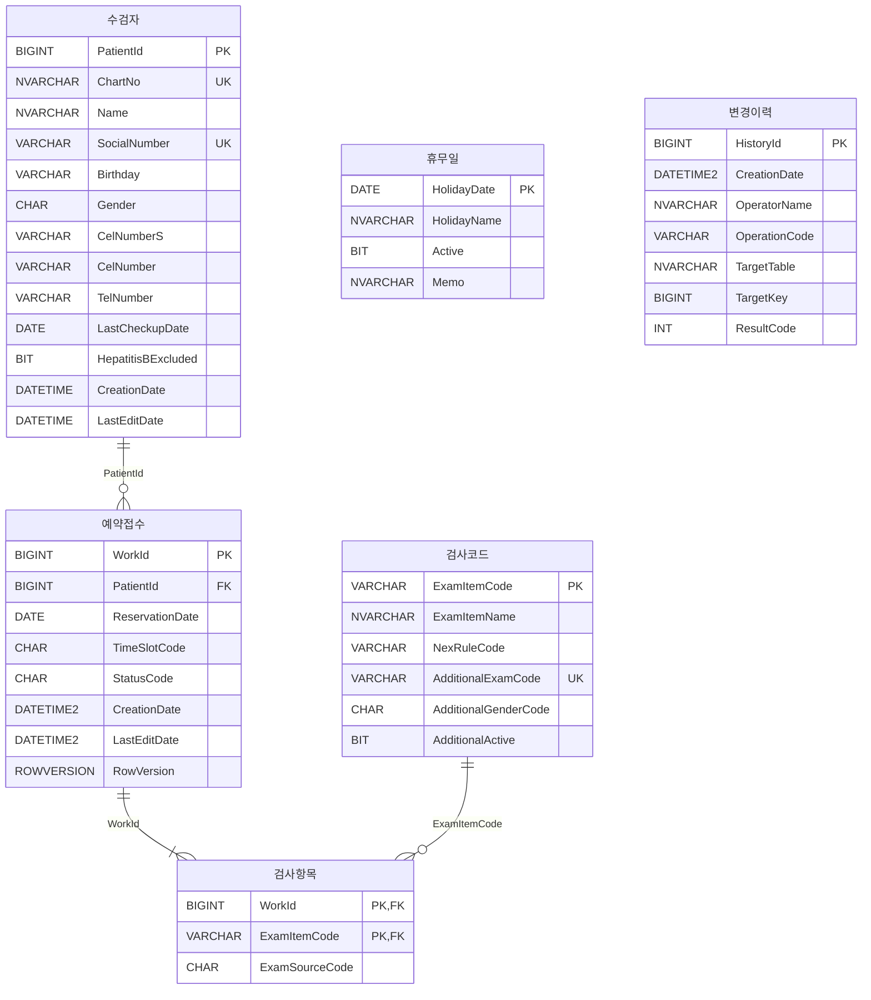

# 검진 예약·접수 관리 프로그램 — DB 설계서 R3 재설계 초안

- **문서명:** `04_DB_Design_R3_DRAFT.md`
- **상태:** `DRAFT` — 기준선이 아니다. `docs/baseline/04_DB_Design.md` 를 대체하지 않는다
- **초안 버전:** d0.1
- **작성일:** 2026-09-04
- **대체 대상:** `docs/baseline/04_DB_Design.md` v1.1 (`HC-RSV-RCP-20260903-R2`)
- **제안 기준선 ID:** `HC-RSV-RCP-20260904-R3` (§5 에서 확정)
- **선행 세션:** `database-38` — R3 개편 grilling 6라운드로 설계 결정 확정
- **인계문서:** `database/docs/prompts/2026-09-04-session-03-Phase4-R3-Redesign.md`

---

# 0. 이 문서의 지위

## 0.1 초안인 이유 — 기준선에 바로 쓰면 게이트 두 개가 즉시 깨진다

| 게이트 | 04 를 먼저 바꾸면 | 근거 |
|---|---|---|
| `scripts/verify-baseline.sh` | `=== 5/6 ===` exit 1 | 6개 파일 SHA-256 을 스크립트 안에 하드코딩해 대조한다 |
| `tools/verify-docs.js` `V08` | FAIL | `04` 에서 `CK_`·`DF_` 이름을 세어 스펙·계획의 수치와 대조한다. `04` 만 바꾸면 스펙·계획은 옛 수치를 들고 있다 |

따라서 이 문서는 `docs/phase4/` 바로 아래에 둔다. `verify-docs.js` 는 `docs/phase4/plans/` 와 `06_*_CANDIDATE.md` 와 `docs/baseline/04_DB_Design.md` 만 읽으므로 이 파일은 검사 대상이 아니다.

`03`·`04`·`05` 를 실제로 교체하는 것은 **R3 전체(스펙·계획·게이트·실물)를 한 번에 옮기는 시점**이며 이 초안의 일이 아니다. 그때 해야 할 일은 §12 에 있다.

## 0.2 이 초안이 확정하는 것과 하지 않는 것

```text
확정한다
  테이블 6개 · 전체 컬럼·타입·NULL
  PK / FK / UQ / UX / CK / DF / NCI / Sequence 의 이름과 정의
  상태 CHAR(3) 5값
  변경이력 DDL
  명명규칙
  기준선 ID · 기준일 · tag

확정하지 않는다 (하위 문서의 일)
  SP 본문 SQL · Transaction · 잠금
  Seed / Test Fixture 값
  Test ID 카탈로그 234건의 재편성
  C# 호출계약
```

---

# 1. R3 개편 요지

| 항목 | R2 | R3 |
|---|---:|---:|
| 물리 테이블 | 7 | **6** |
| 전체 컬럼 | 55 | **46** |
| `수검자` 컬럼 | 29 | **18** |
| Primary Key | 7 | **6** |
| Foreign Key | 6 | **3** |
| Unique Constraint | 2 | 2 |
| Filtered Unique Index | 1 | 1 |
| 업무/조회 Nonclustered Index | 5 | 5 |
| CHECK | 22 | **22** |
| DEFAULT | 14 | **8** |
| Sequence | 1 | 1 |
| Trigger | 0 | **0** |
| 업무상태 값 수 | 3 | **5** |
| 외부 호출 SP | 15 | **15** |
| 내부 Inline TVF | 4 | **4** |

세 가지가 R3 의 전부다.

```text
① 테이블을 한글 이름으로 바꾸고 역할이 겹치는 2개를 컬럼으로 흡수한다
② 상태를 3값에서 5값으로 나눈다 — 검진완료와 취소사유 구분
③ 변경이력 테이블을 신설하고 Write SP 가 명시적으로 기록한다
```

---

# 2. 확정된 설계 결정과 근거

선행 세션 `database-38` 이 grilling 6라운드로 확정했다. 이 장은 재논의 대상이 아니며 근거를 보존하기 위해 옮겨 적는다.

## 2.1 테이블 6개

| 신규명 | R2 원본 | 확정 근거 |
|---|---|---|
| `수검자` | `INFO_PATIENTS` | `00` 정책 EP-01~10 · `03` "수검자 관리 Tab"(`03` §5, WF-PAT-01) · SP 5개가 전부 `수검자` |
| `예약접수` | `INFO_CHECKUP_WORKS` | SP `USP_HC_SELECT_예약접수목록`·`_예약접수상세` · 프로그램 표시명 "검진 예약·접수 관리" |
| `검사항목` | `INFO_CHECKUP_WORK_EXAMS` | `05` RS2·RS3·RS4·RS5 의 "국가검사항목 / 추가검사항목". `05` §8.2 RS2 가 *"실제 저장된 `ExamSourceCode='NEX'` 만 반환한다"* 고 명시 |
| `검사코드` | `MST_EXAM_ITEMS` | `04` §4.6 제목 *"공통 검사코드 19종"* · `04` §4.2 *"검사코드와 NEX/AEX 역할의 단일 Seed 원천"* |
| `휴무일` | `MST_HOLIDAYS` | HOL-01~05 |
| `변경이력` | **신설** | §4 |

### 삭제한 2개

| 삭제 | 이관처 | 확정 근거 |
|---|---|---|
| `INFO_PATIENT_EXAM_EXCLUSIONS` | `수검자.HepatitisBExcluded BIT` | NEX-03 판정이 `NOT EXISTS(… x.ExamItemCode='EX010')` 에서 컬럼 비교로 바뀌지만 **의미는 동일**하다. Seed 가 1행뿐이고 `'EX010'` 이 규칙 코드에 리터럴로 박혀 있어 범용성은 명목뿐이었다 |
| `HIS_GENERAL_CHECKUP_COMPLETIONS` | `수검자.LastCheckupDate DATE NULL` | TGT 판정 조인이 1→0회. Fixture 4행이 전부 다른 수검자라 복수 이력은 한 번도 시험되지 않았고, `03` §8.7 이 *"대상판정 : 대상 — 최근 완료연도 2024"* 단일 값만 표시한다 |

### 더 줄이지 않는 이유 — 이미 검토해 기각했다

- `검사항목`을 `예약접수`에 합치면 한 건이 8~17행으로 중복되어 **정원 COUNT 가 깨진다**(`04` §5.3 과 동일한 판단).
- `휴무일`은 수검자와 무관한 날짜 Master 라 어느 컬럼으로도 옮길 수 없다.
- `검사코드`는 19행 Seed 의 단일 원천이며 `검사항목`의 FK 부모다.

## 2.2 `수검자` 18컬럼 (29 → 18)

### 삭제 13

| 컬럼 | 근거 |
|---|---|
| `PassportNumber` `InsuranceNumber` `IsStudent` `IsVIP` `IsReceiveCall` `IsReceiveSMS` `IsReceiveEmail` `IsReceivePost` `IsMarketingConsent` `MConsentDate` `MCancelDate` | `03` §5 컬럼표가 No 4·8·19~27 을 전부 **"UI 미사용"** 으로 열거한다. `05` 등장 0회 |
| `TelNumberS` | 검색 파라미터에도 Result Set 에도 없다 — **읽는 계약이 0**. `TEL_NORMALIZED`·`TEL_DIGIT` 두 CHECK 이 함께 사라진다 |
| `Active` | `05` 계약에 **0회** 등장. `03` No 18 도 "UI 미사용". EP-10 이 삭제 SP 를 금지하므로 영원히 `1` |

### 신설 2

| 컬럼 | 근거 |
|---|---|
| `LastCheckupDate DATE NULL` | 이름이 `05` §6.2.2 TVF 반환 컬럼 · `05` §9.8 RS3 과 이미 일치한다. 계약 이름을 새로 만들지 않는다 |
| `HepatitisBExcluded BIT NOT NULL DEFAULT 0` | §3.3 에서 이름을 확정했다 |

### 유지 판단

- `SocialNumber` 는 **`VARCHAR(13)` 평문 그대로**. `VARCHAR(128)` 로 넓히는 안은 얻는 것 없이 `CK_…_SOCIAL_FORMAT` 만 무력화하므로 기각했다.
- `CelNumberS` 는 유지한다. `05` §7.2 의 `@MobilePhone` 이 *"`-` 제거 후 정확검색"* 이고 `04` §11.1 이 그 조회경로를 `IX_…_CEL_NUMBER_S` 로 지정한다. `TelNumber` 에 대응하는 검색 파라미터는 **없다** — 이것이 `CelNumberS` 는 살고 `TelNumberS` 는 죽는 이유다.
- `TelNumber` 는 유지한다. `05` §7.2 RS1 의 `Phone` 컬럼 물리 출처다.

## 2.3 상태 모델 — `CHAR(3)` 5값

| 값 | 의미 | `StatusName` |
|---|---|---|
| `RSV` | 예약 | 예약 |
| `RCP` | 접수 | 접수 |
| `FIN` | 검진완료 | 검진완료 |
| `CNR` | 예약취소 | 예약취소 |
| `CNC` | 접수취소 | 접수취소 |

```text
예약(RSV)
 ├─ 예약 변경 → 예약(RSV)
 ├─ 예약 취소 → 예약취소(CNR)
 └─ 접수      → 접수(RCP)

접수(RCP)
 ├─ AEX 변경  → 접수(RCP)
 ├─ 접수 취소 → 접수취소(CNC)
 └─ 검진 완료 → 검진완료(FIN)    ※ 전이 SP 없음. §2.3.1

검진완료(FIN) · 예약취소(CNR) · 접수취소(CNC)
 └─ 종결. 어떤 Action 도 불허(502 WrongStatus)
```

### 2.3.1 `FIN` 은 `CHECK` 허용값에만 존재한다

**전이 SP 를 만들지 않는다.** 사용자가 SSMS 로 직접 `UPDATE` 해서 조회·통계 분류를 시험하는 용도다. 도달 경로가 있으므로 죽은 코드가 아니다.

그 결과 다음이 전부 열리지 않는다.

```text
SP 는 15개 그대로              → 05 §19.2 "15개 SP 이름과 수" 유지
01_Process · 02_Function 미개봉 → FIN 은 업무 단계가 아니라 데이터 상태값이다
```

### 2.3.2 5값이 기존 계약에 미치는 영향

| 항목 | 결정 |
|---|---|
| 정원(RP-03) | **`RSV+RCP` 그대로.** `FIN` 을 넣으면 기존 정원 시험(`CON-002` 19/20 등)이 테스트 조작에 흔들린다 |
| 중복 유효예약(RP-06) | **`RSV`·`RCP` 만.** `FIN`·`CNR`·`CNC` 는 제외 |
| 취소 SP 수 | **늘지 않는다.** `UPDATE_예약취소`(RSV→`CNR`)와 `UPDATE_접수취소`(RCP→`CNC`)가 이미 별개 SP 다 |
| Workbench `@Status` 필터 | 5값 모두 허용 |
| 노쇼 | **도입하지 않는다** |

### 2.3.3 도메인 근거

HL7 FHIR `Appointment.status`(`booked`·`checked-in`·`fulfilled`·`cancelled`·`noshow`)가 같은 단일 enum 구조를 쓴다. 상태를 별도 이력 테이블로 분리하지 않고 한 컬럼의 값 집합으로 두는 것이 이 도메인의 표준형이다.

## 2.4 `변경이력` 의 확정 원칙

| 원칙 | 근거 |
|---|---|
| **Write SP 8개 내부에서 명시적으로 기록한다. 트리거를 쓰지 않는다** | `Trigger 0` 원칙(`04`·`05`·`06` 15곳)과 이미 배포된 `SCH-010` 이 그대로 산다 |
| 실측: AFTER 트리거는 바깥 `UPDATE` 의 `@@ROWCOUNT` 를 훼손하지 않지만(`SET NOCOUNT ON` 유무 무관), **트리거가 쓴 로그 행은 `ROLLBACK` 과 함께 사라진다** | 실패한 시도를 트리거로 남기는 것은 **구조적으로 불가능**하다 |
| 업무 단위 **1행** — 시각·조작자·업무·대상 키·`ResultCode` | 컬럼 단위 EAV 가 아니다 |
| **성공 + 업무실패 둘 다 기록한다** | 실패는 `ROLLBACK` 되므로 **Transaction 밖**에서 써야 살아남는다 |
| 조작자는 `@OperatorName NVARCHAR(50)` 자유 문자열 | 직원 Master 를 만들면 테이블이 7개가 되고 `04` §4.1·§10.1·§15.4 가 전부 재작성된다 |
| clean-create 로 **매 배포 초기화** | `Rebuild.sql` 이 DB 를 통째로 DROP 하므로 "보존"은 deploy 경로에서만 성립하는 반쪽 보장이다. 반쪽 보장을 문서에 적지 않는다 |
| `T35` 의 `G14`(2회 rebuild 지문 동일) 비교 대상에서 **제외한다** | 로그 행의 시각이 매번 달라 지문이 어긋난다 |

## 2.5 명명 규칙

| 대상 | 규칙 |
|---|---|
| 테이블 | 한글, 접두사 없음. 전부 2형태소 |
| 컬럼 | **영문 PascalCase 유지** — `05` §1.6 Result Set 이름과 1:1 이라 SP 본문에 별칭이 붙지 않는다 |
| 제약·인덱스 | §3 |
| SP / TVF | **변경 없음** — 한글 15개 + 4개 |
| 상태값 | `CHAR(3)` 영문 5값 |

**실측 확인**: 대상 DB(`Korean_Wansung_CI_AS`) 안에서 한글 테이블·컬럼·제약·인덱스 이름이 **대괄호 없이** 생성되고, `EXCEPT` 양방향 대조에 `COLLATE` 가 **불필요**하다. `SCH-002`·`016`·`017`·`018` 형태 모두 통과를 확인했다.

---

# 3. 제약·인덱스 명명규칙 — 확정

> 인계문서 §4.1 의 미결 해소

## 3.1 규칙

```text
{PK|FK|UQ|UX|IX|CK|DF}_{한글테이블명}[_{본체}]
```

| 항목 | 규칙 |
|---|---|
| 접두사 | 영문 대문자. `04` §3.3 과 동일 |
| 테이블명 자리 | **한글**. 여기가 한글이 오는 **유일한 자리**다 |
| 본체 | **영문 대문자 `SNAKE_CASE`**. 컬럼명을 `SNAKE_CASE` 로 전개하거나(`SocialNumber` → `SOCIAL_NUMBER`), 컬럼이 여럿·조건이 컬럼명만으로 안 드러나면 의미 태그(`SLOT`, `EDIT_DATE`) |
| 같은 컬럼에 CHECK 가 둘 이상 | 술어 태그를 덧붙인다 — `_NOT_BLANK` `_FORMAT` `_DIGIT` `_NORMALIZED` |
| PK | 본체 없음. `PK_수검자` |
| **FK 만 예외** | 본체가 **부모 한글테이블명**이다 — `FK_예약접수_수검자`. FK 는 컬럼이 아니라 관계를 가리키므로 컬럼명 규칙을 적용하지 않는다 |

## 3.2 이 규칙을 고른 이유

**R2 이름에서 테이블 구간만 치환하면 R3 이름이 된다.**

```text
CK_INFO_PATIENTS_SOCIAL_FORMAT  →  CK_수검자_SOCIAL_FORMAT
IX_INFO_CHECKUP_WORKS_SLOT      →  IX_예약접수_SLOT
DF_MST_EXAM_ITEMS_AEX_ACTIVE    →  DF_검사코드_AEX_ACTIVE
```

- 이름 어휘가 R2 그대로라 `06` §12.5 와 `tests/01_Schema_Tests.sql` 의 기대값이 **문자열 치환으로 기계적으로 옮겨진다.**
- 컬럼명이 영문 PascalCase 로 남으므로 `CK_수검자_SocialNumber_FORMAT` 같은 `대소문자 혼합 + 밑줄` 형태가 생기지 않는다.
- 대안이었던 전체 한글(`CK_수검자_주민번호형식`)은 R2 대응이 끊겨 시험 기대값을 전건 손으로 다시 써야 한다.

## 3.3 `HepatitisBExcluded` — B형간염 제외 컬럼 이름 확정

> 인계문서 §4.2 의 미결 해소

| 후보 | 판정 |
|---|---|
| **`HepatitisBExcluded`** | **채택** |
| `IsHepatitisBExcluded` | 기각 — R3 에 남는 `BIT` 는 이것과 `검사코드.AdditionalActive`·`휴무일.Active` 셋뿐이고 둘 다 `Is` 접두사가 없다. `Is` 를 쓰던 컬럼(`IsStudent` 등)은 전부 삭제됐으므로 되살릴 관례가 없다 |
| `ExcludeHepatitisB` | 기각 — 명령형으로 읽힌다. 저장하는 것은 명령이 아니라 상태다 |

제약 이름은 §3.1 에 따라 `DF_수검자_HEPATITIS_B_EXCLUDED` 다.

---

# 4. `변경이력` 설계 — 확정

> 인계문서 §4.4 의 미결 해소

## 4.1 컬럼

| No | 컬럼 | 타입 | NULL | Default / 생성 | 설명 |
|---:|---|---|:---:|---|---|
| 1 | `HistoryId` | `BIGINT IDENTITY(1,1)` | X | DB 자동생성 | PK. 기록 순서 |
| 2 | `CreationDate` | `DATETIME2(0)` | X | `SYSDATETIME()` | 기록시각 |
| 3 | `OperatorName` | `NVARCHAR(50)` | O | `@OperatorName` | 조작자 자유 문자열 |
| 4 | `OperationCode` | `VARCHAR(10)` | X | SP 고정값 | 업무 코드 8종 |
| 5 | `TargetTable` | `NVARCHAR(10)` | X | SP 고정값 | `수검자` / `예약접수` |
| 6 | `TargetKey` | `BIGINT` | O | `PatientId` 또는 `WorkId` | 대상 키 |
| 7 | `ResultCode` | `INT` | X | SP 계산값 | `05` §4.2 ResultCode |

## 4.2 컬럼별 결정 근거

### `HistoryId` — 대리키가 필요하다

자연키가 없다. 같은 조작자가 같은 업무를 같은 초에 두 번 할 수 있고 `CreationDate` 가 `DATETIME2(0)` 이라 그 둘을 구분하지 못한다. `IDENTITY` 가 순서까지 준다.

### `OperationCode` — SP 이름이 아니라 업무 코드다

| 대안 | 판정 |
|---|---|
| **`VARCHAR(10)` 업무 코드 8종 + `CHECK` 허용목록** | **채택** |
| SP 이름(`USP_HC_UPDATE_접수추가검사`) 저장 | 기각 — ① 30자 넘는 값이 로그를 채운다 ② SP 를 이름 변경하면 옛 로그와 새 로그가 조용히 갈라진다 ③ SP 카탈로그를 `CHECK` 로 복제하지 않는 한 선언적 허용목록을 걸 수 없다 |
| `05` §1.3 의 SP-ID(`SP-RCP-02`) 저장 | 기각 — 로그를 읽을 때마다 `05` 를 펴야 한다 |

허용값 8종은 Write SP 8개와 1:1 이다.

| `OperationCode` | SP | `TargetTable` |
|---|---|---|
| `PAT_INSERT` | `USP_HC_INSERT_수검자` | `수검자` |
| `PAT_UPDATE` | `USP_HC_UPDATE_수검자정보` | `수검자` |
| `RSV_INSERT` | `USP_HC_INSERT_예약` | `예약접수` |
| `RSV_UPDATE` | `USP_HC_UPDATE_예약변경` | `예약접수` |
| `RSV_CANCEL` | `USP_HC_UPDATE_예약취소` | `예약접수` |
| `RCP_ACCEPT` | `USP_HC_UPDATE_접수완료` | `예약접수` |
| `RCP_AEX` | `USP_HC_UPDATE_접수추가검사` | `예약접수` |
| `RCP_CANCEL` | `USP_HC_UPDATE_접수취소` | `예약접수` |

한글 업무명(`수검자 등록` 등)은 **컬럼으로 두지 않는다.** `OperationCode` 가 결정하므로 화면·보고서에서 변환한다. 매 배포에 지워지는 테이블에 표시용 한글을 중복 저장하는 것은 `04` §1.8 이 금지한 "관성적 컬럼"이다.

### `TargetTable` — `SYSNAME` 이 아니라 고정 코드다

| 대안 | 판정 |
|---|---|
| **`NVARCHAR(10)` + 결합 `CHECK`** | **채택** |
| `SYSNAME`(`NVARCHAR(128) NOT NULL`) | 기각 — "임의의 객체 이름"이라는 뜻을 담아 동적 SQL 사고를 부른다. `06` §9.2 허용목록에 동적 SQL 이 없다. 값이 2종뿐인데 의미 있는 `CHECK` 을 걸 수 없다 |

`TargetTable` 은 `OperationCode` 가 1:1 로 결정하므로 **중복이다.** 그래도 두는 이유는 `TargetKey` 의 의미(`PatientId` 인가 `WorkId` 인가)가 이 컬럼으로만 드러나고, *"예약접수에 일어난 모든 변경"* 조회가 코드→테이블 대응표를 몰라도 되기 때문이다.

중복을 위험이 아니라 보증으로 바꾸기 위해 **허용목록과 짝 일치를 `CHECK` 하나로 동시에 건다**(§6.6). 제약 수가 늘지 않는다.

### `TargetKey` — `NULL` 을 허용해야 한다

`USP_HC_INSERT_수검자` 가 입력검증(`100 MissingValue`)에서 실패하면 `PatientId` 가 아직 존재하지 않는다. `NOT NULL` 로 두면 **가장 흔한 실패를 기록할 수 없다.**

### `OperatorName` — `NULL` 을 허용하고 `NOT BLANK` `CHECK` 을 걸지 않는다

`@OperatorName` 이 `NULL` 로 들어와 SP 가 `100 MissingValue` 로 거절하는 경우, **그 거절 자체를 기록하는 행의 조작자도 `NULL`** 이다. `NOT NULL` 이면 로그가 자기 자신의 가장 흔한 입력오류를 남기지 못한다.

더 근본적으로 — **기록이 업무 호출을 실패시키는 경로를 만들지 않는다.** 로그 컬럼의 제약 위반으로 `THROW` 가 나면 정상 업무실패가 예상치 못한 오류로 둔갑한다.

### `ResultCode` — `Success` 컬럼을 따로 두지 않는다

`05` §4.1 이 `0~9` 를 성공(`0` 정상 / `1` No-op / `2` 기존수검자 사용), `100` 이상을 실패로 고정했다. `Success` 는 `ResultCode < 100` 으로 완전히 결정되므로 컬럼으로 두면 어긋날 수 있는 중복이 하나 더 생긴다.

`CHECK` 은 38종 카탈로그를 복제하지 않고 `05` §4.1 이 선언한 영역의 합집합(`0`~`799`)만 경계로 쓴다. 카탈로그를 복제하면 `05` 가 코드를 하나 추가할 때마다 DDL 이 조용히 어긋난다.

## 4.3 기록 지점 — `06` §21.1 Template 대비

```text
[1] Transaction 밖 · 입력검증 실패   → 기록한다 (이미 Transaction 밖)
[4] Transaction 안 · 업무실패        → ROLLBACK 직후, RETURN 앞에서 기록한다
[5] Transaction 안 · 저장 성공        → COMMIT 앞에서 기록한다
CATCH · 예상하지 못한 오류            → 기록하지 않는다
```

| 지점 | 결정 근거 |
|---|---|
| `[4]` 는 `ROLLBACK` **뒤** | 안에서 쓰면 `ROLLBACK` 과 함께 사라진다. `ROLLBACK` 뒤에는 `@@TRANCOUNT=0` 이라 그 `INSERT` 가 자동 커밋된다 |
| `[5]` 는 `COMMIT` **앞** | 밖에 두면 `COMMIT` 직후 세션이 끊길 때 데이터는 남고 로그만 사라진다. 성공 기록은 데이터 변경과 원자적이어야 한다 |
| `CATCH` 는 기록하지 않는다 | ① `SET XACT_ABORT ON` 에서 doomed 된 트랜잭션(`XACT_STATE()=-1`)에 `INSERT` 하면 그 `INSERT` 가 다시 실패해 **원본 오류가 로깅 오류로 바뀐다** ② `THROW` 는 `ResultCode` 가 없어 `ResultCode NOT NULL` 을 채울 값이 구조적으로 없다 |

**No-op(`Code=1`)도 성공이므로 기록한다.** `변경이력` 은 Work Aggregate 의 Master 도 Detail 도 아니므로 `RowVersion` 을 건드리지 않는다 — `04` §1.2.1 과 `06` §28 의 No-op 계약은 그대로 성립한다.

## 4.4 인덱스를 만들지 않는다

`변경이력` 을 읽는 SP 가 없다. 15개 SP 는 고정이고 그중 이 테이블을 읽는 것은 하나도 없다. 읽는 주체는 SSMS 의 사람뿐이고, 매 배포에 비워지므로 행 수가 작다.

`04` §11.2 의 판단 기준을 그대로 적용해 **Clustered PK 하나만** 둔다. `IDENTITY` Clustered 는 append-only 로그에 가장 적합한 구조이기도 하다.

## 4.5 FK 를 걸지 않는다

`TargetKey` → `수검자.PatientId` / `예약접수.WorkId` FK 를 만들 수 없다.

```text
① 대상이 두 테이블이라 컬럼 하나에 FK 두 개를 걸 수 없다
② INSERT_수검자 실패 행은 존재하지 않는 PatientId 를 가리킨다
   FK 를 걸면 실패 기록이 원리적으로 불가능해진다
```

감사 로그는 대상 행보다 오래 살아야 한다. 이것이 `04` §9.1 의 FK 6개가 R3 에서 3개가 되는 이유의 일부다.

---

# 5. 기준선 ID · 기준일 · tag — 확정

> 인계문서 §4.3 의 미결 해소

| 항목 | R2 (현행) | R3 (확정) |
|---|---|---|
| 기준선 ID | `HC-RSV-RCP-20260903-R2` | **`HC-RSV-RCP-20260904-R3`** |
| 기준일 | `2026-09-03` | **`2026-09-04`** |
| git tag | `baseline-HC-RSV-RCP-20260903-R2` | **`baseline-HC-RSV-RCP-20260904-R3`** |

`[승인]` **2026-09-04 사용자 확정** — 대안 2종(실제 봉인 실행일 / 날짜 없는 `HC-RSV-RCP-R3`)을 함께 제시했고 설계 확정일 고정을 선택했다.

## 5.1 기준일을 봉인 실행일이 아니라 설계 확정일로 고정한다

`2026-09-04` 는 선행 세션 `database-38` 이 R3 설계를 확정하고 이 초안이 작성된 날이다. **봉인 스크립트를 언제 돌리는지와 무관하게 고정**한다.

봉인 실행일로 정의하면 ID 가 "언제 실행하느냐"에 따라 움직이는 값이 되고, 그 값이 아래 6곳에 흩어져 있어 `06` §45.2 가 경고한 사본 어긋남이 그대로 재현된다.

## 5.2 R2 tag 는 이동하지 않고 보존한다

`baseline-HC-RSV-RCP-20260903-R2` 와 `phase4-r2-t07-complete` 는 그대로 둔다. R3 는 **새 tag 를 추가**한다.

## 5.3 이 값이 동시에 바뀌어야 하는 곳 — 실측 목록

`grep -rn 'HC-RSV-RCP-20260903-R2'` 로 확인한 실제 출현 위치다(`docs/baseline/output/` 과 인계문서 제외).

| 파일 | 위치 |
|---|---|
| `docs/baseline/00_Project_Policy.md` | :7 머리말 · :347 최종판정 — **R3 에서 열지 않으므로 R2 표기 유지** |
| `docs/baseline/01_Process_Definition.md` | :7 · :1062 — **열지 않으므로 R2 표기 유지** |
| `docs/baseline/03_Wireframe_Definition.md` | :7 · :1335 → **R3 로 교체** |
| `docs/baseline/04_DB_Design.md` | :7 · :90 · :1649 → **R3 로 교체** |
| `docs/baseline/05_DB_Rule_SP_Contract.md` | :7 · :2297 → **R3 로 교체** |
| `docs/phase4/06_…_CANDIDATE.md` | :7 · :39 · §4.1 표 6행 · :2109 → **R3 로 교체 + `04`·`05`·`03` SHA-256 3개 갱신** |
| `docs/phase4/plans/01-preflight-schema.md` | :25 · :137 · :138 → **R3 tag 로 교체** |
| `docs/phase4/plans/08-verification-finalization.md` | :925 · :993 → **R3 tag 로 교체** |
| `docs/phase4/plans/2026-09-04-…-implementation.md` | :22 Global Constraints → **R3 로 교체** |
| `database/scripts/verify-baseline.sh` | 하드코딩 SHA-256 6개 중 **`03`·`04`·`05` 3개 갱신** |

`[!]` **`00`·`01`·`02` 는 열지 않으므로 세 파일의 머리말은 `HC-RSV-RCP-20260903-R2` 로 남는다.** 한 기준선 안에 두 ID 가 공존하는 상태이므로, R3 봉인 시 `06` §4.1 표에 *"`00`·`01`·`02` 는 R2 원본 무변경"* 을 명시해야 한다. 그러지 않으면 다음 세션이 불일치를 결함으로 오인한다.

## 5.4 문서 버전 (권고)

| 문서 | R2 | R3 권고 | 사유 |
|---|---|---|---|
| `03_Wireframe_Definition.md` | v1.2 | v1.3 | 삭제 컬럼 표기·상태 5값 표시 |
| `04_DB_Design.md` | v1.1 | **v2.0** | 테이블·컬럼 구조 변경 |
| `05_DB_Rule_SP_Contract.md` | v1.1 | **v2.0** | SP Parameter·판정식 변경(§12.1) |

---

# 6. 테이블 상세 정의

> `04` §8 을 대체한다. 컬럼 순서가 배포 DDL 의 순서다.

## 6.1 `수검자`

### 6.1.1 역할

수검자 Master. 내부 식별자·차트번호·주민등록번호 테스트값의 고유성과 조회를 지원한다. R3 에서 TGT 판정 입력(`LastCheckupDate`)과 NEX-03 판정 입력(`HepatitisBExcluded`)을 흡수했다.

### 6.1.2 컬럼 (18)

| No | 컬럼 | 타입 | NULL | Default / 생성 | 설명 |
|---:|---|---|:---:|---|---|
| 1 | `PatientId` | `BIGINT IDENTITY(1,1)` | X | DB 자동생성 | PK, 불변 내부 식별자 |
| 2 | `ChartNo` | `NVARCHAR(100)` | X | SP 수동값 또는 Sequence 변환값 | 차트번호 |
| 3 | `Name` | `NVARCHAR(100)` | X | 사용자 입력 | 이름 |
| 4 | `SocialNumber` | `VARCHAR(13)` | X | 정규화한 임의 테스트값 | 주민번호 테스트값, 고유 식별 |
| 5 | `Birthday` | `VARCHAR(8)` | X | `SocialNumber` 에서 SP 산출 | `yyyyMMdd` |
| 6 | `Gender` | `CHAR(1)` | X | `SocialNumber` 에서 SP 산출 | `M` / `F` |
| 7 | `EMail` | `VARCHAR(200)` | O | 사용자 입력 | E-mail |
| 8 | `CelNumberS` | `VARCHAR(13)` | O | `CelNumber` 정규화 | 휴대전화 검색값 |
| 9 | `CelNumber` | `VARCHAR(13)` | O | 사용자 입력 | 휴대전화번호 |
| 10 | `TelNumber` | `VARCHAR(13)` | O | 사용자 입력 | 전화번호 |
| 11 | `Zipcode` | `VARCHAR(10)` | O | 사용자 입력 | 우편번호 |
| 12 | `Address` | `NVARCHAR(200)` | O | 사용자 입력 | 주소 |
| 13 | `AddressDetail` | `NVARCHAR(200)` | O | 사용자 입력 | 상세주소 |
| 14 | `Memo` | `NVARCHAR(MAX)` | O | 사용자 입력 | 메모 |
| 15 | `LastCheckupDate` | `DATE` | O | Seed/Test | **신설.** 일반건강검진 최근 완료일 |
| 16 | `HepatitisBExcluded` | `BIT` | X | `0` | **신설.** B형간염(`EX010`) 검사 제외 여부. `1` = 제외 |
| 17 | `CreationDate` | `DATETIME` | X | `GETDATE()` | 생성시각 |
| 18 | `LastEditDate` | `DATETIME` | X | `GETDATE()` | 마지막 수정시각 및 수정 동시성 기준값 |

`CreationDate`·`LastEditDate` 는 `DATETIME` 을 유지한다. `04` §1.2 의 Patient 동시성 계약(`LastEditDate` 비교)과 `06` §26 의 단조증가 구현이 이 타입 위에 서 있다.

### 6.1.3 Key / Constraint

| 구분 | 이름 | 컬럼/조건 |
|---|---|---|
| PK | `PK_수검자` | `PatientId` Clustered |
| UQ | `UQ_수검자_CHART_NO` | `ChartNo` |
| UQ | `UQ_수검자_SOCIAL_NUMBER` | `SocialNumber` |
| CK | `CK_수검자_CHART_NO_NOT_BLANK` | `LEN(LTRIM(RTRIM(ChartNo))) > 0` |
| CK | `CK_수검자_NAME_NOT_BLANK` | `LEN(LTRIM(RTRIM(Name))) > 0` |
| CK | `CK_수검자_SOCIAL_FORMAT` | `LEN(SocialNumber)=13 AND SocialNumber NOT LIKE '%[^0-9]%'` |
| CK | `CK_수검자_BIRTHDAY` | 숫자 8자리이며 `TRY_CONVERT(DATE, Birthday, 112)` 가능 |
| CK | `CK_수검자_GENDER` | `Gender IN ('M','F')` |
| CK | `CK_수검자_CEL_NORMALIZED` | 원번호가 NULL 이면 S 도 NULL, 아니면 `CelNumberS=REPLACE(CelNumber,'-','')` |
| CK | `CK_수검자_CEL_DIGIT` | `CelNumberS` 가 NULL 이거나 숫자만 포함 |
| CK | `CK_수검자_EDIT_DATE` | `LastEditDate >= CreationDate` |

**CK 8개.** R2 의 `TEL_NORMALIZED`·`TEL_DIGIT` 두 CHECK 은 `TelNumberS` 와 함께 사라진다. `TelNumber` 는 표시값이고 정규화 짝이 없으므로 형식 제약을 두지 않는다.

`[!]` **삭제된 제약의 이름을 `CK_` 접두사가 붙은 형태로 `04` 본문에 쓰지 않는다.** `V08` 은 `04` 안의 `CK_`·`DF_` **이름을 유니크로 세므로**, 사라진 제약을 완전한 이름으로 언급하면 실측치가 22 가 아니라 24 가 되어 스펙·계획과 어긋난다(§12.4).

`LastCheckupDate` 에 `CHECK` 을 두지 않는다 — `04` §8.6.3 이 `HIS_GENERAL_CHECKUP_COMPLETIONS` 에 동적 현재일 `CHECK` 을 두지 않은 이유(*"미래 완료이력 제외 동작을 테스트할 수 있어야 한다"*)가 컬럼이 된 뒤에도 그대로 적용된다.

### 6.1.4 Default Constraint

| 이름 | 컬럼 | 값 |
|---|---|---|
| `DF_수검자_HEPATITIS_B_EXCLUDED` | `HepatitisBExcluded` | `0` |
| `DF_수검자_CREATION_DATE` | `CreationDate` | `GETDATE()` |
| `DF_수검자_LAST_EDIT_DATE` | `LastEditDate` | `GETDATE()` |

**DF 3개.** R2 의 `BIT` Default 8개는 해당 컬럼과 함께 사라졌다.

### 6.1.5 Index

| 이름 | Key | INCLUDE / Filter | 목적 |
|---|---|---|---|
| `UQ_수검자_CHART_NO` | `ChartNo` | - | 차트번호 정확조회·고유성 |
| `UQ_수검자_SOCIAL_NUMBER` | `SocialNumber` | - | 주민번호 테스트값 정확조회·고유성 |
| `IX_수검자_NAME_BIRTHDAY` | `Name, Birthday` | `PatientId, ChartNo, Gender, CelNumber` | 이름 조회·이름+생년월일 중복후보 |
| `IX_수검자_BIRTHDAY` | `Birthday` | `PatientId, ChartNo, Name, Gender, CelNumber` | 생년월일 단독조회·중복후보 |
| `IX_수검자_CEL_NUMBER_S` | `CelNumberS` | `PatientId, ChartNo, Name, Birthday, Gender, CelNumber` / `WHERE CelNumberS IS NOT NULL` | 휴대전화 정확조회 |

`LastCheckupDate`·`HepatitisBExcluded` 는 항상 `PatientId` 로 단일행을 집은 뒤 읽으므로 Index 를 두지 않는다. 오히려 R2 보다 조회경로가 짧다 — TGT 판정의 `HIS_…` 조인 1회와 NEX-03 의 `INFO_PATIENT_EXAM_EXCLUSIONS` 조회 1회가 **모두 0 회**가 된다.

## 6.2 `예약접수`

### 6.2.1 역할

예약과 접수를 동일 행으로 관리하는 업무 Master. `04` §1.1 의 "예약·접수 동일 업무 행" 원칙은 그대로다.

### 6.2.2 컬럼 (8)

| No | 컬럼 | 타입 | NULL | Default / 생성 | 설명 |
|---:|---|---|:---:|---|---|
| 1 | `WorkId` | `BIGINT IDENTITY(1,1)` | X | DB 자동생성 | PK, 화면 간 Target Key |
| 2 | `PatientId` | `BIGINT` | X | 수검자 확정값 | 수검자 FK |
| 3 | `ReservationDate` | `DATE` | X | 사용자 선택 / WalkIn 오늘 | 예약일 및 접수 기준일 |
| 4 | `TimeSlotCode` | `CHAR(2)` | X | 명시 입력 | `AM` / `PM` |
| 5 | `StatusCode` | `CHAR(3)` | X | 저장 SP 명시 | `RSV`/`RCP`/`FIN`/`CNR`/`CNC` |
| 6 | `CreationDate` | `DATETIME2(0)` | X | `SYSDATETIME()` | 업무행 생성시각 |
| 7 | `LastEditDate` | `DATETIME2(0)` | X | `SYSDATETIME()` | 최근 변경·접수·취소·AEX 변경시각 |
| 8 | `RowVersion` | `ROWVERSION` | X | SQL Server 자동생성 | 낙관적 동시성 토큰 |

컬럼 구조는 R2 와 동일하다. `StatusCode` 의 허용값만 3값에서 5값이 된다.

`CHAR(3)` 이므로 4글자 값은 들어가지 않는다 — 검진완료를 `DONE` 이 아니라 **`FIN`** 으로 정한 이유다(실측 확인).

### 6.2.3 Key / Constraint

| 구분 | 이름 | 정의 |
|---|---|---|
| PK | `PK_예약접수` | `WorkId` Clustered |
| FK | `FK_예약접수_수검자` | `PatientId` → `수검자.PatientId`, `NO ACTION` |
| CK | `CK_예약접수_TIME_SLOT` | `TimeSlotCode IN ('AM','PM')` |
| CK | `CK_예약접수_STATUS` | `StatusCode IN ('RSV','RCP','FIN','CNR','CNC')` |
| CK | `CK_예약접수_EDIT_DATE` | `LastEditDate >= CreationDate` |
| DF | `DF_예약접수_CREATION_DATE` | `CreationDate = SYSDATETIME()` |
| DF | `DF_예약접수_LAST_EDIT_DATE` | `LastEditDate = SYSDATETIME()` |

`CHECK` 이 아니라 Write SP/Transaction 에서 검증하는 항목은 `04` §8.2.3 과 동일하다(과거일·토요일 오후·일요일/HOL·정원 20명·중복 유효예약·현재 Work 제외·허용 상태전이).

### 6.2.4 Index

| 이름 | Key | INCLUDE | 목적 |
|---|---|---|---|
| `IX_예약접수_SLOT` | `ReservationDate, TimeSlotCode, StatusCode` | `PatientId` | 정원 COUNT, 날짜범위 Workbench 조회 |
| `IX_예약접수_PATIENT_STATE_DATE` | `PatientId, StatusCode, ReservationDate` | `TimeSlotCode` | RP-06 중복예약, EP-08 활성업무, 당일 대상조회 |

두 Index 모두 `StatusCode` 가 Key 에 있고 값이 3→5 로 늘어도 선두 컬럼 순서가 바뀌지 않으므로 **조회경로는 그대로다.** 정원·중복 조회의 술어는 `StatusCode IN ('RSV','RCP')` 로 R2 와 동일하다.

## 6.3 `검사항목`

### 6.3.1 역할

각 `예약접수` 행에 실제로 구성된 NEX 와 AEX 검사 스냅샷.

### 6.3.2 컬럼 (3)

| No | 컬럼 | 타입 | NULL | 생성 | 설명 |
|---:|---|---|:---:|---|---|
| 1 | `WorkId` | `BIGINT` | X | 업무 PK | `예약접수` FK |
| 2 | `ExamItemCode` | `VARCHAR(10)` | X | NEX Rule / AEX Master 변환 | `검사코드` FK |
| 3 | `ExamSourceCode` | `CHAR(3)` | X | 저장 SP | `NEX` / `AEX` |

### 6.3.3 Key / Constraint / Index

| 구분 | 이름 | 정의 |
|---|---|---|
| PK | `PK_검사항목` | `(WorkId, ExamItemCode)` Clustered |
| FK | `FK_검사항목_예약접수` | `WorkId` → `예약접수.WorkId`, `NO ACTION` |
| FK | `FK_검사항목_검사코드` | `ExamItemCode` → `검사코드.ExamItemCode`, `NO ACTION` |
| CK | `CK_검사항목_SOURCE` | `ExamSourceCode IN ('NEX','AEX')` |

Composite PK 하나가 `04` §8.3.3 과 동일하게 세 가지를 동시에 보장한다 — 한 Work 내 동일 코드 중복 불가, NEX 골밀도와 AEX `OPT04` 동시 저장 불가, Work 별 Detail 조회 최적화.

**FK 이름이 부모 테이블명 두 개로 갈린다**(`_예약접수`, `_검사코드`). §3.1 의 FK 규칙이 그대로 적용된 결과이며 R2 의 `_WORK`·`_EXAM_ITEM` 과 1:1 대응한다.

## 6.4 `검사코드`

### 6.4.1 역할

공통 검사코드와 NEX/AEX 역할을 한 행에 통합한 **19행 Seed Master**. R2 와 컬럼·제약이 완전히 동일하며 이름만 바뀐다.

### 6.4.2 컬럼 (6)

| No | 컬럼 | 타입 | NULL | Default / 생성 | 설명 |
|---:|---|---|:---:|---|---|
| 1 | `ExamItemCode` | `VARCHAR(10)` | X | Seed | 공통 PK, `EX001`~`EX019` |
| 2 | `ExamItemName` | `NVARCHAR(100)` | X | Seed | 화면 검사명 |
| 3 | `NexRuleCode` | `VARCHAR(10)` | O | Seed | `NEX-01`~`NEX-06`, NEX 가 아니면 NULL |
| 4 | `AdditionalExamCode` | `VARCHAR(10)` | O | Seed | `OPT01`~`OPT07`, AEX 가 아니면 NULL |
| 5 | `AdditionalGenderCode` | `CHAR(1)` | O | Seed | `A` / `M` / `F` |
| 6 | `AdditionalActive` | `BIT` | X | `0` | AEX 사용여부. AEX Seed 는 1 |

### 6.4.3 Key / Constraint / Index

| 구분 | 이름 | 정의 |
|---|---|---|
| PK | `PK_검사코드` | `ExamItemCode` Clustered |
| CK | `CK_검사코드_CODE_NOT_BLANK` | `ExamItemCode` 공백 불가 |
| CK | `CK_검사코드_NAME_NOT_BLANK` | `ExamItemName` 공백 불가 |
| CK | `CK_검사코드_ROLE_REQUIRED` | `NexRuleCode` 또는 `AdditionalExamCode` 중 하나 이상 존재 |
| CK | `CK_검사코드_NEX_RULE` | NULL 또는 `NEX-01`~`NEX-06` |
| CK | `CK_검사코드_AEX_CODE` | NULL 또는 `OPT01`~`OPT07` |
| CK | `CK_검사코드_AEX_GENDER` | NULL 또는 `A`/`M`/`F` |
| CK | `CK_검사코드_AEX_GROUP` | AEX 역할 없음이면 Code/Gender NULL 및 Active=0, 역할 있음이면 Code/Gender NOT NULL |
| DF | `DF_검사코드_AEX_ACTIVE` | `AdditionalActive = 0` |
| UX | `UX_검사코드_AEX_CODE` | `AdditionalExamCode`, `WHERE AdditionalExamCode IS NOT NULL` |

`UX_검사코드_AEX_CODE` 는 필터형 인덱스다. **생성 시점뿐 아니라 이 테이블의 모든 `INSERT`/`UPDATE`/`DELETE` 시점에도 `SET QUOTED_IDENTIFIER ON` 을 요구한다**(실측 확인, 없으면 `Msg 1934`). 배포 `.sql` 의 첫 배치에 `SET QUOTED_IDENTIFIER ON; GO` 를 두는 이유다.

19행 Seed 내용(`EX001`~`EX019`, `NEX-01`~`NEX-06`, `OPT01`~`OPT07`)은 `04` §4.6 과 완전히 동일하다. R3 가 바꾸지 않는다.

## 6.5 `휴무일`

### 6.5.1 컬럼 (4)

| No | 컬럼 | 타입 | NULL | Default / 생성 | 설명 |
|---:|---|---|:---:|---|---|
| 1 | `HolidayDate` | `DATE` | X | Seed | PK, 휴무일 |
| 2 | `HolidayName` | `NVARCHAR(100)` | X | Seed | 휴무일명 |
| 3 | `Active` | `BIT` | X | `1` | 활성 휴무일 여부 |
| 4 | `Memo` | `NVARCHAR(500)` | O | Seed | 비고 |

`Active` 는 여기서는 **삭제하지 않는다.** `수검자.Active` 와 달리 HOL 판정식(*"활성 휴무일 아님"*, `04` §2.3)이 실제로 읽는다.

### 6.5.2 Key / Constraint / Index

| 구분 | 이름 | 정의 |
|---|---|---|
| PK | `PK_휴무일` | `HolidayDate` Clustered |
| CK | `CK_휴무일_NAME_NOT_BLANK` | `HolidayName` 공백 불가 |
| DF | `DF_휴무일_ACTIVE` | `Active = 1` |

정확 날짜 PK 조회만 수행하므로 추가 Index 와 생성·수정시각을 두지 않는다. 일요일은 Seed 하지 않고 요일 Rule 로 차단한다.

## 6.6 `변경이력`

### 6.6.1 역할

Write SP 8개가 남기는 업무 단위 감사 로그. 설계 근거 전문은 §4 에 있다.

### 6.6.2 컬럼 (7)

§4.1 의 표가 정의다.

### 6.6.3 Key / Constraint / Index

| 구분 | 이름 | 정의 |
|---|---|---|
| PK | `PK_변경이력` | `HistoryId` Clustered |
| CK | `CK_변경이력_OPERATION` | 아래 논리 |
| CK | `CK_변경이력_RESULT_CODE` | `ResultCode BETWEEN 0 AND 799` |
| DF | `DF_변경이력_CREATION_DATE` | `CreationDate = SYSDATETIME()` |

#### `CK_변경이력_OPERATION` 논리

```text
(TargetTable = N'수검자'
 AND OperationCode IN ('PAT_INSERT','PAT_UPDATE'))
OR
(TargetTable = N'예약접수'
 AND OperationCode IN ('RSV_INSERT','RSV_UPDATE','RSV_CANCEL',
                       'RCP_ACCEPT','RCP_AEX','RCP_CANCEL'))
```

허용목록과 `TargetTable`↔`OperationCode` 짝 일치를 **하나의 제약으로 동시에** 보장한다. `TargetTable` 의 중복성이 어긋남 위험이 아니라 선언적 보증이 되는 지점이다.

FK 0개 · Index 0개 — §4.4·§4.5.

---

# 7. Foreign Key 설계

## 7.1 FK 목록 (3)

| No | FK 이름 | 자식 컬럼 | 부모 컬럼 | Delete / Update |
|---:|---|---|---|---|
| 1 | `FK_예약접수_수검자` | `예약접수.PatientId` | `수검자.PatientId` | NO ACTION |
| 2 | `FK_검사항목_예약접수` | `검사항목.WorkId` | `예약접수.WorkId` | NO ACTION |
| 3 | `FK_검사항목_검사코드` | `검사항목.ExamItemCode` | `검사코드.ExamItemCode` | NO ACTION |

R2 의 FK 4·5·6 은 `HIS_GENERAL_CHECKUP_COMPLETIONS`·`INFO_PATIENT_EXAM_EXCLUSIONS` 와 함께 사라진다. `변경이력` 은 FK 를 갖지 않는다(§4.5).

## 7.2 생성 순서

```text
1. 수검자
2. 검사코드
3. 휴무일
4. 예약접수
5. 검사항목
6. 변경이력
```

Drop Script 는 역순으로 수행한다. `01_Schema.sql` 의 `DROP TABLE IF EXISTS` 블록이 이 역순이다.

`변경이력` 은 FK 가 없어 순서 제약이 없지만 **마지막에 둔다** — clean-create 의 `DROP` 역순에서 가장 먼저 지워져, 뒤이어 실패하더라도 옛 로그가 새 스키마에 남지 않는다.

---

# 8. Key / Constraint / Index 총괄

## 8.1 수량 — §6 상세정의와 자기정합

| 구분 | 수검자 | 예약접수 | 검사항목 | 검사코드 | 휴무일 | 변경이력 | **합계** | R2 |
|---|---:|---:|---:|---:|---:|---:|---:|---:|
| 컬럼 | 18 | 8 | 3 | 6 | 4 | 7 | **46** | 55 |
| Primary Key | 1 | 1 | 1 | 1 | 1 | 1 | **6** | 7 |
| Foreign Key | 0 | 1 | 2 | 0 | 0 | 0 | **3** | 6 |
| Unique Constraint | 2 | 0 | 0 | 0 | 0 | 0 | **2** | 2 |
| Filtered Unique Index | 0 | 0 | 0 | 1 | 0 | 0 | **1** | 1 |
| Nonclustered Index | 3 | 2 | 0 | 0 | 0 | 0 | **5** | 5 |
| CHECK | 8 | 3 | 1 | 7 | 1 | 2 | **22** | 22 |
| DEFAULT | 3 | 2 | 0 | 1 | 1 | 1 | **8** | 14 |
| Trigger | 0 | 0 | 0 | 0 | 0 | 0 | **0** | 0 |

| 구분 | 수량 |
|---|---:|
| 물리 테이블 | **6** |
| Sequence | **1** — `SEQ_HC_CHART_NO` |
| 사용자 정의 Table Type | **0** |

### CHECK 이 22 로 유지되는 이유

```text
R2 22
 - 2  수검자   TEL_NORMALIZED · TEL_DIGIT (TelNumberS 삭제)
 + 2  변경이력 OPERATION · RESULT_CODE
= 22
```

우연히 같다. **`06` 스펙과 계획의 `CHECK 22` 표기는 R3 에서도 그대로 유효하다.** `DEFAULT` 는 `14 → 8` 로 반드시 바뀐다.

## 8.2 `SEQ_HC_CHART_NO`

R2 정의를 그대로 유지한다. 이름·역할·표현범위·결번 허용이 모두 동일하다.

```sql
CREATE SEQUENCE [dbo].[SEQ_HC_CHART_NO]
    AS BIGINT START WITH 1 INCREMENT BY 1
    MINVALUE 1 MAXVALUE 999999 NO CYCLE CACHE 50;
```

변환 `N'C' + RIGHT(N'000000' + CONVERT(NVARCHAR(6), @SequenceValue), 6)` → `C000123`.

Sequence 이름은 한글화하지 않는다 — `04` §0.4.1 이 *"`SEQ_HC_CHART_NO` 의 역할과 표현범위"* 를 고정했고, `05` §1.2 의 `SEQ_HC_` 접두사 규칙이 SP·TVF 와 함께 유지되기 때문이다.

## 8.3 선언적 무결성 우선순위

R2 와 동일하다.

```text
PK/FK/UQ/CK 로 표현 가능한 불변조건
→ 반드시 DB 제약으로 구현

현재일·다른 행·다른 테이블·상태전이에 의존하는 조건
→ Write SP/Transaction 으로 구현
```

---

# 9. Index 설계 및 조회경로

## 9.1 화면/Rule 별 사용 Index

| 조회/검증 | 선두 조건 | 사용 Index | R2 대비 |
|---|---|---|---|
| 차트번호 수검자 조회 | `ChartNo` | `UQ_수검자_CHART_NO` | 동일 |
| 주민번호 수검자 조회 | `SocialNumber` | `UQ_수검자_SOCIAL_NUMBER` | 동일 |
| 이름 수검자 조회 | `Name` | `IX_수검자_NAME_BIRTHDAY` | 동일 |
| 생년월일/중복후보 | `Birthday` 또는 `Name+Birthday` | `IX_수검자_BIRTHDAY`, `IX_수검자_NAME_BIRTHDAY` | 동일 |
| 휴대전화 조회 | `CelNumberS` | `IX_수검자_CEL_NUMBER_S` | 동일 |
| `WorkId` 직접 이동 | `WorkId` | `PK_예약접수` | 동일 |
| 예약일/시간대 정원 | `ReservationDate+TimeSlot+Status` | `IX_예약접수_SLOT` | 동일 |
| Workbench 날짜범위 | `ReservationDate` | `IX_예약접수_SLOT` | 동일 |
| 동일 수검자 유효예약 | `PatientId+Status+ReservationDate` | `IX_예약접수_PATIENT_STATE_DATE` | 동일 |
| 예약변경 다른 유효업무 | 위 + `WorkId` 제외 | `IX_예약접수_PATIENT_STATE_DATE` + PK | 동일 |
| 주민번호 변경 활성업무 | `PatientId+Status` | `IX_예약접수_PATIENT_STATE_DATE` | 동일 |
| 당일 접수 대상 | `PatientId+Status+ReservationDate` | `IX_예약접수_PATIENT_STATE_DATE` | 동일 |
| Work 검사상세 | `WorkId` | `PK_검사항목` | 동일 |
| NEX Master 조회 | `NexRuleCode IS NOT NULL` | `PK_검사코드` 소형 Master Scan | 동일 |
| AEX Master/가용성 | `AdditionalExamCode` | `UX_검사코드_AEX_CODE` | 동일 |
| HOL 판정 | `HolidayDate` | `PK_휴무일` | 동일 |
| **최근 완료일(TGT)** | `PatientId` | `PK_수검자` — **같은 행에서 읽는다** | **조인 1회 → 0회** |
| **B형간염 제외여부(NEX-03)** | `PatientId` | `PK_수검자` — **같은 행에서 읽는다** | **조회 1회 → 0회** |
| 변경이력 열람 | 없음 | `PK_변경이력` Scan | 신설. SP 가 읽지 않는다 |

## 9.2 Index 최소화 판단

R2 §11.2 의 목록에 두 줄을 더한다.

- `수검자.LastCheckupDate` / `HepatitisBExcluded` 단독 Index: 항상 `PatientId` 로 단일행을 집은 뒤 읽으므로 불필요.
- `변경이력` 의 어떤 Index 도: 읽는 SP 가 0개이고 매 배포에 비워진다(§4.4).

---

# 10. 선언적 제약으로 보장하지 못하는 항목

> `04` §14 를 대체한다.

| 불변조건 | 선언적 제약이 부족한 이유 | 최종 구현 위치 | R3 변화 |
|---|---|---|---|
| `SocialNumber` 6자리 날짜·7번째 자리 해석과 `Birthday`/`Gender` 일치 | 세기·성별 산출과 원본-파생값 비교 필요 | Patient Insert/Update SP | 동일 |
| 실제 주민등록번호 사용 금지 | 입력값의 실제성은 DB 제약으로 판별 불가 | 과제 운영원칙·Seed 검수 | 동일 |
| 현재일/업무일/마감 | 현재시각과 HOL 조회 필요 | 일정/접수 Rule 및 Write SP | 동일 |
| 시간대 최대 20명 | 다른 행 COUNT 필요 | Reservation Transaction | 술어가 `IN ('RSV','RCP')` 로 명시된다 |
| 동일 수검자 유효예약 1건 | 현재일과 복수행 상태 조회 필요 | Reservation Transaction | 위와 동일 |
| 예약변경에서 현재 Work 제외 | 요청 `WorkId` 와 타행 비교 필요 | Reservation Select/Update SP | 동일 |
| 허용 상태전이 | 기존 행 상태와 요청업무 비교 필요 | Update/Cancel/Reception SP | **종결 3값(`FIN`·`CNR`·`CNC`)에서 모든 Action 이 `502`** |
| Work 에 NEX 최소 1건 | 부모행에서 자식행 개수 CHECK 불가 | Reservation Insert/Update SP | 동일 |
| `ExamSourceCode` 와 Master 역할 일치 | 타테이블 컬럼 조건 필요 | NEX/AEX 저장검증 | 동일 |
| AEX 성별·Active·NEX 중복 | Patient/Exam/Work Detail 조합 필요 | AEX Rule | 동일 |
| 검사 Master 가 정확히 19/13/7종 | Seed 집합 전체 개수 조건 | Seed 검수 Script | 동일 |
| **TGT 의 "예약일 이전" 완료일 판정** | `LastCheckupDate < ReservationDate` 비교가 입력 예약일에 의존 | TGT Rule | **테이블 조회에서 컬럼 비교로 바뀐다** — `05` §6.2.3 |
| **NEX-03 의 B형간염 제외 판정** | 나이 조건과 결합 필요 | NEX Rule | **`NOT EXISTS(…)` 에서 `HepatitisBExcluded = 0` 으로** — `05` §6.3.4 |
| **`변경이력` 이 Write SP 마다 정확히 1행** | SP 실행 여부를 DB 제약으로 강제할 수 없다 | Write SP 8개 · Test | **신설.** 트리거를 쓰지 않는 대가다 |

`[!]` 마지막 항목이 트리거 미사용의 진짜 비용이다. **SP 가 기록을 빠뜨려도 DB 는 아무 말도 하지 않는다.** 실패 기록을 남기려면 트리거로는 원리적으로 불가능(`ROLLBACK` 과 함께 사라진다)하므로 이 비용을 받아들이되, Write SP 시험 전건이 `변경이력` 행수를 함께 단언해야 한다(§12.3).

---

# 11. 물리 ERD



`휴무일` 과 `변경이력` 은 관계선이 없다. `휴무일` 은 날짜로만 조회되는 독립 Master 이고 `변경이력` 은 FK 를 갖지 않는다(§4.5). Mermaid 는 핵심 컬럼만 요약하며 정확한 타입·NULL·제약명은 §6 이 기준이다.

---

# 12. 하위 문서·게이트·시험에 미치는 영향

> 이 장은 **다음 세션의 작업 목록**이다. 이 세션은 여기에 손대지 않는다.

## 12.1 `05_DB_Rule_SP_Contract.md`

| 절 | 변경 | 성격 |
|---|---|---|
| §6.2.3 TGT 판정식 | `HIS_GENERAL_CHECKUP_COMPLETIONS` 최신 1건 조회 → `수검자.LastCheckupDate` 컬럼 비교 | 구현 |
| §6.2.2 TVF 반환 | `LastCheckupDate` — **컬럼명 그대로**, 출처만 바뀜 | **계약 무변경** |
| §6.3.4 NEX-03 | *"B형간염 제외행이 없음"* → `수검자.HepatitisBExcluded = 0` | 구현 |
| 상태값 전 구간 | `'CNL'` → `'CNR'`/`'CNC'`, `StatusName` 5값 | 계약 |
| §1.3 SP 15개 | **이름·수 무변경** | 무변경 |
| §1.4 TVF 4개 | **이름·수 무변경** | 무변경 |
| §4.2 ResultCode 38종 | **무변경.** `FIN` 은 전이 SP 가 없고 종결 상태 진입은 `502 WrongStatus` 로 이미 덮인다 | 무변경 |
| §7.2 등 Result Set | **컬럼명 무변경** — 컬럼이 영문 PascalCase 로 남기 때문 | 무변경 |
| §7.4 · §8.1 · §8.2 `StatusName` | `NVARCHAR(10)` **유지.** 신규 3값 `검진완료`·`예약취소`·`접수취소` 가 전부 4자라 들어간다(실측) | 무변경 |
| §8.2 RS4 가능한업무 | **정확히 5행 유지.** `ActionCode` 5종은 상태값 5개와 **무관하다** — §12.1b | 무변경 |

### 12.1b `가능한업무 5행` 과 상태 5값은 같은 5 가 아니다

`05` §8.2 RS4 는 `EDIT_RESERVATION`·`CANCEL_RESERVATION`·`START_RECEPTION`·`EDIT_EXTRA`·`CANCEL_RECEPTION` 5종을 **항상** 반환한다. R3 가 상태를 3값에서 5값으로 늘리면서 두 숫자가 우연히 같아졌다.

`FIN`·`CNR`·`CNC` 는 다섯 `ActionCode` 의 허용조건(`RSV +…` / `RCP +…`)을 모두 만족하지 못하므로 **`Allowed=0` + `502` 로 떨어진다.** 행 수도 조건표도 바뀌지 않는다.

`[!]` 다음 세션이 *"상태가 5개니까 Action 도 5개"* 로 연결하지 않도록 이 절을 남긴다.

### 12.1c `'CNL'` 치환 범위 — 실측

```text
docs/baseline/05_DB_Rule_SP_Contract.md    9 곳
docs/baseline/04_DB_Design.md             11 곳
docs/baseline/03_Wireframe_Definition.md  14 곳
```

일괄 치환할 수 없다. `CNL` 하나가 문맥에 따라 `CNR`·`CNC`·`CNR`/`CNC` 둘 다로 갈라진다 — 예약취소 경로는 `CNR`, 접수취소 경로는 `CNC`, *"취소 상태에서는 …"* 같은 서술은 둘 다다.
| **Write SP 8개 Parameter** | **`@OperatorName NVARCHAR(50)` 추가** | **§12.1a** |

### 12.1a `@OperatorName` 은 `05` §19.2 를 연다 — 명시적으로 기록한다

`05` §19.2 READ-ONLY 고정항목에 *"각 SP Parameter 이름·타입·NULL"* 이 있다. `변경이력` 의 조작자를 받으려면 Write SP 8개의 Parameter 가 늘어나므로 **이 항목은 R3 에서 열린다.**

`[승인]` **2026-09-04 사용자 확정** — 대안 2종(조작자 컬럼 제거 / `변경이력` 자체 보류)을 함께 제시했고 파라미터 추가를 선택했다. 인계문서 §3.3 의 *"§19.2 가 열리지 않는다"* 는 SP **수**에 한해 참이며, Parameter 항목은 열린다.

대안을 검토했고 기각했다.

| 대안 | 기각 사유 |
|---|---|
| `SUSER_SNAME()` / `ORIGINAL_LOGIN()` 사용 | `06` §32.3 이 Phase 5 연결을 단일 서비스 계정(`DOMAIN\AppServiceAccount`)으로 문서화했다. 모든 행이 같은 값이 되어 로그의 의미가 사라진다 |
| 직원 Master 테이블 + `@EmployeeId` | 테이블이 7개가 되어 §2.1 의 6개 결정이 무너진다. Parameter 는 어차피 늘어난다 |

열리는 범위를 정확히 한정한다.

```text
열린다      Write SP 8개의 Parameter 목록 (+1)
            그에 따른 C# 호출 시그니처 (Phase 5)

열리지 않는다
            SP 15개의 이름과 수
            SELECT SP 7개의 Parameter
            RS0 공통 컬럼 · SP별 Result Set 순서·컬럼·Cardinality
            3자리 ResultCode 와 영역 · 오류 우선순위
```

## 12.2 `06_DB_Transaction_Security_Seed_CANDIDATE.md`

| 절 | 변경 |
|---|---|
| §4.1 Baseline 표 | 기준선 ID·버전·SHA-256 (§5.3). `00`·`01`·`02` 는 R2 유지임을 명시 |
| §7 파일구조 | `01_Schema.sql` 이 **6 Table**. `02_Seed.sql` 은 19+2행 유지 |
| §11 Table 구현 계약 | 7개 표 → 6개 표. `수검자` 컬럼 수 29 → 18 |
| §12.1 수량 | PK 7→6, FK 6→3. UQ 2·UX 1·NCI 5·Sequence 1·Trigger 0 유지 |
| §12.2 FK 목록 | 6행 → 3행 |
| §12.4 NCI 5개 | 이름만 한글 테이블명으로 |
| §12.5 CHECK | `TEL_*` 2개 삭제, `변경이력` 2개 추가. **총계 22 유지** |
| §15 Fixture | 완료이력·제외정보 Fixture → `수검자` 컬럼값 설정으로 |
| §21.1 Template | `변경이력` 기록 지점 3개 삽입 (§4.3) |
| §21.2 Transaction Matrix | 8행 전부 "변경대상" 에 `변경이력 1행 INSERT` 추가 |
| §32.1 GRANT | **15개 그대로.** `변경이력` 에 Table 권한을 주지 않는다 — ownership chaining 으로 SP 내부 `INSERT` 가 동작한다 |
| §40 `RBD-004` | 인벤토리 기대값 `Table 6 / PK 6 / FK 3` |
| §40 `RBD-005` | **`변경이력` 을 덤프 비교 대상에서 제외** (§2.4) |
| §45.2 카탈로그 | §12.3 |

## 12.3 Test ID 카탈로그 — 기대값이 바뀌는 것

`06` §45.2 가 Test ID 의 **단일 출처**다. 234건의 재편성은 이 초안의 범위 밖이지만 **기대값이 확실히 바뀌는 것**은 기록해 둔다.

| Test ID | R2 기대 | R3 기대 |
|---|---|---|
| `SCH-001` 계열 | Table 7 | **6** |
| `SCH-015` | 컬럼 55행 | **46행** |
| `SCH-016` | CHECK 22 | **22 (변동 없음)** |
| `SCH-017` | DEFAULT 14 | **8** |
| `SCH-018` | NCI Key | 이름만 한글화. Key 구성 동일 |
| FK 인벤토리 | 6 | **3** |
| `RBD-004` | Table 7 / PK 7 / FK 6 | **Table 6 / PK 6 / FK 3** |
| `RBD-005` | 전체 덤프 diff | **`변경이력` 제외** |

**신설이 필요한 것**: Write SP 8개 각각에 대해 `변경이력` 행이 성공·업무실패 양쪽에서 정확히 1행 남는지 단언하는 시험. §10 의 마지막 항목이 선언적으로 보장되지 않으므로 이것이 유일한 방어선이다.

## 12.4 `tools/verify-docs.js` — `V08` 이 반드시 깨진다 (실측 확인)

`V08` 은 `04` 에서 제약 이름을 이 정규식으로 센다.

```js
const ck = uniq(/\bCK_[A-Z_0-9]+/g), df = uniq(/\bDF_[A-Z_0-9]+/g);
```

문자 클래스가 **ASCII 대문자뿐**이다. 한글 이름은 매칭되지 않는다. `node` 로 실측했다.

```text
입력  CK_수검자_SOCIAL_FORMAT · DF_수검자_CREATION_DATE · CK_INFO_PATIENTS_GENDER

/\bCK_[A-Z_0-9]+/g  →  ["CK_INFO_PATIENTS_GENDER"]      ← 한글 이름 탈락
/\bDF_[A-Z_0-9]+/g  →  null                              ← 0건
```

R3 의 `04` 는 모든 제약 이름이 한글 테이블명을 포함하므로 **`ck=0`, `df=0` 이 되고, 스펙·계획의 `CHECK 22`·`DF 8` 선언이 전부 FAIL 한다.**

**`04` 를 교체하는 그 커밋에서 정규식을 함께 고쳐야 한다.**

```js
const ck = uniq(/\bCK_[A-Za-z_0-9가-힣]+/g), df = uniq(/\bDF_[A-Za-z_0-9가-힣]+/g);
```

`[!]` 이 결함은 **게이트가 스스로 알려주지 않는다.** `V08` 은 "실측 0 = 선언 22" 불일치로 FAIL 하므로 증상은 보이지만, 원인을 정규식이 아니라 문서 수치로 오인하면 **수치를 0 으로 고쳐서 통과시키는** 잘못된 수리로 이어진다.

### 12.4a 정규식을 고친 뒤에 생기는 두 번째 함정

`V08` 은 이름을 **유니크 집합**으로 센다. 즉 `04` 본문에 `CK_`·`DF_` 형태로 등장하는 **모든** 문자열이 실측치에 들어간다.

R2 의 `04` 는 존재하는 제약만 이름으로 적었기 때문에 문제가 없었다. R3 의 `04` 는 *"이 제약은 삭제된다"* 를 설명할 유인이 생기므로, 사라진 `CK_…_TEL_NORMALIZED`·`CK_…_TEL_DIGIT` 를 완전한 이름으로 쓰면 **실측 24 ≠ 선언 22** 가 된다.

```text
규칙: 04 본문에서 CK_ / DF_ 접두사가 붙은 완전한 이름은
      실제로 존재하는 제약에만 쓴다.
      삭제·이관 설명에는 접두사를 뗀 형태(TEL_NORMALIZED)를 쓴다.
```

이 초안의 §2.2·§6.1.3 이 이미 그 형태를 쓰고 있다.

## 12.5 `03_Wireframe_Definition.md`

| 절 | 변경 |
|---|---|
| §5 수검자 컬럼표 | 삭제 13컬럼 행 제거, 신설 2컬럼 행 추가 |
| 상태 표시 | 예약·접수·취소 3값 → 5값. `StatusName` 5종 |
| §8.7 TGT 표시 | 문구 무변경. 출처만 `수검자.LastCheckupDate` |

## 12.6 실물 재배포

`.\SQLEXPRESS` 의 `HealthCheckupReservationReceptionDb` 에는 지금 **R2 스키마 7테이블이 올라가 있다.** R3 확정 시 `Rebuild.sql` 로 폐기·재생성한다. 초안 단계에서는 건드리지 않는다.

`Rebuild.sql` 의 가드 `50022`(계약 밖 사용자 Table 0개 확인)는 **R3 테이블 6개 이름으로 갱신**해야 한다. 갱신하지 않으면 R3 배포 후 첫 Rebuild 에서 6개 전부가 "계약 밖 Table" 로 잡혀 `50022` 로 막힌다.

---

# 13. 04 원본 ↔ R3 대응표

| `04` 절 | R3 처리 | 이 초안의 위치 |
|---|---|---|
| 머리말 | **수정** — 버전 v2.0, 기준선 ID·기준일 | §5 |
| §0.1 목적 | 유지 | — |
| §0.2 단계별 범위 | **수정** — R3 재봉인 사실 추가 | §5 |
| §0.3 Source of Truth | 유지 | — |
| §0.4.1 변경하지 않는 항목 | **전면 개정** — "물리 테이블 7개"·"29개 컬럼"·"`INFO_PATIENT_EXAM_EXCLUSIONS` Composite PK" 등이 전부 바뀐다 | §1 · §8.1 |
| §0.4.2 / §0.4.3 | 유지 | — |
| §1.1 예약·접수 동일 행 | **수정** — 상태 전이도에 `FIN`·`CNR`·`CNC` | §2.3 |
| §1.2 DB 최종검증 | 유지 | — |
| §1.2.1 Work Aggregate 동시성 | 유지 (`변경이력` 은 Aggregate 밖) | §4.3 |
| §1.3 SP 중심 | 유지 | — |
| §1.4 물리삭제 및 이력 | **수정** — *"일반 변경상세 이력: 별도 History 테이블 생성하지 않음"* → `변경이력` 신설. 단 **컬럼 단위 상세가 아니라 업무 단위 1행**임을 명시 | §2.4 · §4 |
| §1.5 `INFO_PATIENTS` 구조 유지 | **전면 개정** — 29 → 18 | §2.2 · §6.1 |
| §1.6 계산값/영속값 | 유지 | — |
| §1.7 범위 통제 | **수정** — *"예약·접수 상태변경 History"* 생성 금지 조항을 업무 단위 기록 허용으로 한정 | §2.4 |
| §1.8 관리 단순화 | **수정** — 7개 열거를 6개로 | §2.1 |
| §2.1 수검자 불변조건 | 유지 (EP-01~10) | — |
| §2.2 예약·접수 불변조건 | **수정** — RP-03·RP-06·RP-10·RCP-06 의 상태값 | §2.3.2 |
| §2.2.1 예약변경 영향범위 | 유지 | — |
| §2.3 TGT/NEX/AEX/HOL | **수정** — TGT·NEX-03 판정 출처 | §10 |
| §3.1 확정 결정 17항 | **수정** — No 1(테이블 수)·No 7(상태코드) | §1 · §2.3 |
| §3.2 테이블/비테이블 경계 | **수정** — 6개 | §8.1 |
| §3.3 명명규칙 | **전면 개정** | §3 |
| §3.4 공통 타입·현재시각 | 유지 | — |
| §3.5 주민번호 저장·검색 | 유지 | — |
| §3.6 ChartNo 자동발급 | 유지 | §8.2 |
| §3.7 검사 Master 통합 | **수정** — 테이블명만 | §6.4 |
| §3.8 AEX 7 BIT 입력계약 | 유지 | — |
| §3.9 호환성 경계 | 유지 | — |
| §3.10 Transaction·잠금 결과조건 | 유지 | — |
| §4.1 Entity 목록 | **전면 개정** — 7행 → 6행 | §2.1 |
| §4.2 독립 유지 근거 | **전면 개정** | §2.1 |
| §4.3 Aggregate 경계 | **수정** — Rule Reference Data 가 `검사코드`·`휴무일` 2개로 | §4.3 |
| §4.4 관계 및 Cardinality | **전면 개정** — 6행 → 3행 | §7.1 |
| §4.5 논리 ERD | **전면 개정** | §11 |
| §4.6 공통 검사코드 19종 | **유지** — 값 무변경 | §6.4 |
| §4.7 Function ID 추적 | **수정** — Entity 이름 치환. F-COM-003·004 의 참조 테이블 | — |
| §5 Phase 1.1 적대적 재검수 | **대체** — R3 근거로 재작성 | §2 |
| §6 Phase 2 공통 규칙 | 유지 | — |
| §7 물리 테이블 요약 | **전면 개정** — 7행 → 6행 | §8.1 |
| §8 테이블 상세 정의 | **전면 개정** | **§6** |
| §9 Foreign Key | **전면 개정** — 6 → 3 | §7 |
| §10 Key/Constraint/Index 총괄 | **전면 개정** | §8 |
| §11 Index 설계·조회경로 | **수정** | §9 |
| §12 `SEQ_HC_CHART_NO` | 유지 | §8.2 |
| §13 물리 ERD | **전면 개정** | §11 |
| §14 선언적 제약 밖 항목 | **수정** — 3행 변경 + 1행 신설 | §10 |
| §15 Phase 2 적대적 검수 | **대체** — R3 근거로 재작성 | §14 |
| §16 Phase 3 인계 계약 | **수정** — 고정 입력조건의 상태값·테이블 수 | §12.1 |
| §17 기준선 최종 선언 | **전면 개정** | — |

---

# 14. 초안 grilling 결과

이 초안을 §6~§11 작성 후 다음 관점으로 압박했고 **결과를 본문에 반영했다.** 반영 위치를 함께 적는다.

| # | 지적 | 판정 | 반영 |
|---:|---|---|---|
| 1 | `@OperatorName` 을 8개 Write SP 에 추가하면 `05` §19.2 의 *"각 SP Parameter 이름·타입·NULL"* 이 열린다. 인계문서 §3.3 은 *"SP 15개 유지 → §19.2 가 열리지 않는다"* 고 적었다 | **성립** — 열리는 것은 SP **수**가 아니라 **Parameter** 다. 둘 다 §19.2 안에 있다 | §12.1a 신설. 열리는 범위와 열리지 않는 범위를 분리 명시 |
| 2 | `TargetTable` 은 `OperationCode` 가 1:1 로 결정하는 중복 컬럼이다 | **부분 성립** — 중복은 맞다. 제거하면 `TargetKey` 의 의미가 사라진다 | §4.2. 결합 `CHECK` 하나로 짝 일치까지 보증. 제약 수는 늘지 않는다 |
| 3 | `OperatorName NOT NULL` + `NOT BLANK CHECK` 이면 `@OperatorName IS NULL` 을 거절하는 그 실패를 기록할 수 없다 | **성립** — 로그가 자기 자신의 가장 흔한 입력오류를 못 남긴다 | §4.2. `NULL` 허용, `CHECK` 없음 |
| 4 | `CATCH` 에서 `변경이력` 을 쓰면 doomed 트랜잭션에서 그 `INSERT` 가 실패해 원본 오류를 덮는다 | **성립** | §4.3. `CATCH` 는 기록하지 않음을 명시 |
| 5 | `Success BIT` 컬럼이 필요한가 | **불필요** — `05` §4.1 이 `0~9` 성공 / `100+` 실패로 고정. `ResultCode < 100` 으로 완전 결정 | §4.2 |
| 6 | `ResultCode` `CHECK` 을 38종 카탈로그로 걸면 `05` 가 코드를 추가할 때 DDL 이 조용히 어긋난다 | **성립** | §4.2. `BETWEEN 0 AND 799` 영역 경계만 |
| 7 | No-op 에서도 `변경이력` 행이 생기면 `04` §1.2.1 의 No-op 계약이 깨지지 않나 | **불성립** — `변경이력` 은 Work Aggregate 의 Master 도 Detail 도 아니고 `RowVersion` 을 건드리지 않는다 | §4.3 에 명시 |
| 8 | `변경이력` 에 FK 를 걸어야 참조 무결성이 선다 | **불성립·역효과** — 대상이 두 테이블이고, `INSERT_수검자` 실패 행은 존재하지 않는 키를 가리킨다. FK 는 실패 기록을 원리적으로 불가능하게 만든다 | §4.5 신설 |
| 9 | 인계문서 §3.2 는 `CelNumberS` 유지 근거를 *"`@MobilePhone` 검색이 쓴다"* 로 적었지만 `05` 본문에 `CelNumberS` 는 **0회** 등장한다 (`TelNumberS` 와 동일) | **근거 보강 필요** — 실측으로 둘 다 0회. 차이는 `05` §7.2 에 `@MobilePhone` 정규화 정확검색이 **있고** `TelNumber` 용 검색 파라미터는 **없다**는 점 | §2.2 유지 판단을 그 근거로 다시 씀 |
| 10 | `TelNumberS` 를 지우면 `TelNumber` 에 아무 형식 제약도 남지 않는다 | **성립·수용** — 표시값이고 읽는 계약이 `05` §7.2 RS1 의 `Phone` 하나뿐이다 | §6.1.3 에 명시 |
| 11 | `04` §1.4 는 *"일반 변경상세 이력: 별도 History 테이블 생성하지 않음"*, §1.7 은 *"예약·접수 상태변경 History"* 생성 금지다. `변경이력` 이 정면으로 위반한다 | **성립** — 조용히 넘어가면 안 되는 자기모순 | §13 대응표에서 §1.4·§1.7 을 **수정 대상**으로 명시. *"컬럼 단위 상세가 아니라 업무 단위 1행"* 으로 한정 |
| 12 | `V08` 정규식이 한글 제약명을 세지 못하면? | **성립 (실측 확인)** — `ck=0 df=0` 이 되어 스펙·계획 수치가 전부 FAIL | §12.4 신설. `node` 실측 결과와 수정할 정규식 |
| 13 | CHECK 이 R2 와 같은 22 인 것은 우연인가 | **우연** — 삭제 2 · 추가 2 | §8.1 에 계산식 명시. *"우연히 같다"* 를 적어 다음 세션이 무변경으로 오인하지 않게 함 |
| 13a | 정규식을 고친 `V08` 은 유니크 집합을 세므로, `04` 가 *삭제된* 제약을 완전한 이름으로 언급하면 실측이 24 가 된다 | **성립 (초안 자체에서 재현)** — 첫 작성본이 §2.2·§6.1.3 에서 그 형태를 써서 집계가 24 로 나왔다 | §12.4a 신설 + 해당 두 곳을 접두사 없는 형태로 수정 |
| 14 | `Rebuild.sql` 의 `50022` 가드가 R2 테이블 이름을 들고 있다 | **성립** — 갱신하지 않으면 R3 배포 후 첫 Rebuild 가 막힌다 | §12.6 |
| 15 | `00`·`01`·`02` 를 안 여는데 기준선 ID 를 바꾸면 한 기준선에 ID 두 개가 공존한다 | **성립** | §5.3 `[!]`. `06` §4.1 에 명시하도록 지시 |
| 16 | 트리거를 안 쓰면 기록 누락을 DB 가 못 잡는다 | **성립·수용** — 트리거로는 실패 기록이 원리적으로 불가능하므로 대안이 없다 | §10 마지막 행 + §12.3 신설 시험 |
| 17 | `Sequence` 이름만 영문으로 남는 것은 일관성 위반 아닌가 | **불성립** — `05` §1.2 의 `SEQ_HC_`·`USP_HC_`·`UFN_HC_` 접두사 체계가 유지되고 SP·TVF 도 접두사가 영문이다. 한글은 **테이블명 자리**에만 온다는 §3.1 규칙과 일치 | §8.2 |
| 18 | 상태값 5개로 늘면 `IX_예약접수_*` 의 선택도가 나빠지지 않나 | **불성립** — 두 Index 모두 `StatusCode` 가 선두가 아니고, 정원·중복 술어는 `IN ('RSV','RCP')` 로 R2 와 동일 | §6.2.4 |
| 19 | `05` §8.2 RS4 가 *"정확히 5행"* 인데 상태도 5값이 된다. 연동되는가 | **불성립 (실측 확인)** — `ActionCode` 5종은 고정이고 `FIN`·`CNR`·`CNC` 는 전부 `Allowed=0`+`502` 로 떨어진다. 숫자가 같은 것은 우연 | §12.1b 신설 — 다음 세션의 오연결을 막기 위해 |
| 20 | `StatusName NVARCHAR(10)` 에 신규 3값이 들어가는가 | **들어간다 (실측 확인)** — `검진완료`·`예약취소`·`접수취소` 전부 4자. `05` 3곳 타입 무변경 | §12.1 표 |
| 21 | `'CNL'` → 새 값 치환을 일괄로 할 수 있는가 | **불가** — 문맥에 따라 `CNR`/`CNC`/양쪽으로 갈린다. 실측 출현 05:9 · 04:11 · 03:14 곳 | §12.1c 신설 |

## 14.1 압박했으나 바꾸지 않은 것

- **`SocialNumber VARCHAR(13)` 평문 유지** — 마스킹·해시 안은 `CK_수검자_SOCIAL_FORMAT` 과 `UQ_수검자_SOCIAL_NUMBER` 정확검색을 동시에 무력화한다. 저장값이 실제 주민등록번호가 아니라 임의 테스트값이라는 것이 이 설계의 전제다(`04` §3.5).
- **`FIN` 전이 SP 미생성** — SP 를 16개로 늘리면 `05` §19.2 의 "15개"가 열리고 `01`·`02` 까지 연쇄한다. SSMS 직접 `UPDATE` 로 도달 가능하므로 죽은 값이 아니다.
- **`변경이력` 매 배포 초기화** — 보존하려면 `01_Schema.sql` 의 clean-create 에서 이 테이블만 빼야 하는데, `Rebuild.sql` 이 DB 를 통째로 DROP 하므로 deploy 경로에서만 성립하는 반쪽 보장이 된다. 반쪽 보장을 계약으로 적지 않는다.

---

# 15. 남은 미결

| # | 항목 | 다음 단계 |
|---:|---|---|
| 1 | Test ID 카탈로그 234건의 R3 재편성 | `06` §45.2 를 여는 세션. §12.3 이 입력이다 |
| 2 | `변경이력` 기록 시험의 Test ID 신설 위치 | `PWR`·`RWR`·`CWR` 에 붙일지 새 Prefix 를 만들지 |
| 3 | `03` §5 컬럼표의 정확한 편집 범위 | `03` 을 여는 세션 |
| 4 | `01_Schema.sql`·`tests/01_Schema_Tests.sql` 의 실제 치환 | R3 실물 배포 세션 |

---

> **판정: DRAFT — 인계문서 §3 확정안 전건 반영, §4 미결 4건 해소 완료. `docs/baseline/**` 무변경. 하위 문서 진행 여부는 사용자가 정한다.**
