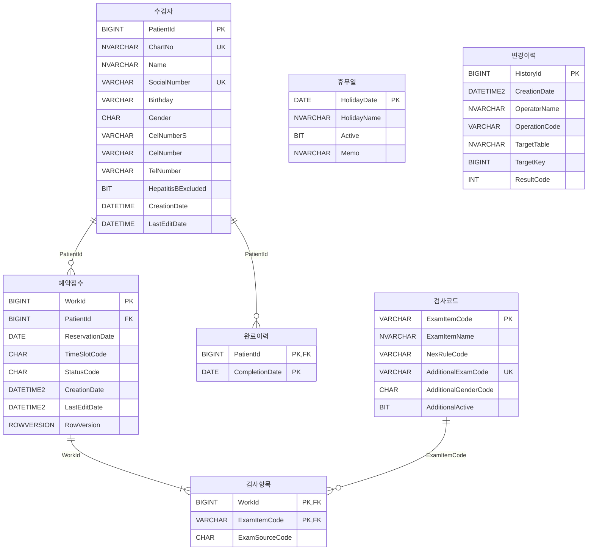

# 검진 예약·접수 관리 프로그램 — DB 설계서 R3 재설계 초안

- **문서명:** `04_DB_Design_R3_DRAFT.md`
- **상태:** `DRAFT` — 기준선이 아니다. `docs/baseline/04_DB_Design.md` 를 대체하지 않는다
- **초안 버전:** d0.3 (`d0.2` 작성 → 미결 8건 2차 grilling → 실측 반영)
- **작성일:** 2026-09-04
- **대체 대상:** `docs/baseline/04_DB_Design.md` v1.1 (`HC-RSV-RCP-20260903-R2`)
- **제안 기준선 ID:** `HC-RSV-RCP-20260904-R3` (§14 에서 확정)
- **선행 세션:** `database-38`(설계 grilling 6라운드) → `database-63`(d0.1 + 적대적 검토 5인)
- **입력:** `docs/phase4/04_DB_Design_R3_DRAFT_REVIEW.md` — 결함 전건
- **인계문서:** `database/docs/prompts/2026-09-04-session-04-Phase4-R3-Draft-d0.2.md`

---

# 0. d0.1 → d0.2 에서 바뀐 것

d0.1 은 적대적 검토를 통과하지 못했다. 검토자 5인이 부여한 ID 전건을 반영했고, 그중 **설계를 되돌린 것이 둘**이다. 대조표는 §15 에 있다.

| # | d0.1 | d0.2 | 근거 |
|---:|---|---|---|
| 1 | 물리 테이블 **6개** — `완료이력`을 `수검자.LastCheckupDate` 컬럼으로 흡수 | 물리 테이블 **7개** — `완료이력` **존치**. `수검자` 는 17컬럼 | **A4.** 컬럼 하나로는 `CompletionDate < ReservationDate` 필터 뒤의 `MAX()` 를 표현할 수 없다. 반례 실증 |
| 2 | 상태 **5값** — `RSV`·`RCP`·`FIN`·`CNR`·`CNC` | 상태 **4값** — `RSV`·`RCP`·`CNR`·`CNC`. `FIN` **제거** | **A5.** `00` §8.2 가 *"실제 검사 수행/진행 상태"* 를 범위에서 제외한다. `검진완료` 분류는 상태값이 아니라 `완료이력` 조인으로 얻는다 |
| 3 | `00`·`01`·`02` 를 열지 않는다고 전제 | `00`·`01`·`02` 개정안을 **§3 에 문장으로** 쓴다 | **A1~A3.** 개봉은 2026-09-04 승인됨. d0.1 은 개정문이 없었다 |
| 4 | `V08` 정규식을 한글까지 넓힌다 | `V08` 을 **절 한정 + 백틱 한정**으로 다시 센다 | **C1·C2.** 넓히는 안은 한국어 조사를 이름에 흡수하고 R2 에서 회귀시킨다 |
| 5 | `변경이력` 기록 3지점(트랜잭션 안 2 · 밖 1) | **항상 트랜잭션 밖 · 자체 `TRY/CATCH` · 해당 RS `SELECT` 뒤** | **B1.** d0.1 안은 `06` §21.1 제어흐름에서 7가지로 깨진다 |
| 6 | CHECK 22 · DEFAULT 8 · FK 3 · 컬럼 46 | CHECK **23** · DEFAULT 8 · FK **4** · 컬럼 **47** | ①②와 **B5**(`TargetKey` 정합 CHECK 신설) |

## 0.1 d0.2 → d0.3 — 미결 8건을 2차 grilling 으로 닫았다

**초안 단계의 미결이 0건이 됐다.** 상세는 §17.4, 실측 근거는 각 절에 있다.

| 미결 | d0.2 | d0.3 |
|---|---|---|
| `02` 편집 수단 | 3안 나열 · 시트 2~5·7 미판독 | **전 시트 판독 → in-place 치환 확정.** 행 삽입·삭제 0 · 표 ref 변경 0 — §14.4 |
| `02` 재생성 조율 | 세션 간 조율 필요 | **순서 합의.** 우리가 먼저, `a97cfb9f` 가 나중에 — §14.4 |
| Test ID 자리 | *"새 Prefix 가 유리"* (근거가 틀림) | **기존 Prefix 새 대역.** §45.2 가 이미 대역 구조 — §13.3a |
| 컬럼명 게이트 | *"오탐 억제가 필요해 안 만들었다"* | **`V14` 설계 확정.** 1462건 오탐 0 · RED 로 `[IsActive]` 포획 — §13.4d |
| 한글 식별자 실측 | 미재현 표기 | **`ZZ` scratch 로 전건 재현.** 원상복구 확인 — §4.5.1 |
| E3 `Msg 468` | 정적 판정 불가 | **종결.** 발생하지 않음 — §13.7b |
| Test ID 234건 재편성 | 미분석 | **소멸.** 재편성이 아니라 대역 추가 |
| `03` 조작자 표시 | *"새 footer"* | **기존 상태영역에 항목 1개** (`03`:67·:91) — §13.5 |

`[!]` **d0.3 이 잡은 초안 자신의 오류가 하나 더 있다** — §13.3a 의 Test ID 밀림 주장. 같은 절이 *"뒤를 당기지 말고"* 라고 적고 있었는데 반대로 읽었다.

---

# 1. 이 문서의 지위

## 1.1 초안인 이유 — 기준선에 바로 쓰면 게이트가 깨진다

| 게이트 | `04` 를 먼저 바꾸면 | 근거 |
|---|---|---|
| `scripts/verify-baseline.sh` | `=== 5/6 ===` exit 1 | 6개 파일 SHA-256 을 스크립트 안에 하드코딩해 대조한다 |
| `tools/verify-docs.js` `V08` | FAIL | `04` 에서 `CK_`·`DF_` 이름을 세어 스펙·계획의 수치와 대조한다 |
| `tools/verify-docs.js` `V11` | FAIL **578건** | `fdfb8e6` 이 Table 축을 구현했다. `04` 를 한글 테이블명으로 바꾸는 순간 계획 9개의 R2 이름이 전부 미정의 참조가 된다 |

따라서 이 문서는 `docs/phase4/` 바로 아래에 둔다. `verify-docs.js` 는 `docs/phase4/plans/` 와 `06_*_CANDIDATE.md` 와 `docs/baseline/04_DB_Design.md` 만 읽으므로 이 파일은 검사 대상이 아니다.

`V11` 결합이 최소 원자 단위를 키웠다 — `04` 와 `plans/**` 를 더는 따로 옮길 수 없다. 세션 분할 기준은 검토서 §9.1 에 있다.

## 1.2 이 초안이 확정하는 것과 하지 않는 것

```text
확정한다
  테이블 7개 · 전체 컬럼·타입·NULL
  PK / FK / UQ / UX / CK / DF / NCI / Sequence 의 이름과 정의
  상태 CHAR(3) 4값
  변경이력 DDL 과 기록 규칙
  명명규칙
  기준선 ID · 기준일 · tag
  00 · 01 · 02 개정안 문장 (§3)

확정하지 않는다 (하위 문서의 일)
  SP 본문 SQL · Transaction · 잠금
  Seed / Test Fixture 값
  Test ID 카탈로그 234건의 재편성
  02 의 시트 2~5·7 편집 범위 — 진행안 2단계
  C# 호출계약
```

---

# 2. R3 개편 요지

| 항목 | R2 | R3 |
|---|---:|---:|
| 물리 테이블 | 7 | **7** |
| 전체 컬럼 | 55 | **47** |
| `수검자` 컬럼 | 29 | **17** |
| Primary Key | 7 | **7** |
| Foreign Key | 6 | **4** |
| Unique Constraint | 2 | 2 |
| Filtered Unique Index | 1 | 1 |
| 업무/조회 Nonclustered Index | 5 | 5 |
| CHECK | 22 | **23** |
| DEFAULT | 14 | **8** |
| Sequence | 1 | 1 |
| Trigger | 0 | 0 |
| 업무상태 값 수 | 3 | **4** |
| 외부 호출 SP | 15 | 15 |
| 내부 Inline TVF | 4 | 4 |

세 가지가 R3 의 전부다.

```text
① 테이블 5개를 한글 이름으로 바꾸고 제외정보 1개를 컬럼으로 흡수한다
② 취소 상태를 취소 시점에 따라 둘로 나눈다 — CNL → CNR / CNC
③ 변경이력 테이블을 신설하고 Write SP 가 명시적으로 기록한다
```

`[!]` **테이블 수가 R2 와 같은 7 인 것은 우연이 아니라 상쇄다.** `제외정보` 1개가 사라지고 `변경이력` 1개가 생겼다. `SCH-001`(Table 7)·`SCH-004`(PK 7)·`G04`·`RBD-004` 의 `Table 7` 표기는 R3 에서도 유효하지만, `SCH-002`(이름 집합 `EXCEPT` 양방향)는 **7개 이름이 하나도 남김없이 바뀐다.** 개수가 같다고 무변경으로 오인하면 `SCH-002` 가 차집합 7 로 FAIL 한다.

---

# 3. 상위 기준선 개정안 — 계층 A

> 검토서 §1 의 해소. **개봉은 2026-09-04 사용자 승인됨. 이 장이 그 개정문이다.**

`00`:11 은 후속 Phase 가 *"본 문서의 업무 의미·범위·수치·상태전이를 변경"* 하는 것을 금지하고, `01`:11 은 *"신규 업무분기나 역방향 상태전이"* 추가를 금지한다. R3 는 그 두 조항을 **개봉하여** 진행한다. 개봉 범위를 아래 다섯 항목으로 한정하고, 각각 현행 문장과 개정 문장을 짝지어 적는다.

## 3.1 A1 — `00` CP-06 개정 (`변경이력` 신설의 근거)

**현행** `00_Project_Policy.md`:49

```text
| CP-06 | 변경 이력 | 일반 변경의 상세 이력은 별도 History로 관리하지 않는다.
                     현재 유효 데이터와 생성·최종수정시각만 관리한다. |
```

**개정안**

```text
| CP-06 | 변경 이력 | 컬럼 단위 변경 상세와 상태전이 이력은 별도 History로 관리하지 않는다.
                     현재 유효 데이터와 생성·최종수정시각을 관리하고, 이에 더해
                     Write Stored Procedure 호출 중 업무 결과가 확정된 것마다 1행의
                     업무 단위 조작기록(시각·조작자·업무코드·대상 테이블·대상 키·
                     ResultCode)을 남긴다. 결과코드가 없는 호출(잠금 실패, 예상하지
                     못한 오류)은 기록하지 않는다. 조작기록은 업무 데이터의 이전값·
                     이후값을 담지 않으며 복원의 근거로 사용하지 않는다. |
```

`[!]` **`1회 호출당 1행` 이 아니라 `업무 결과가 확정된 호출마다 1행` 이다.** §6.5 가 applock 실패와 `CATCH` 를 무기록으로 정했으므로 전자로 쓰면 `00` 개정문이 `04` 설계와 **정면으로 모순**한다. 상위 문장이 하위가 지키지 못할 것을 약속하면 안 된다.

### 전면 허용이 아니라 "업무 단위 1행"으로 좁히는 이유

| 안 | 판정 |
|---|---|
| **업무 단위 1행 한정** | **채택** — 열리는 것이 정확히 `변경이력` 테이블 1개다. 컬럼 단위 EAV 와 상태전이 History 는 여전히 금지로 남아 `04` §1.4·§1.7 의 나머지 절반이 그대로 산다 |
| 전면 허용(*"History 로 관리할 수 있다"*) | 기각 — `04` §1.7 이 금지한 *"예약·접수 상태변경 History"* 까지 함께 열린다. 다음 세션이 상태전이 테이블을 추가해도 정책상 막을 근거가 없어진다 |
| 개정하지 않고 `변경이력` 을 R3 에서 제거 | 기각하지 않는다 — 유효한 대안이다. 다만 사용자가 2026-09-04 에 `@OperatorName` 파라미터 추가까지 승인했으므로 `변경이력` 존치를 전제로 진행한다 |

`[!]` **개정 문장이 "이전값·이후값을 담지 않는다" 를 명시하는 것이 핵심이다.** 이 한 줄이 없으면 `CP-06` 은 사실상 무제한 감사 테이블을 허용하게 되고, `04` §1.8 의 관리 단순화 원칙과 충돌한다.

### `02` 파급

`02_Function_Definition.xlsx` 시트 6 `DB추적` 의 `S6:5`(`F-PAT-003` 수검자 정보 수정)가 Policy 열에 **`CP-06`** 을 달고 있다. `CP-06` 의 의미가 바뀌므로 그 행의 해석이 바뀐다. 참조 테이블 열에 `변경이력` 을 추가할지는 **진행안 2단계(`02` 판독)에서 확정한다** — 이 초안은 파급 사실만 등재한다.

## 3.2 A2 — `00`·`01` 상태 모델 개정 (`CNL` → `CNR`/`CNC`)

`CNL` 하나를 둘로 나누는 것만으로 `00`·`01` 이 열린다. `FIN` 때문이 아니다(§3.5 에서 `FIN` 은 제거했다).

### 3.2.1 `00`:33 용어표

**현행** — 1행

```text
| **CNL** | Cancelled | 취소 상태 코드 |
```

**개정안** — 2행

```text
| **CNR** | Cancelled - Reservation | 예약취소 상태 코드 |
| **CNC** | Cancelled - Reception   | 접수취소 상태 코드 |
```

### 3.2.2 `00` CP-05 · RP-03 · RP-10 · RCP-06 · TGT-02

| ID | 현행 | 개정안 |
|---|---|---|
| **CP-05** `00`:48 | 취소 시 물리 삭제하지 않고 동일 데이터 행을 `취소(CNL)` 상태로 변경한다 | 취소 시 물리 삭제하지 않고 동일 데이터 행을 취소 상태로 변경한다. **취소 상태는 취소 시점에 따라 `예약취소(CNR)` 와 `접수취소(CNC)` 로 구분한다.** 이후 문장(내역 조회 유지·복원 불가·재진행은 신규예약)은 두 값에 동일하게 적용한다 |
| **RP-03** `00`:123 | `예약(RSV)`과 `접수완료(RCP)`는 각각 1건으로 산정하고 `취소(CNL)`는 제외한다 | … 각각 1건으로 산정하고 **`취소(CNR·CNC)`는 제외한다** |
| **RP-10** `00`:130 | 동일 업무 행을 `취소(CNL)`로 변경하고 CP-05를 적용한다 | 동일 업무 행을 **`예약취소(CNR)`** 로 변경하고 CP-05를 적용한다 |
| **RCP-06** `00`:157 | `접수완료(RCP)`를 취소하면 동일 업무 행을 `취소(CNL)`로 변경한다 | `접수완료(RCP)`를 취소하면 동일 업무 행을 **`접수취소(CNC)`** 로 변경한다 |
| **TGT-02** `00`:194 | 현재 예약·접수 업무의 RSV/RCP/CNL 상태는 완료이력으로 사용하지 않는다 | 현재 예약·접수 업무의 상태(**RSV/RCP/CNR/CNC**)는 완료이력으로 사용하지 않는다 |

`[i]` **RP-06(중복예약)은 개정하지 않는다.** `00`:126 은 *"상태가 `예약(RSV)` 또는 `접수완료(RCP)`인 업무"* 라는 **포함 열거식**이라 새 취소값이 자동으로 제외된다. 검토서 A2 표가 RP-06 을 넣지 않은 것과 일치하며, `FIN` 을 제거했으므로 A5 쪽에서도 손댈 것이 없다.

### 3.2.3 `00` §6 상태 해석

**개정안** — 전이도

```text
예약(RSV)
 ├─ 예약 변경 ─────────────→ 예약(RSV)
 ├─ 예약 취소 ─────────────→ 예약취소(CNR)
 └─ 접수 ─────────────────→ 접수완료(RCP)
                                │
                                ├─ AEX 변경 → 접수완료(RCP)
                                └─ 접수 취소 → 접수취소(CNC)

예약취소(CNR) · 접수취소(CNC)
 └─ 기존 건 복원 불가
    재진행은 신규 예약
```

**개정안** — Action Matrix (3행 → 4행)

| 상태 | 정원 산정 | 예약변경 | 예약취소 | 접수 | 접수완료 AEX 변경 | 접수취소 |
|---|:---:|:---:|:---:|:---:|:---:|:---:|
| 예약(RSV) | 1 | O | O | 조건부 O | X | X |
| 접수완료(RCP) | 1 | X | X | X | O | O |
| 예약취소(CNR) | 0 | X | X | X | X | X |
| 접수취소(CNC) | 0 | X | X | X | X | X |

말미의 *"허용되지 않은 역방향·순환 상태전이는 구현하지 않는다"* 는 그대로 둔다.

### 3.2.4 `01_Process_Definition.md` — 11곳

| 위치 | 현행 | 개정안 |
|---|---|---|
| :557 | RSV/RCP/CNL을 모두 조회할 수 있다 | RSV/RCP/**CNR/CNC**를 모두 조회할 수 있다 |
| :649 | `S8[동일 업무 행을 CNL로 변경]` — 예약취소 흐름 | `S8[동일 업무 행을 **CNR**로 변경]` |
| :761 | 수검자의 당일 CNL 제외 업무 조회 | 수검자의 당일 **취소(CNR·CNC)** 제외 업무 조회 |
| :793 | CNL은 접수 대상으로 사용하지 않는다 | **CNR·CNC는** 접수 대상으로 사용하지 않는다 |
| :899 | `S8[동일 업무 행을 CNL로 변경]` — 접수취소 흐름 | `S8[동일 업무 행을 **CNC**로 변경]` |
| :961 | CNL은 예약변경·접수·복원 대상으로 사용하지 않는다 | **CNR·CNC는** 예약변경·접수·복원 대상으로 사용하지 않는다 |
| :967 | UI에서 RCP/CNL Action을 비활성화한다 | UI에서 RCP/**CNR/CNC** Action을 비활성화한다 |
| :976-979 §7 전이 | `RSV → CNL : 예약취소` / `RCP → CNL : 접수취소` / `CNL → * : 허용하지 않음` | `RSV → CNR : 예약취소` / `RCP → CNC : 접수취소` / `CNR → * : 허용하지 않음` / `CNC → * : 허용하지 않음` (3줄 → 4줄) |
| :1041 최종확정 #9 | 예약과 접수는 동일 업무 행의 RSV/RCP/CNL 상태전이다 | … 동일 업무 행의 **RSV/RCP/CNR/CNC** 상태전이다 |

`[!]` :649 와 :899 는 문자열이 **완전히 같다**(`S8[동일 업무 행을 CNL로 변경]`). 일괄 치환하면 둘 다 같은 값이 된다. 앞이 예약취소 흐름(`CNR`), 뒤가 접수취소 흐름(`CNC`)이다 — 반드시 행 단위로 확인하고 바꾼다.

### 3.2.5 `01`:11 변경 통제 조항

`01`:11 의 *"신규 업무분기나 역방향 상태전이를 추가하지 않는다"* 는 **그대로 둔다.** `CNL` → `CNR`/`CNC` 분리는 새 분기가 아니라 **기존 분기(예약취소 / 접수취소) 두 개가 이미 별개였는데 결과값만 같았던 것을 값에서도 구분한 것**이다. `01` §7 의 전이 개수가 5 → 5 로 유지되는 것이 그 증거다(`CNL → *` 한 줄이 두 줄로 늘어난 것은 종결 상태가 둘이기 때문이며 전이가 늘어난 것이 아니다).

## 3.3 A3 — `00`·`01` 의 물리 식별자 4곳

| 위치 | 현행 | 개정안 |
|---|---|---|
| `00`:70 EP-02 | `INFO_PATIENTS.PatientId`를 시스템 내부 수검자 식별자로 사용한다 | **`수검자.PatientId`** 를 … |
| `00`:87 §2.1 | DB에는 `-`를 제거한 숫자 13자리 테스트 값을 `INFO_PATIENTS.SocialNumber`에 저장한다 | … **`수검자.SocialNumber`** 에 저장한다 |
| `01`:189 | 주민등록번호·차트번호 고유성은 저장 Transaction에서 최종 재검증하고 `INFO_PATIENTS` 한 행으로 저장한다 | … **`수검자`** 한 행으로 저장한다 |
| `01`:426 | 저장은 `INFO_CHECKUP_WORKS` 1행과 `INFO_CHECKUP_WORK_EXAMS`를 같은 Transaction으로 처리한다 | 저장은 **`예약접수`** 1행과 **`검사항목`** 을 같은 Transaction으로 처리한다 |

### 대응표 안을 기각한다

| 안 | 판정 |
|---|---|
| **4곳을 새 이름으로 직접 교체** | **채택** — `00`·`01` 은 A1·A2 로 이미 열린다. 같은 개봉 안에서 4곳을 고치는 비용이 대응표를 영구히 유지하는 비용보다 작다 |
| `00`·`01` 을 원문 그대로 두고 `04` 에 R2↔R3 대응표를 둔다 | 기각 — ① 최상위 계약의 저장 대상이 R3 스키마에 **존재하지 않는 이름**으로 남는다 ② 두 이름이 동시에 살아 있어 `V11` 같은 기계 대조가 어느 쪽을 정답으로 볼지 정하지 못한다 ③ 조용한 재해석은 이 프로젝트가 금지한 방식이다 |

`[!]` **`02` 파급이 가장 크다.** 시트 6 `DB추적` 16행이 물리 테이블을 직접 지정하고 전 시트 합계 **35곳**이다. 진행안 2단계에서 전수 확정한다.

## 3.4 A4 — `완료이력` 을 존치한다 (테이블 7개)

`[승인]` **2026-09-04 사용자 확정** — 대안(`00` TGT-04 개정으로 판정 변화를 계약 수용, 테이블 6개)을 수치와 함께 제시한 뒤 **존치**를 선택했다.

### 결정

`HIS_GENERAL_CHECKUP_COMPLETIONS` → **`완료이력`** 으로 이름만 바꾸고 구조를 유지한다. d0.1 의 `수검자.LastCheckupDate` 흡수안은 **철회한다.**

### 근거 — 컬럼 하나는 "필터 뒤의 MAX" 를 표현할 수 없다

`05`:634 는 완료이력 범위를 **집합에 대한 필터**로 정의하고, `04`:1136 은 그 필터가 남긴 집합에 `ORDER BY CompletionDate DESC` 최신 1건을 적용한다.

```text
완료이력 {2025-06-01, 2026-11-01},  예약일 2026-09-10

R2  CompletionDate < 2026-09-10 필터 → {2025-06-01} → MAX=2025
    2026 - 2025 = 1 < 2 → 401 NotDue

d0.1  LastCheckupDate = 2026-11-01 이 필터에 걸린다
      → "이력 없음" → 최초검진 대상 → Eligible        ← 판정이 뒤집힌다
```

컬럼 하나는 필터 **전**의 값 하나만 들고 있으므로 *"필터에 걸린 값을 버리고 다음 값으로 내려간다"* 를 구조적으로 표현할 수 없다. 필터를 아예 없애도 마찬가지다 — `{2020-01-01, 2026-11-01}` / 예약일 `2026-09-10` 에서 R2 는 `Eligible`, 무필터 단일컬럼은 `401 NotDue` 가 된다. **어느 쪽으로 가도 판정이 바뀐다.**

### d0.1 의 흡수 논거 2개가 성립하지 않는 이유

| d0.1 논거 | 반박 |
|---|---|
| *"Fixture 4행이 전부 다른 수검자라 복수 이력은 시험된 적이 없다"* | **시험 커버리지의 공백**을 규칙의 부재로 바꿔치기했다. 공백은 채워야 할 결함이지 삭제 근거가 아니다 |
| *"`03` §8.7 이 단일 값만 표시한다"* | **표시값의 개수**를 **입력집합의 크기**로 오독했다. `03`:600 은 집합에 대한 계산 *결과*이며 저장 카디널리티에 대해 아무 말도 하지 않는다 |

흡수의 유일한 이득이었던 *"TGT 판정 조인 1→0회"* 는 4행짜리 Seed/Test 테이블에 대한 미세 최적화다. 최상위 업무 판정을 바꿀 값이 아니다.

### `00` 개정 범위

```text
TGT-01  무변경
TGT-02  §3.2.2 의 상태값 열거만 바뀐다 (RSV/RCP/CNL → RSV/RCP/CNR/CNC)
TGT-03  무변경
TGT-04  무변경          ← d0.1 이 열려고 했던 조항. 존치로 닫힌다
TGT-05  무변경
판정식(00:202-208)  무변경
```

### 되돌아가는 것

| 항목 | d0.1 | d0.2 |
|---|---:|---:|
| 물리 테이블 | 6 | **7** |
| `수검자` 컬럼 | 18 | **17** (`LastCheckupDate` 삭제) |
| 전체 컬럼 | 46 | **47** |
| Foreign Key | 3 | **4** (`FK_완료이력_수검자` 부활) |
| Primary Key | 6 | **7** |

`[!]` **검토서 B4 가 이 결정으로 소멸한다.** B4 는 *"`수검자.LastCheckupDate` 동명이 예약일 이전 필터를 조용히 없앤다"* 였는데, 컬럼이 존재하지 않으므로 `05` §6.2.2 TVF 의 반환 컬럼 `LastCheckupDate` 는 **R2 와 완전히 동일하게** `완료이력` 에서 필터를 거쳐 계산된 값이다. 계약도 구현도 무변경이다.

## 3.5 A5 — `FIN` 을 제거한다 (상태 4값)

`[승인]` **2026-09-04 사용자 확정** — 대안(`FIN` 유지 + `00` RP-03·RP-06·TGT-02 개정)을 함께 제시한 뒤 **제거**를 선택했다.

### 결정

`StatusCode CHAR(3)` 의 허용값은 **`RSV`·`RCP`·`CNR`·`CNC` 4값**이다. `FIN` 을 두지 않는다.

### 근거

| # | 근거 |
|---:|---|
| 1 | **`00` §8.2 :300 이 *"실제 검사 수행/진행 상태"* 를 구현 범위에서 명시적으로 제외한다.** `검진완료` 는 정확히 그것이다. `RCP`(접수완료)와 `FIN` 을 가르는 유일한 사실이 *"검사를 실제로 수행했는가"* 이므로 이 경계를 피해 갈 방법이 없다 |
| 2 | **`01`:11 이 신규 업무분기 추가를 금지한다.** `RCP → FIN` 은 `00` §6 전이도에도 `01` §7 전이표에도 없는 **새 분기**다. §3.2.5 에서 `CNR`/`CNC` 분리를 *"기존 분기의 값 구분"* 이라고 방어할 수 있었던 논리가 `FIN` 에는 적용되지 않는다 |
| 3 | **`00` 의 세 열거식이 `FIN` 에 침묵한다.** RP-03(정원)·RP-06(중복)·TGT-02(완료이력 원천) 각각에 위치를 정해야 하고, 정하지 않으면 슬롯의 `RCP` 20행을 `FIN` 처리해 같은 슬롯에 20건이 더 들어간다 — **하루 40명** |
| 4 | **유일한 도달 경로가 계약을 전부 우회한다.** SSMS 직접 `UPDATE` 는 `00` §9-9(*"데이터 변경의 최종 권한은 SP/Transaction"*) · `04` §1.3 · `06` §32(Table 권한 0)를 동시에 우회한다. 허용 전이 검증이 없어 `CNR → FIN` 도 만들 수 있고 `변경이력` 에도 남지 않는다 |
| 5 | **정식 전이 SP 를 만들면 연쇄가 커진다.** SP 가 16개가 되어 `05` §19.2 의 *"15개 Stored Procedure 이름과 수"* 가 열리고, `01`·`02` 의 기능정의까지 파급된다 |
| 6 | **`완료의 원천이 둘`이 되는 문제가 사라진다.** `FIN` Work 가 있으면서 완료이력이 없는 상태와 그 반대가 둘 다 제약을 통과하는데, 둘을 함께 갱신하는 SP·제약·규칙이 없었다 |

### `FIN` 이 하려던 일의 대체 — 상태값이 아니라 조인

d0.1 이 `FIN` 을 둔 목적은 *"조회·통계 분류를 시험하는 용도"* 였다. **§3.4 에서 `완료이력` 을 존치했으므로 그 분류는 조인으로 나온다.**

```sql
-- 검진을 실제로 마친 업무
SELECT w.WorkId, w.PatientId, w.ReservationDate, w.TimeSlotCode
FROM   dbo.예약접수 AS w
JOIN   dbo.완료이력 AS h
       ON  h.PatientId      = w.PatientId
       AND h.CompletionDate = w.ReservationDate
WHERE  w.StatusCode = 'RCP';
```

| 성질 | 값 |
|---|---|
| 조회경로 | `완료이력` PK `(PatientId, CompletionDate)` **seek** — 별도 Index 불필요 |
| 완료의 원천 | **하나.** 이 조인이 읽는 행이 TGT 판정이 읽는 바로 그 행이다 |
| 새로 여는 계약 | **없음.** 새 상태값 0 · 새 SP 0 · `00` 개정 0 |
| 실행 주체 | SSMS 의 사람. 전용 SP 를 만들지 않는다 — `00` §8.2 가 *"통계 Dashboard"* 를 범위 밖에 두었다 |
| 값의 출처 | Seed/Test 로 사람이 넣는다. `완료이력` 에 쓰는 SP 는 R2 에도 R3 에도 **없다** |

`[!]` **보증이 아니라 분류다.** 정직하게 적는다.

| 성립 조건 | 성질 |
|---|---|
| `CompletionDate = ReservationDate` | RCP-02(*"예약일과 실제 접수일이 동일한 경우만 접수할 수 있다"*)에 기대는 **가정**이다. 검진을 접수 당일 수행한다는 것은 `00` §8.2 가 범위 밖에 둔 사실이므로 계약이 아니다 |
| 두 테이블의 연결 | 선언된 참조가 아니라 **값 일치**다. `완료이력` 행이 `예약접수` 행 없이 존재할 수 있고 그 반대도 가능하다 |
| `FIN` 대비 손해 | 없다. `FIN` 도 SSMS 직접 `UPDATE` 로만 도달했으므로 사람이 넣는 수고는 같다 |
| `FIN` 대비 이득 | **TGT 가 그 완료를 실제로 본다.** `FIN` 로 표시한 완료는 `완료이력` 행이 없어 2년 판정에 잡히지 않았다 — 원천이 둘이던 문제의 실체가 이것이다 |

`[!]` **두 결정이 서로를 지탱한다.** `완료이력` 을 흡수했다면 이 조인이 성립하지 않아 `FIN` 을 대체할 것이 없었다. A4 존치가 A5 제거를 가능하게 한다.

### 열리지 않는 것

```text
00 RP-03 (정원 산정 대상)        FIN 이 없으므로 개정 대상이 아니다
00 RP-06 (중복판단 유효예약)      포함 열거식이라 애초에 손댈 것이 없다
00 §8.2  (구현 범위 제외)         '실제 검사 수행/진행 상태' 가 그대로 산다
05 §19.2 (15개 SP 이름과 수)      전이 SP 를 만들지 않는다
04 §1.3 / 06 §32                 Table 직접 DML 경로가 생기지 않는다
```

---

# 4. 확정된 설계 결정과 근거

선행 세션 `database-38` 이 grilling 6라운드로 확정하고, `database-63` 의 적대적 검토가 둘을 되돌렸다(§0). 이 장은 근거를 보존하기 위해 옮겨 적는다.

## 4.1 테이블 7개

| 신규명 | R2 원본 | 확정 근거 |
|---|---|---|
| `수검자` | `INFO_PATIENTS` | `00` 정책 EP-01~10 · `03` "수검자 관리 Tab"(`03` §5, WF-PAT-01) · SP 5개가 전부 `수검자` |
| `예약접수` | `INFO_CHECKUP_WORKS` | SP `USP_HC_SELECT_예약접수목록`·`_예약접수상세` · 프로그램 표시명 "검진 예약·접수 관리" |
| `검사항목` | `INFO_CHECKUP_WORK_EXAMS` | `05` RS2~RS5 의 "국가검사항목 / 추가검사항목". `05` §8.2 RS2 가 *"실제 저장된 `ExamSourceCode='NEX'` 만 반환한다"* 고 명시 |
| `검사코드` | `MST_EXAM_ITEMS` | `04` §4.6 제목 *"공통 검사코드 19종"* · `04` §4.2 *"검사코드와 NEX/AEX 역할의 단일 Seed 원천"* |
| `휴무일` | `MST_HOLIDAYS` | HOL-01~05 |
| `완료이력` | `HIS_GENERAL_CHECKUP_COMPLETIONS` | **존치**(§3.4). TGT-02·TGT-04 가 집합을 요구한다 |
| `변경이력` | **신설** | §5 |

### 삭제한 1개

| 삭제 | 이관처 | 확정 근거 |
|---|---|---|
| `INFO_PATIENT_EXAM_EXCLUSIONS` | `수검자.HepatitisBExcluded BIT` | `00`:232 NEX-03 의 문언이 *"B형간염 검사 제외대상이 아닌 경우. 제외정보가 없으면 `제외 아님`으로 판단"* 으로 **정확히 Boolean** 이다. Rule 의미가 보존된다. Seed 가 1행뿐이고 `'EX010'` 이 규칙 코드에 리터럴로 박혀 있어 범용성은 명목뿐이었다 |

**이 흡수가 잃는 것**(검토서 B10·B17)

| 잃는 것 | 판정 |
|---|---|
| R2 DDL 이 수용하던 **다른 `ExamItemCode` 의 제외행** | 수용. `00`·`01`·`05` 어디에도 다른 코드의 제외 요구가 없다. 필요해지면 그때 테이블로 되돌린다 |
| 제외행의 `Memo` 컬럼 | 수용. 읽는 계약이 0이다 |
| `FK_INFO_PATIENT_EXAM_EXCLUSIONS_EXAM_ITEM` | **정확히 짚는다.** 이 FK 는 *"제외행이 가리키는 코드가 실재한다"* 를 보증했을 뿐 *"`EX010` 이 존재한다"* 를 보증한 적이 없다. `EX010` 의 존재는 R2 에서도 R3 에서도 **`검사코드` 19행 Seed 검수(SED 계열)** 가 보증한다. 사라진 것은 제외행의 참조 무결성이고, 제외행 자체가 사라졌으므로 보증 대상이 없다 |

### 더 줄이지 않는 이유 — 이미 검토해 기각했다

- `검사항목`을 `예약접수`에 합치면 한 건이 8~17행으로 중복되어 **정원 COUNT 가 깨진다**(`04` §5.3 과 동일한 판단).
- `휴무일`은 수검자와 무관한 날짜 Master 라 어느 컬럼으로도 옮길 수 없다.
- `검사코드`는 19행 Seed 의 단일 원천이며 `검사항목`의 FK 부모다.
- `완료이력`은 §3.4 — 집합이라 컬럼이 될 수 없다.

## 4.2 `수검자` 17컬럼 (29 → 17)

### 삭제 13

| 컬럼 | 근거 |
|---|---|
| `PassportNumber` `InsuranceNumber` `IsStudent` `IsVIP` `IsReceiveCall` `IsReceiveSMS` `IsReceiveEmail` `IsReceivePost` `IsMarketingConsent` `MConsentDate` `MCancelDate` | `03` §5 컬럼표가 No 4·8·19~27 을 전부 **"UI 미사용"** 으로 열거한다. `05` 등장 0회 |
| `TelNumberS` | 검색 파라미터에도 Result Set 에도 없다 — **읽는 계약이 0**. `TEL_NORMALIZED`·`TEL_DIGIT` 두 CHECK 이 함께 사라진다 |
| `Active` | `05` 계약에 **0회** 등장. `03` No 18 도 "UI 미사용". EP-10 이 삭제 SP 를 금지하므로 영원히 `1` |

3인이 독립적으로 삭제 13컬럼의 `00`·`01`·`05` 등장 **0회**를 확인했다. 이 항목은 상위 정책에 저촉하지 않는다.

### 신설 1

| 컬럼 | 근거 |
|---|---|
| `HepatitisBExcluded BIT NOT NULL DEFAULT 0` | §4.5 에서 이름을 확정했다. `1` = 제외 |

`[!]` d0.1 의 신설 2번째 컬럼 `LastCheckupDate DATE NULL` 은 **§3.4 에서 철회했다.**

### 유지 판단

- `SocialNumber` 는 **`VARCHAR(13)` 평문 그대로**. `VARCHAR(128)` 로 넓히는 안은 얻는 것 없이 `SOCIAL_FORMAT` CHECK 만 무력화하므로 기각했다.
- `CelNumberS` 는 유지한다. `05` §7.2 의 `@MobilePhone` 이 *"`-` 제거 후 정확검색"* 이고 `04` §11.1 이 그 조회경로를 `CEL_NUMBER_S` Index 로 지정한다. `TelNumber` 에 대응하는 검색 파라미터는 **없다** — 이것이 `CelNumberS` 는 살고 `TelNumberS` 는 죽는 이유다. (실측: `05` 본문에 두 컬럼명 모두 0회 등장. 차이는 컬럼명이 아니라 검색 파라미터의 유무다)
- `TelNumber` 는 유지한다. `05` §7.2 RS1 의 `Phone` 컬럼 물리 출처다. 정규화 짝이 사라지므로 형식 제약이 남지 않는다 — 수용한다(읽는 계약이 표시 하나뿐이다).

## 4.3 상태 모델 — `CHAR(3)` 4값

| 값 | 의미 | `StatusName` |
|---|---|---|
| `RSV` | 예약 | 예약 |
| `RCP` | 접수완료 | 접수완료 |
| `CNR` | 예약취소 | 예약취소 |
| `CNC` | 접수취소 | 접수취소 |

`[!]` **`RCP` 의 `StatusName` 은 `접수완료` 다.** d0.1 §2.3 이 `접수` 로 조용히 줄였는데 `03`:978 · `plans/03`:385 · `00`:154-157 이 전부 `접수완료` 다(검토서 B6). 되돌렸다.

`StatusName NVARCHAR(10)` 에 4값이 전부 들어간다 — `예약`(2자) · `접수완료`·`예약취소`·`접수취소`(각 4자). `05` 의 타입 선언 3곳은 무변경이다.

### 4.3.1 4값이 기존 계약에 미치는 영향

| 항목 | 결정 |
|---|---|
| 정원(RP-03) | `RSV + RCP`. 술어는 `StatusCode IN ('RSV','RCP')` 로 **R2 와 문자 그대로 동일** |
| 중복 유효예약(RP-06) | `RSV`·`RCP` 만. 포함 열거식이라 무변경 |
| 취소 SP 수 | **늘지 않는다.** `UPDATE_예약취소`(RSV→`CNR`)와 `UPDATE_접수취소`(RCP→`CNC`)가 이미 별개 SP 다 |
| Workbench `@Status` 필터 | 4값 모두 허용. `05`:271·:955 의 허용값 목록이 바뀐다(§13.1) |
| 노쇼 | **도입하지 않는다** |
| 잠금 자원 정렬(`06`:1188) | `'CNL' < 'RCP' < 'RSV'` → **`'CNC' < 'CNR' < 'RCP' < 'RSV'`**. 결론(정렬순서 하나로 교착 회피)은 그대로 살지만 **논증문의 값 목록이 거짓이 되므로 함께 고친다** |

### 4.3.2 도메인 근거

HL7 FHIR `Appointment.status` 가 취소를 `cancelled` 하나로 두는 대신 `cancelationReason` 확장을 쓰는 것과 달리, 이 과제는 취소 시점(예약 단계 / 접수 단계)이 **서로 다른 SP 와 서로 다른 허용 전이**로 이미 갈라져 있다. 값으로 구분하는 편이 사유 컬럼을 새로 만드는 것보다 작다.

## 4.4 `변경이력` 의 확정 원칙

| 원칙 | 근거 |
|---|---|
| **Write SP 8개 내부에서 명시적으로 기록한다. 트리거를 쓰지 않는다** | `Trigger 0` 원칙(`04`·`05`·`06` 15곳)과 이미 배포된 `SCH-010` 이 그대로 산다 |
| 실측: AFTER 트리거는 바깥 `UPDATE` 의 `@@ROWCOUNT` 를 훼손하지 않지만(`SET NOCOUNT ON` 유무 무관), **트리거가 쓴 로그 행은 `ROLLBACK` 과 함께 사라진다** | 실패한 시도를 트리거로 남기는 것은 **구조적으로 불가능**하다 |
| 업무 단위 **1행** — 시각·조작자·업무·대상 키·`ResultCode` | 컬럼 단위 EAV 가 아니다. `00` CP-06 개정문(§3.1)이 이 범위를 못박는다 |
| **성공 + 업무실패 둘 다 기록한다** | 실패는 `ROLLBACK` 되므로 **Transaction 밖**에서 써야 살아남는다 |
| 조작자는 `@OperatorName NVARCHAR(50)` 자유 문자열 | 직원 Master 를 만들면 테이블이 8개가 되고 `04` §4.1·§10.1·§15.4 가 전부 재작성된다 |
| clean-create 로 **매 배포 초기화** | `Rebuild.sql` 이 DB 를 통째로 DROP 하므로 "보존"은 deploy 경로에서만 성립하는 반쪽 보장이다. 반쪽 보장을 문서에 적지 않는다 |
| `RBD-005`(2회 rebuild 덤프 `diff`) 비교 대상에서 **제외하지 않는다** | **d0.1 을 철회한다.** Rebuild 는 DB 를 DROP 후 재배포하므로 그 시점 `변경이력` 은 **0행**이다. *"로그 행의 시각이 매번 달라 지문이 어긋난다"* 는 발화하지 않는다. 틀린 근거로 제외를 지시하면 객체 덤프에서까지 빠져 컬럼·CK·PK 변화를 못 잡는다(검토서 B14) |

## 4.5 명명 규칙 요약

| 대상 | 규칙 |
|---|---|
| 테이블 | 한글, 접두사 없음. 전부 2형태소 |
| 컬럼 | **영문 PascalCase 유지** — `05` §1.6 Result Set 이름과 1:1 이라 SP 본문에 별칭이 붙지 않는다 |
| 제약·인덱스 | §5 |
| SP / TVF / Sequence | **변경 없음** — 한글 SP 15개 + TVF 4개 + `SEQ_HC_CHART_NO` |
| 상태값 | `CHAR(3)` 영문 4값 |

### 4.5.1 한글 식별자 실측 — 재현 완료 (2026-09-04)

선행 세션 `database-38` 의 주장을 검토자 5인 중 아무도 재현하지 못했다(전원 SQL Server 접속 금지). **이 세션에서 `ZZ` 접두사 scratch 로 재현했다.**

| 측정 | 결과 |
|---|---|
| 대괄호 없는 한글 `CREATE TABLE` / `CONSTRAINT` / `INDEX` | **통과.** `SET PARSEONLY ON` 파서 수용 확인 후 실제 생성까지 |
| `sys.tables.name` 왕복 | **온전.** `ZZ수검자` `LEN=5`, `ZZ예약접수`·`ZZ검사코드` `LEN=6` — 한글이 1문자로 저장된다 |
| `sys.check_constraints` | `CK_ZZ수검자_CHART_NO_NOT_BLANK` · `CK_ZZ예약접수_STATUS` |
| `sys.default_constraints` | `DF_ZZ수검자_HEPATITIS_B_EXCLUDED` |
| `sys.indexes` | 6개. `UX_ZZ검사코드_AEX_CODE` 가 `is_unique=1 has_filter=1` — **필터형 인덱스가 한글 이름으로 정상 생성** |
| `sys.foreign_keys` | `FK_ZZ예약접수_ZZ수검자` |
| `EXCEPT` 양방향 (`SYSNAME` 테이블변수 ↔ `sys.tables.name`, `COLLATE` 없음) | **`0 / 0`** — `SCH-002` 와 같은 형상 |
| 필터형 인덱스 보유 테이블의 `INSERT`/`UPDATE`/`DELETE` | `SET QUOTED_IDENTIFIER ON` 하에 **`Msg 1934` 없음** |
| `CK_ZZ예약접수_STATUS` 가 `CNR`·`CNC` 수용 / `CNL` 거부 | 수용 O · 거부 **`Msg 547`** |
| 정리 | `ZZ` 잔존 **0**. 사용자테이블 7 · PK 7 · FK 6 · CHECK 22 · DF 14 로 R2 기준선 복귀 확인 |

`[!]` **`DATABASEPROPERTYEX('…','Collation')` 이 `NULL` 을 돌려준다** — Express 가 `model` 에서 `AUTO_CLOSE ON` 을 상속해 DB 가 닫혀 있기 때문이다. 서버·`master` 는 둘 다 `Korean_Wansung_CI_AS` 다. **이 값을 diff 기준으로 쓰면 안 된다.**

---

# 5. 제약·인덱스 명명규칙 — 확정

> 검토서 B3 의 해소. d0.1 §3.1 은 §6 이름 11개를 만들지 못했고 §3.2 의 *"테이블 구간만 치환"* 은 FK 전부에서 거짓이었다.

## 5.1 규칙

```text
{PK|FK|UQ|UX|IX|CK|DF}_{한글테이블명}[_{본체}]
```

| 항목 | 규칙 |
|---|---|
| 접두사 | 영문 대문자. `04` §3.3 과 동일 |
| 테이블명 자리 | **한글**. 여기가 한글이 오는 **유일한 자리**다 |
| **본체 — R2 승계가 원칙** | R2 에 대응 제약이 있으면 **R2 의 본체를 문자 그대로 승계한다.** 컬럼명에서 새로 유도하지 않는다 |
| 본체 — 신규 객체 | R2 대응이 없는 객체(`변경이력` 3제약·1기본값, `수검자.HepatitisBExcluded` 기본값)에만 컬럼명을 영문 대문자 `SNAKE_CASE` 로 전개한다 |
| PK | 본체 없음. `PK_수검자` |
| **FK — 명시적 예외** | 본체가 **부모 한글테이블명**이다. FK 는 컬럼이 아니라 관계를 가리키므로 컬럼명 규칙도 R2 승계 규칙도 적용하지 않는다 |

## 5.2 왜 "R2 본체 승계" 인가 — d0.1 의 유도 규칙이 틀린 이유

d0.1 은 *"컬럼명을 SNAKE_CASE 로 전개한다(SocialNumber → SOCIAL_NUMBER)"* 를 규칙으로 삼았다. **같은 컬럼에 두 답이 나온다.**

| 컬럼 | d0.1 유도 규칙의 답 | R2 실제 이름의 본체 | 충돌 |
|---|---|---|---|
| `SocialNumber` (CHECK) | `SOCIAL_NUMBER` | `SOCIAL_FORMAT` | **불일치** |
| `SocialNumber` (UQ) | `SOCIAL_NUMBER` | `SOCIAL_NUMBER` | 일치 |
| `StatusCode` | `STATUS_CODE` | `STATUS` | **불일치** |
| `LastEditDate` (DF) | `LAST_EDIT_DATE` | `LAST_EDIT_DATE` | 일치 |
| `LastEditDate` (CHECK) | `LAST_EDIT_DATE` | `EDIT_DATE` | **불일치** |
| `TimeSlotCode` | `TIME_SLOT_CODE` | `TIME_SLOT` | **불일치** |
| `ExamSourceCode` | `EXAM_SOURCE_CODE` | `SOURCE` | **불일치** |

R2 본체는 컬럼명의 기계적 전개가 아니라 **술어의 의미 태그**다(`_FORMAT` `_NOT_BLANK` `_DIGIT` `_NORMALIZED` `_GROUP` `_ROLE_REQUIRED`). 유도 규칙을 세우면 R2 22개 CHECK 중 상당수가 다른 이름이 되고, `06` §12.5 와 `tests/01_Schema_Tests.sql` 의 기대값을 손으로 다시 써야 한다.

**승계 규칙에서는 테이블 구간만 치환하면 된다.**

```text
CK_INFO_PATIENTS_SOCIAL_FORMAT       →  CK_수검자_SOCIAL_FORMAT
CK_INFO_CHECKUP_WORKS_STATUS         →  CK_예약접수_STATUS
CK_INFO_CHECKUP_WORK_EXAMS_SOURCE    →  CK_검사항목_SOURCE
IX_INFO_CHECKUP_WORKS_SLOT           →  IX_예약접수_SLOT
DF_MST_EXAM_ITEMS_AEX_ACTIVE         →  DF_검사코드_AEX_ACTIVE
UX_MST_EXAM_ITEMS_AEX_CODE           →  UX_검사코드_AEX_CODE
```

## 5.3 FK 4개는 전부 예외다 — d0.1 의 "치환" 주장이 거짓인 지점

| R2 FK | 테이블 구간만 치환하면 | **실제 R3 이름** |
|---|---|---|
| `FK_INFO_CHECKUP_WORKS_PATIENT` | `FK_예약접수_PATIENT` | **`FK_예약접수_수검자`** |
| `FK_INFO_CHECKUP_WORK_EXAMS_WORK` | `FK_검사항목_WORK` | **`FK_검사항목_예약접수`** |
| `FK_INFO_CHECKUP_WORK_EXAMS_EXAM_ITEM` | `FK_검사항목_EXAM_ITEM` | **`FK_검사항목_검사코드`** |
| `FK_HIS_GENERAL_CHECKUP_COMPLETIONS_PATIENT` | `FK_완료이력_PATIENT` | **`FK_완료이력_수검자`** |

**FK 는 4/4 전부에서 본체가 함께 바뀐다.** 기계적 치환으로 옮길 수 없으므로 §13.4 의 치환 작업에서 FK 4개를 따로 처리한다.

## 5.4 대안을 기각한 이유

| 대안 | 판정 |
|---|---|
| 전체 한글(`CK_수검자_주민번호형식`) | 기각 — R2 대응이 끊겨 `06` §12.5 와 `tests/01_Schema_Tests.sql` 의 기대값 22+14 개를 전건 손으로 다시 써야 한다 |
| 컬럼명을 그대로(`CK_수검자_SocialNumber_FORMAT`) | 기각 — 대소문자 혼합 + 밑줄 형태가 생긴다. R2 어느 이름에도 없는 형태다 |
| FK 본체도 부모 컬럼명(`FK_예약접수_PATIENT_ID`) | 기각 — 관계를 컬럼으로 부르면 복합 FK 에서 즉시 무너진다. `04` §3.3 이 이미 부모 테이블을 가리키는 형태를 썼다 |

## 5.5 `HepatitisBExcluded` — B형간염 제외 컬럼 이름 확정

| 후보 | 판정 |
|---|---|
| **`HepatitisBExcluded`** | **채택** |
| `IsHepatitisBExcluded` | 기각 — R3 에 남는 `BIT` 는 이것과 `검사코드.AdditionalActive`·`휴무일.Active` 셋뿐이고 둘 다 `Is` 접두사가 없다. `Is` 를 쓰던 컬럼(`IsStudent` 등)은 전부 삭제됐으므로 되살릴 관례가 없다 |
| `ExcludeHepatitisB` | 기각 — 명령형으로 읽힌다. 저장하는 것은 명령이 아니라 상태다 |

R2 대응 제약이 없는 신규 객체이므로 §5.1 의 신규 규칙을 적용해 기본값 이름은 `DF_수검자_HEPATITIS_B_EXCLUDED` 다.

---

# 6. `변경이력` 설계 — 확정

## 6.1 컬럼

| No | 컬럼 | 타입 | NULL | Default / 생성 | 설명 |
|---:|---|---|:---:|---|---|
| 1 | `HistoryId` | `BIGINT IDENTITY(1,1)` | X | DB 자동생성 | PK. 기록 순서 |
| 2 | `CreationDate` | `DATETIME2(0)` | X | SP 의 `@StoredNow` | 기록시각 |
| 3 | `OperatorName` | `NVARCHAR(50)` | O | `@OperatorName` | 조작자 자기신고 문자열 |
| 4 | `OperationCode` | `VARCHAR(20)` | X | SP 고정값 | 업무 코드 8종 |
| 5 | `TargetTable` | `NVARCHAR(10)` | X | SP 고정값 | `수검자` / `예약접수` |
| 6 | `TargetKey` | `BIGINT` | O | `PatientId` 또는 `WorkId` | 대상 키. 업무실패로 키가 없을 때만 `NULL` |
| 7 | `ResultCode` | `INT` | X | SP 계산값 | `05` §4.2 ResultCode |

## 6.2 컬럼별 결정 근거

### `HistoryId` — 대리키가 필요하다

자연키가 없다. 같은 조작자가 같은 업무를 같은 초에 두 번 할 수 있고 `CreationDate` 가 `DATETIME2(0)` 이라 그 둘을 구분하지 못한다.

`[!]` **`IDENTITY` 가 순서를 주는 것은 이 설계에서만 참이다.** 일반적으로 `IDENTITY` 는 발급 순서이지 커밋 순서가 아니다 — 트랜잭션 안에서 발급된 값은 `COMMIT` 까지 가시화가 지연되므로 나중에 발급된 값이 먼저 보일 수 있다(검토서 B15). §6.4 가 **모든 감사 INSERT 를 트랜잭션 밖 자동커밋**으로 못박았기 때문에 발급 순서 = 커밋 순서가 성립한다. **기록을 트랜잭션 안으로 되돌리면 이 성질이 깨진다.**

### `CreationDate` — `SYSDATETIME()` DEFAULT 에 맡기지 않는다

SP 는 `06` §21.1 Template 이 진입 시점에 계산한 **`@StoredNow` 를 명시적으로 넘긴다.** DEFAULT 에 맡기면 감사행과 데이터행이 `DATETIME2(0)` 해상도에서 **다른 초**가 될 수 있고, applock 대기가 최대 5초이므로 두 행을 시각으로 상관시킬 수 없다(검토서 B12).

기본값 제약은 그래도 둔다 — R2 의 모든 시각 컬럼이 같은 형태다(`06`:1227 이 `LastEditDate = @StoredNow` 를 명시로 넘기면서도 그 컬럼은 DEFAULT 를 함께 갖는다). 컬럼이 `NOT NULL` 이므로 DEFAULT 가 없으면 값 누락이 `Msg 515` 라는 **엉뚱한 오류**로 나타난다.

### `OperationCode` — SP 이름이 아니라 업무 코드다

| 대안 | 판정 |
|---|---|
| **`VARCHAR(20)` 업무 코드 8종 + `CHECK` 허용목록** | **채택** |
| SP 이름(`USP_HC_UPDATE_접수추가검사`) 저장 | 기각 — ① 30자 넘는 값이 로그를 채운다 ② SP 를 이름 변경하면 옛 로그와 새 로그가 조용히 갈라진다 ③ SP 카탈로그를 `CHECK` 로 복제하지 않는 한 선언적 허용목록을 걸 수 없다 |
| `05` §1.3 의 SP-ID(`SP-RCP-02`) 저장 | 기각 — 로그를 읽을 때마다 `05` 를 펴야 한다 |

`[!]` **길이는 `VARCHAR(10)` 이 아니라 `VARCHAR(20)` 이다.** 8종 중 **7종이 정확히 10자**이고 `RCP_AEX` 만 7자다(검토서 B11). 상한에 붙어 있으면 코드 하나 추가에 `Msg 8152` 가 난다. 여유를 두되 `NVARCHAR` 로 넓히지는 않는다 — 값이 전부 ASCII 다.

허용값 8종은 Write SP 8개와 1:1 이다.

| `OperationCode` | SP | `TargetTable` |
|---|---|---|
| `PAT_INSERT` | `USP_HC_INSERT_수검자` | `수검자` |
| `PAT_UPDATE` | `USP_HC_UPDATE_수검자정보` | `수검자` |
| `RSV_INSERT` | `USP_HC_INSERT_예약` | `예약접수` |
| `RSV_UPDATE` | `USP_HC_UPDATE_예약변경` | `예약접수` |
| `RSV_CANCEL` | `USP_HC_UPDATE_예약취소` | `예약접수` |
| `RCP_ACCEPT` | `USP_HC_UPDATE_접수완료` | `예약접수` |
| `RCP_AEX` | `USP_HC_UPDATE_접수추가검사` | `예약접수` |
| `RCP_CANCEL` | `USP_HC_UPDATE_접수취소` | `예약접수` |

`[!]` **`OperationCode` 는 SP 와 1:1 이지 업무와 1:1 이 아니다**(검토서 B9). `RSV_UPDATE` + `ResultCode=0` 하나가 *"예약일 이동 + NEX 전량 재작성"* 과 *"추가검사 하나 변경"* 을 구분하지 못한다. `05` §19.2 는 `Scope`(`ALL`/`SLOT`/`EXTRA`/`SLOT_EXTRA`/`NONE`)를 READ-ONLY 1급 개념으로 고정하고 있으므로 컬럼을 늘리면 표현할 수 있다. **늘리지 않는다** — `Scope` 를 갖는 SP 가 `UPDATE_예약변경` 하나뿐이라 나머지 7종에서 항상 `NULL` 인 컬럼이 된다. §11 한계로 등재한다.

한글 업무명(`수검자 등록` 등)은 **컬럼으로 두지 않는다.** `OperationCode` 가 결정하므로 화면·보고서에서 변환한다. 매 배포에 지워지는 테이블에 표시용 한글을 중복 저장하는 것은 `04` §1.8 이 금지한 "관성적 컬럼"이다.

### `TargetTable` — `SYSNAME` 이 아니라 고정 코드다

| 대안 | 판정 |
|---|---|
| **`NVARCHAR(10)` + 결합 `CHECK`** | **채택** |
| `SYSNAME`(`NVARCHAR(128) NOT NULL`) | 기각 — "임의의 객체 이름"이라는 뜻을 담아 동적 SQL 사고를 부른다. `06` §9.2 허용목록에 동적 SQL 이 없다. 값이 2종뿐인데 의미 있는 `CHECK` 을 걸 수 없다 |

`TargetTable` 은 `OperationCode` 가 1:1 로 결정하므로 **중복이다.** 그래도 두는 이유는 `TargetKey` 의 의미(`PatientId` 인가 `WorkId` 인가)가 이 컬럼으로만 드러나고, *"예약접수에 일어난 모든 변경"* 조회가 코드→테이블 대응표를 몰라도 되기 때문이다. 중복을 위험이 아니라 보증으로 바꾸기 위해 **허용목록과 짝 일치를 CHECK 하나로 동시에 건다**(§7.7).

### `TargetKey` — `NULL` 을 허용하되 조건을 선언한다

`USP_HC_INSERT_수검자` 가 입력검증(`100 MissingValue`)에서 실패하면 `PatientId` 가 아직 존재하지 않는다. `NOT NULL` 로 두면 **가장 흔한 실패를 기록할 수 없다.**

`[!]` 그러나 `NULL` 을 무조건 허용하면 *"실패라서 키가 없다"* 와 *"SP 가 키를 넘기는 것을 잊었다"* 가 구분되지 않는다(검토서 B5). **성공에는 반드시 키가 있다** — `PAT_INSERT` 성공은 `PatientId` 를, 나머지 7종 성공은 `PatientId` 또는 `WorkId` 를 확정한 뒤에만 도달한다. No-op(`1`)과 기존수검자 사용(`2`)도 성공이며 키가 있다. 이것을 별도 CHECK 으로 선언한다(§7.7).

`RSV_INSERT` 가 실패해 `WorkId` 가 없을 때 아는 유일한 키인 `@PatientId` 를 담을 자리가 없다는 지적은 사실이다. **`PatientId` 컬럼을 새로 만들지 않는다** — *"이 수검자에게 무슨 일이 있었나"* 는 아무도 요구한 적 없는 질의이고, `TargetKey IS NULL` + `TargetTable = N'예약접수'` + `ResultCode >= 100` 조합이 *"업무 행이 만들어지지 않았다"* 를 정확히 기록한다. §11 한계로 등재한다.

### `OperatorName` — `NULL` 을 허용하고 NOT BLANK CHECK 을 걸지 않는다

`@OperatorName` 이 `NULL` 로 들어와 SP 가 `100 MissingValue` 로 거절하는 경우, **그 거절 자체를 기록하는 행의 조작자도 `NULL`** 이다. `NOT NULL` 이면 로그가 자기 자신의 가장 흔한 입력오류를 남기지 못한다.

더 근본적으로 — **기록이 업무 호출을 실패시키는 경로를 만들지 않는다.** 로그 컬럼의 제약 위반으로 `THROW` 가 나면 정상 업무실패가 예상치 못한 오류로 둔갑한다.

#### 값의 출처 — WinForms 설정 파일

`[승인]` **2026-09-04 사용자 확정.** `03` 에 조작자·담당자·사용자명 **입력 필드가 0건**이라는 실측(`03`:1131·:1167 은 *로그인별 개인화*·*로그인/권한* 을 범위 밖으로 명시)을 제시하고 4안을 함께 냈다.

```text
출처   WinForms 앱의 설정 파일(app.config 등) 키 1개
표시   화면 하단 footer 의 접속정보 영역 — 읽기 전용 표시
입력   없다. 사용자가 화면에서 값을 넣지 않는다
전달   C# 이 Write SP 8개 호출마다 @OperatorName 으로 그대로 넘긴다
```

**이것이 `00` §8.2 를 건드리지 않는 이유**

| `00` §8.2 제외 항목 | 저촉 여부 |
|---|---|
| 로그인 | **없다.** 인증 절차가 없고 값을 검증하지 않는다 |
| 권한 | **없다.** 값이 어떤 접근도 통제하지 않는다. GRANT 는 `06` §32 대로 15개 SP 고정 |
| 사용자별 개인화 | **없다.** 화면 구성·기본값·필터가 값에 따라 달라지지 않는다. footer 는 값을 **표시만** 한다 |

`[!]` **초안이 `SUSER_SNAME()` 을 기각한 근거는 이 안에 적용되지 않는다.** 기각 사유는 *"모든 행이 같은 값이 되어 로그의 의미가 사라진다"* 였는데, 설정 파일은 **설치 단위로 다르다** — 접수 단말별·부서별로 값이 갈린다. 해상도가 "사람 1명"이 아니라 "단말 1대"일 뿐 상수는 아니다.

`[!]` **그래도 감사 주체의 증거는 아니다**(검토서 B8). 설정 파일을 고칠 수 있는 사람은 값을 바꿀 수 있고 DB 는 대조할 정보가 없다. **인증되지 않은, 위조 가능한 자기신고 문자열**이다. §11 한계 L4 로 등재하고 `04` 본문이 이 컬럼을 "감사 주체"로 부르지 않는다.

`[!]` **`03` 이 얻는 것은 입력 컨트롤이 아니라 표시 영역이다.** footer 접속정보 1개 — §13.5.

### `ResultCode` — `Success` 컬럼을 따로 두지 않는다

`05` §4.1 이 `0~9` 를 성공(`0` 정상 / `1` No-op / `2` 기존수검자 사용), `100` 이상을 실패로 고정했다. `Success` 는 `ResultCode < 100` 으로 완전히 결정되므로 컬럼으로 두면 어긋날 수 있는 중복이 하나 더 생긴다.

CHECK 은 38종 카탈로그를 복제하지 않고 `05` §4.1 이 선언한 **영역의 합집합**을 쓴다.

```text
ResultCode BETWEEN 0 AND 9  OR  ResultCode BETWEEN 100 AND 799
```

`[!]` d0.1 의 `BETWEEN 0 AND 799` 는 합집합이 아니라 **초집합**이라 `10~99` 90개 미선언 값이 통과했다(검토서 B13). `900 이상`은 `05` §4.1 이 *"사용하지 않음"* 으로 못박았고 예상하지 못한 오류는 `THROW` 라 `ResultCode` 자체가 없다.

## 6.3 인덱스를 만들지 않는다

`변경이력` 을 읽는 SP 가 없다. 15개 SP 는 고정이고 그중 이 테이블을 읽는 것은 하나도 없다. 읽는 주체는 SSMS 의 사람뿐이고, 매 배포에 비워지므로 행 수가 작다.

`04` §11.2 의 판단 기준을 그대로 적용해 **Clustered PK 하나만** 둔다. `IDENTITY` Clustered 는 append-only 로그에 가장 적합한 구조이기도 하다.

## 6.4 기록 지점 — `06` §21.1 Template 대비 (재설계)

> 검토서 B1 의 해소. d0.1 의 3지점 안은 `06` §21.1 제어흐름에서 **7가지로 깨진다.**

### 단일 규칙

```text
감사 INSERT 는 항상
  ① 트랜잭션 밖에서 (@@TRANCOUNT = 0 인 지점에서만)
  ② 자체 TRY/CATCH 로 감싸고 CATCH 는 비운다 (오류를 삼킨다)
  ③ 해당 Result Set 의 SELECT 를 먼저 낸 뒤에
한다.
```

### Template 상의 배치

```text
[1] 입력검증 실패      → RS0 SELECT → 감사 INSERT(삼킴) → RETURN      [TRY 밖]
[2] 사전조회 실패      → RS0 SELECT → 감사 INSERT(삼킴) → RETURN      [TRY 밖]
[3] applock 실패       → THROW 50001/50002 → 바깥 CATCH 가 ROLLBACK 후 재THROW
                         기록하지 않는다 (§6.5 · 한계 L2)
[4] 업무실패           → ROLLBACK → RS0 SELECT → 감사 INSERT(삼킴) → RETURN
                                                                      [TRY 안, @@TRANCOUNT=0]
[5] 저장 성공          → COMMIT                                        [TRY 안]
[6] 성공 RS0·RS1 SELECT → 감사 INSERT(삼킴)                            [CATCH 밖]
CATCH  예상하지 못한 오류 → ROLLBACK → THROW. 기록하지 않는다
```

`[1]`·`[2]` 는 트랜잭션을 아직 열지 않았고, `[4]` 는 `ROLLBACK` 뒤라 `@@TRANCOUNT = 0` 이며, `[6]` 은 `COMMIT` 뒤다. **네 지점 모두 자동커밋이다.**

### 이 한 규칙이 동시에 해소하는 것

| 검토서 | 결함 | 해소 |
|---|---|---|
| B1-a | `[4]` 의 감사 INSERT 가 `TRY` 안이라 실패 시 `CATCH`→`THROW` 가 **로깅 오류를** 재발생시켜 계약된 업무실패 RS0 가 영원히 안 나간다 | 자체 `TRY/CATCH` 가 삼킨다. 바깥 `CATCH` 에 도달하지 않는다 |
| B1-b | `[5]` 를 `COMMIT` 앞에 두면 감사 INSERT 실패가 `XACT_ABORT ON` 에서 트랜잭션을 doomed 로 만들어 **완결된 업무가 통째로 롤백**된다 | `COMMIT` **뒤**로 옮겼다. 트랜잭션에 영향을 줄 수 없다 |
| B1-c | `[1]` 은 `TRY` 밖이라 안전망이 아예 없어 배치가 끊기면 RS0 가 한 번도 안 나간다 | 자체 `TRY/CATCH` 가 안전망이다. 그리고 RS0 를 **먼저** 낸다 |
| B1-d | `[2]` 사전조회 실패(`500 WorkNotFound`)가 규칙 어디에도 없어 감사 로그에 0행 | `[2]` 를 명시 지점으로 등재했다 |
| B1-e | applock 실패(`50001`/`50002`)가 무기록이라 로그가 "경합 없는 시간대"만 담는 편향 표본이 된다 | **해소하지 않는다.** §11 한계로 등재한다 — §6.5 |
| B1-f | `CATCH` 불기록 근거로 든 *"doomed 트랜잭션"* 은 Template 이 `CATCH` 진입 시 먼저 `ROLLBACK` 하므로 해당하지 않는다 | 근거를 하나로 줄였다 — §6.5 |
| B1-g | 감사 INSERT 와 RS0 SELECT 의 선후가 규정되지 않아 `RBK-008`(*"실패 응답 RS0 1개만"*)과 `verify-contract.js` 의 RS 개수 판정이 서로 다른 결과를 본다 | 규칙 ③ 이 **SELECT 가 먼저**로 못박았다 |
| B16 | `[6]` 이 `TRY/CATCH` 밖이라, 감사행을 먼저 커밋한 뒤 RS1 재조회가 실패하면 **로그는 "성공", 클라이언트는 예외** → 재시도로 성공행 2행 | 규칙 ③ 으로 감사 INSERT 가 RS1 **뒤**다. RS1 이 실패하면 감사행도 없다 — 로그가 성공을 주장하지 않는다 |

### 대가

**성공 기록이 데이터 변경과 원자적이지 않다.** `COMMIT` 은 됐는데 `[6]` 도달 전에 세션이 끊기면 데이터는 남고 로그는 없다. §11 한계로 등재한다.

`[!]` 이 대가는 d0.1 §4.2 의 *"기록이 업무 호출을 실패시키는 경로를 만들지 않는다"* 와 §4.3 의 *"성공 기록은 데이터 변경과 원자적이어야 한다"* 가 **같은 문서 안에서 서로를 부정하고 있던 것**의 해소다. 둘 다 가질 수 없으므로 전자를 택한다 — 감사 로그가 업무를 실패시키는 것이 그 반대보다 나쁘다.

## 6.5 `CATCH` 와 applock 실패를 기록하지 않는 이유

| 지점 | 근거 |
|---|---|
| `CATCH`(예상하지 못한 오류) | **`ResultCode` 가 없다.** `THROW` 는 `05` §4.2 카탈로그의 코드를 갖지 않으므로 `ResultCode NOT NULL` 을 채울 값이 구조적으로 없다 |
| `[3]` applock 실패 | 같은 이유로 `CATCH` 를 거쳐 `THROW` 된다. `50001`/`50002` 는 `05` §4.2 코드가 아니다 |

`[!]` d0.1 이 든 두 번째 근거 *"`XACT_ABORT ON` 에서 doomed 된 트랜잭션에 INSERT 하면 그 INSERT 가 다시 실패한다"* 는 **틀렸다**(검토서 B1-f). Template 이 `CATCH` 진입 즉시 `IF XACT_STATE() <> 0 ROLLBACK` 하므로 doomed 상태가 아니다. 유효한 근거는 위 하나뿐이다.

`[!]` **대가**: `06` §20 이 applock 실패를 *"예상 업무실패"* 표에 편성했으므로, 감사 로그는 **경합이 없었던 호출만 담는 편향 표본**이다. 로그의 호출 수를 실제 호출 수로 읽으면 안 된다. §11 한계.

## 6.6 `SCOPE_IDENTITY()` 오염 방지

업무 INSERT 직후 **키를 변수로 확정한 뒤** 감사 INSERT 를 한다.

```sql
-- [5] 저장
INSERT INTO dbo.수검자 (...) VALUES (...);
DECLARE @NewPatientId BIGINT = SCOPE_IDENTITY();   -- 즉시 확정
COMMIT TRANSACTION;

-- [6] RS0 · RS1 SELECT 뒤
BEGIN TRY
    INSERT INTO dbo.변경이력 (CreationDate, OperatorName, OperationCode,
                              TargetTable, TargetKey, ResultCode)
    VALUES (@StoredNow, @OperatorName, 'PAT_INSERT',
            N'수검자', @NewPatientId, @Code);
END TRY
BEGIN CATCH
END CATCH
```

`변경이력.HistoryId` 도 `IDENTITY` 이므로 감사 INSERT 뒤에 `SCOPE_IDENTITY()` 를 읽으면 `PatientId`/`WorkId` 가 아니라 `HistoryId` 가 나온다(검토서 B2). `plans/04`:183 · `plans/05`:231 이 `SCOPE_IDENTITY()` 를 나중에 읽는 형태이므로 **계획 수정 시 이 순서를 반드시 지킨다.**

## 6.7 FK 를 걸지 않는다

`TargetKey` → `수검자.PatientId` / `예약접수.WorkId` FK 를 만들 수 없다.

```text
① 대상이 두 테이블이라 컬럼 하나에 FK 두 개를 걸 수 없다
② INSERT_수검자 실패 행은 존재하지 않는 PatientId 를 가리킨다
   FK 를 걸면 실패 기록이 원리적으로 불가능해진다
③ 감사 로그는 대상 행보다 오래 살아야 한다
```

---

# 7. 테이블 상세 정의

> `04` §8 을 대체한다. 컬럼 순서가 배포 DDL 의 순서다.
>
> `[!]` **`V08` 이 제약 수치를 세는 절이 여기다**(§13.4). 이 절 안에서는 `CK_`·`DF_` 접두사가 붙은 완전한 이름을 **실제로 존재하는 제약에만** 쓴다. 삭제·이관을 설명할 때는 접두사를 뗀 형태(`TEL_NORMALIZED`)를 쓴다. 절 **밖**에서는 제약이 없다 — 삭제된 R2 이름을 완전한 형태로 자유롭게 언급할 수 있다.

## 7.1 `수검자`

### 7.1.1 역할

수검자 Master. 내부 식별자·차트번호·주민등록번호 테스트값의 고유성과 조회를 지원한다. R3 에서 NEX-03 판정 입력(`HepatitisBExcluded`)을 흡수했다.

### 7.1.2 컬럼 (17)

| No | 컬럼 | 타입 | NULL | Default / 생성 | 설명 |
|---:|---|---|:---:|---|---|
| 1 | `PatientId` | `BIGINT IDENTITY(1,1)` | X | DB 자동생성 | PK, 불변 내부 식별자 |
| 2 | `ChartNo` | `NVARCHAR(100)` | X | SP 수동값 또는 Sequence 변환값 | 차트번호 |
| 3 | `Name` | `NVARCHAR(100)` | X | 사용자 입력 | 이름 |
| 4 | `SocialNumber` | `VARCHAR(13)` | X | 정규화한 임의 테스트값 | 주민번호 테스트값, 고유 식별 |
| 5 | `Birthday` | `VARCHAR(8)` | X | `SocialNumber` 에서 SP 산출 | `yyyyMMdd` |
| 6 | `Gender` | `CHAR(1)` | X | `SocialNumber` 에서 SP 산출 | `M` / `F` |
| 7 | `EMail` | `VARCHAR(200)` | O | 사용자 입력 | E-mail |
| 8 | `CelNumberS` | `VARCHAR(13)` | O | `CelNumber` 정규화 | 휴대전화 검색값 |
| 9 | `CelNumber` | `VARCHAR(13)` | O | 사용자 입력 | 휴대전화번호 |
| 10 | `TelNumber` | `VARCHAR(13)` | O | 사용자 입력 | 전화번호 |
| 11 | `Zipcode` | `VARCHAR(10)` | O | 사용자 입력 | 우편번호 |
| 12 | `Address` | `NVARCHAR(200)` | O | 사용자 입력 | 주소 |
| 13 | `AddressDetail` | `NVARCHAR(200)` | O | 사용자 입력 | 상세주소 |
| 14 | `Memo` | `NVARCHAR(MAX)` | O | 사용자 입력 | 메모 |
| 15 | `HepatitisBExcluded` | `BIT` | X | `0` | **신설.** B형간염(`EX010`) 검사 제외 여부. `1` = 제외 |
| 16 | `CreationDate` | `DATETIME` | X | `GETDATE()` | 생성시각 |
| 17 | `LastEditDate` | `DATETIME` | X | `GETDATE()` | 마지막 수정시각 및 수정 동시성 기준값 |

`CreationDate`·`LastEditDate` 는 `DATETIME` 을 유지한다. `04` §1.2 의 Patient 동시성 계약(`LastEditDate` 비교)과 `06` §26 의 단조증가 구현이 이 타입 위에 서 있다.

`[!]` **`LastCheckupDate` 는 없다.** d0.1 이 신설하려던 컬럼이며 §3.4 에서 철회했다. 최근 완료일은 `완료이력`(§7.6)에서 예약일 필터를 거쳐 계산한다.

### 7.1.3 Key / Constraint

| 구분 | 이름 | 컬럼/조건 |
|---|---|---|
| PK | `PK_수검자` | `PatientId` Clustered |
| UQ | `UQ_수검자_CHART_NO` | `ChartNo` |
| UQ | `UQ_수검자_SOCIAL_NUMBER` | `SocialNumber` |
| CK | `CK_수검자_CHART_NO_NOT_BLANK` | `LEN(LTRIM(RTRIM(ChartNo))) > 0` |
| CK | `CK_수검자_NAME_NOT_BLANK` | `LEN(LTRIM(RTRIM(Name))) > 0` |
| CK | `CK_수검자_SOCIAL_FORMAT` | `LEN(SocialNumber)=13 AND SocialNumber NOT LIKE '%[^0-9]%'` |
| CK | `CK_수검자_BIRTHDAY` | 숫자 8자리이며 `TRY_CONVERT(DATE, Birthday, 112)` 가능 |
| CK | `CK_수검자_GENDER` | `Gender IN ('M','F')` |
| CK | `CK_수검자_CEL_NORMALIZED` | 원번호가 NULL 이면 S 도 NULL, 아니면 `CelNumberS=REPLACE(CelNumber,'-','')` |
| CK | `CK_수검자_CEL_DIGIT` | `CelNumberS` 가 NULL 이거나 숫자만 포함 |
| CK | `CK_수검자_EDIT_DATE` | `LastEditDate >= CreationDate` |

**CK 8개.** R2 의 `TEL_NORMALIZED`·`TEL_DIGIT` 두 CHECK 은 `TelNumberS` 와 함께 사라진다. `TelNumber` 는 표시값이고 정규화 짝이 없으므로 형식 제약을 두지 않는다.

### 7.1.4 Default Constraint

| 이름 | 컬럼 | 값 |
|---|---|---|
| `DF_수검자_HEPATITIS_B_EXCLUDED` | `HepatitisBExcluded` | `0` |
| `DF_수검자_CREATION_DATE` | `CreationDate` | `GETDATE()` |
| `DF_수검자_LAST_EDIT_DATE` | `LastEditDate` | `GETDATE()` |

**DF 3개.** R2 의 `BIT` 기본값 7개(`ACTIVE` `IS_STUDENT` `IS_VIP` `MARKETING_CONSENT` `RECEIVE_CALL` `RECEIVE_EMAIL` `RECEIVE_POST` `RECEIVE_SMS` 중 해당 컬럼분)는 컬럼과 함께 사라졌다.

### 7.1.5 Index

| 이름 | Key | INCLUDE / Filter | 목적 |
|---|---|---|---|
| `UQ_수검자_CHART_NO` | `ChartNo` | - | 차트번호 정확조회·고유성 |
| `UQ_수검자_SOCIAL_NUMBER` | `SocialNumber` | - | 주민번호 테스트값 정확조회·고유성 |
| `IX_수검자_NAME_BIRTHDAY` | `Name, Birthday` | `PatientId, ChartNo, Gender, CelNumber` | 이름 조회·이름+생년월일 중복후보 |
| `IX_수검자_BIRTHDAY` | `Birthday` | `PatientId, ChartNo, Name, Gender, CelNumber` | 생년월일 단독조회·중복후보 |
| `IX_수검자_CEL_NUMBER_S` | `CelNumberS` | `PatientId, ChartNo, Name, Birthday, Gender, CelNumber` / `WHERE CelNumberS IS NOT NULL` | 휴대전화 정확조회 |

`HepatitisBExcluded` 는 항상 `PatientId` 로 단일행을 집은 뒤 읽으므로 Index 를 두지 않는다. NEX-03 판정의 제외정보 조회 1회가 **0회**가 된다.

## 7.2 `예약접수`

### 7.2.1 역할

예약과 접수를 동일 행으로 관리하는 업무 Master. `04` §1.1 의 "예약·접수 동일 업무 행" 원칙은 그대로다.

### 7.2.2 컬럼 (8)

| No | 컬럼 | 타입 | NULL | Default / 생성 | 설명 |
|---:|---|---|:---:|---|---|
| 1 | `WorkId` | `BIGINT IDENTITY(1,1)` | X | DB 자동생성 | PK, 화면 간 Target Key |
| 2 | `PatientId` | `BIGINT` | X | 수검자 확정값 | 수검자 FK |
| 3 | `ReservationDate` | `DATE` | X | 사용자 선택 / WalkIn 오늘 | 예약일 및 접수 기준일 |
| 4 | `TimeSlotCode` | `CHAR(2)` | X | 명시 입력 | `AM` / `PM` |
| 5 | `StatusCode` | `CHAR(3)` | X | 저장 SP 명시 | `RSV`/`RCP`/`CNR`/`CNC` |
| 6 | `CreationDate` | `DATETIME2(0)` | X | `SYSDATETIME()` | 업무행 생성시각 |
| 7 | `LastEditDate` | `DATETIME2(0)` | X | `SYSDATETIME()` | 최근 변경·접수·취소·AEX 변경시각 |
| 8 | `RowVersion` | `ROWVERSION` | X | SQL Server 자동생성 | 낙관적 동시성 토큰 |

컬럼 구조는 R2 와 동일하다. `StatusCode` 의 허용값만 3값에서 4값이 된다.

### 7.2.3 Key / Constraint

| 구분 | 이름 | 정의 |
|---|---|---|
| PK | `PK_예약접수` | `WorkId` Clustered |
| FK | `FK_예약접수_수검자` | `PatientId` → `수검자.PatientId`, `NO ACTION` |
| CK | `CK_예약접수_TIME_SLOT` | `TimeSlotCode IN ('AM','PM')` |
| CK | `CK_예약접수_STATUS` | `StatusCode IN ('RSV','RCP','CNR','CNC')` |
| CK | `CK_예약접수_EDIT_DATE` | `LastEditDate >= CreationDate` |
| DF | `DF_예약접수_CREATION_DATE` | `CreationDate = SYSDATETIME()` |
| DF | `DF_예약접수_LAST_EDIT_DATE` | `LastEditDate = SYSDATETIME()` |

CHECK 이 아니라 Write SP/Transaction 에서 검증하는 항목은 `04` §8.2.3 과 동일하다(과거일·토요일 오후·일요일/HOL·정원 20명·중복 유효예약·현재 Work 제외·허용 상태전이).

### 7.2.4 Index

| 이름 | Key | INCLUDE | 목적 |
|---|---|---|---|
| `IX_예약접수_SLOT` | `ReservationDate, TimeSlotCode, StatusCode` | `PatientId` | 정원 COUNT, 날짜범위 Workbench 조회 |
| `IX_예약접수_PATIENT_STATE_DATE` | `PatientId, StatusCode, ReservationDate` | `TimeSlotCode` | RP-06 중복예약, EP-08 활성업무, 당일 대상조회 |

두 Index 모두 `StatusCode` 가 선두가 아니고 값이 3→4 로 늘어도 선두 컬럼 순서가 바뀌지 않으므로 **조회경로는 그대로다.** 정원·중복 조회의 술어는 `StatusCode IN ('RSV','RCP')` 로 R2 와 문자 그대로 동일하다.

## 7.3 `검사항목`

### 7.3.1 역할

각 `예약접수` 행에 실제로 구성된 NEX 와 AEX 검사 스냅샷.

### 7.3.2 컬럼 (3)

| No | 컬럼 | 타입 | NULL | 생성 | 설명 |
|---:|---|---|:---:|---|---|
| 1 | `WorkId` | `BIGINT` | X | 업무 PK | `예약접수` FK |
| 2 | `ExamItemCode` | `VARCHAR(10)` | X | NEX Rule / AEX Master 변환 | `검사코드` FK |
| 3 | `ExamSourceCode` | `CHAR(3)` | X | 저장 SP | `NEX` / `AEX` |

### 7.3.3 Key / Constraint / Index

| 구분 | 이름 | 정의 |
|---|---|---|
| PK | `PK_검사항목` | `(WorkId, ExamItemCode)` Clustered |
| FK | `FK_검사항목_예약접수` | `WorkId` → `예약접수.WorkId`, `NO ACTION` |
| FK | `FK_검사항목_검사코드` | `ExamItemCode` → `검사코드.ExamItemCode`, `NO ACTION` |
| CK | `CK_검사항목_SOURCE` | `ExamSourceCode IN ('NEX','AEX')` |

Composite PK 하나가 `04` §8.3.3 과 동일하게 세 가지를 동시에 보장한다 — 한 Work 내 동일 코드 중복 불가, NEX 골밀도와 AEX `OPT04` 동시 저장 불가, Work 별 Detail 조회 최적화.

**FK 이름이 부모 테이블명 두 개로 갈린다.** §5.1 의 FK 예외 규칙이 적용된 결과이며 R2 의 `_WORK`·`_EXAM_ITEM` 과 1:1 대응한다(§5.3).

## 7.4 `검사코드`

### 7.4.1 역할

공통 검사코드와 NEX/AEX 역할을 한 행에 통합한 **19행 Seed Master**. R2 와 컬럼·제약이 완전히 동일하며 이름만 바뀐다.

### 7.4.2 컬럼 (6)

| No | 컬럼 | 타입 | NULL | Default / 생성 | 설명 |
|---:|---|---|:---:|---|---|
| 1 | `ExamItemCode` | `VARCHAR(10)` | X | Seed | 공통 PK, `EX001`~`EX019` |
| 2 | `ExamItemName` | `NVARCHAR(100)` | X | Seed | 화면 검사명 |
| 3 | `NexRuleCode` | `VARCHAR(10)` | O | Seed | `NEX-01`~`NEX-06`, NEX 가 아니면 NULL |
| 4 | `AdditionalExamCode` | `VARCHAR(10)` | O | Seed | `OPT01`~`OPT07`, AEX 가 아니면 NULL |
| 5 | `AdditionalGenderCode` | `CHAR(1)` | O | Seed | `A` / `M` / `F` |
| 6 | `AdditionalActive` | `BIT` | X | `0` | AEX 사용여부. AEX Seed 는 1 |

### 7.4.3 Key / Constraint / Index

| 구분 | 이름 | 정의 |
|---|---|---|
| PK | `PK_검사코드` | `ExamItemCode` Clustered |
| CK | `CK_검사코드_CODE_NOT_BLANK` | `ExamItemCode` 공백 불가 |
| CK | `CK_검사코드_NAME_NOT_BLANK` | `ExamItemName` 공백 불가 |
| CK | `CK_검사코드_ROLE_REQUIRED` | `NexRuleCode` 또는 `AdditionalExamCode` 중 하나 이상 존재 |
| CK | `CK_검사코드_NEX_RULE` | NULL 또는 `NEX-01`~`NEX-06` |
| CK | `CK_검사코드_AEX_CODE` | NULL 또는 `OPT01`~`OPT07` |
| CK | `CK_검사코드_AEX_GENDER` | NULL 또는 `A`/`M`/`F` |
| CK | `CK_검사코드_AEX_GROUP` | AEX 역할 없음이면 Code/Gender NULL 및 Active=0, 역할 있음이면 Code/Gender NOT NULL |
| DF | `DF_검사코드_AEX_ACTIVE` | `AdditionalActive = 0` |
| UX | `UX_검사코드_AEX_CODE` | `AdditionalExamCode`, `WHERE AdditionalExamCode IS NOT NULL` |

`UX_검사코드_AEX_CODE` 는 필터형 인덱스다. **생성 시점뿐 아니라 이 테이블의 모든 `INSERT`/`UPDATE`/`DELETE` 시점에도 `SET QUOTED_IDENTIFIER ON` 을 요구한다**(실측 확인, 없으면 `Msg 1934`). 배포 `.sql` 의 첫 배치에 `SET QUOTED_IDENTIFIER ON; GO` 를 두는 이유다.

19행 Seed 내용(`EX001`~`EX019`, `NEX-01`~`NEX-06`, `OPT01`~`OPT07`)은 `04` §4.6 과 완전히 동일하다. R3 가 바꾸지 않는다. **`EX010` 의 존재는 이 19행 Seed 검수가 보증한다** — R2 에서도 제외정보 테이블의 FK 가 아니라 이 Seed 가 보증했다(§4.1).

## 7.5 `휴무일`

### 7.5.1 컬럼 (4)

| No | 컬럼 | 타입 | NULL | Default / 생성 | 설명 |
|---:|---|---|:---:|---|---|
| 1 | `HolidayDate` | `DATE` | X | Seed | PK, 휴무일 |
| 2 | `HolidayName` | `NVARCHAR(100)` | X | Seed | 휴무일명 |
| 3 | `Active` | `BIT` | X | `1` | 활성 휴무일 여부 |
| 4 | `Memo` | `NVARCHAR(500)` | O | Seed | 비고 |

`Active` 는 여기서는 **삭제하지 않는다.** `수검자.Active` 와 달리 HOL 판정식(*"활성 휴무일 아님"*, `04` §2.3)이 실제로 읽는다.

### 7.5.2 Key / Constraint / Index

| 구분 | 이름 | 정의 |
|---|---|---|
| PK | `PK_휴무일` | `HolidayDate` Clustered |
| CK | `CK_휴무일_NAME_NOT_BLANK` | `HolidayName` 공백 불가 |
| DF | `DF_휴무일_ACTIVE` | `Active = 1` |

정확 날짜 PK 조회만 수행하므로 추가 Index 와 생성·수정시각을 두지 않는다. 일요일은 Seed 하지 않고 요일 Rule 로 차단한다.

## 7.6 `완료이력`

### 7.6.1 역할

TGT 판정에 사용할 일반건강검진 완료이력이다. 모든 행이 `일반건강검진 + 검진완료` 의미이므로 별도 검진종류·상태 컬럼을 두지 않는다.

**R2 `HIS_GENERAL_CHECKUP_COMPLETIONS` 와 컬럼·제약이 완전히 동일하며 이름만 바뀐다.** §3.4 에서 존치를 확정했다.

### 7.6.2 컬럼 (2)

| No | 컬럼 | 타입 | NULL | 생성 | 설명 |
|---:|---|---|:---:|---|---|
| 1 | `PatientId` | `BIGINT` | X | Seed/Test | 수검자 FK |
| 2 | `CompletionDate` | `DATE` | X | Seed/Test | 일반검진 완료일 |

### 7.6.3 Key / Constraint / Index

| 구분 | 이름 | 정의 |
|---|---|---|
| PK | `PK_완료이력` | `(PatientId, CompletionDate)` Clustered |
| FK | `FK_완료이력_수검자` | `PatientId` → `수검자.PatientId`, `NO ACTION` |

한 수검자의 같은 완료일 중복을 Composite PK 로 차단하며, `PatientId=@PatientId AND CompletionDate<@ReservationDate ORDER BY CompletionDate DESC` 최신 1건 조회도 같은 PK 를 사용한다.

Seed/Test 전용 관계이므로 `CompletionId`, 별도 Unique Index, 생성시각을 두지 않는다. **미래 완료이력 제외 동작을 테스트할 수 있어야 하므로 동적 현재일 CHECK 도 만들지 않는다** — 이 테이블이 존치되었기 때문에 그 시험이 가능하다(§3.4).

`[!]` **`검진완료` 분류의 유일한 원천이다.** `예약접수` 에 `FIN` 같은 완료 상태를 두지 않으므로(§3.5) 완료 여부는 항상 이 테이블과의 조인으로 판정한다. 원천이 하나라 두 곳이 어긋나는 상태가 존재할 수 없다.

## 7.7 `변경이력`

### 7.7.1 역할

Write SP 8개가 남기는 업무 단위 감사 로그. 설계 근거 전문은 §6 에 있다.

### 7.7.2 컬럼 (7)

§6.1 의 표가 정의다.

### 7.7.3 Key / Constraint / Index

| 구분 | 이름 | 정의 |
|---|---|---|
| PK | `PK_변경이력` | `HistoryId` Clustered |
| CK | `CK_변경이력_OPERATION` | 아래 논리 ① |
| CK | `CK_변경이력_RESULT_CODE` | 아래 논리 ② |
| CK | `CK_변경이력_TARGET_KEY` | 아래 논리 ③ |
| DF | `DF_변경이력_CREATION_DATE` | `CreationDate = SYSDATETIME()` |

#### ① 허용목록 + 짝 일치

```text
(TargetTable = N'수검자'
 AND OperationCode IN ('PAT_INSERT','PAT_UPDATE'))
OR
(TargetTable = N'예약접수'
 AND OperationCode IN ('RSV_INSERT','RSV_UPDATE','RSV_CANCEL',
                       'RCP_ACCEPT','RCP_AEX','RCP_CANCEL'))
```

허용목록과 `TargetTable`↔`OperationCode` 짝 일치를 **하나의 제약으로 동시에** 보장한다. `TargetTable` 의 중복성이 어긋남 위험이 아니라 선언적 보증이 되는 지점이다.

#### ② ResultCode 영역

```text
ResultCode BETWEEN 0 AND 9  OR  ResultCode BETWEEN 100 AND 799
```

`05` §4.1 영역의 **합집합**이다. 초집합(`0~799`)이 아니다 — §6.2.

#### ③ 성공에는 반드시 대상 키가 있다

```text
ResultCode >= 100  OR  TargetKey IS NOT NULL
```

`TargetKey IS NULL` 을 **업무실패에만** 허용한다. *"실패라서 키가 없다"* 와 *"SP 가 키를 넘기는 것을 잊었다"* 를 DB 가 구분하게 만든다 — §6.2.

FK 0개 · Index 0개 — §6.3·§6.7.

---

# 8. Foreign Key 설계

## 8.1 FK 목록 (4)

| No | FK 이름 | 자식 컬럼 | 부모 컬럼 | Delete / Update |
|---:|---|---|---|---|
| 1 | `FK_예약접수_수검자` | `예약접수.PatientId` | `수검자.PatientId` | NO ACTION |
| 2 | `FK_검사항목_예약접수` | `검사항목.WorkId` | `예약접수.WorkId` | NO ACTION |
| 3 | `FK_검사항목_검사코드` | `검사항목.ExamItemCode` | `검사코드.ExamItemCode` | NO ACTION |
| 4 | `FK_완료이력_수검자` | `완료이력.PatientId` | `수검자.PatientId` | NO ACTION |

R2 의 FK 6개 중 `FK_INFO_PATIENT_EXAM_EXCLUSIONS_PATIENT` 와 `FK_INFO_PATIENT_EXAM_EXCLUSIONS_EXAM_ITEM` 두 개가 제외정보 테이블과 함께 사라진다. `변경이력` 은 FK 를 갖지 않는다(§6.7).

## 8.2 생성 순서

```text
1. 수검자
2. 검사코드
3. 휴무일
4. 예약접수
5. 검사항목
6. 완료이력
7. 변경이력
```

Drop Script 는 역순으로 수행한다. `01_Schema.sql` 의 `DROP TABLE IF EXISTS` 블록이 이 역순이다.

`변경이력` 은 FK 가 없어 순서 제약이 없지만 **마지막에 둔다** — clean-create 의 `DROP` 역순에서 가장 먼저 지워져, 뒤이어 실패하더라도 옛 로그가 새 스키마에 남지 않는다.

---

# 9. Key / Constraint / Index 총괄

## 9.1 수량 — §7 상세정의와 자기정합

| 구분 | 수검자 | 예약접수 | 검사항목 | 검사코드 | 휴무일 | 완료이력 | 변경이력 | **합계** | R2 |
|---|---:|---:|---:|---:|---:|---:|---:|---:|---:|
| 컬럼 | 17 | 8 | 3 | 6 | 4 | 2 | 7 | **47** | 55 |
| Primary Key | 1 | 1 | 1 | 1 | 1 | 1 | 1 | **7** | 7 |
| Foreign Key | 0 | 1 | 2 | 0 | 0 | 1 | 0 | **4** | 6 |
| Unique Constraint | 2 | 0 | 0 | 0 | 0 | 0 | 0 | **2** | 2 |
| Filtered Unique Index | 0 | 0 | 0 | 1 | 0 | 0 | 0 | **1** | 1 |
| Nonclustered Index | 3 | 2 | 0 | 0 | 0 | 0 | 0 | **5** | 5 |
| CHECK | 8 | 3 | 1 | 7 | 1 | 0 | 3 | **23** | 22 |
| DEFAULT | 3 | 2 | 0 | 1 | 1 | 0 | 1 | **8** | 14 |
| Trigger | 0 | 0 | 0 | 0 | 0 | 0 | 0 | **0** | 0 |

| 구분 | 수량 |
|---|---:|
| 물리 테이블 | **7** |
| Sequence | **1** — `SEQ_HC_CHART_NO` |
| 사용자 정의 Table Type | **0** |

### 9.1.1 CHECK 이 22 → 23 이 되는 계산

```text
R2 22
 - 2  수검자   TEL_NORMALIZED · TEL_DIGIT (TelNumberS 삭제)
 + 3  변경이력 OPERATION · RESULT_CODE · TARGET_KEY
= 23
```

`[!]` d0.1 은 `변경이력` CHECK 을 2개로 잡아 우연히 22 가 되었고, 그 우연을 *"스펙과 계획의 CHECK 22 표기는 R3 에서도 그대로 유효하다"* 로 적었다. **d0.2 는 23 이므로 `06` §34 `SCH-016` · §42 `G05` · §45.2 의 수치가 전부 바뀐다**(§13.2).

### 9.1.2 DEFAULT 가 14 → 8 이 되는 계산

```text
R2 14
 - 7  수검자   삭제 컬럼의 BIT/일자 기본값 7개
 + 1  수검자   HEPATITIS_B_EXCLUDED
 + 1  변경이력 CREATION_DATE
= 8   (수검자 3 · 예약접수 2 · 검사코드 1 · 휴무일 1 · 변경이력 1)
```

### 9.1.3 테이블 이름 집합은 7개가 전부 바뀐다

| R2 | R3 |
|---|---|
| `INFO_PATIENTS` | `수검자` |
| `INFO_CHECKUP_WORKS` | `예약접수` |
| `INFO_CHECKUP_WORK_EXAMS` | `검사항목` |
| `MST_EXAM_ITEMS` | `검사코드` |
| `MST_HOLIDAYS` | `휴무일` |
| `HIS_GENERAL_CHECKUP_COMPLETIONS` | `완료이력` |
| `INFO_PATIENT_EXAM_EXCLUSIONS` | **삭제** |
| — | `변경이력` **신설** |

개수는 7 로 같지만 **교집합이 공집합**이다. `SCH-002` 의 `EXCEPT` 양방향은 차집합 7+7 로 FAIL 한다.

## 9.2 `SEQ_HC_CHART_NO`

R2 정의를 그대로 유지한다. 이름·역할·표현범위·결번 허용이 모두 동일하다.

```sql
CREATE SEQUENCE [dbo].[SEQ_HC_CHART_NO]
    AS BIGINT START WITH 1 INCREMENT BY 1
    MINVALUE 1 MAXVALUE 999999 NO CYCLE CACHE 50;
```

변환 `N'C' + RIGHT(N'000000' + CONVERT(NVARCHAR(6), @SequenceValue), 6)` → `C000123`.

Sequence 이름은 한글화하지 않는다 — `04` §0.4.1 이 *"`SEQ_HC_CHART_NO` 의 역할과 표현범위"* 를 고정했고, `05` §1.2 의 `SEQ_HC_` 접두사 규칙이 SP·TVF 와 함께 유지되기 때문이다.

## 9.3 선언적 무결성 우선순위

R2 와 동일하다.

```text
PK/FK/UQ/CK 로 표현 가능한 불변조건
→ 반드시 DB 제약으로 구현

현재일·다른 행·다른 테이블·상태전이에 의존하는 조건
→ Write SP/Transaction 으로 구현
```

---

# 10. Index 설계 및 조회경로

## 10.1 화면/Rule 별 사용 Index

| 조회/검증 | 선두 조건 | 사용 Index | R2 대비 |
|---|---|---|---|
| 차트번호 수검자 조회 | `ChartNo` | `UQ_수검자_CHART_NO` | 동일 |
| 주민번호 수검자 조회 | `SocialNumber` | `UQ_수검자_SOCIAL_NUMBER` | 동일 |
| 이름 수검자 조회 | `Name` | `IX_수검자_NAME_BIRTHDAY` | 동일 |
| 생년월일/중복후보 | `Birthday` 또는 `Name+Birthday` | `IX_수검자_BIRTHDAY`, `IX_수검자_NAME_BIRTHDAY` | 동일 |
| 휴대전화 조회 | `CelNumberS` | `IX_수검자_CEL_NUMBER_S` | 동일 |
| `WorkId` 직접 이동 | `WorkId` | `PK_예약접수` | 동일 |
| 예약일/시간대 정원 | `ReservationDate+TimeSlot+Status` | `IX_예약접수_SLOT` | 동일 |
| Workbench 날짜범위 | `ReservationDate` | `IX_예약접수_SLOT` | 동일 |
| 동일 수검자 유효예약 | `PatientId+Status+ReservationDate` | `IX_예약접수_PATIENT_STATE_DATE` | 동일 |
| 예약변경 다른 유효업무 | 위 + `WorkId` 제외 | `IX_예약접수_PATIENT_STATE_DATE` + PK | 동일 |
| 주민번호 변경 활성업무 | `PatientId+Status` | `IX_예약접수_PATIENT_STATE_DATE` | 동일 |
| 당일 접수 대상 | `PatientId+Status+ReservationDate` | `IX_예약접수_PATIENT_STATE_DATE` | 동일 |
| Work 검사상세 | `WorkId` | `PK_검사항목` | 동일 |
| NEX Master 조회 | `NexRuleCode IS NOT NULL` | `PK_검사코드` 소형 Master Scan | 동일 |
| AEX Master/가용성 | `AdditionalExamCode` | `UX_검사코드_AEX_CODE` | 동일 |
| HOL 판정 | `HolidayDate` | `PK_휴무일` | 동일 |
| TGT 최근 완료일 | `PatientId + CompletionDate < 예약일` | `PK_완료이력` | **동일** — 존치했으므로 조인 1회 그대로 |
| 검진완료 분류(SSMS) | `PatientId + CompletionDate` | `PK_완료이력` seek | 신설 조회. §3.5 |
| **B형간염 제외여부(NEX-03)** | `PatientId` | `PK_수검자` — **같은 행에서 읽는다** | **조회 1회 → 0회** |
| 변경이력 열람(SSMS) | 없음 | `PK_변경이력` Scan | 신설. SP 가 읽지 않는다 |

## 10.2 Index 최소화 판단

R2 §11.2 의 목록에 두 줄을 더한다.

- `수검자.HepatitisBExcluded` 단독 Index: 항상 `PatientId` 로 단일행을 집은 뒤 읽으므로 불필요.
- `변경이력` 의 어떤 Index 도: 읽는 SP 가 0개이고 매 배포에 비워진다(§6.3).

`[!]` d0.1 은 *"TGT 조인 1회 → 0회"* 를 R3 의 이득으로 적었다. **§3.4 로 철회됐다.** R3 가 줄이는 조회는 NEX-03 의 제외정보 조회 1회뿐이다.

---

# 11. 선언적 제약으로 보장하지 못하는 항목과 한계

> `04` §14 를 대체한다.

## 11.1 Write SP/Transaction 이 구현하는 불변조건

| 불변조건 | 선언적 제약이 부족한 이유 | 최종 구현 위치 | R3 변화 |
|---|---|---|---|
| `SocialNumber` 6자리 날짜·7번째 자리 해석과 `Birthday`/`Gender` 일치 | 세기·성별 산출과 원본-파생값 비교 필요 | Patient Insert/Update SP | 동일 |
| 실제 주민등록번호 사용 금지 | 입력값의 실제성은 DB 제약으로 판별 불가 | 과제 운영원칙·Seed 검수 | 동일 |
| 현재일/업무일/마감 | 현재시각과 HOL 조회 필요 | 일정/접수 Rule 및 Write SP | 동일 |
| 시간대 최대 20명 | 다른 행 COUNT 필요 | Reservation Transaction | 술어가 `IN ('RSV','RCP')` 로 R2 와 동일 |
| 동일 수검자 유효예약 1건 | 현재일과 복수행 상태 조회 필요 | Reservation Transaction | 위와 동일 |
| 예약변경에서 현재 Work 제외 | 요청 `WorkId` 와 타행 비교 필요 | Reservation Select/Update SP | 동일 |
| 허용 상태전이 | 기존 행 상태와 요청업무 비교 필요 | Update/Cancel/Reception SP | **종결 2값(`CNR`·`CNC`)에서 모든 Action 이 `502`** |
| Work 에 NEX 최소 1건 | 부모행에서 자식행 개수 CHECK 불가 | Reservation Insert/Update SP | 동일 |
| `ExamSourceCode` 와 Master 역할 일치 | 타테이블 컬럼 조건 필요 | NEX/AEX 저장검증 | 동일 |
| AEX 성별·Active·NEX 중복 | Patient/Exam/Work Detail 조합 필요 | AEX Rule | 동일 |
| 검사 Master 가 정확히 19/13/7종 | Seed 집합 전체 개수 조건 | Seed 검수 Script | 동일. **`EX010` 존재 보증도 여기다** |
| TGT 의 "예약일 이전" 완료일 판정 | `CompletionDate < ReservationDate` 필터가 입력 예약일에 의존 | TGT Rule | **동일** — `완료이력` 존치(§3.4) |
| **NEX-03 의 B형간염 제외 판정** | 나이 조건과 결합 필요 | NEX Rule | **`NOT EXISTS(…)` 에서 `HepatitisBExcluded = 0` 으로** — `05` §6.3.4 |
| **`변경이력` 이 Write SP 마다 정확히 1행** | SP 실행 여부를 DB 제약으로 강제할 수 없다 | Write SP 8개 · Test | **신설.** 트리거를 쓰지 않는 대가다 |

`[!]` 마지막 항목이 트리거 미사용의 진짜 비용이다. **SP 가 기록을 빠뜨려도 DB 는 아무 말도 하지 않는다.** 실패 기록을 남기려면 트리거로는 원리적으로 불가능(`ROLLBACK` 과 함께 사라진다)하므로 이 비용을 받아들이되, Write SP 시험 전건이 `변경이력` 행수를 함께 단언해야 한다(§13.3).

## 11.2 R3 가 명시적으로 받아들이는 한계

> 검토서가 지적했고 **해소하지 않기로 한** 것들이다. 다음 세션이 결함으로 오인하지 않도록 여기에 모은다.

| # | 한계 | 근거 | 검토서 |
|---:|---|---|---|
| L1 | **성공 기록이 데이터 변경과 원자적이지 않다.** `COMMIT` 뒤 `[6]` 도달 전에 세션이 끊기면 데이터는 남고 로그는 없다 | 감사 기록이 업무를 실패시키는 경로를 만들지 않기 위한 대가. 둘 다 가질 수 없다 — §6.4 | B1-b |
| L2 | **applock 실패(`50001`/`50002`)는 기록되지 않는다.** 감사 로그가 "경합이 없었던 호출"만 담는 편향 표본이 된다 | `THROW` 는 `05` §4.2 코드가 없어 `ResultCode NOT NULL` 을 채울 값이 구조적으로 없다 — §6.5 | B1-e |
| L3 | **`CATCH`(예상하지 못한 오류)도 기록되지 않는다.** 같은 이유 | 위와 동일 | B1-f |
| L4 | **`OperatorName` 은 인증되지 않은 위조 가능 문자열이다.** 감사 주체의 증거가 아니라 설치 설정의 자기신고다. 해상도가 "사람"이 아니라 **"단말/부서"** 이고, 설정 파일을 고칠 수 있는 사람은 값을 바꿀 수 있다 | 로그인·인증이 `00` §8.2 범위 밖이라 DB 가 실제 주체와 대조할 정보를 가질 수 없다 — §6.2 | B8 |
| L5 | **`OperationCode` 는 SP 와 1:1 이지 업무와 1:1 이 아니다.** `RSV_UPDATE` 하나가 예약일 이동과 AEX 하나 변경을 구분하지 못한다 | `Scope` 컬럼을 두면 8종 중 7종에서 항상 `NULL` 이다. 필요해지면 그때 늘린다 — §6.2 | B9 |
| L6 | **실패한 `RSV_INSERT` 의 `PatientId` 는 기록되지 않는다.** `TargetKey` 가 `NULL` 이 된다 | `TargetKey IS NULL` + `TargetTable=N'예약접수'` + `ResultCode>=100` 조합이 *"업무 행이 만들어지지 않았다"* 를 정확히 기록한다. 전용 컬럼은 아무도 요구하지 않았다 — §6.2 | B5 |
| L7 | **제외정보를 `EX010` 외의 검사코드로 확장할 수 없다.** 제외행의 `Memo` 도 표현할 수 없다 | `00`:232 NEX-03 의 문언이 정확히 Boolean 이다. 필요해지면 테이블로 되돌린다 — §4.1 | B17·B10 |
| L8 | **`TelNumber` 에 아무 형식 제약도 남지 않는다** | 정규화 짝(`TelNumberS`)이 사라졌고 읽는 계약이 `05` §7.2 RS1 의 `Phone` 표시 하나뿐이다 — §4.2 | 초안 §14-10 |
| L9 | **`변경이력` 은 매 배포에 초기화된다** | `Rebuild.sql` 이 DB 를 통째로 DROP 하므로 "보존"은 deploy 경로에서만 성립하는 반쪽 보장이다. 반쪽 보장을 계약으로 적지 않는다 — §4.4 | — |
| L10 | **`검진완료` 분류는 전용 SP 없이 SSMS 조인으로만 얻는다** | `00` §8.2 가 통계 Dashboard 를 범위 밖에 두었다 — §3.5 | A5 |

`[i]` **미재현이었던 둘은 이 세션에서 실측으로 닫혔다** — §4.5.1(한글 식별자 왕복·`EXCEPT`·필터형 인덱스)과 §13.7b(E3 cross-DB `NOT IN`). 초안 단계에서 남은 미측정은 없다.

---

# 12. 물리 ERD



`휴무일` 과 `변경이력` 은 관계선이 없다. `휴무일` 은 날짜로만 조회되는 독립 Master 이고 `변경이력` 은 FK 를 갖지 않는다(§6.7).

`[!]` `예약접수` 와 `완료이력` 사이에도 **관계선이 없다.** §3.5 의 검진완료 조인은 `(PatientId, ReservationDate = CompletionDate)` 라는 **값 일치**이지 선언된 참조가 아니다. 두 테이블은 각각 `수검자` 를 통해서만 연결된다.

Mermaid 는 핵심 컬럼만 요약하며 정확한 타입·NULL·제약명은 §7 이 기준이다.

---

# 13. 하위 문서·게이트·시험·실물에 미치는 영향

> 이 장은 **다음 세션들의 작업 목록**이다. 이 세션은 여기에 손대지 않는다.
>
> `[!]` d0.1 의 §12 는 **20건이 빠져 있어 작업목록으로 쓸 수 없었다**(검토서 §4). 특히 `plans/**` 행이 하나도 없었다. 이 장이 그 전면 재작성이다.

## 13.1 `05_DB_Rule_SP_Contract.md`

| 절 / 위치 | 변경 | 성격 |
|---|---|---|
| §6.2.2 TVF 반환 `LastCheckupDate` (`05`:607) | **무변경** — `완료이력` 존치로 출처도 계산식도 R2 그대로 | 무변경 |
| §6.2.3 TGT 판정식 (`05`:634) | **무변경** — `CompletionDate < ReservationDate` 필터가 그대로 산다 | 무변경 |
| §6.3.4 NEX-03 | *"B형간염 제외행이 없음"* → `수검자.HepatitisBExcluded = 0` | 구현 |
| 상태값 전 구간 **9곳** | `'CNL'` → `'CNR'`/`'CNC'`. 문맥에 따라 갈린다 — §13.1c | 계약 |
| `05`:271 허용 코드 블록 | `Status : RSV / RCP / CNL` → `RSV / RCP / CNR / CNC` | 계약 |
| `05`:955 `@Status` 의미 열 | `NULL / RSV / RCP / CNL` → `NULL / RSV / RCP / CNR / CNC` | 계약 — §13.1d |
| `05`:1907 등 SP별 ResultCode 목록 | **무변경** — `FIN` 을 제거했으므로 새 코드가 없다 | 무변경 |
| §0.2 *"이 문서가 04 기준을 그대로 쓴다"* 선언 | **수정** — 그 두 줄이 정확히 R3 가 바꾸는 것을 가리킨다 | 계약 |
| §1.3 SP 15개 · §1.4 TVF 4개 | **이름·수 무변경** | 무변경 |
| §1.3 책임열 | **수정** — Write SP 8개에 *"`변경이력` 1행 기록"* 추가 | 계약 |
| §4.2 ResultCode 38종 | **무변경** | 무변경 |
| §7.2 등 Result Set | **컬럼명 무변경** — 컬럼이 영문 PascalCase 로 남기 때문 | 무변경 |
| §7.4 · §8.1 · §8.2 `StatusName` | `NVARCHAR(10)` **유지.** 신규 2값 `예약취소`·`접수취소` 가 4자라 들어간다. `RCP` 표시명은 **`접수완료`** 유지 — §4.3 | 무변경 |
| §8.2 RS4 가능한업무 | **정확히 5행 유지** — §13.1b | 무변경 |
| §14 Transaction·잠금 | **수정** — `06` §21.2 의 **상위 원본**이다. 하위만 고치면 SoT 가 뒤집힌다 | 계약 |
| §17.3 / §17.4 / §17.8 | **수정** — 상태값. §17.8(`CNL` 접수 시도 → `502`)은 `CWR-010` 의 상위 정의 | 계약 |
| §18 | **수정** — 상태값 | 계약 |
| §19.2 READ-ONLY 고정항목 | **수정** — Parameter 항목이 열린다. §13.1a | 계약 |
| **Write SP 8개 Parameter** | **`@OperatorName NVARCHAR(50)` 추가** | §13.1a |
| 문서 버전 | v1.1 → **v2.0** | — |

### 13.1a `@OperatorName` 은 `05` §19.2 를 연다 — 명시적으로 기록한다

`05` §19.2 READ-ONLY 고정항목에 *"각 SP Parameter 이름·타입·NULL"* 이 있다. `변경이력` 의 조작자를 받으려면 Write SP 8개의 Parameter 가 늘어나므로 **이 항목은 R3 에서 열린다.**

`[승인]` **2026-09-04 사용자 확정** — 대안 2종(조작자 컬럼 제거 / `변경이력` 자체 보류)을 함께 제시했고 파라미터 추가를 선택했다.

| 대안 | 판정 |
|---|---|
| **WinForms 설정 파일 값 → footer 표시 → `@OperatorName`** | **채택** — §6.2. `03` 은 입력 컨트롤이 아니라 표시 영역 1개만 얻는다 |
| `SUSER_SNAME()` / `ORIGINAL_LOGIN()` 사용 | 기각 — `06` §32.3 이 Phase 5 연결을 단일 서비스 계정으로 문서화했다. **모든 행이 같은 값**이 되어 로그의 의미가 사라진다 |
| `03` 에 조작자 입력 컨트롤 추가 | 기각 — 값의 출처는 생기지만 `03` 개봉 범위가 커지고 미입력 시 동작·유지·전달 계약을 Write 6화면 전부에 새로 써야 한다 |
| 직원 Master 테이블 + `@EmployeeId` | 기각 — 테이블이 8개가 되어 §4.1 의 7개 결정이 무너진다. Parameter 는 어차피 늘어난다 |
| 컬럼·파라미터 자체를 제거 | 기각 — Parameter 87 유지와 `05` §19.2 미개봉이라는 큰 이득이 있으나, 설정 파일이 **설치 단위 해상도**를 실제로 제공하므로 로그가 무의미해지지 않는다 |

열리는 범위를 정확히 한정한다.

```text
열린다      Write SP 8개의 Parameter 목록 (+1)
            그에 따른 C# 호출 시그니처 (Phase 5)

열리지 않는다
            SP 15개의 이름과 수
            SELECT SP 7개의 Parameter 이름·타입·NULL
            RS0 공통 컬럼 · SP별 Result Set 순서·컬럼·Cardinality
            3자리 ResultCode 와 영역 · 오류 우선순위
```

### 13.1b `가능한업무 5행` 은 상태값 수와 무관하다

`05` §8.2 RS4 는 `EDIT_RESERVATION`·`CANCEL_RESERVATION`·`START_RECEPTION`·`EDIT_EXTRA`·`CANCEL_RECEPTION` 5종을 **항상** 반환한다. `CNR`·`CNC` 는 다섯 `ActionCode` 의 허용조건(`RSV +…` / `RCP +…`)을 모두 만족하지 못하므로 **`Allowed=0` + `502` 로 떨어진다.** 행 수도 조건표도 바뀌지 않는다.

`[i]` d0.1 은 상태가 5값이라 이 5 와 우연히 같아지는 것을 경고했다. `FIN` 제거로 상태는 4값이 되어 우연조차 사라졌다.

### 13.1c `'CNL'` 치환 범위 — 실측

```text
docs/baseline/00_Project_Policy.md          8 곳   (§3.2.2·§3.2.3)
docs/baseline/01_Process_Definition.md     11 곳   (§3.2.4)
docs/baseline/03_Wireframe_Definition.md   14 곳
docs/baseline/04_DB_Design.md              11 곳
docs/baseline/05_DB_Rule_SP_Contract.md     9 곳
docs/phase4/06_…_CANDIDATE.md               8 곳
docs/phase4/plans/**                       36 곳   (7개 파일)
database/deploy/01_Schema.sql               1 곳   (:132 — DDL 그 자체)
docs/baseline/02_Function_Definition.xlsx  10 곳
                                          ─────
                                          108 곳
```

**일괄 치환할 수 없다.** `CNL` 하나가 문맥에 따라 `CNR`·`CNC`·양쪽으로 갈린다 — 예약취소 경로는 `CNR`, 접수취소 경로는 `CNC`, *"취소 상태에서는 …"* 같은 서술은 둘 다다. `01`:649 와 `01`:899 처럼 **문자열이 완전히 같은데 답이 다른 쌍**이 있다(§3.2.4).

### 13.1d `@Status` 허용값 변경은 §19.2 를 다시 열지 않는다

검토서 B7 은 `@Status` 확대가 SELECT SP 의 Parameter 계약을 연다고 지적했다. **정확히는 이렇다** — `05` §19.2 가 고정한 것은 *"각 SP Parameter 이름·타입·NULL"* 이고, `@Status` 의 이름(`@Status`)·타입(`CHAR(3)`)·NULL(`O`)은 **전부 그대로다.** 바뀌는 것은 `05`:271·:955 의 **허용값 목록**이며, 그것은 §3.2 상태 개정의 일부다.

`[!]` 그래도 §13.1a 의 *"열리지 않는다"* 목록에는 **`SELECT SP 7개의 Parameter 이름·타입·NULL`** 이라고 정확히 적는다. d0.1 은 *"SELECT SP 7개의 Parameter"* 라고만 적어 허용값까지 닫힌 것처럼 읽혔다.

## 13.2 `06_DB_Transaction_Security_Seed_CANDIDATE.md`

| 위치 | 현행 | R3 |
|---|---|---|
| `06`:55 | `7 Table + PK 7 / FK 6 / UQ 2 / UX 1 / NCI 5 / Sequence 1` | **FK 4**. 나머지 동일 |
| §2 · §5 · §7 트리 | `01_Schema.sql` 7 Table 의 **이름**. `00_Test_Harness.sql` 설명의 *"완료이력·제외정보"* | 이름 전면 교체. **제외정보 → 삭제, 변경이력 → 신설** |
| §4.1 Baseline 표 | 기준선 ID·버전·SHA-256 | `00`~`05` **6개 전부 R3**(§14). SHA-256 6개 갱신 |
| `06`:468 §9 | `26개(Table 7 + TVF 4 + SP 15)` | **무변경** |
| §11 Table 구현 계약 | 7개 표 | 7개 표. `INFO_PATIENTS` 29컬럼 → `수검자` **17컬럼**, `변경이력` 표 신설, 제외정보 표 삭제 |
| §12.1 수량 | PK 7 / FK 6 | PK 7 / **FK 4**. UQ 2·UX 1·NCI 5·Seq 1·Trigger 0 유지 |
| §12.2 FK 목록 | 6행 | **4행** (§8.1) |
| §12.4 NCI 5개 | R2 이름 | 한글 테이블명으로 |
| §12.5 CHECK | 22 | **23** — `TEL_*` 2개 삭제, `변경이력` 3개 추가 |
| §17.8 대응 (`06`:1625) | `CNL` 접수 시도 → `502` / `CWR-010` | `CNR`·`CNC` |
| §20 오류표 | applock `50001`/`50002` | **무변경.** 다만 §11.2 L2 가 이 표와 감사 로그의 관계를 규정한다 |
| §21.1 Template | — | **`변경이력` 기록 4지점 삽입** (§6.4). 자체 `TRY/CATCH` 포함 |
| §21.2 Transaction Matrix | 8행 "변경대상" | 전 행에 `변경이력 1행 INSERT (트랜잭션 밖)` 추가 |
| `06`:1076 §21.3 부분저장 차단 | *"어떤 단계에서 실패해도 전량 롤백된다"* | **수정 필수** — R3 는 실패 시 `ROLLBACK` **뒤** 자동커밋 1행을 **설계로 채택**했다. 이 문장이 의도적으로 거짓이 된다. 그대로 두면 다음 구현자가 감사 기록을 트랜잭션 안으로 되돌린다 |
| `06`:1188 §24.2 정렬 논증 | `StatusCode 정렬: 'CNL' < 'RCP' < 'RSV'` | **`'CNC' < 'CNR' < 'RCP' < 'RSV'`**. 결론은 살지만 논증문이 거짓인 채로 봉인되면 안 된다 |
| §29 Scope 표 | — | **무변경.** §11.2 L5 참조 |
| §32.1 GRANT | 15개 SP | **15개 그대로.** `변경이력` 에 Table 권한을 주지 않는다 — ownership chaining 으로 SP 내부 `INSERT` 가 동작한다 |
| §33.4 · §38.2 | `CWR-010`·`CON-005` 의 상위 정의 | 상태값 |
| `06`:1637-1654 §34 | `SCH-001`~`018` 기대값 | **§13.3** |
| `06`:1748 · :1761 §36 | `Parameter 87개` / `합계 87` | **95** — §13.2a |
| §39.1 `@Obj` 목록 | 7개 테이블 하드코딩 | **7개 새 이름.** `변경이력` 포함 — 그래야 감사 테이블의 직접접근 차단이 검증된다 |
| `06`:1967-1968 §39 | `SEC-004`/`SEC-005` *"7개 테이블"* | **7개 유지, 이름 교체.** 이름이 틀리면 `Msg 208` 이 `@Fail` 로 계산돼 확정 FAIL |
| `06`:1991 §40 `RBD-004` | `Table 7 / … / PK 7 / FK 6 / …` | **FK 4**. 나머지 동일 |
| `06`:1992 §40 `RBD-005` | 정렬 덤프 `diff` 차이 0줄 | **무변경.** `변경이력` 을 제외하지 않는다 — §4.4 |
| `06`:2062-2068 §42 | `G04` / `G05` / `G09` / `G10` | **§13.2a** |
| `06`:2285 §44 | `SCH-015` 컬럼 55행 · `SCH-017` DEFAULT 14행 · Parameter 87행 | **47행 / 8행 / 95행** |
| `06`:2318 §45.2 | `7 Table · … · 55컬럼 · CHECK 22 · DF 14` | `7 Table · … · **47컬럼 · CHECK 23 · DF 8**` |
| `06`:2370 §44 | *"객체명 15/4/7/1, Parameter 87, … 스키마 29컬럼"* | `15/4/7/1` 유지, Parameter **95**, 스키마 **17컬럼** |
| §45.2 카탈로그 | Test ID 234건 | §13.3 · §13.3a |
| 문서 버전 | `v0.3` | **`v0.4`** — §13.4c |

### 13.2a `V08` 이 직접 읽는 줄과 완료 Gate

**`V08` 이 실제로 파싱하는 줄**(정규식 `/CHECK[^0-9\n]{0,14}?(\d+)\s*개/`·`/CHECK\s+(\d+)\b/`·`/Default[^0-9\n]{0,16}?(\d+)\s*개/`·`/\bDF\s+(\d+)\b/`)

| 위치 | 현행 | R3 |
|---|---|---|
| `06`:1652 `SCH-016` | `CHECK 제약 이름 22개` | **23개** |
| `06`:1653 `SCH-017` | `Default 제약 이름 14개` | **8개** |
| `06`:2063 `G05` | `CHECK 22·DF 14` | `CHECK 23·DF 8` |
| `06`:2318 §45.2 | `CHECK 22 · DF 14` | `CHECK 23 · DF 8` |
| `plans/01` 의 대응 수치 | 동일 형태 | 동일하게 |

**§42 완료 Gate**

| Gate | 현행 | R3 |
|---|---|---|
| `G04` Object Inventory | `Table 7 / TVF 4 / SP 15 / Sequence 1` | **무변경** |
| `G05` Schema | `PK 7 / FK 6 / UQ 2 / UX 1 / NCI 5 + 55컬럼·CHECK 22·DF 14·NCI Key` | `PK 7 / **FK 4** / UQ 2 / UX 1 / NCI 5 + **47컬럼·CHECK 23·DF 8**·NCI Key` |
| `G09` SP Contract | `Parameter 87 EXCEPT 양방향 · RS0 75행 · 15/15 SP` | **`Parameter 95`**. 나머지 무변경 |
| `G10` Rollback | `부분저장 0건` | **정의 수정** — §21.3 과 같은 문제 |

### 13.2b `Parameter 87 → 95` — `EXCEPT` 양방향이라 ordinal 이 대조 키다

`06` §36 은 `05` §7~§12 의 Parameter 를 `(SpName, ParamOrdinal, ParamName, TypeName, IsNullable)` 기대 `VALUES` 로 두고 `sys.parameters` 실측과 **`EXCEPT` 양방향** 대조한다. 차집합이 한 건이라도 있으면 하드 FAIL 이다.

```text
87 + 8 (Write SP 8개 × @OperatorName 1개) = 95
```

`[!]` **`@OperatorName` 8행을 정확한 ordinal 위치에 끼워야 한다.** 뒤에 붙이면 그 SP 의 기존 Parameter ordinal 은 그대로지만, 중간에 끼우면 그 뒤 전부가 밀린다. **각 Write SP 의 Parameter 목록 맨 끝에 추가**하는 것을 계약으로 고정한다 — `05` §7~§12 표의 마지막 행 다음, `plans/08` `@ExpParam`(`plans/08`:621~)의 해당 SP 마지막 행 다음.

## 13.3 Test ID 카탈로그 — 기대값이 바뀌는 것

`06` §45.2 가 Test ID 의 **단일 출처**다. 234건의 재편성은 이 초안의 범위 밖이지만 **기대값이 확실히 바뀌는 것**은 전건 기록한다.

| Test ID | R2 기대 | R3 기대 | 주의 |
|---|---|---|---|
| `SCH-001` | Table 7 | **7 (무변경)** | 개수만 같다 |
| `SCH-002` | 테이블 이름 집합 `EXCEPT` 양방향 | **7개 이름 전건 교체** | 교집합 공집합 → 차집합 7+7. §9.1.3 |
| `SCH-003` | `INFO_PATIENTS` 컬럼 29 | **`수검자` 17** | 테이블명도 함께. `OBJECT_ID` 가 NULL 이면 `COUNT(*)=0` 이라 원인이 *"컬럼 수 불일치"* 로 오진된다 |
| `SCH-004` | PK 7 | **7 (무변경)** | |
| `SCH-005` | FK 6, 전부 NO ACTION | **4** | |
| `SCH-006`~`014` | UQ 2 / UX 1 / NCI 5 / Seq 1 / Trigger 0 / TT 0 / DELETE 0 / TVF 4 / SP 15 | **전부 무변경** | |
| `SCH-015` | 컬럼 55행 `EXCEPT` 양방향 | **47행** | 테이블명·컬럼명 전건 재작성 |
| `SCH-016` | CHECK 이름 **22개** `EXCEPT` 양방향 | **23개** | **개수 시험이 아니라 이름 집합 시험이다.** 22개 이름이 하나도 남김없이 교체된다 |
| `SCH-017` | Default 이름 14개 `EXCEPT` 양방향 | **8개** | 이름도 전건 교체 |
| `SCH-018` | NCI 5개 이름 + Key 순서 | 이름만 한글화. Key 구성 동일 | |
| `SEC-004` | 7개 테이블 직접 `SELECT` → `Msg 229` | 7개 **새 이름** | `변경이력` 포함 |
| `SEC-005` | 7개 테이블 DML → `Msg 229` | 7개 **새 이름** | 실존 컬럼명을 `EXECUTE AS` 밖에서 확보하는 기존 우회는 유지 |
| `VER-001` | Table 7 | **7 (무변경, 이름 교체)** | `09_Verify.sql` 은 **매 배포 마지막**에 실행된다 |
| `VER-005` | PK 7 / FK 6 | PK 7 / **FK 4** | |
| `RBD-004` | Table 7 / PK 7 / FK 6 / … | **FK 4** 만 변경 | |
| `RBD-005` | 전체 정렬 덤프 `diff` | **무변경 — `변경이력` 제외하지 않음** | Rebuild 직후 0행이라 지문이 흔들리지 않는다 |
| `CON-005` | Work 상태 ∈ `{RCP, CNL}` | **`{RCP, CNC}`** | 접수완료 vs 예약취소 경합. 패자가 `502` |
| `CWR-010` | fixture `'CNL'` 접수 시도 → `502` | **`'CNR'`** | `05` §17.8 · `06` §33.4 가 상위 정의 |
| `RWR` 계열 | 예약취소 결과 `'CNL'` | **`'CNR'`** | 예약 Write 전 구간 |
| `CWR` 계열 | 접수취소 결과 `'CNL'` | **`'CNC'`** | 접수 Write 전 구간 |

### 13.3a 신설이 필요한 시험과 그 자리

**필요한 시험**: Write SP 8개 각각에 대해 `변경이력` 행이 **성공·업무실패 양쪽에서 정확히 1행** 남는지 단언한다. §11.1 의 마지막 항목이 선언적으로 보장되지 않으므로 이것이 유일한 방어선이다.

**자리는 기존 Prefix 의 새 대역이다.** 실측으로 확정했다.

`06` §45.2 카탈로그는 이미 **대역(band) 구조**다.

```text
PWR  001~014  020~028        ← 015~019 는 미선언 구간
RWR  001~012  020~034  040~044
CWR  001~011  020~026  040~044
```

§45.2 의 `[I]` *"범위가 전부 연속이다. 결번이 생기면 그 자체가 결함이다"* 는 **선언된 각 대역이 내부적으로 연속**이라는 뜻이지 하나의 끊김 없는 수열을 요구하는 것이 아니다. 뒤이은 문장이 그것을 확정한다 — *"계획에서 ID를 폐기할 때는 이 표에서도 지우고 **뒤를 당기지 말고**, 폐기 사유를 §45.4에 적는다."*

| 안 | 판정 |
|---|---|
| **기존 `PWR`·`RWR`·`CWR` 에 새 대역 추가** | **채택** — `PWR 030~031` · `RWR 050~052` · `CWR 050~052` 형태. **번호 밀림 0.** 갱신 대상은 §45.2 표의 대역·건수·합계와 해당 `tests/0N_*.sql` 뿐이다 |
| 새 Prefix + 새 파일 | 기각 — `06` §7 트리 · `scripts/test.sh` · §45.2 Prefix 표 · `V09` **4곳**을 동시에 갱신해야 한다. 얻는 것 없이 결합만 늘어난다 |

`[!]` **d0.1·d0.2 초판의 서술이 틀렸다.** *"기존 Prefix 에 끼우면 뒤 번호가 전부 밀린다"* 고 적었으나 카탈로그는 이미 미선언 구간을 두고 있다. 대역을 새로 선언하면 밀림이 없다. 검토서 D20 은 두 안의 비용을 물었고 답은 전자다.

## 13.4 `tools/verify-docs.js`

### 13.4a `V08` — 계수 방식을 다시 설계한다

d0.1 은 정규식의 문자 클래스를 한글까지 넓히는 안(`/\bCK_[A-Za-z_0-9가-힣]+/g`)을 냈다. **틀렸다.**

| 문제 | 실측 |
|---|---|
| 한국어 조사를 이름에 흡수한다 | `"CK_수검자_GENDER을"` → 넓힌 정규식 `["CK_수검자_GENDER을"]` |
| **R2 이름에서 기존 정확동작을 회귀시킨다** | `"CK_INFO_PATIENTS_GENDER은"` → 현행 `["…GENDER"]`, 넓힌 정규식 `["…GENDER은"]` |
| 문서 전체를 세므로 설명문·기각안·예시가 전부 오염원이 된다 | d0.1 자신에게 적용하면 **CK=26 DF=9**(선언 22/8). 초과 5건이 §3.2 치환 예시·§3.3 기각안·§12.4 node 입력 |

**재설계 — 절 한정 + 백틱 한정**

```js
// V08: 04 의 "테이블 상세 정의" 절만 잘라내고 그 안의 백틱 한정 이름만 센다.
// 백틱이 경계라 한국어 조사 흡수가 원리적으로 불가능하고,
// 명명규칙 예시·기각안·삭제 설명이 절 밖이라 자동으로 제외된다.
const sliceTableSection = s => {
  const m = s.match(/^#+[^\n]*테이블 상세 정의[^\n]*$/m);
  if (!m) return '';
  const rest = s.slice(s.indexOf(m[0]) + m[0].length);
  const nx = rest.search(/^# (?!#)/m);          // 다음 최상위 제목까지
  return nx < 0 ? rest : rest.slice(0, nx);
};
const sec = sliceTableSection(read(BASE04));
const uniq = re => new Set(sec.match(re) || []).size;
const ck = uniq(/`CK_[^`\n]+`/g), df = uniq(/`DF_[^`\n]+`/g);
```

**실측 (2026-09-04)**

| 대상 | 신규 방식 | 현행 방식 | 판정 |
|---|---|---|---|
| `docs/baseline/04_DB_Design.md` (R2) | **CK=22 DF=14** | CK=22 DF=14 | 갈아끼워도 오늘의 게이트가 그대로 통과한다 |
| 이 초안 (R3 예정 본문) | **CK=23 DF=8** | CK=3 DF=1 | **실측 = 선언** |

`[!]` **절 이름으로 자른다.** 절 번호(`§8`)가 아니라 제목 문자열 `테이블 상세 정의` 를 키로 쓰므로, 이 초안(§7)과 교체 후의 `04`(§8) 양쪽에서 같은 코드가 동작한다.

`[!]` 규칙의 적용 범위가 **절 안**으로 좁혀졌다. 절 밖에서는 삭제된 제약을 완전한 이름으로 자유롭게 언급할 수 있다 — 이 문서 §5.2·§5.3 이 실제로 그렇게 쓰고 있고 계수는 여전히 23/8 이다.

### 13.4b 이미 조치된 것 (`fdfb8e6`)

| ID | 조치 |
|---|---|
| `C4` | `V11` 에 Table 축 구현 — `TBL = /\b(?:INFO_|MST_|HIS_)[A-Z][A-Z_0-9]*/g`. **출처는 스펙이 아니라 기준선 `04`** |
| `C5`·`E2` | `V05` 금지패턴의 한글·`@` fail-open 차단 — `\w+` → `@?[\w가-힣]+` |
| `E1` | `plans/` 5개 파일의 실재하지 않는 컬럼 참조 **7곳** 수정 |

`[!]` **`C4` 가 `V11` 결합을 새로 만들었다.** `04` 를 한글 테이블명으로 바꾸는 순간 `plans/**` 의 R2 이름 **578곳**이 전부 FAIL 한다. 의도한 결과이며 원자 커밋 단위를 키운다(§13.8).

### 13.4c `V06` — `06` 문서 버전

`06` 을 `v0.4` 로 올리면 `plans/2026-09-04-…-implementation.md`:11 과 `plans/08-verification-finalization.md`:966 이 stale 로 잡혀 FAIL 한다. **셋을 같은 커밋에서 올린다.** 올리지 않으면 14개 절이 바뀐 문서가 같은 버전으로 남는다.

### 13.4d `V14` 신설 — 계획서 SQL 의 **컬럼명** 게이트

게이트 15건 중 **계획서 SQL 의 컬럼명을 기준선 스키마와 대조하는 것이 하나도 없다.** `C4` 는 Table 축만 닫았다. `E1`(`IsActive` 7곳)이 그 구멍으로 들어왔고, **R3 는 그 계획 578곳을 다시 쓰므로 같은 드리프트가 다시 생긴다.**

d0.1·d0.2 초판은 *"오탐 억제가 필요해 만들지 않았다"* 로 넘겼다. **실측해 보니 오탐은 3종뿐이고 전부 특징이 뚜렷하다.**

```text
알려진 집합 = deploy/01_Schema.sql 의 대괄호 식별자
             ∪ 06 스펙의 대괄호 식별자
             ∪ 05 의 백틱 표기 반환 컬럼      ← 억제 A: TVF/RS 반환 컬럼
             ∪ sys 카탈로그 뷰 이름           ← 억제 B
             ∪ 같은 파일에서 정의된 파생 별칭  ← 억제 C: [X] = expr / AS [X]

검사 대상   plans/**.md 의 ```sql 펜스 안 대괄호 식별자
사전 제외   길이 2 이하([X] [i] [Bb]) · LIKE/PATINDEX/ESCAPE 가 있는 줄 · dbo/sys/INFORMATION_SCHEMA
```

**실측 (2026-09-04)**

| 시행 | 결과 |
|---|---|
| 억제 A·B·C **없이** | 미지 식별자 **7건 / 3종** — `[Birthday_D]`(파생 별칭) · `[ExamCode]`(TVF 반환) · `[tables]`(`sys` 뷰) |
| 억제 A·B·C **적용** | 대괄호 식별자 **1462건 검사 → 0건**. 오탐 0 |
| **RED** (`07-security.md` 에 `[IsActive]` 주입, 메모리에서만) | **1건 포획** — `07-security.md:484 [IsActive]`. **`E1` 결함 그 자체** |
| **GREEN** (원상) | 0건. `git status docs/phase4/plans/` 변경 0 |

`[!]` **억제 C 의 천장**: `[X] = expr`(별칭 정의)와 `WHERE [X] = 1`(술어)이 문자열로 구별되지 않아, `WHERE` 절에만 등장하는 유령 컬럼은 별칭으로 오인되어 빠져나간다. RED 시험에서 `[Nonexistent]` 가 그렇게 통과했다. `SELECT` 목록 문맥 판정을 넣으면 닫히지만, **`E1` 이 속한 부류(정규화되지 않은 유령 컬럼 참조)는 이미 잡는다.** 완전성이 아니라 회귀 방지가 목적이다.

**구현 시점은 6단계**(`plans/**` 치환 커밋)다. 이 세션에 넣으면 `PASS 15` 가 `16` 이 되어 완료 판정 #8 과 어긋난다.

## 13.5 `03_Wireframe_Definition.md`

| 절 | 변경 |
|---|---|
| `03`:321 §5 제목 *"29개 컬럼"* | **17개 컬럼** |
| §5 수검자 컬럼표 | 삭제 13컬럼 행 제거, `HepatitisBExcluded` 1행 추가 |
| `03`:335 `TelNumberS` 쓰기 계약 (*"`-` 제거하여 동시 갱신"*) | **삭제** — 컬럼이 사라진다 |
| §5.5 제외목록 · §5.6 제목 | 삭제 컬럼 반영 |
| 상태 표시 전 구간 (**14곳**) | 3값 → 4값. `StatusName` 4종 |
| §9.3 · §9.6 · §9.7 · §9.8 | 상태 3행 고정 표 — **Ribbon Matrix 2 + Action Matrix 2 가 더 있다.** d0.1 §12.5 는 3행뿐이었다 |
| §14.2 · §14.3 | 상태별 UI Action 활성화 계약. 4값에서 재정의 필요 |
| §8.6 · §23-8 | 상태값 |
| §8.7 TGT 표시 | **문구·출처 모두 무변경** — `완료이력` 존치(§3.4) |
| **조작자 표시 (기존 영역에 항목 1개)** | `03`:67·:91 이 이미 *"MainForm 하단 상태영역 또는 `RibbonStatusBar`에 공통 업무상태를 표시한다"* 를 계약하고 있다. **새 영역을 만들지 않고 그 영역에 조작자 항목 하나를 더한다.** WinForms 설정 파일 값을 **읽기 전용으로 표시**하며 입력 컨트롤이 아니다 — §6.2. `03`:1131·:1167 의 *로그인별 개인화*·*로그인/권한* 제외는 그대로 유지된다 |
| 문서 버전 | v1.2 → v1.3 |

## 13.6 `docs/phase4/plans/**` — R2 식별자 578곳

`[!]` **d0.1 §12 에 이 절이 통째로 없었다**(검토서 D1). 게이트 9건이 계획을 판정 근거로 읽는다.

| 게이트 | 계획을 어떻게 읽는가 |
|---|---|
| `V02` | placeholder |
| `V03a`/`V03b` | 스펙 §45.2 카탈로그 ↔ 계획 **양방향**. 한쪽만 고치면 확정 FAIL |
| `V04` | Fixture 생성·소비 |
| `V05` | 금지 패턴 (한글 식별자 유입 후 더 중요해진다) |
| `V06` | 스펙 버전 참조 |
| `V08` | `CHECK n개`·`DF n` 수치 |
| `V09` | `Create:`/`Modify:` 산출물 ↔ 스펙 §7 트리 |
| `V11` | **SP/TVF/Sequence/Table 이름.** `04` 와 양방향으로 묶인다 |
| `V12`/`V13` | 완료조건 건수 · `412` 프로필 |

| 파일 | 주의 |
|---|---|
| `plans/01-preflight-schema.md` | **단독 221곳.** `01_Schema.sql`·`01_Schema_Tests.sql` **전문을 그대로 품고 있다.** `50022` 가드 사본도 여기(`:597`) |
| `plans/02-seed.md` | Seed 19+2행. 테이블명 |
| `plans/03-select-procedures.md` | SELECT SP 7개. 상태값 |
| `plans/04-patient-write-procedures.md` | `@OperatorName` · 감사 INSERT · `SCOPE_IDENTITY()` 순서(`:183`) |
| `plans/05-reservation-write-locking.md` | 동일(`:231`) · 잠금 정렬 |
| `plans/06-reception-write-procedures.md` | 동일 |
| `plans/07-security.md` | `SEC-004`/`SEC-005` 의 테이블 목록 |
| `plans/08-verification-finalization.md` | `@ExpParam` **87행 → 95행**(`:621~`) · `SCH-015`~`018` 기대 `VALUES` · 스펙 버전(`:966`) · tag(`:925`·`:993`) |
| `plans/2026-09-04-…-implementation.md` | Global Constraints(`:22`) · 스펙 버전(`:11`) |

## 13.7 실물 — 배포·시험 스크립트

| 파일 | 변경 |
|---|---|
| `database/deploy/01_Schema.sql` | **전면.** 특히 **`:132` `CHECK ([StatusCode] IN ('RSV','RCP','CNL'))`** — DDL 그 자체다. 놓치면 R3 배포가 3값으로 나가고 `CNR`/`CNC` INSERT 가 `Msg 547` |
| `database/deploy/02_Seed.sql` | 테이블명. 19+2행 값은 무변경 |
| `database/deploy/03`~`07` | SP/TVF 본문의 테이블·컬럼·상태값. Write SP 8개에 `@OperatorName` 과 감사 INSERT |
| `database/deploy/08_Security.sql` | GRANT 대상 15개 SP — 무변경. Table 권한 0 유지 |
| `database/deploy/09_Verify.sql` | `VER-001`(Table 7)·`VER-005`(PK 7 / FK **4**). **매 배포 마지막에 실행된다** |
| `database/tests/01_Schema_Tests.sql` | `SCH-001`~`018` 기대값 전건 (§13.3) |
| `database/Rebuild.sql` | `50022` 가드 — §13.7a |

### 13.7a `50022` 가드는 순서 교착을 만든다 — 이중 가드로 푼다

가드는 **두 곳**에 있다. `Rebuild.sql`:21-37 **과** `plans/01`:597. 계획이 실행의 단일 출처이므로 둘 다 고친다.

```text
지금 DB      R2 7테이블
@Expect 를 R3 로 먼저 바꾸면   → R2 7개가 전부 "계약 밖" → 마이그레이션 Rebuild 자체가 막힌다
@Expect 를 R2 로 두면          → R3 배포 후 첫 Rebuild 가 막힌다
```

d0.1 은 후자만 적어 **다음 세션이 자연스럽게 막히는 순서를 택하도록 유도했다.**

**해소안 — 전환 1회에 한한 이중 가드**

```sql
IF DB_ID(N'HealthCheckupReservationReceptionDb') IS NOT NULL
BEGIN
    DECLARE @Total INT, @R2 INT, @R3 INT;

    SELECT @Total = COUNT(*)
    FROM [HealthCheckupReservationReceptionDb].[sys].[tables] t
    WHERE t.is_ms_shipped = 0;

    SELECT @R2 = COUNT(*)
    FROM [HealthCheckupReservationReceptionDb].[sys].[tables] t
    WHERE t.is_ms_shipped = 0
      AND t.name IN (N'INFO_PATIENTS', N'INFO_CHECKUP_WORKS', N'INFO_CHECKUP_WORK_EXAMS',
                     N'INFO_PATIENT_EXAM_EXCLUSIONS', N'HIS_GENERAL_CHECKUP_COMPLETIONS',
                     N'MST_EXAM_ITEMS', N'MST_HOLIDAYS');

    SELECT @R3 = COUNT(*)
    FROM [HealthCheckupReservationReceptionDb].[sys].[tables] t
    WHERE t.is_ms_shipped = 0
      AND t.name IN (N'수검자', N'예약접수', N'검사항목', N'검사코드',
                     N'휴무일', N'완료이력', N'변경이력');

    -- 빈 DB(배포 실패 잔해) 또는 정확한 R2 집합 또는 정확한 R3 집합만 허용한다
    IF NOT (@Total = 0 OR (@Total = 7 AND @R2 = 7) OR (@Total = 7 AND @R3 = 7))
        THROW 50022, N'Rebuild: 대상 DB 가 Phase 4 계약 집합과 다릅니다. 동명 DB 를 삭제하려는 것일 수 있습니다.', 1;
    PRINT N'INFO 50022 가드 통과';
END
```

`[!]` **전환 완료 후 R2 집합 블록을 제거한다.** 남겨 두면 R2 스키마가 올라간 DB 를 계속 지울 수 있게 되어 가드가 약해진다.

`[!]` 이 형태는 d0.1 의 `NOT IN` 방식보다 **강하다** — 기존 가드는 *"목록 밖 0개"* 만 봐서 반쯤 마이그레이션된 DB(예: `INFO_PATIENTS` + `변경이력`)도 통과시켰다. 정확 집합 판정이 그것을 막는다. 대신 `@Total = 0` 을 명시로 허용해야 빈 DB 에서의 재시도가 막히지 않는다.

**실측 (2026-09-04, 현재 배포된 R2 DB 에 대해 읽기전용 실행)**

```text
@Total = 7   @R2 = 7   @R3 = 0     →  (@Total=7 AND @R2=7) 참 → 가드 통과
```

전환 후에는 `@Total=7 @R2=0 @R3=7` 이 되어 세 번째 절이 참이 된다. **두 방향 모두 열려 있음을 라이브 DB 로 확인했다.**

### 13.7b E3 종결 — cross-DB `NOT IN` 은 `Msg 468` 을 내지 않는다

검토서 E3 은 `Rebuild.sql`:29-32 의 `t.name NOT IN (SELECT N FROM @Expect)` 가 `master` 정렬과 `Korean_Wansung_CI_AS` 사이에서 `Msg 468` 을 낼 가능성을 *"정적 판정 불가"* 로 남겼다. **실측했다.**

| 측정 | 값 |
|---|---|
| `SERVERPROPERTY('Collation')` | `Korean_Wansung_CI_AS` |
| `DATABASEPROPERTYEX('master','Collation')` | `Korean_Wansung_CI_AS` |
| `master` 컨텍스트에서 현행 가드 쿼리 실행 | **정상. `Msg 468` 없음.** `@Foreign = 0` |

**두 정렬이 같으므로 충돌이 발생하지 않는다.** E3 종결.

`[!]` **그리고 §13.7a 의 이중가드는 이 위험 자체를 없앤다.** `NOT IN (SELECT N FROM @Expect)` 는 **컬럼 대 컬럼** 비교라 정렬이 갈리면 충돌하지만, 새 형태의 `t.name IN (N'수검자', …)` 는 **컬럼 대 리터럴**이라 정렬 우선순위 규칙에 따라 `t.name` 의 정렬이 이긴다. 서버 정렬이 다른 환경으로 옮겨도 이 절은 깨지지 않는다 — 의도하지 않았던 부수 이득이다.

## 13.8 원자 커밋 단위

`V03`(스펙↔계획 양방향)과 `V11`(`04`↔계획)이 문서를 서로 묶는다.

```text
최소 green-원자 단위
  04 + 05 + 06 + plans/** + verify-docs.js + verify-baseline.sh 해시
  ≈ 식별자 976곳 + CNL 108곳
```

**한 세션에 안정적으로 담기지 않는다.** 전용 브랜치 `phase4-r3` 에서 **중간 red 를 허용하고 병합 시점에만 green 을 요구한다.** 단계별 진행안은 검토서 §9.2 에 있다.

`[i]` `verify-baseline.sh` 만 원자적이지 않다 — 파일별 SHA-256 이므로 개별 갱신할 수 있다.

---

# 14. 기준선 ID · 기준일 · tag — 확정

| 항목 | R2 (현행) | R3 (확정) |
|---|---|---|
| 기준선 ID | `HC-RSV-RCP-20260903-R2` | **`HC-RSV-RCP-20260904-R3`** |
| 기준일 | `2026-09-03` | **`2026-09-04`** |
| git tag | `baseline-HC-RSV-RCP-20260903-R2` | **`baseline-HC-RSV-RCP-20260904-R3`** |

`[승인]` **2026-09-04 사용자 확정** — 대안 2종(실제 봉인 실행일 / 날짜 없는 `HC-RSV-RCP-R3`)을 함께 제시했고 설계 확정일 고정을 선택했다.

## 14.1 기준일을 봉인 실행일이 아니라 설계 확정일로 고정한다

`2026-09-04` 는 선행 세션 `database-38` 이 R3 설계를 확정하고 이 초안이 작성된 날이다. **봉인 스크립트를 언제 돌리는지와 무관하게 고정**한다.

봉인 실행일로 정의하면 ID 가 "언제 실행하느냐"에 따라 움직이는 값이 되고, 그 값이 아래 여러 곳에 흩어져 있어 `06` §45.2 가 경고한 사본 어긋남이 그대로 재현된다.

## 14.2 R2 tag 는 이동하지 않고 보존한다

`baseline-HC-RSV-RCP-20260903-R2` 와 `phase4-r2-t07-complete` 는 그대로 둔다. R3 는 **새 tag 를 추가**한다.

## 14.3 이 값이 동시에 바뀌어야 하는 곳 — 실측 목록

`grep -rn 'HC-RSV-RCP-20260903-R2'` 실측(`docs/baseline/output/` 과 인계문서 제외).

| 파일 | 곳 | 처리 |
|---|---:|---|
| `docs/baseline/00_Project_Policy.md` | 2 | **R3 로 교체** — §3 에서 열린다 |
| `docs/baseline/01_Process_Definition.md` | 2 | **R3 로 교체** — §3 에서 열린다 |
| `docs/baseline/02_Function_Definition.xlsx` | 2 | **R3 로 교체** — 시트 1 `문서정보`. §14.4 |
| `docs/baseline/03_Wireframe_Definition.md` | 2 | **R3 로 교체** |
| `docs/baseline/04_DB_Design.md` | 3 | **R3 로 교체** |
| `docs/baseline/05_DB_Rule_SP_Contract.md` | 2 | **R3 로 교체** |
| `docs/phase4/06_…_CANDIDATE.md` | 9 | **R3 로 교체 + §4.1 표의 SHA-256 6개 갱신** |
| `docs/phase4/plans/01-preflight-schema.md` | 3 | **R3 tag 로 교체** |
| `docs/phase4/plans/08-verification-finalization.md` | 2 | **R3 tag 로 교체** (`:925`·`:993`) |
| `docs/phase4/plans/2026-09-04-…-implementation.md` | 1 | **R3 로 교체** (`:22` Global Constraints) |
| `database/scripts/verify-baseline.sh` | 6 | 하드코딩 SHA-256 **6개 전부 갱신** |

`[!]` **d0.1 의 `[!]` 를 철회한다.** d0.1 은 `00`·`01`·`02` 를 열지 않으므로 *"한 기준선 안에 두 ID 가 공존한다"* 고 적고 `06` §4.1 에 그 사실을 명시하라고 지시했다. **§3 에서 `00`·`01`·`02` 를 열기로 했으므로 6개 파일 전부가 R3 가 되고 공존 상태가 발생하지 않는다.** `06` §4.1 의 특기사항도 필요 없다.

## 14.4 `02` 편집 수단 — sheet XML in-place 치환 (확정)

`tools/docgen/xlsx/build_02.js` 는 기준선 `02` 를 **읽어서** `docs/baseline/output/` 의 공개용 xlsx 를 만드는 **배포기**다. **기준선 `02` 자체를 만드는 생성기는 저장소에 없다.**

`[승인]` **2026-09-04 사용자 확정.** 전 시트(1~7)를 판독해 R3 편집 지점을 전수 확인한 뒤 3안을 제시했다.

### 결정의 근거 — 행 삽입·삭제가 하나도 없다

전 시트 실측 결과 **R3 변경이 전부 셀 텍스트 치환으로 끝난다.**

**편집 대상 36행** — 토큰 단위 전수 실측(2026-09-04). `CNL` 11회 · 물리 테이블명 35회 · 기준선 ID 2회 · 버전 1회.

| 시트 | 편집 행 | 무엇을 바꾸는가 |
|---|---|---|
| 1 `문서정보` | 3 · 4 · 7 | r3 문서 버전 `v1.2`→`v2.0` · r4 기준일 + 기준선 ID · r7 최종판정문의 기준선 ID |
| 2 `기능정의` | 25 · **27** · 35 · 37 | r25 `F-RSV-003` 예약취소 → `CNR` · **r27 `F-RCP-001` *"취소(CNL)는 제외한다"* → `CNR`·`CNC` 둘 다** · r35 `F-RCP-003` 접수취소 → `CNC` · r37 `F-COM-001` *"예약(RSV), 접수완료(RCP), 취소(CNL)"* → 4값 |
| 3 `업무Rule` | 5 · **18** · **34** · **36** · **37** | r5 `TGT-02` 의 `RSV/RCP/CNL` + `HIS_GENERAL_CHECKUP_COMPLETIONS` · **r18 `NEX-03` 의 `INFO_PATIENT_EXAM_EXCLUSIONS`** · **r34 `AEX-05` 의 `INFO_CHECKUP_WORK_EXAMS`** · **r36·r37 `HOL-02`·`HOL-03` 의 `MST_HOLIDAYS`** |
| 4 `개발범위` | 20 · 21 · 22 · 23 · 24 | `HIS_GENERAL_CHECKUP_COMPLETIONS`→`완료이력` · `INFO_PATIENT_EXAM_EXCLUSIONS`→`수검자.HepatitisBExcluded` · `MST_EXAM_ITEMS`×2→`검사코드` · `MST_HOLIDAYS`→`휴무일` |
| 5 `설계근거` | 12 · 20 | r12 *"CNL만 제외한다"* · r20 *"CNL 상태 보존·복원금지"* |
| 6 `DB추적` | 4~19 (16행) | 물리 테이블명 전 행 · r6 에 `변경이력` 추가(`CP-06` 파급) · r9 `→CNL`→`CNR` · r12 `→CNL`→`CNC` · r15 `HIS_GENERAL…`→`완료이력` · r16 `INFO_PATIENT_EXAM_EXCLUSIONS` 참조 제거 |
| 7 `최종검수` | 23 | *"RSV→RCP, RSV→CNL, RCP→CNL, 복원금지"* — `CNL` 2회 |

`[!]` **굵은 5행은 d0.3 초판 표에 없었다.** 2차 grilling 의 토큰 전수 실측에서 드러났다 — 특히 시트3 `r34`·`r36`·`r37` 은 **물리 테이블명이 R2 이름으로 남을 뻔했다.** 표를 믿지 말고 실측한다는 원칙이 이 표 자신에게도 적용된다.

**참조는 남지만 편집하지 않는 행** — 다음 세션이 누락으로 오인하지 않도록 함께 적는다.

| 시트·행 | 왜 그대로 두는가 |
|---|---|
| 2 `r9`·`r12`·`r19`·`r24`·`r34` · 6 `r6` · 7 `r8` | Policy 열의 **`CP-06` ID 참조**. ID 는 그대로이고 의미만 개정된다(§3.1). 단 6 `r6` 은 테이블명 때문에 어차피 편집 대상이다 |
| 2 `r16` · 3 `r6`·`r7`·`r8` | *"완료이력"* 은 업무 용어다. R3 에서 **테이블명과 철자가 같아질 뿐** 문장은 옳다 |
| 5 `r14` | *"제외정보"* 는 업무 용어다. 저장 위치만 컬럼으로 옮겼다 |

`[i]` 7 `r8` 의 `CP-01~CP-06` 은 범위 표기라 `RCP-06` 과 달리 정규식 `(?<!R)CP-06` 에 걸린다. **`RCP-01~RCP-06`(7 `r11`)은 오탐이므로 손대지 않는다.**

```text
행 삽입·삭제   0
표 ref 변경    0     xl/tables/table1~6.xml 의 A3:I39 · A3:J39 · A3:H32 · A3:F25 · A3:G19 · A3:E32 그대로
스타일 변경    0
```

`제외정보` 행(시트 4 r21)은 **삭제하지 않고 다시 쓴다** — 데이터는 R3 에서도 존재하며 저장 위치만 테이블에서 컬럼으로 옮겼기 때문이다. `변경이력` 도 새 행이 아니라 시트 6 의 기존 Write 기능행에 참조 테이블로 더한다.

### 3안 비교

| 안 | 판정 |
|---|---|
| **b. sheet XML in-place 치환 + zip 재패키징** | **채택** — `<v>` 안의 텍스트만 바꾼다. 서식·스타일 팔레트·ListObject 6개가 전부 무손상. 약 60줄. 검토서가 경고한 *"표 정의를 깨뜨릴 위험"* 은 **구조 수술을 전제한 것**이고 치환만 하면 발생하지 않는다 |
| a. 기준선 `02` 생성기 신작 | 기각 — `build_02.js` 의 판독기는 재사용할 수 있으나 **쓰기 쪽이 `addTable` 을 쓰지 않는다.** ListObject 6개와 스타일 팔레트를 전부 새로 재현해야 한다. 얻는 것(*"이후 편집이 텍스트 편집"*)은 R3 이후 `02` 편집 예정이 없으므로 speculative 다 |
| c. Excel 로 수작업 | 기각 — 재현 불가·검증 불가. `verify-baseline.sh` 해시만 바뀐다 |

### 검증 방법

```text
1. 치환 후 다시 파싱해 의도한 셀만 바뀌었는지 셀 단위 대조 (변경 집합 = 위 표)
2. xl/tables/table1~6.xml 의 ref 6개가 치환 전후 동일한지 확인
3. node tools/docgen/xlsx/build_02.js 의 [검증 2] 원본 대비 셀 대조가 통과하는지
```

### `docs/baseline/output/` 재생성 순서

`[승인]` **2026-09-04 사용자 확정** — `tools/docgen` 을 소유한 세션(`a97cfb9f`)은 **일시 중지 상태**이며, 이 세션 계열이 확정한 R3 문서를 기준으로 **나중에** 재편집·재생성한다.

```text
우리   기준선 00~05 를 R3 로 개편 (진행안 4~6단계)
그 뒤  a97cfb9f 세션이 tools/docgen 을 다시 돌려 docs/baseline/output/ 을 재생성
```

`[!]` **ROOT `tools/` 와 `docs/baseline/output/` 은 이 계열의 커밋 대상이 아니다.** 우리는 기준선 원본만 바꾸고 산출물은 건드리지 않는다.

`[i]` `build_02.js` 의 `FORBIDDEN` 목록이 `'기준선'`·`'HC-RSV-RCP'`·`'FINAL'`·`'READ-ONLY'`·`'v1.2'` 를 공개 산출물에서 배제한다. **기준선 ID·버전 변경은 산출물 내용에 영향을 주지 않는다** — 재생성이 필요한 이유는 테이블명·`CNL`·제외정보 행의 내용 변경 때문이다.

`[!]` **파싱 주의점** — 이 xlsx 는 `x:` **네임스페이스 접두사**를 쓰고 `sharedStrings` 가 **비어 있다**(전부 `t="inlineStr"`). 접두사를 무시하는 파서는 **시트 0개·문자열 0개로 조용히 통과**한다(실측). 정규식에 `(?:[A-Za-z0-9]+:)?` 를 넣어야 한다. `jszip` 은 전역 설치돼 있고 `NODE_PATH="$(npm root -g)"` 로 해결된다.

## 14.5 문서 버전 (권고)

| 문서 | R2 | R3 권고 | 사유 |
|---|---|---|---|
| `00_Project_Policy.md` | v1.2 | **v2.0** | CP-06·CP-05·RP-03·RP-10·RCP-06·TGT-02·§6·용어표·EP-02·§2.1 개정 |
| `01_Process_Definition.md` | v1.2 | **v2.0** | §7 전이·최종확정 #9·물리 식별자 |
| `02_Function_Definition.xlsx` | — | 시트 1 갱신 | `CP-06` 해석·물리 테이블명 35곳 |
| `03_Wireframe_Definition.md` | v1.2 | v1.3 | 삭제 컬럼 표기·상태 4값 표시 |
| `04_DB_Design.md` | v1.1 | **v2.0** | 테이블·컬럼 구조 변경 |
| `05_DB_Rule_SP_Contract.md` | v1.1 | **v2.0** | SP Parameter·판정식 변경 |
| `06_…_CANDIDATE.md` | v0.3 | **v0.4** | 14개 절. §13.4c |

---

# 15. `04` 원본 ↔ R3 대응표

| `04` 절 | R3 처리 | 이 초안의 위치 |
|---|---|---|
| 머리말 | **수정** — 버전 v2.0, 기준선 ID·기준일 | §14 |
| §0.1 목적 | 유지 | — |
| §0.2 단계별 범위 | **수정** — R3 재봉인 사실 추가 | §14 |
| §0.3 Source of Truth | 유지 | — |
| §0.4.1 변경하지 않는 항목 | **전면 개정** — "29개 컬럼"·"`INFO_PATIENT_EXAM_EXCLUSIONS` Composite PK" 등이 바뀐다. *"물리 테이블 7개"* 는 **유지** | §2 · §9.1 |
| §0.4.2 / §0.4.3 | 유지 | — |
| §1.1 예약·접수 동일 행 | **수정** — 상태 전이도에 `CNR`·`CNC` | §4.3 |
| §1.2 DB 최종검증 | 유지 | — |
| §1.2.1 Work Aggregate 동시성 | 유지 (`변경이력` 은 Aggregate 밖) | §6.4 |
| §1.3 SP 중심 | 유지 | — |
| §1.4 물리삭제 및 이력 | **수정** — *"일반 변경상세 이력: 별도 History 테이블 생성하지 않음"* → `변경이력` 신설. **컬럼 단위 상세가 아니라 업무 단위 1행**임을 명시. 상위 근거는 `00` CP-06 개정문 | §3.1 · §6 |
| §1.5 `INFO_PATIENTS` 구조 유지 | **전면 개정** — 29 → 17 | §4.2 · §7.1 |
| §1.6 계산값/영속값 | 유지 | — |
| §1.7 범위 통제 | **수정** — *"예약·접수 상태변경 History"* 생성 금지 조항은 **그대로 유지**한다. `변경이력` 은 상태전이 이력이 아니라 업무 호출 기록이다 | §3.1 |
| §1.8 관리 단순화 | **수정** — 7개 열거의 이름 교체 | §4.1 |
| §2.1 수검자 불변조건 | 유지 (EP-01~10) | — |
| §2.2 예약·접수 불변조건 | **수정** — RP-03·RP-06·RP-10·RCP-06 의 상태값 | §4.3.1 |
| §2.2.1 예약변경 영향범위 | 유지 | — |
| §2.3 TGT/NEX/AEX/HOL | **수정** — NEX-03 판정 출처만. **TGT 는 무변경** | §11.1 |
| §3.1 확정 결정 17항 | **수정** — No 1(테이블 이름)·No 7(상태코드) | §2 · §4.3 |
| §3.2 테이블/비테이블 경계 | **수정** — 이름 교체 | §9.1 |
| §3.3 명명규칙 | **전면 개정** | §5 |
| §3.4 공통 타입·현재시각 | 유지 | — |
| §3.5 주민번호 저장·검색 | 유지 | — |
| §3.6 ChartNo 자동발급 | 유지 | §9.2 |
| §3.7 검사 Master 통합 | **수정** — 테이블명만 | §7.4 |
| §3.8 AEX 7 BIT 입력계약 | 유지 | — |
| §3.9 호환성 경계 | 유지 | — |
| §3.10 Transaction·잠금 결과조건 | 유지 | — |
| §4.1 Entity 목록 | **수정** — 7행 유지, 1행 교체(제외정보 → 변경이력) | §4.1 |
| §4.2 독립 유지 근거 | **수정** | §4.1 |
| §4.3 Aggregate 경계 | **수정** — Rule Reference Data 가 `검사코드`·`휴무일` | §6.4 |
| §4.4 관계 및 Cardinality | **수정** — 6행 → 4행 | §8.1 |
| §4.5 논리 ERD | **전면 개정** | §12 |
| §4.6 공통 검사코드 19종 | **유지** — 값 무변경 | §7.4 |
| §4.7 Function ID 추적 | **수정** — Entity 이름 치환. F-COM-003·004 의 참조 테이블 | §3.3 |
| §5 Phase 1.1 적대적 재검수 | **대체** — R3 근거로 재작성. **§5.3 의 *"완료이력 분리 유지 필요"* 결론은 그대로 산다**(§3.4) | §4 |
| §6 Phase 2 공통 규칙 | 유지 | — |
| §7 물리 테이블 요약 | **수정** — 7행, 이름·컬럼수 교체 | §9.1 |
| §8 테이블 상세 정의 | **전면 개정** | **§7** |
| §9 Foreign Key | **수정** — 6 → 4 | §8 |
| §10 Key/Constraint/Index 총괄 | **전면 개정** | §9 |
| §11 Index 설계·조회경로 | **수정** | §10 |
| §12 `SEQ_HC_CHART_NO` | 유지 | §9.2 |
| §13 물리 ERD | **전면 개정** | §12 |
| §14 선언적 제약 밖 항목 | **수정** — 2행 변경 + 1행 신설 + **한계 10건 신설** | §11 |
| §15 Phase 2 적대적 검수 | **대체** — R3 근거로 재작성 | §17 |
| §16 Phase 3 인계 계약 | **수정** — 고정 입력조건의 상태값 | §13.1 |
| §17 기준선 최종 선언 | **전면 개정** | §14 |

---

# 16. 검토 결함 대조표 — 전건 반영

`04_DB_Design_R3_DRAFT_REVIEW.md` 가 부여한 ID **전건**이다.

`[i]` 검토서 머리말은 *"48건 (계층 A 5 · B 14 · C 6 · D 20 · E 3)"* 이라 적었으나 §2 표는 `B1`~`B17` 을 열거한다. **ID 기준으로 51건**(A5·B17·C6·D20·E3)을 다룬다.

## 16.1 계층 A — 최상위 정책

| ID | 처리 | 위치 |
|---|---|---|
| A1 | `00` CP-06 개정문 작성. *"업무 단위 1행"* 한정. `02` `S6:5` 파급 등재 | §3.1 |
| A2 | `00` 용어표·CP-05·RP-03·RP-10·RCP-06·TGT-02·§6 전이도·Action Matrix, `01` 11곳 개정문 작성 | §3.2 |
| A3 | `00`:70·:87 · `01`:189·:426 을 새 이름으로 교체. 대응표 안 기각 | §3.3 |
| A4 | **`완료이력` 존치.** 흡수안 철회. 테이블 7 · 수검자 17컬럼 · FK 4 | §3.4 |
| A5 | **`FIN` 제거.** 상태 4값. 검진완료 분류는 `완료이력` 조인 | §3.5 |

## 16.2 계층 B — 설계 결함

| ID | 처리 | 위치 |
|---|---|---|
| B1 (a~g) | 기록 지점 재설계 — 항상 트랜잭션 밖 · 자체 `TRY/CATCH` · RS `SELECT` 뒤. 7항목 개별 대조 | §6.4 |
| B2 | 업무 INSERT 직후 키를 변수로 확정. `plans/04`:183 · `plans/05`:231 주의 명시 | §6.6 |
| B3 | 명명규칙을 *"R2 본체 승계"* 로 교체. FK 4개를 명시적 예외로 | §5.1~§5.3 |
| B4 | **A4 존치로 소멸.** TVF 반환 `LastCheckupDate` 는 R2 와 동일하게 `완료이력` 에서 필터를 거쳐 계산된다 | §3.4 · §13.1 |
| B5 | `CK_변경이력_TARGET_KEY` 신설 — 성공에는 반드시 키가 있다. `PatientId` 컬럼은 만들지 않고 한계 L6 등재 | §7.7 · §11.2 |
| B6 | `RCP` 의 `StatusName` 을 **`접수완료`** 로 되돌림 | §4.3 |
| B7 | `@Status` 는 이름·타입·NULL 무변경, 허용값 목록만 바뀜을 정확히 구분 | §13.1d |
| B8 | `OperatorName` 의 **출처를 확정**(WinForms 설정 파일 → footer 표시)하고 `00` §8.2 3항목 비저촉을 논증. 위조 가능성은 한계로 유지 | §6.2 · §13.1a · §13.5 · L4 |
| B9 | `OperationCode` 가 업무와 1:1 이 아님을 한계로 등재. `Scope` 컬럼 기각 | §6.2 · L5 |
| B10 | `EX010` 존재 보증의 실제 출처가 19행 Seed 검수임을 정정 | §4.1 · §7.4 |
| B11 | `OperationCode` `VARCHAR(10)` → **`VARCHAR(20)`** | §6.1 · §6.2 |
| B12 | `CreationDate` 를 SP 의 `@StoredNow` 로 명시. 기본값 제약은 R2 패턴대로 유지 | §6.2 |
| B13 | `ResultCode` CHECK 을 **합집합**(`0~9` ∪ `100~799`)으로 | §6.2 · §7.7 |
| B14 | `RBD-005` 제외를 **철회**. 근거가 사실과 달랐다 | §4.4 · §13.3 |
| B15 | `IDENTITY` 순서 주장을 *"모든 감사 INSERT 가 자동커밋이므로 성립"* 으로 한정 | §6.2 |
| B16 | 감사 INSERT 를 RS1 `SELECT` **뒤**로 — 로그가 성공을 잘못 주장하지 않는다 | §6.4 |
| B17 | 제외 흡수가 Boolean 투영만 보존함을 한계 L7 로 등재 | §4.1 · §11.2 |

## 16.3 계층 C — 게이트·도구

| ID | 처리 | 위치 |
|---|---|---|
| C1 | 정규식 확장안 폐기 — 조사 흡수 + R2 회귀 | §13.4a |
| C2 | 절 한정 + 백틱 한정으로 재설계. **초안 자신에게 적용해 CK=23 DF=8 = 선언 확인** | §13.4a |
| C3 | 현행 정규식 실측이 `2/1` 이었다는 사실 반영 — 이 초안 본문에서는 `4/1` | §13.4a |
| C4 | **`fdfb8e6` 에서 조치 완료.** `V11` Table 축. 이 결합이 원자 단위를 키운 사실 등재 | §13.4b · §1.1 |
| C5 | **`fdfb8e6` 에서 조치 완료.** `V05` 한글·`@` fail-open | §13.4b |
| C6 | `06` `v0.4` 승격과 `plans` 2곳 동시 갱신 | §13.4c |

## 16.4 계층 D — 영향 목록 누락 20건

| ID | 처리 | 위치 |
|---|---|---|
| D1 | `plans/**` 절 신설. 578곳 · 게이트 9건 · 파일별 주의 | §13.6 |
| D2 | `06` §42 `G04`·`G05`·`G09`·`G10` | §13.2a |
| D3 | `06` §34 `:1652`·`:1653` | §13.2a |
| D4 | Parameter **87 → 95**. ordinal 삽입 위치를 계약으로 고정 | §13.2b |
| D5 | `VER-001`·`VER-005`. `09_Verify.sql` 이 매 배포 마지막에 실행됨을 명시 | §13.3 · §13.7 |
| D6 | `SEC-004`·`SEC-005`·§39.1 `@Obj`. `변경이력` 포함 | §13.2 · §13.3 |
| D7 | `SCH-002`·`003`·`004`·`005` 개별 등재. `OBJECT_ID` NULL 오진 주의 | §13.3 |
| D8 | `SCH-016` 이 **이름 집합 시험**임을 명시. 22 → 23 이며 이름 전건 교체 | §13.3 · §9.1.1 |
| D9 | `deploy/01_Schema.sql`**`:132`** | §13.7 |
| D10 | `06`:1188 §24.2 정렬 논증문 | §13.2 · §4.3.1 |
| D11 | `06`:1076 §21.3 · `G10` *"부분저장 0건"* 의 정의 수정 | §13.2 · §13.2a |
| D12 | `05` §0.2·§14·§17.3/17.4/17.8·§1.3 책임열·§18 | §13.1 |
| D13 | `03` §9.3·§9.6·§9.7·§9.8·§14.2·§14.3·§8.6·§5.6·§5.5·§23-8·`:321`·`:335` | §13.5 |
| D14 | `CON-005`·`CWR-010`·`RWR`·`CWR` 계열 | §13.3 |
| D15 | `50022` 가 **두 곳**(`Rebuild.sql` · `plans/01`:597) | §13.7a |
| D16 | 순서 교착 → **이중 가드**. 빈 DB 허용까지 포함 | §13.7a |
| D17 | `06` §7 트리 · §2 · §5 · §9(`:468`) · §45 의 표기 | §13.2 |
| D18 | `06` §33.4 · §38.2 | §13.2 |
| D19 | `06` 문서 버전 | §13.4c · §14.5 |
| D20 | `변경이력` 시험의 파일 자리 — 두 안의 비용 비교. **미결** | §13.3a · §18 |

## 16.5 계층 E — 기존 결함

| ID | 처리 |
|---|---|
| E1 | **`fdfb8e6` 에서 조치 완료** — `plans/` 5개 파일의 `IsActive`·`ExamName` 오참조 7곳 |
| E2 | **`fdfb8e6` 에서 조치 완료** — `V05` 의 `\w` 가 `@` 를 포함하지 않던 문제. C5 와 함께 닫음 |
| E3 | **종결.** 2026-09-04 실측 — `master` 와 서버 정렬이 둘 다 `Korean_Wansung_CI_AS` 라 `Msg 468` 이 발생하지 않는다. §13.7a 의 리터럴 `IN` 형태는 컬럼 대 리터럴이라 이 위험 자체가 사라진다 — §13.7b |

## 16.6 d0.1 §14 자체 지적 22건

전건 유효하며 이 대조표와 겹치지 않는다. 다만 두 건이 **불완전한 해소**였고 d0.2 에서 다시 처리했다.

| d0.1 §14 | d0.2 처리 |
|---|---|
| 13a *"삭제된 제약 이름이 V08 을 오염시킨다"* | 오염원이 4종 더 있었다(C2). **절 한정으로 원리적으로 해소** — §13.4a |
| 12 *"V08 정규식이 한글을 못 센다 → `[A-Za-z_0-9가-힣]` 로"* | **수정안이 틀렸다**(C1). 폐기하고 재설계 — §13.4a |

---

# 17. d0.2 grilling 결과

> 작성 후 §3·§6·§9·§13 을 다섯 축으로 압박했다. **환경에서 확인 가능한 것은 실측했고, 사용자 결정 하나만 물었다.**

## 17.1 축별 결과

| 축 | 압박 | 판정 | 반영 |
|---|---|---|---|
| ① 상태 4값이 `00` §8.2 를 피했는가 | `FIN` 은 피했다. **그런데 `OperatorName` 이 같은 구조의 구멍이었다** — `03` 에 조작자 입력 필드가 **0건**이고 `03`:1131·:1167 과 `00` §8.2 가 로그인·권한·개인화를 배제한다 | **성립. 가장 큰 발견** | §6.2 값의 출처 절 신설 · §13.1a 대안표 재작성 · §13.5 footer 행 · L4 수정 |
| ② `완료이력` 조인이 `FIN` 을 완전히 대체하는가 | *"완전히"* 는 과장이다. `CompletionDate = ReservationDate` 는 RCP-02 에 기대는 **가정**이고, 두 테이블은 선언된 참조가 아니라 값 일치로만 연결된다 | **부분 성립** | §3.5 에 성립 조건 표 신설. *"보증이 아니라 분류"* 로 격하하되, `FIN` 대비 **이득**(TGT 가 그 완료를 실제로 본다)을 함께 적음 |
| ③ 감사 기록 단일 규칙이 B1 전건을 닫는가 | 닫는다. 다만 `[3]` 배치가 부정확했다 — `THROW 50001` 은 그 자리가 아니라 **바깥 `CATCH` 가 `ROLLBACK` 후 재`THROW`** 한다 | **성립 · 표기 오류** | §6.4 Template 배치도에 `TRY` 안/밖과 `@@TRANCOUNT` 를 명시 |
| ④ 수치 자기정합 | `V08` 재설계 방식으로 실측: **CK=23 · DF=8**. §7 컬럼표 행수 실측 17+8+3+6+4+2=40, `변경이력` 7 = **47**. 표를 믿지 않고 파일에서 셌다 | **성립** | 변경 없음 |
| ⑤ CP-06 개정문이 `변경이력` 만 여는가 | 범위는 맞다. **그러나 *"1회 호출당 1행"* 이 §6.5(applock·`CATCH` 무기록)와 정면 모순**이었다 — 상위 문장이 하위가 지키지 못할 것을 약속하고 있었다 | **성립. 자기모순** | 개정문을 *"업무 결과가 확정된 호출마다 1행"* + 무기록 조항 명시로 수정 |

## 17.2 ① 의 상세 — `OperatorName` 이 `FIN` 과 같은 구조였다

```text
FIN            도달 경로가 SSMS 직접 UPDATE 뿐 → 계약을 우회 → 제거
OperatorName   값의 출처가 어디에도 없음        → ?
```

`03` 실측으로 **조작자·담당자·사용자명 입력 필드가 0건**임을 확인했다. 출처가 없으면 세 결과 중 하나다 — 앱 상수(초안이 `SUSER_SNAME()` 을 기각한 바로 그 실패), `03` 개봉 확대, 또는 컬럼 제거.

`[승인]` **2026-09-04 사용자 확정** — 4안을 제시했고 **WinForms 설정 파일 + footer 표시**를 선택했다. 이 답이 제시된 4안보다 낫다.

| 왜 나은가 | |
|---|---|
| 설정 파일은 **설치 단위로 다르다** | `SUSER_SNAME()` 기각 근거(*"모든 행이 같은 값"*)에 걸리지 않는다 |
| footer 는 **표시**이지 입력이 아니다 | `03` 개봉이 컨트롤 1개가 아니라 표시 영역 1개로 줄고, 미입력 시 동작·유지·전달 계약을 쓸 필요가 없다 |
| 인증·권한·개인화가 **하나도 없다** | `00` §8.2 세 항목 전부 비저촉 (§6.2 표) |

## 17.3 압박했으나 바꾸지 않은 것

- **`SocialNumber VARCHAR(13)` 평문 유지** — 마스킹·해시 안은 `SOCIAL_FORMAT` CHECK 과 `UQ_수검자_SOCIAL_NUMBER` 정확검색을 동시에 무력화한다. 저장값이 실제 주민등록번호가 아니라 임의 테스트값이라는 것이 이 설계의 전제다(`04` §3.5).
- **`변경이력` 매 배포 초기화** — 보존하려면 `01_Schema.sql` 의 clean-create 에서 이 테이블만 빼야 하는데, `Rebuild.sql` 이 DB 를 통째로 DROP 하므로 deploy 경로에서만 성립하는 반쪽 보장이 된다. 반쪽 보장을 계약으로 적지 않는다(L9).
- **`DF_변경이력_CREATION_DATE` 존치** — SP 가 `@StoredNow` 를 명시로 넘기므로 발화하지 않는다. 그래도 둔다: R2 의 모든 시각 컬럼이 같은 형태이고, `NOT NULL` 컬럼에 DEFAULT 가 없으면 값 누락이 `Msg 515` 라는 엉뚱한 오류로 나타난다.
- **`Scope` 컬럼 미신설** — B9 는 성립하지만 `Scope` 를 갖는 SP 가 하나뿐이라 8종 중 7종에서 항상 `NULL` 이다. 한계 L5 로 등재하고 필요해지면 늘린다.
- **`변경이력.PatientId` 미신설** — B5 의 실패한 `RSV_INSERT` 문제. `TargetKey IS NULL` + `TargetTable=N'예약접수'` + `ResultCode>=100` 조합이 이미 *"업무 행이 만들어지지 않았다"* 를 기록한다. 한계 L6.

## 17.4 2차 grilling — 미결 8건 (2026-09-04)

**환경이 답할 수 있는 것은 묻지 않고 읽거나 실행했다.** 8건 중 6건이 조회·실측만으로 닫혔고 2건이 사용자 결정이었다.

| # | 미결 | 방법 | 결과 |
|---:|---|---|---|
| 1 | `02` 편집 수단 | `02` **전 시트(1~7) 판독** | **차단 해제 → 결정.** R3 편집이 전부 셀 텍스트 in-place 치환이라 행 삽입·삭제 0, 표 ref 변경 0. **in-place 치환 채택** — §14.4 |
| 2 | `02` 재생성 조율 | 사용자 답변 | **닫힘.** `a97cfb9f` 세션은 일시 중지이며 우리 R3 문서를 기준으로 나중에 재생성 — §14.4 |
| 3 | `변경이력` 시험 Test ID 자리 | `06` §45.2 원문 확인 | **닫힘.** 카탈로그가 이미 **대역 구조**(`PWR 001~014 020~028`)다. 새 대역 추가는 번호 밀림 0 — §13.3a. **초판 서술이 틀렸다** |
| 4 | 계획서 SQL 컬럼명 게이트 | **프로토타입 작성 + RED/GREEN** | **닫힘.** 1462건 검사 오탐 0, RED 로 `[IsActive]` 포획. *"만들 수 없다"* 가 아니라 *"안 만들었다"* 였다 — §13.4d |
| 5 | 한글 식별자 실측 | **`ZZ` scratch DDL** (사용자 승인) | **닫힘.** 생성·카탈로그 왕복·`EXCEPT` 양방향·필터형 인덱스·`CNL` 거부 전건 통과. 원상복구 확인 — §4.5.1 |
| 6 | E3 `Msg 468` | 읽기전용 쿼리 | **닫힘.** `master`·서버 정렬이 같아 발생하지 않는다. 이중가드는 위험 자체를 없앤다 — §13.7b |
| 7 | Test ID 234건 재편성 | #3 의 하류 | **소멸.** 재편성이 아니라 대역 추가다 |
| 8 | `03` 조작자 표시 | `03` 원문 확인 | **닫힘.** `03`:67·:91 이 이미 `RibbonStatusBar`/하단 상태영역을 계약한다. 새 영역이 아니라 항목 1개 추가 — §13.5 |

`[!]` **2차 grilling 이 초안 자신의 오류를 하나 더 잡았다** — §13.3a 의 *"기존 Prefix 에 끼우면 뒤 번호가 전부 밀린다"* 는 §45.2 를 잘못 읽은 것이다. 같은 절이 *"뒤를 당기지 말고"* 라고 명시하고 있었다.

`[!]` **미결로 남겨 둔 것 중 절반이 실제로는 "확인하지 않은 것"이었다.** #3·#4·#6·#8 은 원문 한 줄 또는 쿼리 한 번으로 닫혔다. 미결 목록을 만들 때 *"차단 요인"* 을 적어 두는 것이 그 구분을 강제한다.

---

# 18. 남은 것 — 미결이 아니라 하류 실행

**초안 단계의 미결은 0건이다.** 아래는 각 단계에서 그 단계의 일로 수행하는 것이며 불확실성이 아니다.

| # | 항목 | 수행 단계 | 상태 |
|---:|---|---|---|
| 1 | `02` in-place 치환 스크립트 작성·실행 | 4단계 | 편집 지점·검증 방법 확정 — §14.4 |
| 2 | `docs/baseline/output/` 재생성 | 6단계 이후, `a97cfb9f` 세션 | 순서 합의됨 |
| 3 | `V14` 컬럼명 게이트 구현 | 6단계 | 설계·억제 3종·RED/GREEN 확정 — §13.4d |
| 4 | `변경이력` 시험 대역 추가 (`PWR 030~` 등) | 6단계 | 자리 확정 — §13.3a |
| 5 | `06` §21.1 Template 에 감사 INSERT 삽입 | 6단계 | 배치·순서 확정 — §6.4 |
| 6 | `03` 상태영역의 조작자 표시 형식 | 5단계 | 영역은 확정, 형식은 `03` 세션의 재량 |
| 7 | Phase 5 C# 의 설정 키 이름 | Phase 5 | 이 초안의 범위 밖 |

`[i]` `verify-contract.js` 는 **아직 저장소에 없다**(`database/tools/` 에는 `verify-docs.js` 하나뿐). `06` §36.3 이 계획한 산출물이며, 감사 `INSERT` 는 `SET NOCOUNT ON` 하에 Result Set 을 만들지 않으므로 RS 개수 판정에 영향을 주지 않는다. 그 도구가 생기는 단계에서 함께 확인한다.

---

# 19. 이 초안의 판정

```text
계층 A 5건      개정문 확정 — §3
계층 B 17건     전건 반영 — §16.2 (B4 는 A4 로 소멸)
계층 C 6건      전건 반영 — §16.3 (C4·C5 는 fdfb8e6 조치 완료)
계층 D 20건     전건 반영 — §16.4
계층 E 3건      E1·E2 조치 완료 · E3 실측 종결 — §16.5 · §13.7b
grilling 1차    5축 반영 — §17.1~§17.3
grilling 2차    미결 8건 전건 해소 — §17.4
초안 단계 미결   0건 — §18
docs/baseline/** 무변경 · 배포 DB 무변경(ZZ scratch 전량 회수)
```

**이 초안이 라이브 DB 로 실측한 것**

```text
한글 식별자 CREATE · sys.* 카탈로그 왕복 · EXCEPT 양방향 COLLATE 불필요
필터형 인덱스 한글명 생성 및 DML(Msg 1934 없음) · CNR/CNC 수용 및 CNL 거부(Msg 547)
cross-DB NOT IN 의 Msg 468 미발생 · 50022 이중가드 두 방향 성립
원상복구: 사용자테이블 7 · PK 7 · FK 6 · CHECK 22 · DF 14 · ZZ 잔존 0
```

> **판정: DRAFT — `04_DB_Design_R3_DRAFT_REVIEW.md` 전건 반영, 계층 A 개정안 확정, 2차 grilling 으로 미결 8건 전건 해소. `docs/baseline/**` 한 바이트도 바뀌지 않았고 배포된 R2 스키마도 그대로다. 진행안 2단계 이후로 넘어갈지는 사용자가 정한다.**
